# Création de rapports {#reporting}

Pour vous aider à analyser et surveiller l’état de votre instance, AEM propose une sélection de rapports par défaut, qui peuvent être configurés en fonction de vos besoins :

* [Rapport de composants](#component-report)
* [Utilisation du disque](#disk-usage)
* [Contrôle de l’intégrité](#health-check)
* [Rapport d’activité de la page](#page-activity-report)
* [Rapport de contenu généré par l’utilisateur](#user-generated-content-report)
* [Rapport de l’utilisateur](#user-report)
* [Rapport d’instance de workflow](#workflow-instance-report)
* [Rapport de workflow](#workflow-report)

>[!NOTE]
>
>Ces rapports ne sont disponibles que dans l’interface utilisateur classique. Pour la surveillance du système et la création de rapports dans l’interface utilisateur moderne, voir le [Tableau de bord des opérations.](/help/sites-administering/operations-dashboard.md)

Tous ces rapports sont accessibles à partir de la console **Tools**. Sélectionnez **Rapports** dans le panneau de gauche, puis double-cliquez sur le rapport dans le panneau de droite pour l’ouvrir afin de l’afficher et/ou de le configurer.

De nouvelles instances d’un rapport peuvent également être créées à partir de la console **Outils**. Sélectionnez **Rapports** dans le panneau de gauche, puis **Nouveau** dans la barre d’outils. Définissez un **Titre** et un **Nom**, sélectionnez le type de rapport dont vous avez besoin, puis cliquez sur **Créez**. Votre nouvelle instance de rapport apparaît dans la liste. Double-cliquez pour l’ouvrir, puis faites glisser un composant du sidekick pour créer la première colonne et commencer la définition du rapport.

>[!NOTE]
>
>Outre les rapports AEM standard disponibles clé en main, vous pouvez [développer vos propres rapports (entièrement nouveaux)](/help/sites-developing/dev-reports.md).

## Principes de base de la personnalisation des rapports {#the-basics-of-report-customization}

Divers formats de rapport sont disponibles. Les rapports suivants utilisent tous des colonnes qui peuvent être personnalisées comme indiqué dans les sections suivantes :

* [Rapport de composants](#component-report)
* [Rapport d’activité de la page](#page-activity-report)
* [Rapport de contenu généré par l’utilisateur](#user-generated-content-report)
* [Rapport de l’utilisateur](#user-report)
* [Rapport d’instance de workflow](#workflow-instance-report)

>[!NOTE]
>
>Les rapports suivants comportent chacun leur propre format et leur propre personnalisation :
>
>
>* Le rapport [Contrôle de l’intégrité](#health-check) utilise des champs de sélection pour spécifier les données sur lesquelles vous souhaitez générer des rapports.
>* Le rapport [Utilisation du disque](#disk-usage) utilise des liens permettant d’explorer la structure du référentiel.
>* Le [rapport de workflow](/help/sites-administering/reporting.md#workflow-report) offre un aperçu des workflows exécutés sur votre instance.

>
>
Les procédures suivantes concernant la configuration de colonne ne sont donc pas appropriées. Voir la description des différents rapports pour en connaître les détails.

### Sélection et positionnement des colonnes de données  {#selecting-and-positioning-the-data-columns}

Vous pouvez ajouter des colonnes, les repositionner ou les supprimer à partir de n’importe lequel des rapports, standard ou personnalisés.

L’onglet **Composants** du sidekick (disponible sur la page de rapport) répertorie toutes les catégories de données qui peuvent être sélectionnées en tant que colonnes.

Pour modifier la sélection de données :

* Pour ajouter une nouvelle colonne, faites glisser le composant requis à partir du sidekick et déposez-le dans la position souhaitée.

   * Une coche verte indique quand la position est valide et une paire de flèches indique son emplacement exact.
   * Un symbole d’interdiction rouge indique quand la position n’est pas valide.

* Pour déplacer une colonne, cliquez sur l’en-tête, puis faites-le glisser vers la nouvelle position.
* Pour supprimer une colonne, cliquez sur le titre de la colonne, faites-le glisser et déposez-le sur la zone d’en-tête de rapport (un signe moins rouge indique que la position est valide). Relâchez le bouton de la souris, et la boîte de dialogue Supprimer le(s) composant(s) vous demande de confirmer que vous souhaitez vraiment supprimer la colonne.

### Menu déroulant de colonne  {#column-drop-down-menu}

Chaque colonne du rapport comprend un menu déroulant. Ce menu apparaît lorsque le curseur de la souris se trouve au-dessus de la cellule du titre de colonne.

Une flèche s’affiche à l’extrémité droite de la cellule du titre (à ne pas confondre avec la flèche située immédiatement à droite du texte de titre et qui indique le [mécanisme de tri actuel](#sorting-the-data)).

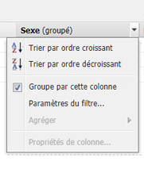

Les options disponibles dans le menu dépendent de la configuration de la colonne (telle que définie lors du développement de projet), et toutes les options non valides sont grisées.

### Tri des données {#sorting-the-data}

Les données peuvent être triées selon une colonne en procédant comme suit, au choix :

* Cliquez sur l’en-tête de colonne voulu. Le tri bascule entre l’ordre croissant et décroissant, indiqué par une flèche immédiatement en regard du texte de titre.
* Utilisez le [menu déroulant de la colonne](#column-drop-down-menu) pour sélectionner spécifiquement **Trier par ordre croissant** ou **Trier par ordre décroissant**. De même, cette option est indiquée par une flèche immédiatement en regard du texte du titre.

### Groupes et graphique des données actuelles  {#groups-and-the-current-data-chart}

Sur les colonnes appropriées, vous pouvez sélectionner **Groupe par cette colonne** dans le [menu déroulant de la colonne](#column-drop-down-menu). Ceci a pour effet de regrouper les données selon chaque valeur distincte dans cette colonne. Vous pouvez sélectionner plusieurs colonnes à regrouper. Cette option est grisée lorsque les données de la colonne ne sont pas appropriées : chaque entrée est distincte et unique et aucun groupe ne peut donc être formé. Par exemple, la colonne ID de l’utilisateur du rapport d’utilisateur.

Lorsqu’au moins une colonne a été groupée, un diagramme circulaire des **Données actuelles** est généré en fonction de ce regroupement. Si plusieurs colonnes sont regroupées, ceci est également indiqué sur le diagramme.

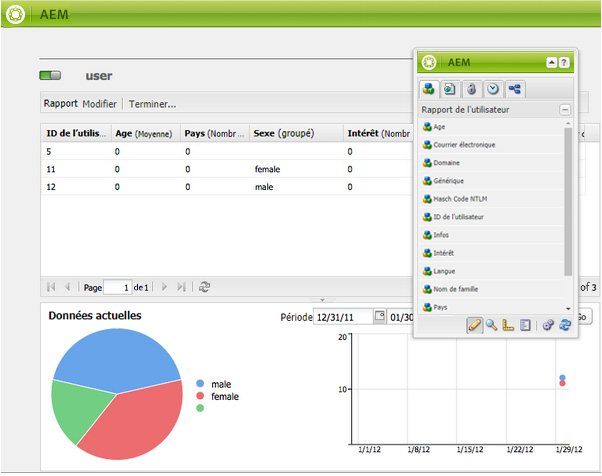

Placez le pointeur de la souris au-dessus du diagramme circulaire pour afficher la valeur agrégée du segment approprié. Cette méthode utilise l’agrégat actuellement défini dans la colonne ; par exemple, nombre, minimum, moyenne, entre autres.

### Filtres et agrégats {#filters-and-aggregates}

Sur les colonnes appropriées, vous pouvez également configurer des **Paramètres du filtre** et/ou des **Agrégats** dans le [menu déroulant de la colonne](#column-drop-down-menu).

#### Filtres {#filters}

Les paramètres de filtre vous permettent de spécifier les critères des entrées à afficher. Les opérateurs disponibles sont :

* `contains`
* `equals`

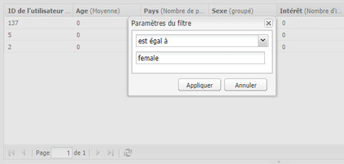

Pour définir un filtre :

1. Sélectionnez l’opérateur de votre choix dans la liste déroulante.
1. Saisissez le texte sur lequel filtrer.
1. Cliquez sur **Appliquer**.

Pour désactiver le filtre :

1. Supprimez le texte du filtre.
1. Cliquez sur **Appliquer**.

#### Agrégats {#aggregates}

Vous pouvez également sélectionner une méthode d’agrégation (elle peut varier en fonction de la colonne sélectionnée) :

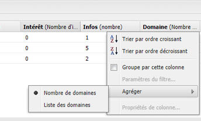

### Propriétés de colonne {#column-properties}

Cette option est uniquement disponible lorsque la [Colonne générique](#generic-column) a été utilisée dans le [Rapport de l’utilisateur](#user-report).

### Données historiques {#historic-data}

Un graphique des changements survenant dans vos données au fil du temps est visible dans les **Données historiques**. Ce graphique est dérivé des instantanés réalisés à intervalles réguliers.

Les données sont :

* Collectées par, le cas échéant, la première colonne triée, sinon la première colonne (non regroupée)
* Regroupées par la colonne appropriée

Le rapport peut être généré :

1. Définissez l’option **Groupement** sur la colonne requise.
1. **Modifiez** la configuration pour définir la fréquence à laquelle les instantanés doivent être pris, par exemple toutes les heures ou tous les jours.
1. Cliquez sur **Terminer** pour achever la définition et commencer la collecte des instantanés.

   Le bouton curseur rouge/vert situé en haut à gauche indique à quel moment les instantanés sont collectés.

Le graphique qui en résulte est affiché en bas à droite :

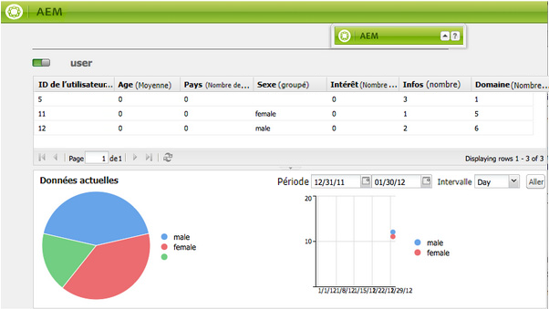

Une fois la collecte de données commencée, vous pouvez sélectionner les options suivantes :

* **Période**

   Vous pouvez sélectionner les dates de début et de fin pour les données du rapport à afficher.

* **Intervalle**

   Mois, Semaine, Jour, Heure peuvent être sélectionnés pour l’échelle et l’agrégation du rapport.

    Par exemple, si des instantanés quotidiens sont disponibles pour le mois de février 2011 :

   * Si l’intervalle est défini sur `Day`, chaque instantané est présenté comme une valeur unique dans le graphique.
   * Si l’intervalle est défini sur `Month`, tous les instantanés de février sont agrégés en une seule valeur (affichée sous la forme d’un &quot;point&quot; unique dans le graphique).

Faites vos choix selon vos besoins, puis cliquez sur **Aller** pour les appliquer au rapport. Pour mettre à jour l’affichage après la création d’autres instantanés, cliquez de nouveau sur **OK**.

Lorsque des instantanés sont en cours de collecte, vous pouvez :

* Utiliser de nouveau l’option **Terminer** pour réinitialiser la collecte.

   **L’optionTerminer** « gèle » la structure du rapport (à savoir, les colonnes affectées au rapport et groupées, triées, filtrées, etc.) et lance la création des instantanés.

* Ouvrez la boîte de dialogue **Modifier** pour sélectionner **Aucun instantané de données** afin de terminer la collecte à la date requise.

   **Modifier** active ou désactive uniquement la création des instantanés. Si la création d’instantanés est réactivée, elle utilise l’état du rapport lorsque celui-ci a été la terminé la dernière fois pour créer d’autres instantanés.

>[!NOTE]
>
>Les instantanés sont stockés sous `/var/reports/...` où le reste du chemin reflète le chemin du rapport et de l’identifiant respectifs créés lorsque le rapport a été terminé.
>
>
>Les anciens instantanés peuvent être manuellement purgés, si vous êtes absolument certain de ne plus en avoir besoin.

>[!NOTE]
>
>Les rapports préconfigurés n’exigent pas de performances élevées, mais il est toujours recommandé d’utiliser des instantanés quotidiens sur un environnement de production. Si possible, exécutez ces instantanés quotidiens à un moment de la journée où votre site web ne présente pas beaucoup d’activité ; cela peut être défini avec le paramètre `Daily snapshots (repconf.hourofday)` pour la **configuration des rapports Day CQ** ; voir [Configuration OSGI](/help/sites-deploying/configuring-osgi.md) pour plus d’informations sur la configuration.

#### Limites d’affichage {#display-limits}

Le rapport de données historiques peut aussi changer légèrement d’aspect en raison des limites qui peuvent être définies, selon le nombre de résultats pour la période sélectionnée.

Chaque ligne horizontale est une série (et correspond à une entrée dans la légende du graphique), et chaque colonne verticale de points représente les instantanés agrégés.

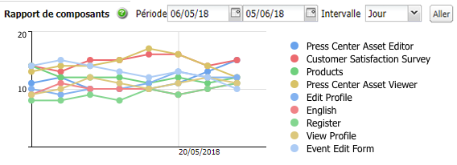

Pour que le graphique reste propre sur des périodes plus longues, vous pouvez définir des limites. Pour les rapports standard, ces limites sont les suivantes :

* série horizontale - la valeur maximale par défaut et système est `9`

* instantanés agrégés verticaux - la valeur par défaut est `35` (par série horizontale)

Ainsi, lorsque les limites (appropriées) sont dépassées :

* les points ne sont pas affichés
* la légende du graphique des données historiques peut afficher un nombre d’entrées différent de celui du graphique des données actuelles

Les rapports personnalisés peuvent également afficher la valeur **Total** pour toutes les séries. Ceci est illustré sous la forme d’une série (ligne horizontale et entrée dans la légende).

>[!NOTE]
>
>Pour les rapports personnalisés, les limites peuvent être définies différemment.

### Modifier (rapport) {#edit-report}

Le bouton **Modifier** ouvre la boîte de dialogue **Modifier le rapport**.

Il s’agit d’un emplacement où la période de collecte des instantanés pour les [Données historiques](#historic-data) est définie, mais d’autres paramètres peuvent également être définis :

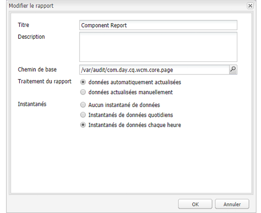

* **Titre**

   Vous pouvez définir votre propre titre.

* **Description**

   Vous pouvez définir votre propre description.

* **Chemin d’accès racine**  (*uniquement principal pour certains rapports*)

   Utilisez cette option pour limiter le rapport à une sous-section du référentiel.

* **Traitement du rapport**

   * **données automatiquement actualisées**

      Les données du rapport sont actualisées chaque fois que vous mettez à jour la définition du rapport.

   * **données actualisées manuellement**

      Cette option peut être utilisée pour éviter les retards causés par les opérations d’actualisation automatique en cas de volume de données important.

       Cette option indique que les données du rapport doivent être actualisées manuellement lorsqu’un aspect de la configuration du rapport a changé. Cela signifie également que dès que vous changez un aspect de la configuration du rapport, le tableau est effacé.

       Lorsque cette option est sélectionnée, le bouton **[Charger les données](#load-data)** s’affiche (en regard de **Modifier** sur le rapport). Le bouton **Charger les données** charge les données et actualise les données du rapport affichées.

* **Instantanés** Vous pouvez définir la fréquence selon laquelle créer des instantanés : quotidienne, horaire ou pas du tout.

### Charger les données {#load-data}

Le bouton **Charger les données** est uniquement visible lorsque l’option **données actualisées manuellement** a été sélectionnée via **[Modifier](#edit-report)**.

Un clic sur le bouton **Charger les données** a pour effet de recharger les données et de mettre le rapport affiché à jour.

Choisir d’actualiser manuellement les données signifie que :

1. Dès que vous modifiez la configuration du rapport, le tableau des données du rapport est masqué.

   Par exemple, si vous modifiez le mécanisme de tri d’une colonne, les données ne sont pas affichées.

1. Si vous souhaitez réafficher les données du rapport, vous devez cliquer sur **Charger les données** pour recharger les données.

### Terminer (rapport)  {#finish-report}

Lorsque vous avez **terminé** le rapport :

* La définition de rapport *à partir de ce moment* est utilisée pour créer les instantanés (vous pouvez ensuite continuer à travailler sur une définition de rapport, car elle est alors séparée des instantanés).
* Tous les instantanés existants sont supprimés.
* De nouveaux instantanés sont collectés pour les [Données historiques](#historic-data).

Avec cette boîte de dialogue, vous pouvez définir ou mettre à jour votre propre titre et votre propre description du rapport.

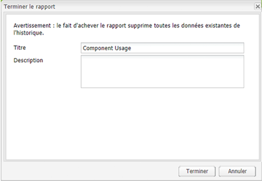

## Types de rapports {#report-types}

### Rapport de composants {#component-report}

Le rapport de composants fournit des informations sur la façon dont votre site web utilise les composants.

[Colonnes d’informations](#selecting-and-positioning-the-data-columns) sur :

* Création
* Chemin de composant
* Type de composant
* Dernière modification
* Page

Signifient que vous pouvez voir, par exemple :

* Quels composants sont utilisés et où ils le sont.

   Utile, par exemple, lors des tests.

* La manière dont les instances d’un composant sont distribuées.

   Ceci peut être intéressant si certaines pages (c’est-à-dire, des « pages lourdes ») rencontrent des problèmes de performances.

* Identifiez les parties du site faisant l’objet de modifications fréquentes ou moins fréquentes.
* Découvrez comment le contenu de page se développe au fil du temps.

Tous les composants sont inclus, ceux standard produit comme ceux spécifiques aux projets. Avec la boîte de dialogue **Modifier**, l’utilisateur peut également définir un **Chemin racine** qui définit le point de départ du rapport. Tous les composants sous cette racine sont pris en compte pour le rapport.

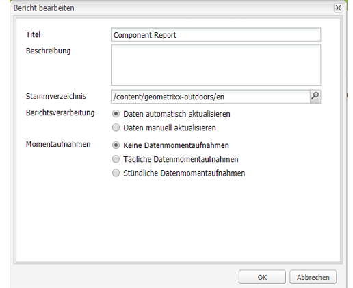 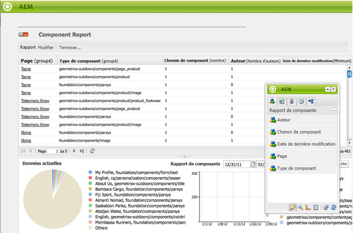

### Utilisation du disque {#disk-usage}

>[!CONTEXTUALHELP]
>id="aemcloud_ctt_diskusage"
>title="Rapport Utilisation du disque"
>abstract="En tant qu’entrée du calculateur CTT, les utilisateurs peuvent estimer la taille du référentiel AEM en exécutant le rapport Utilisation du disque sous &quot;http://HOST:PORT/etc/reports/diskusage.html&#39;&quot;. Les utilisateurs peuvent également estimer la taille des chemins de référentiel spécifiques à l’aide du paramètre &quot;path&quot;, tel que : &#39;http://HOST:PORT/etc/reports/diskusage.html?path=/content/dam&#39;."

Le rapport d’utilisation du disque affiche des informations sur les données stockées dans votre référentiel.

Le rapport commence à la racine (/) du référentiel. En cliquant sur une branche, vous pouvez explorer le référentiel (le chemin d’accès actuel est reflété dans le titre du rapport).

### Contrôle de l’intégrité {#health-check}

Ce rapport analyse le journal des requêtes en cours :

`<cq-installation-dir>/crx-quickstart/logs/request.log`\
pour vous aider à identifier la ou les demandes les plus coûteuses au cours d’une période donnée.

Pour générer le rapport, vous pouvez spécifier :

* **Période (heures)**

   Nombre d’heures (passées) à analyser.

   Valeur par défaut: `24`

* **max. Résultats**

   Nombre maximal de lignes de sortie.

   Valeur par défaut: `50`

* **max. Demandes**

   Nombre maximum de demandes à analyser.

   Valeur par défaut : `-1` (tous)

* **Adresse électronique**

   Envoyez les résultats à une adresse électronique.

   Facultatif ; valeur par défaut : non renseigné

* **Exécuter quotidiennement à (hh:mm)**

   Spécifiez l’heure à laquelle le rapport doit être exécuté automatiquement tous les jours.

   Facultatif ; valeur par défaut : non renseigné

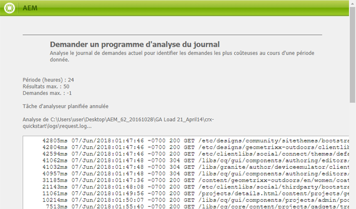

### Rapport d’activité de la page {#page-activity-report}

Le rapport d’activité de la page répertorie les pages et les actions effectuées sur celles-ci.

[Colonnes d’informations](#selecting-and-positioning-the-data-columns) sur :

* Page
* Heure
* Type
* User

Signifie que vous pouvez surveiller :

* Les dernières modifications
* Les auteurs qui travaillent sur des pages spécifiques
* Les pages n’ayant pas été modifiées récemment et donc susceptibles de nécessiter une intervention
* Les pages les plus/moins fréquemment modifiées
* Les utilisateurs les plus/moins actifs

Le rapport d’activité de la page récupère toutes ses informations dans le journal d’audit. Par défaut, le chemin d’accès racine est configuré sur le journal d’audit à l’adresse `/var/audit/com.day.cq.wcm.core.page`.

### Rapport de contenu généré par l’utilisateur {#user-generated-content-report}

Ce rapport fournit des informations sur le contenu généré par l’utilisateur, qu’il s’agisse de commentaires, d’évaluations ou de forums.

[Colonnes d’informations ](#selecting-and-positioning-the-data-columns) sur :

* Date
* Adresse IP
* Page
* Référent
* Type
* Identifiant de l’utilisateur

Vous permettent :

* De voir quelles pages reçoivent le plus de commentaires
* De disposer d’un aperçu de l’ensemble des commentaires que des visiteurs du site laissent, avec éventuellement les erreurs associées
* D’évaluer si le nouveau contenu suscite des commentaires en surveillant les commentaires laissés sur une page.

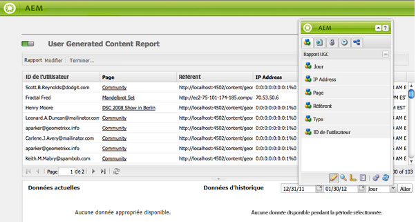

### Rapport de l’utilisateur {#user-report}

Ce rapport fournit des informations sur tous les utilisateurs qui ont enregistré un compte et/ou un profil. Ceci peut comprendre les auteurs de votre organisation et les visiteurs externes.

[Colonnes d’informations](#selecting-and-positioning-the-data-columns) (le cas échéant) sur :

* Âge
* Pays
* Domaine
* Adresse électronique
* Nom de famille
* Sexe
* [Générique](#generic-column)
* Prénom
* Infos
* Intérêt
* Langue
* Hasch Code NTLM
* ID utilisateur

Vous permettent :

* Connaître la répartition démographique de vos utilisateurs.
* Créer des rapports sur les champs personnalisés que vous avez ajoutés aux profils.

#### Colonne Générique {#generic-column}

La colonne **Générique** est disponible dans le rapport de l’utilisateur afin que vous puissiez accéder à des informations personnalisées, généralement via les [profils utilisateur](/help/sites-administering/identity-management.md#profiles-and-user-accounts). Par exemple, la [couleur préférée comme détaillé sous Ajout de champs à la définition du profil](/help/sites-administering/identity-management.md#adding-fields-to-the-profile-definition).

La boîte de dialogue Colonne générique s’affiche :

* Quand vous faites glisser le composant Générique du sidekick vers le rapport.
* Quand vous sélectionnez Propriétés de colonne pour une colonne Générique existante.

Dans l’onglet **Définitions**, vous pouvez définir :

* **Titre**

   Votre propre titre pour la colonne générique.

* **Propriété**

   Nom de la propriété tel qu’il est stocké dans le référentiel, généralement dans le profil de l’utilisateur.

* **Chemin**

   En règle générale, la propriété est extraite de `profile`.

* **Type**

   Sélectionnez le type de champ à partir de `String`, `Number`, `Integer`, `Date`.

* **Agrégat par défaut**

   Cette opération définit l&#39;agrégat utilisé par défaut si la colonne est dissociée dans un rapport avec au moins une colonne regroupée. Sélectionnez l’agrégat requis à partir de `Count`, `Minimum`, `Average`, `Maximum`, `Sum`.

   Par exemple, *Comptage* pour un champ `String` signifie que le nombre de valeurs `String` distinctes est affiché pour la colonne dans l’état agrégé.

Dans l’onglet **Étendu**, vous pouvez également définir les agrégats et les filtres disponibles :

### Rapport d’instance de processus {#workflow-instance-report}

Ce rapport offre un aperçu précis et fournit des informations sur chaque instance de workflow, à la fois en cours d’exécution et terminé.

[Colonnes d’informations](#selecting-and-positioning-the-data-columns) sur :

* Terminé
* Durée
* Initiateur
* Modèle
* Charge utile
* Démarré
* État

Signifie que vous pouvez :

* Surveiller la durée moyenne des workflows. Si cela se produit régulièrement, il se peut que le workflow connaisse des problèmes.

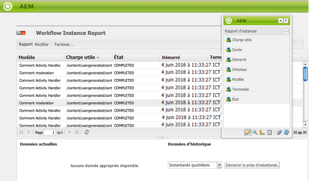

### Rapports de processus {#workflow-report}

Ce rapport fournit des statistiques clés sur les workflows s’exécutant sur votre instance.

## Utilisation de rapports dans un environnement de publication {#using-reports-in-a-publish-environment}

Une fois que vous avez configuré les rapports selon vos besoins, vous pouvez les activer pour transférer la configuration vers l’environnement de publication.

>[!CAUTION]
>
>Si vous souhaitez des **Données historiques** pour l’environnement de publication, **terminez** le rapport dans l’environnement de création avant d’activer la page.

Le rapport approprié est alors accessible sous

`/etc/reports`

Par exemple, le rapport de contenu généré par l’utilisateur figure sous :

`http://localhost:4503/etc/reports/ugcreport.html`

Il rend à présent compte des données collectées dans l’environnement de publication.

Puisqu’aucune configuration de rapport n’est autorisée dans l’environnement de publication, les boutons **Modifier** et **Terminer** ne sont pas disponibles. Toutefois, vous pouvez sélectionner la **Période** et l’**Intervalle** des rapports **Données historiques** si des instantanés sont collectés.

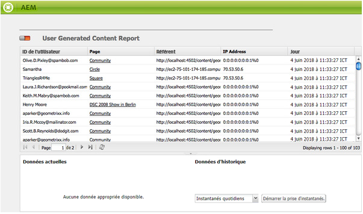

>[!CAUTION]
>
>L’accès à ces rapports peut poser un problème de sécurité ; nous vous recommandons donc de configurer Dispatcher de sorte que `/etc/reports` ne soit pas disponible pour les visiteurs externes. Voir la [Liste de contrôle de sécurité](security-checklist.md) pour plus de détails.

## Autorisations requises pour exécuter des rapports {#permissions-needed-for-running-reports}

Les autorisations requises varient en fonction de l’action :

* Les données de rapport sont en gros collectées à l’aide des autorisations de l’utilisateur actuel.
* Les données historiques sont collectées à l’aide des autorisations de l’utilisateur qui a terminé le rapport.

Dans une installation AEM standard, les autorisations suivantes sont prédéfinies pour les rapports :

* **Rapport de l’utilisateur**

   `user administrators` - lecture et écriture

* **Rapport d’activité de la page**

   `contributors` - lecture et écriture

* **Rapport de composants**

   `contributors` - lecture et écriture

* **Rapport de contenu généré par l’utilisateur**

   `contributors` - lecture et écriture

* **Rapport d’instance de processus**

   `workflow-users` - lecture et écriture

Tous les membres du groupe `administrators` disposent des droits nécessaires pour créer de nouveaux rapports.
