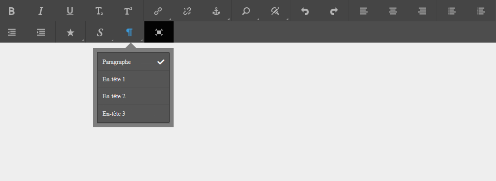
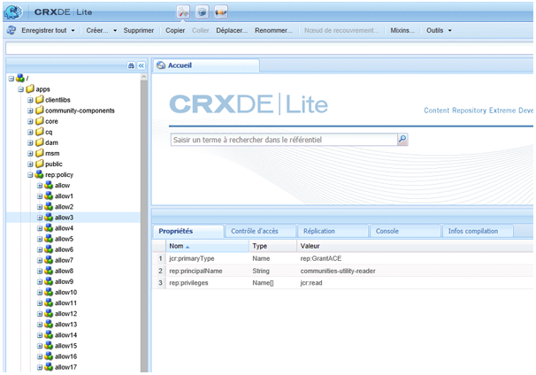

# Configuration de l’éditeur de texte enrichi pour produire des sites accessibles  {#configuring-rte-for-producing-accessible-sites}

AEM prend en charge à la fois :

* Les fonctions d’accessibilité standard, notamment le texte de remplacement pour les images
* Des fonctionnalités supplémentaires qui sont accessibles lors de la création de contenu avec les composants qui utilisent l’éditeur de texte enrichi (RTE)

>[!NOTE]
>
>* [Guide rapide relatif à WCAG 2.0](/help/managing/qg-wcag.md)
>* [Création d’un contenu accessible (conformité WCAG 2.0)](/help/sites-authoring/creating-accessible-content.md)


Les auteurs de contenu peuvent utiliser les fonctions de l’éditeur de texte enrichi afin de fournir des informations d’accessibilité lors de l’ajout de contenu à une page. Cela peut impliquer l’ajout d’informations structurelles via des en-têtes et des éléments de paragraphe.

Vous pouvez [configurer et personnaliser ces fonctions en configurant des modules externes RTE](#configuring-the-plugin-features) pour le composant. Par exemple, le module externe `paraformat` vous permet d’ajouter des éléments sémantiques de niveau bloc supplémentaires, y compris l’extension du nombre de niveaux d’en-tête pris en charge au-delà des niveaux de base `H1`, `H2` et `H3` fournis par défaut.

Le RTE est disponible dans divers composants de l&#39;interface utilisateur tactile et classique. Cependant, le composant principal pour l’utilisation de l’éditeur de texte enrichi est le composant **Texte**.

Le composant **Texte** de l&#39;AEM est disponible à la fois pour les interfaces utilisateur tactiles et classiques. Les illustrations suivantes présentent l’éditeur de texte enrichi avec une plage de modules externes activés, y compris `paraformat` :

* Composant **Texte** dans l’interface utilisateur tactile :

   

* Composant **Text** dans l’IU classique :

   

>[!NOTE]
>
>Il existe des différences entre les fonctionnalités RTE disponibles dans l’interface utilisateur classique et l’interface utilisateur tactile. Pour plus d’informations, voir
>
>* [Modules externes et leurs fonctionnalités](/help/sites-administering/rich-text-editor.md#aboutplugins)
>* [Plug-ins et leurs fonctionnalités - IU tactile](/help/sites-administering/rich-text-editor.md#aboutplugins)

>


## Configuration des fonctionnalités de module externe {#configuring-the-plugin-features}

Les instructions complètes sur la configuration de l’éditeur de texte enrichi sont disponibles sur la page [Configuration de l’éditeur de texte enrichi.](/help/sites-administering/rich-text-editor.md) Ceci couvre tous les problèmes, y compris les étapes principales :

* [Modules externes et leurs fonctionnalités](/help/sites-administering/rich-text-editor.md#aboutplugins)
* [Emplacements de configuration](/help/sites-administering/rich-text-editor.md#understand-the-configuration-paths-and-locations)
* [Activation d’un module externe et configuration de la propriété features](/help/sites-administering/rich-text-editor.md#enable-rte-functionalities-by-activating-plug-ins)
* [Configuration d’autres fonctionnalités de l’éditeur de texte enrichi](/help/sites-administering/rich-text-editor.md#enable-rte-functionalities-by-activating-plug-ins)

En configurant un module externe dans la sous-branche `rtePlugins` appropriée en CRXDE Lite (voir l&#39;illustration suivante), vous pouvez activer toutes les fonctionnalités ou certaines fonctionnalités de ce module externe.



### Exemple : spécification des formats de paragraphes disponibles dans le champ de sélection de l’éditeur de texte enrichi {#example-specifying-paragraph-formats-available-in-rte-selection-field}

De nouveaux formats de bloc sémantique peuvent être rendus disponibles pour la sélection comme suit :

1. Selon votre éditeur de texte enrichi, déterminez l’[emplacement de configuration](/help/sites-administering/rich-text-editor.md#understand-the-configuration-paths-and-locations) et accédez-y.
1. [Activez le champ de sélection Paragraphe](/help/sites-administering/rich-text-editor.md). En [activant le module externe](/help/sites-administering/rich-text-editor.md#enable-rte-functionalities-by-activating-plug-ins).
1. [Spécifiez les formats qui doivent être disponibles dans le champ de sélection Paragraphes](/help/sites-administering/rich-text-editor.md).
1. Les formats de paragraphe sont ensuite à la disposition de l’auteur du contenu des champs de sélection dans l’éditeur de texte enrichi. Ils sont accessibles :

   * Utilisation de l’icône de paragraphe ([pilcrow](https://en.wikipedia.org/wiki/Pilcrow)) dans l’interface utilisateur tactile :

   

   * Utilisation du champ **Format** (sélecteur déroulant) dans l’IU classique.


Avec les éléments structurels disponibles dans l’éditeur de texte enrichi via les options de format de paragraphe, AEM constitue une bonne base pour le développement de contenu accessible. Les auteurs de contenu ne peuvent pas utiliser l’éditeur de texte enrichi pour formater la taille de la police ou les couleurs ou d’autres attributs associés, empêchant la création de formatage en ligne. À la place, ils doivent sélectionner les éléments structurels appropriés comme les en-têtes et utiliser des styles globaux choisis via l’option Styles. Ceci garantit une mise en forme nette, de meilleures options pour les utilisateurs qui naviguent avec leurs propres feuilles de style et un contenu correctement structuré.

## Utilisation de l’option Modification de la source   {#use-of-the-source-edit-feature}

Dans certains cas, les auteurs de contenu constateront qu’il est nécessaire d’examiner et d’ajuster le code source HTML créé à l’aide de l’éditeur de texte enrichi. Par exemple, un élément de contenu créé dans l’éditeur de texte enrichi peut nécessiter une mise en forme supplémentaire pour être conforme à la norme WCAG 2.0. Ceci peut s’effectuer avec l’option [Modification de la source](/help/sites-administering/rich-text-editor.md#aboutplugins) de l’éditeur de texte enrichi. Vous pouvez spécifier la fonction [ `sourceedit` dans le module `misctools` ](/help/sites-administering/rich-text-editor.md#aboutplugins).

>[!CAUTION]
>
>Utilisez la fonction `sourceedit` avec prudence. Les fautes de frappe et/ou les fonctions non prises en charge peuvent entraîner d’autres problèmes.

## Ajout de la prise en charge des éléments et attributs HTML supplémentaires {#adding-support-for-additional-html-elements-and-attributes}

Pour étendre davantage les fonctions d’accessibilité d’AEM, vous pouvez étendre les composants existants (par exemple, les composants **Text** et **Table**) en fonction de l’éditeur de texte enrichi avec des éléments et attributs supplémentaires.

La procédure suivante illustre comment étendre le composant **Table** avec un élément **Caption** qui fournit des informations sur un tableau de données aux utilisateurs de technologies d&#39;assistance :

### Exemple - Ajout de la légende à la boîte de dialogue Propriétés du tableau {#example-adding-the-caption-to-the-table-properties-dialog}

Dans le constructeur de l’élément `TablePropertiesDialog`, ajoutez un champ de saisie de texte supplémentaire utilisé pour modifier la légende. Notez que `itemId` doit être défini sur `caption` (c’est-à-dire le nom de l’attribut DOM) pour gérer automatiquement son contenu.

Dans le composant **Table**, vous devez définir ou supprimer explicitement l’attribut vers/depuis l’élément DOM. La valeur est transmise par la boîte de dialogue dans l’objet `config`. Notez que les attributs DOM doivent être définis/supprimés à l’aide des méthodes `CQ.form.rte.Common` correspondantes (`com` est un raccourci de `CQ.form.rte.Common`) pour éviter les pièges courants des mises en œuvre de navigateur.

>[!NOTE]
>
>Cette procédure convient uniquement à l’IU classique.

### Instructions détaillées  {#step-by-step-instructions}

1. Démarrez CRXDE Lite. Par exemple : [http://localhost:4502/crx/de/](http://localhost:4502/crx/de/)
1. Copier :

   `/libs/cq/ui/widgets/source/widgets/form/rte/commands/Table.js`

   vers :

   `/apps/cq/ui/widgets/source/widgets/form/rte/commands/Table.js`

   >[!NOTE]
   >
   >Vous devrez peut-être créer des dossiers intermédiaires si ceux-ci n’existent pas déjà.

1. Copier :

   `/libs/cq/ui/widgets/source/widgets/form/rte/plugins/TablePropertiesDialog.js`

   vers :

   `/apps/cq/ui/widgets/source/widgets/form/rte/plugins/TablePropertiesDialog.js`.

1. Ouvrez le fichier suivant pour le modifier (ouvrez-le en double-cliquant dessus) :

   `/apps/cq/ui/widgets/source/widgets/form/rte/plugins/TablePropertiesDialog.js`

1. Dans la méthode `constructor`, avant la lecture de ligne :

   ```
   var dialogRef = this;
   ```

   Ajoutez le code suivant :

   ```
   editItems.push({
       "itemId": "caption",
       "name": "caption",
       "xtype": "textfield",
       "fieldLabel": CQ.I18n.getMessage("Caption"),
       "value": (this.table && this.table.caption ? this.table.caption.textContent : "")
   });
   ```

1. Ouvrez le fichier suivant :

   `/apps/cq/ui/widgets/source/widgets/form/rte/commands/Table.js`.

1. Ajoutez le code suivant à la fin de la méthode `transferConfigToTable` :

   ```
   /**
    * Adds Caption Element
   */
   var captionElement;
   if (dom.firstChild && dom.firstChild.tagName.toLowerCase() == "caption")
   {
      captionElement = dom.firstChild;
   }
   if (config.caption)
   {
       var captionTextNode = document.createTextNode(config.caption)
       if (captionElement)
       {
          dom.replaceNode(captionElement.firstChild,captionTextNode);
       } else
       {
           captionElement = document.createElement("caption");
           captionElement.appendChild(captionTextNode);
           if (dom.childNodes.length>0)
           {
              dom.insertBefore(captionElement, dom.firstChild);
           } else
           {
              dom.appendChild(captionElement);
           }
       }
   } else if (captionElement)
   {
     dom.removeChild(captionElement);
   }
   ```

1. Enregistrez vos modifications à l&#39;aide de **Enregistrer tout**

>[!NOTE]
>
>Le champ de texte brut n’est pas le seul type d’entrée autorisé pour la valeur de l’élément de légende. Tout widget ExtJS, qui fournit la valeur de la légende par le biais de sa méthode `getValue()`, peut être utilisé.
>
>Pour ajouter des fonctionnalités de modification pour d’autres éléments et attributs, assurez-vous à la fois :
>
>* La propriété `itemId` de chaque champ correspondant est définie sur le nom de l’attribut DOM approprié (`TablePropertiesDialog`).
>* Que l’attribut est défini et/ou supprimé sur l’élément DOM de manière explicite (`Table`).

