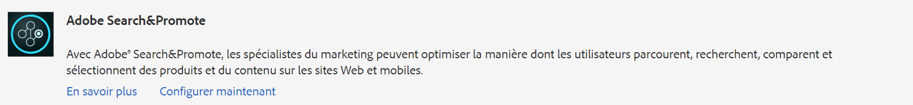
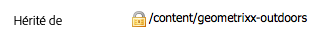

# Intégration à Adobe Search&amp;Promote{#integrating-with-adobe-search-promote}

Pour appeler le service Adobe Search&amp;Promote depuis votre site web, effectuez les opérations suivantes :

1. Indiquez l’URL du cloud.
1. Configurez la connexion au service Search&amp;Promote.
1. Ajoutez les composants de Search &amp; Promote à [!UICONTROL Sidekick].
1. Utilisez les composants pour créer le contenu. (Voir [Ajout de fonctionnalités Search&amp;Promote à une page web](/help/sites-authoring/search-and-promote.md).)
1. Ajout de bannières à vos pages. Les images de bannière sont sensibles aux données Search&amp;Promote.
1. Générez un plan du site pour l’utilisation du service Search&amp;Promote.

>[!NOTE]
>
>Si vous utilisez Search&amp;Promote avec une configuration de proxy personnalisée, vous devez configurer les deux configurations de proxy client HTTP, car certaines fonctionnalités d’AEM utilisent les API 3.x et d’autres les API 4.x :
>
>* La version 3.x est configurée avec [http://localhost:4502/system/console/configMgr/com.day.commons.httpclient](http://localhost:4502/system/console/configMgr/com.day.commons.httpclient)
>* Les API 4.x sont configurées avec [http://localhost:4502/system/console/configMgr/org.apache.http.proxyconfigurator](http://localhost:4502/system/console/configMgr/org.apache.http.proxyconfigurator)

>

## Modification de l’URL du service Search&amp;Promote {#changing-the-search-promote-service-url}

L’URL par défaut configurée pour le service de Search &amp; Promote est `https://searchandpromote.omniture.com/px/`. Pour utiliser un autre service, utilisez la console OSGi afin de spécifier une autre URL.

**Pour modifier l’URL** du service de Search &amp; Promote :

1. Ouvrez la console [!UICONTROL OSGi] et appuyez sur l&#39;onglet **[!UICONTROL Configuration]**. ([http://localhost:4502/system/console/configMgr.](http://localhost:4502/system/console/configMgr))

1. Cliquez sur l’élément **[!UICONTROL Configuration des Search &amp; Promote Day CQ]**.
1. Dans le champ **[!UICONTROL URI du serveur distant]**, saisissez l’URL, puis appuyez sur **[!UICONTROL Enregistrer]**.

## Configuration de la connexion à Search&amp;Promote {#configuring-the-connection-to-search-promote}

Configurez une ou plusieurs connexions à Search&amp;Promote afin que vos pages web puissent interagir avec le service. Pour vous connecter, vous avez besoin du numéro d’identification et de compte du membre de votre compte Search&amp;Promote.

**Pour configurer la connexion au Search &amp; Promote** :

1. Dans l&#39;icône **[!UICONTROL Outils]** > **[!UICONTROL Déploiement]**, sélectionnez **[!UICONTROL Cloud Services]**.

   Ceci vous amène au tableau de bord Services Cloud. Si vous utilisez un ordinateur local, l’URL du tableau de bord se présente comme suit :

   [http://localhost:4502/libs/cq/core/content/tools/cloudservices.html](http://localhost:4502/libs/cq/core/content/tools/cloudservices.html)

1. Dans la page [!UICONTROL Cloud Services], appuyez sur le lien **[!UICONTROL Search &amp; Promote d&#39;Adobe]** ou sur l&#39;icône **[!UICONTROL Search &amp; Promote]**.

1. Si c’est la première fois que vous configurez un Search &amp; Promote d’Adobe, appuyez sur **[!UICONTROL Configurer maintenant]** pour ouvrir le panneau [!UICONTROL Créer une configuration].

   Si vous souhaitez en savoir plus sur les Search &amp; Promote, cliquez sur **[!UICONTROL En savoir plus]** à la place.

   

1. Saisissez un **[!UICONTROL Titre]** reconnaissable aux auteurs de pages, puis saisissez un **[!UICONTROL Nom]** unique, puis appuyez sur **[!UICONTROL Créer]**.

   De plus, la configuration nouvellement créée apparaît sous **[!UICONTROL Configurations disponibles]** dans l’élément de liste Adobe Search&amp;Promote **[!UICONTROL Tableau de bord Services cloud]**.

   

1. Dans la boîte de dialogue [!UICONTROL Modifier le composant], ajoutez les éléments suivants aux champs :

   * **[!UICONTROL ID de membre]**
   * **[!UICONTROL Numéro de compte]**

   >[!NOTE]
   >
   >Pour obtenir ces informations vous-même, connectez-vous aux sections suivantes :
   >
   >[https://searchandpromote.omniture.com/center/](https://searchandpromote.omniture.com/center/)
   >
   >à l’aide de vos identifiants Search&amp;Promote (adresse électronique/mot de passe) valides.
   >
   >Notez l&#39;URL dans la barre d&#39;adresse de votre navigateur. Il devrait ressembler à ce qui suit :
   >
   >
   >
   >[https://searchandpromote.omniture.com/px/home/?sp_id=XXXXXXXX-spYYYYYYYY](https://searchandpromote.omniture.com/px/home/?sp_id=XXXXXXXX-spYYYYYYYY)
   >
   >Où **XXXXXX** correspond à votre **[!UICONTROL identifiant membre]** et **[!UICONTROL spYYYYYYY]** correspond à votre numéro de compte.

1. Appuyez sur **[!UICONTROL Se connecter à Search &amp; Promote]**.

   Lorsque le message de réussite de la connexion s’affiche, appuyez sur **[!UICONTROL OK]**.

   (Une fois que vous êtes connecté, le texte du bouton est remplacé par **[!UICONTROL Reconnecter à Search&amp;Promote]**.)

1. Appuyez sur **[!UICONTROL OK]**. La page Paramètres Search&amp;Promote s’affiche pour la configuration que vous venez de créer.

## Configuration du centre de données {#configuring-the-data-center}

Si votre compte de Search &amp; Promote se trouve en Asie ou en Europe, vous devez modifier le centre de données par défaut pour qu&#39;il pointe vers le bon (le centre de données par défaut est pour les comptes nord-américains).

**Pour configurer le centre** de données :

1. Accédez à la console Web à l’adresse `http://localhost:4502/system/console/configMgr/com.day.cq.searchpromote.impl.SearchPromoteServiceImpl`

   

1. En fonction de l’emplacement du serveur, redéfinissez l’URI sur l’une des URI suivantes :

   * Amérique du Nord : [https://center.atomz.com/px/](https://center.atomz.com/px/)
   * EMEA : [https://center.lon5.atomz.com/px/](https://center.lon5.atomz.com/px/)
   * APAC : [https://center.sin2.atomz.com/px/](https://center.sin2.atomz.com/px/)

1. Appuyez sur **[!UICONTROL Save]** (Enregistrer).

## Ajout de composants Search&amp;Promote au sidekick {#adding-search-promote-components-to-sidekick}

En mode [!UICONTROL Conception], modifiez un composant **[!UICONTROL par]** pour autoriser les composants Search &amp; Promote dans le Sidekick]. [!UICONTROL  (Voir la documentation [Composants](/help/sites-developing/components.md) pour en savoir plus.)

Pour plus d&#39;informations sur l&#39;utilisation des composants, voir [Ajouter des fonctionnalités de Search &amp; Promote à une page Web](/help/sites-authoring/search-and-promote.md).

## Spécification du service Search&amp;Promote utilisé par vos pages {#specifying-the-search-promote-service-that-your-pages-use}

Configurez les pages web afin qu’elles utilisent un service Search&amp;Promote spécifique. Les composants Search&amp;Promote utilisent automatiquement le service de leur page hôte.

Lorsque vous configurez les propriétés Search&amp;Promote d’une page, toutes les pages enfants héritent des paramètres. Si nécessaire, vous pouvez configurer les pages enfants pour remplacer les paramètres hérités.

>[!NOTE]
>
>La connexion au service doit déjà être configurée. Voir [Configuration de la connexion à Search&amp;Promote](#configuring-the-connection-to-search-promote).

1. Ouvrez la boîte de dialogue **[!UICONTROL Propriétés de la page]**. Par exemple, sur la page **[!UICONTROL Sites Web]**, cliquez avec le bouton droit sur la page et cliquez sur **[!UICONTROL Propriétés]**.

1. Cliquez sur l’onglet **[!UICONTROL Services Cloud]**.

1. Pour désactiver l’héritage des configurations des services cloud d’une page parent, cliquez sur l’icône en forme de cadenas en regard du chemin d’héritage.

   

1. Cliquez sur **[!UICONTROL Ajouter le service]**, sélectionnez **[!UICONTROL Adobe Search &amp; Promote]**, puis cliquez sur **[!UICONTROL OK]**.

1. Sélectionnez la configuration de la connexion pour votre compte de Search &amp; Promote, puis cliquez sur **[!UICONTROL OK]**.

## Flux de produit {#product-feed}

L’intégration de Search &amp; Promote vous permet d’effectuer les opérations suivantes :

* Utilisez l&#39;API [!UICONTROL eCommerce], indépendamment de la structure de référentiel sous-jacente et de la plate-forme commerciale.
* Tirez parti de la fonction [!UICONTROL Connecteur d’index] de Search &amp; Promote pour fournir un flux de produits au format XML.
* Tirez parti de la fonction [!UICONTROL Remote Control] du Search &amp; Promote pour effectuer des demandes à la demande ou planifiées du flux de produits.
* Génération de flux pour différents comptes de Search &amp; Promote, configurés en tant que configurations de services Cloud.

Pour plus d’informations, voir [Flux de produits](/help/sites-administering/product-feed.md).
