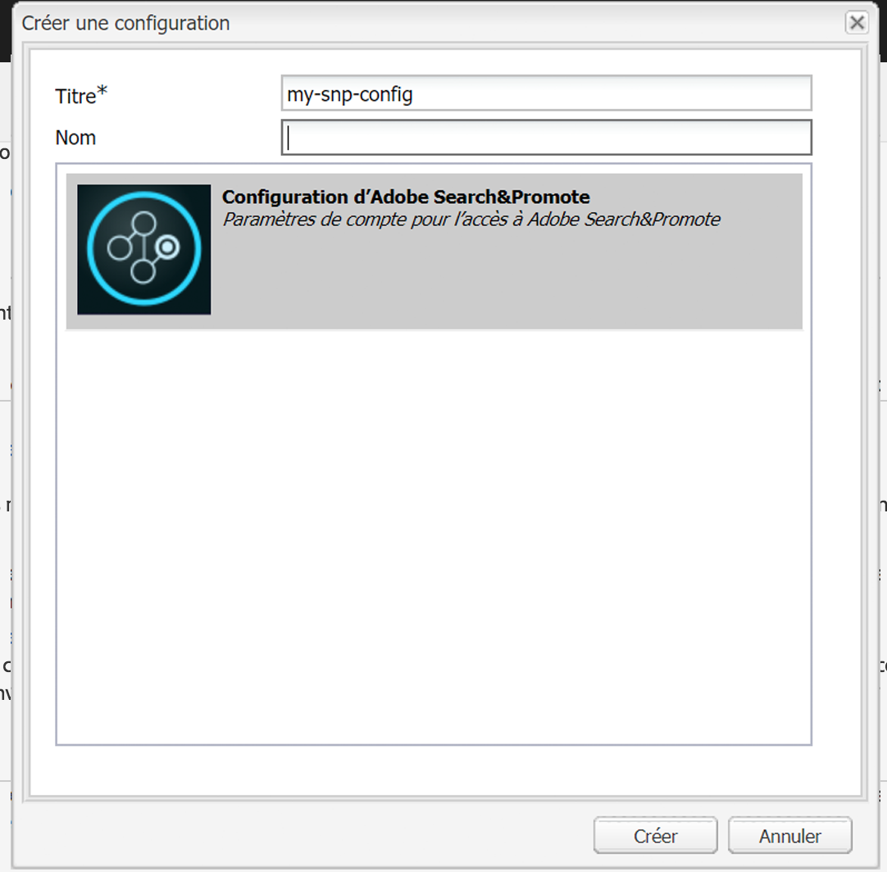

# Intégration à Adobe Search&amp;Promote{#integrating-with-adobe-search-promote}

Pour appeler le service Adobe Search&amp;Promote depuis votre site web, effectuez les opérations suivantes :

1. Indiquez l’URL du cloud.
1. Configurez la connexion au service Search&amp;Promote.
1. Add Search&amp;Promote components to [!UICONTROL Sidekick].
1. Utilisez les composants pour créer le contenu. (Voir [Ajout de fonctionnalités Search&amp;Promote à une page web](/help/sites-authoring/search-and-promote.md).)
1. Ajout de bannières à vos pages. Les images de bannière sont sensibles aux données Search&amp;Promote.
1. Générez un plan du site pour l’utilisation du service Search&amp;Promote.

>[!NOTE]
>
>Si vous utilisez Search&amp;Promote avec une configuration de proxy personnalisée, vous devez configurer les deux configurations de proxy client HTTP, car certaines fonctionnalités d’AEM utilisent les API 3.x et d’autres les API 4.x :
>
>* La version 3.x est configurée avec [http://localhost:4502/system/console/configMgr/com.day.commons.httpclient](http://localhost:4502/system/console/configMgr/com.day.commons.httpclient)
>* Les API 4.x sont configurées avec [http://localhost:4502/system/console/configMgr/org.apache.http.proxyconfigurator](http://localhost:4502/system/console/configMgr/org.apache.http.proxyconfigurator)

>

## Modification de l’URL du service Search&amp;Promote {#changing-the-search-promote-service-url}

The default URL that is configured for the Search&amp;Promote service is `https://searchandpromote.omniture.com/px/`. Pour utiliser un autre service, utilisez la console OSGi afin de spécifier une autre URL.

**Pour modifier l’URL** du service de Search &amp; Promote :

1. Open the [!UICONTROL OSGi] console and tap the **[!UICONTROL Configuration]** tab. ([http://localhost:4502/system/console/configMgr.](http://localhost:4502/system/console/configMgr))

1. Click the **[!UICONTROL Day CQ Search&amp;Promote Configuration]** item.
1. Dans le champ de texte URI **[!UICONTROL du serveur]** distant, saisissez l’URL, puis appuyez sur **[!UICONTROL Enregistrer]**.

## Configuration de la connexion à Search&amp;Promote {#configuring-the-connection-to-search-promote}

Configurez une ou plusieurs connexions à Search&amp;Promote afin que vos pages web puissent interagir avec le service. Pour vous connecter, vous avez besoin du numéro d’identification et de compte du membre de votre compte Search&amp;Promote.

**Pour configurer la connexion au Search &amp; Promote**:

1. From the **[!UICONTROL Tools]** icon > **[!UICONTROL Deployment]**, select **[!UICONTROL Cloud Services]**.

   Ceci vous amène au tableau de bord Services Cloud. Si vous utilisez un ordinateur local, l’URL du tableau de bord se présente comme suit :

   [http://localhost:4502/libs/cq/core/content/tools/cloudservices.html](http://localhost:4502/libs/cq/core/content/tools/cloudservices.html)

1. In the [!UICONTROL Cloud Services] page, tap the **[!UICONTROL Adobe Search&amp;Promote]** link or the **[!UICONTROL Search&amp;Promote]** icon.

1. If this is the first time you are configuring Adobe Search&amp;Promote, tap **[!UICONTROL Configure Now]** to open the [!UICONTROL Create Configuration] panel.

   If you would like to learn more about Search&amp;Promote click **[!UICONTROL Learn more]** instead.

   

1. Enter a **[!UICONTROL Title]** that is recognizable to page authors, and enter a unique **[!UICONTROL Name]**, then tap **[!UICONTROL Create]**.

   De plus, la configuration nouvellement créée apparaît sous **[!UICONTROL Configurations disponibles]** dans l’élément de liste Adobe Search&amp;Promote **[!UICONTROL Tableau de bord Services cloud]**.

   

1. Dans la boîte de dialogue [!UICONTROL Modifier le composant] , ajoutez les éléments suivants aux champs :

   * **[!UICONTROL ID de membre]**
   * **[!UICONTROL Numéro de compte]**

   >[!NOTE]
   >
   >Pour obtenir ces informations vous-même, connectez-vous aux sections suivantes :
   >
   >[https://searchandpromote.omniture.com/center/](https://searchandpromote.omniture.com/center/)
   >
   >à l’aide de vos identifiants Search&amp;Promote (adresse électronique/mot de passe) valides.
   >
   >Notez l&#39;URL dans la barre d&#39;adresse de votre navigateur. Il devrait ressembler à ce qui suit :
   >
   >
   >
   >[https://searchandpromote.omniture.com/px/home/?sp_id=XXXXXXXX-spYYYYYYYY](https://searchandpromote.omniture.com/px/home/?sp_id=XXXXXXXX-spYYYYYYYY)
   >
   >Où **XXXXXXXX** correspond à votre ID **** membre et **[!UICONTROL spYYYYYYYY]** correspond à votre numéro de compte.

1. Tap **[!UICONTROL Connect To Search&amp;Promote]**.

   When the connection success message appears, tap **[!UICONTROL OK]**.

   (Une fois que vous êtes connecté, le texte du bouton est remplacé par **[!UICONTROL Reconnecter à Search&amp;Promote]**.)

1. Appuyez sur **[!UICONTROL OK]**. La page Paramètres Search&amp;Promote s’affiche pour la configuration que vous venez de créer.

## Configuration du centre de données {#configuring-the-data-center}

Si votre compte de Search &amp; Promote se trouve en Asie ou en Europe, vous devez modifier le centre de données par défaut pour qu&#39;il pointe vers le bon (le centre de données par défaut est pour les comptes nord-américains).

**Pour configurer le centre** de données :

1. Navigate to the Web console at `http://localhost:4502/system/console/configMgr/com.day.cq.searchpromote.impl.SearchPromoteServiceImpl`

   

1. En fonction de l’emplacement du serveur, redéfinissez l’URI sur l’une des URI suivantes :

   * North America: [https://center.atomz.com/px/](https://center.atomz.com/px/)
   * EMEA: [https://center.lon5.atomz.com/px/](https://center.lon5.atomz.com/px/)
   * APAC: [https://center.sin2.atomz.com/px/](https://center.sin2.atomz.com/px/)

1. Appuyez sur **[!UICONTROL Save]** (Enregistrer).

## Ajout de composants Search&amp;Promote au sidekick {#adding-search-promote-components-to-sidekick}

In [!UICONTROL Design] mode, edit a **[!UICONTROL par]** component to allow the Search&amp;Promote components in [!UICONTROL Sidekick]. (Voir la documentation [Composants](/help/sites-developing/components.md) pour en savoir plus.)

For information about using the components, see [Adding Search&amp;Promote features to a Web Page](/help/sites-authoring/search-and-promote.md).

## Spécification du service Search&amp;Promote utilisé par vos pages {#specifying-the-search-promote-service-that-your-pages-use}

Configurez les pages web afin qu’elles utilisent un service Search&amp;Promote spécifique. Les composants Search&amp;Promote utilisent automatiquement le service de leur page hôte.

Lorsque vous configurez les propriétés Search&amp;Promote d’une page, toutes les pages enfants héritent des paramètres. Si nécessaire, vous pouvez configurer les pages enfants pour remplacer les paramètres hérités.

>[!NOTE]
>
>La connexion au service doit déjà être configurée. Voir [Configuration de la connexion à Search&amp;Promote](#configuring-the-connection-to-search-promote).

1. Ouvrez la boîte de dialogue **[!UICONTROL Propriétés de la page]**. Par exemple, sur la page **[!UICONTROL Sites Web]**, cliquez avec le bouton droit sur la page et cliquez sur **[!UICONTROL Propriétés]**.

1. Cliquez sur l’onglet **[!UICONTROL Services Cloud]**.

1. Pour désactiver l’héritage des configurations des services cloud d’une page parent, cliquez sur l’icône en forme de cadenas en regard du chemin d’héritage.

   

1. Click **[!UICONTROL Add Service]**, select **[!UICONTROL Adobe Search&amp;Promote]**, then click **[!UICONTROL OK]**.

1. Select the connection configuration for your Search&amp;Promote account, then click **[!UICONTROL OK]**.

## Flux de produit {#product-feed}

L’intégration de Search &amp; Promote vous permet d’effectuer les opérations suivantes :

* Use the [!UICONTROL eCommerce] API, independently of the underlying repository structure and commerce platform.
* Leverage the [!UICONTROL Index Connector] feature of Search&amp;Promote to provide a product feed in XML format.
* Leverage the [!UICONTROL Remote Control] feature of Search&amp;Promote to perform on-demand or scheduled requests of the product feed.
* Génération de flux pour différents comptes de Search &amp; Promote, configurés en tant que configurations de services Cloud.

For more information, see [Product Feed](/help/sites-administering/product-feed.md).
