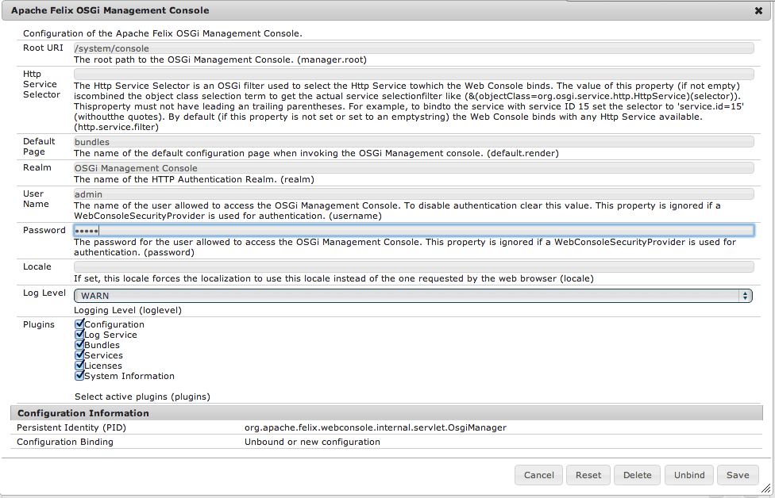

# Liste de contrôle de sécurité{#security-checklist}

>[!CAUTION]
>
>AEM 6.4 a atteint la fin de la prise en charge étendue et cette documentation n’est plus mise à jour. Pour plus d’informations, voir notre [période de support technique](https://helpx.adobe.com/fr/support/programs/eol-matrix.html). Rechercher les versions prises en charge [here](https://experienceleague.adobe.com/docs/?lang=fr).

Cette section traite des différentes étapes à suivre pour s’assurer que votre installation AEM est sécurisée une fois déployée. La liste de contrôle doit être appliquée de haut en bas.

>[!NOTE]
>
>Informations supplémentaires [est également disponible au sujet des menaces de sécurité les plus dangereuses, comme publié par Open Web Application Security Project (OWASP)](https://www.owasp.org/index.php/OWASP_Top_Ten_Project).

>[!NOTE]
>
>D’autres [considérations relatives à la sécurité](/help/sites-developing/dev-guidelines-bestpractices.md#security-considerations) s’appliquent à la phase de développement.

## Principales mesures de sécurité {#main-security-measures}

### Exécuter AEM en mode Prêt pour la production {#run-aem-in-production-ready-mode}

Pour plus d’informations, reportez-vous à la section [Exécution d’AEM en mode Prêt pour la production](/help/sites-administering/production-ready.md).

### Activation du protocole HTTPS pour la sécurité des couches de transfert {#enable-https-for-transport-layer-security}

Pour une instance sécurisée, il est obligatoire d’activer la couche de transfert HTTPS sur les instances de création et de publication.

>[!NOTE]
>
>Pour plus d’informations, consultez la section [Activation d’HTTP Over SSL](/help/sites-administering/ssl-by-default.md).

### Installation des correctifs de sécurité {#install-security-hotfixes}

Assurez-vous d’avoir installé les derniers [correctifs de sécurité fournis par Adobe](https://helpx.adobe.com/fr/experience-manager/kb/aem63-available-hotfixes.html).

### Modifier les mots de passe par défaut pour les comptes d’administration de console OSGi et AEM {#change-default-passwords-for-the-aem-and-osgi-console-admin-accounts}

Adobe recommande vivement, après l’installation, de modifier le mot de passe pour les comptes dotés d’autorisations [**AEM** `admin`comptes](#changing-the-aem-admin-password) (sur toutes les instances).

Ces comptes sont les suivants :

* Le compte `admin` AEM

   Une fois que vous avez modifié le mot de passe du compte d’administration d’AEM, vous devez utiliser le nouveau mot de passe lors de l’accès à CRX.

* Le mot de passe `admin` de la console web OSGi

   Cette modification sera également appliquée au compte d’administration utilisé pour accéder à la console web. Vous devez donc utiliser le même mot de passe lorsque vous y accédez.

Ces deux comptes utilisent des informations d’identification distinctes. Il est essentiel d’utiliser des mots de passe sécurisés distincts pour un déploiement sécurisé.

#### Modification du mot de passe d’administrateur AEM {#changing-the-aem-admin-password}

Le mot de passe du compte administrateur AEM peut être modifié via la console [Opérations Granite - Utilisateurs](/help/sites-administering/granite-user-group-admin.md).

Vous pouvez modifier le compte `admin` et [modifier le mot de passe](/help/sites-administering/granite-user-group-admin.md#changing-the-password-for-an-existing-user).

>[!NOTE]
>
>La modification du compte administrateur modifie également le compte de la console web OSGi. Après avoir modifié le compte administrateur, vous devez modifier le compte OSGi.

#### Importance de la modification du mot de passe de la console web OSGi {#importance-of-changing-the-osgi-web-console-password}

En plus du compte `admin` d’AEM, si vous ne modifiez pas le mot de passe par défaut du mot de passe de la console web OSGi, cela peut entraîner :

* Exposition du serveur avec un mot de passe par défaut au démarrage et à l’arrêt (ce qui peut prendre quelques minutes pour les serveurs volumineux) ;
* Exposition du serveur lorsque le référentiel est en panne ou qu’il redémarre le bundle - et qu’OSGI est en cours d’exécution.

Pour plus d’informations sur la modification du mot de passe de la console Web, reportez-vous à la section [Modification du mot de passe d’administrateur de la console Web OSGi](/help/sites-administering/security-checklist.md#changing-the-osgi-web-console-admin-password) ci-dessous.

#### Modification du mot de passe d’administrateur de la console Web OSGi {#changing-the-osgi-web-console-admin-password}

Vous devez également modifier le mot de passe utilisé pour accéder à la console web. À cet effet, configurez les propriétés de la [console de gestion OSGi Apache Felix](/help/sites-deploying/osgi-configuration-settings.md) suivantes :

**Nom d’utilisateur** et **Mot de passe**, les informations d’identification pour accéder à la console de gestion web Apache Felix.\
Le mot de passe doit être modifié après l’installation initiale pour garantir la sécurité de votre instance. 

Pour ce faire :

1. Accédez à la console web sur `<server>:<port>/system/console/configMgr`.
1. Accédez à** Console de gestion Apache Felix OSGi** et modifiez les **nom d’utilisateur** et **password**.

   

1. Cliquez sur **Enregistrer**.

### Mettre en oeuvre un gestionnaire d’erreurs personnalisé {#implement-custom-error-handler}

Adobe recommande de définir des pages de gestionnaire d’erreurs personnalisé, en particulier pour les codes de réponse HTTP 404 et 500, afin d’éviter la divulgation d’informations.

>[!NOTE]
>
>Pour plus d’informations, consultez l’article de la base de connaissances [Comment créer des scripts ou des gestionnaires d’erreur personnalisés](https://helpx.adobe.com/experience-manager/kb/CustomErrorHandling.html).

### Compléter la liste de contrôle de sécurité de Dispatcher {#complete-dispatcher-security-checklist}

AEM Dispatcher est un élément essentiel de votre infrastructure. Adobe recommande vivement de compléter la [liste de contrôle de sécurité de Dispatcher](https://helpx.adobe.com/fr/experience-manager/dispatcher/using/security-checklist.html).

>[!CAUTION]
>
>Avec Dispatcher, vous devez désactiver le sélecteur « form ».

## Étapes de vérification {#verification-steps}

### Configurer les utilisateurs et utilisatrices de réplication et de transfert {#configure-replication-and-transport-users}

L’installation AEM standard spécifie `admin` comme utilisateur des informations d’identifications de transfert dans les [agents de réplication](/help/sites-deploying/replication.md) par défaut. En outre, l’utilisateur administrateur ou l’utilisatrice administratrice est utilisé(e) pour obtenir la réplication sur le système de création.

Pour des raisons de sécurité, ces deux éléments doivent être modifiés afin de tenir compte du cas d’utilisation particulier en question, en prenant en considération les deux aspects suivants :

* L’**utilisateur du transfert** ne doit pas être administrateur. Configurez plutôt un utilisateur ou une utilisatrice sur le système de publication qui n’a accès qu’aux parties pertinentes du système de publication et qui utilise les informations d’identification de cet utilisateur ou de cette utilisatrice pour le transfert.

   Vous pouvez partir de l’utilisateur de réception de la réplication en lot et configurer les droits d’accès de cet utilisateur afin qu’ils correspondent à votre situation.

* L’**utilisateur de la réplication** ou l’**ID utilisateur de l’agent** ne doit pas être non plus un administrateur, mais un utilisateur qui ne peut afficher que le contenu qui est censé être répliqué. L’utilisateur de la réplication permet de collecter le contenu à répliquer sur le système de création avant de l’envoyer au système de publication.

### Vérifier les contrôles de l’intégrité de la sécurité du tableau de bord des opérations {#check-the-operations-dashboard-security-health-checks}

AEM 6 présente le nouveau tableau de bord des opérations, destiné à aider les opérateurs système à résoudre les problèmes et à surveiller l’intégrité d’une instance.

Le tableau de bord est accompagné également d’une série de contrôles de l’intégrité de la sécurité. Il est recommandé de contrôler le statut de tous les contrôles d’intégrité de la sécurité avant de les publier grâce à votre instance de production. Pour plus d’informations, consultez la [documentation du tableau de bord des opérations](/help/sites-administering/operations-dashboard.md).

### Vérifier si l’exemple de contenu est présent {#check-if-example-content-is-present}

Tous les exemples de contenu, et d’utilisateurs et d’utilisatrices, (par exemple, le projet de Geometrixx et ses composants) doivent être désinstallés et supprimés complètement sur un système productif avant de le rendre accessible au public.

>[!NOTE]
>
>Les exemples d’applications We.Retail sont supprimés si cette instance est en cours d’exécution en [mode Prêt pour la production](/help/sites-administering/production-ready.md). Si, pour une raison quelconque, ce n’est pas le cas, vous pouvez désinstaller l’exemple de contenu en accédant à Package Manager, puis rechercher et désinstaller tous les packages We.Retail. Pour plus d’informations, voir [Utilisation de modules](package-manager.md).

### Vérifier si les bundles de développement CRX sont présents {#check-if-the-crx-development-bundles-are-present}

Ces bundles OSGi de développement doivent être désinstallés sur les systèmes de création et de publication productifs avant de les rendre accessibles.

* Assistance CRXDE d’Adobe (com.adobe.granite.crxde-support)
* Explorateur CRX Granite d’Adobe (com.adobe.granite.crx-explorer)
* CRXDE Lite Granite d’Adobe (com.adobe.granite.crxde-lite)

### Vérifier si le bundle de développement Sling est présent {#check-if-the-sling-development-bundle-is-present}

Le [AEM Outils de développement pour Eclipse](/help/sites-developing/aem-eclipse.md) déploie l’installation de prise en charge des outils Apache Sling (org.apache.sling.tooling.support.install).

Ce bundle OSGi doit être désinstallé sur les systèmes de création et de publication productifs avant de les rendre accessibles.

### Se protéger contre les attaques CRSF {#protect-against-cross-site-request-forgery}

#### Le Framework de protection CSRF {#the-csrf-protection-framework}

AEM version 6.1 comprend un mécanisme qui aide à la protection contre les attaques par falsification de requête intersites, appelé **Structure de protection CSRF**. Pour plus d’informations sur son utilisation, consultez la [documentation](/help/sites-developing/csrf-protection.md).

#### Filtre de référent Sling {#the-sling-referrer-filter}

Pour résoudre les problèmes de sécurité connus avec les attaques CSRF dans CRX WebDAV et Apache Sling, vous devez ajouter des configurations pour le filtre de référent afin de pouvoir l’utiliser.

Le service de filtrage des référents est un service OSGi qui vous permet de configurer :

* les méthodes HTTP à filtrer ;
* si un en-tête de référent vide est permis ;
* et une liste des serveurs autorisés, en plus de l’hôte de serveur.

   Par défaut, toutes les variantes de localhost et les noms d’hôtes actuels auxquels le serveur est lié figurent sur la liste.

Pour configurer le service de filtrage de référent, procédez comme suit :

1. Ouvrez la console Apache Felix (**Configurations**) sur :

   `https://<server>:<port_number>/system/console/configMgr`

1. Connectez-vous en tant qu’`admin`.
1. Dans le menu **Configurations**, sélectionnez :

   `Apache Sling Referrer Filter`

1. Dans le champ `Allow Hosts`, saisissez tous les hôtes autorisés comme référents. Chaque entrée doit se trouver dans le formulaire.

   &lt;protocol>://&lt;server>:&lt;port>

   Par exemple :

   * `https://allowed.server:80` autorise toutes les demandes émanant de ce serveur avec le port indiqué.
   * Si vous souhaitez également autoriser les demandes https, vous devez saisir une seconde ligne.
   * Si vous autorisez tous les ports de ce serveur, vous pouvez utiliser `0` comme numéro de port.

1. Contrôlez le champ `Allow Empty` si vous souhaitez autoriser les en-têtes de référent vides ou manquants.

   >[!CAUTION]
   >
   >Il est recommandé de fournir un référent lors de l’utilisation des outils de ligne de commande, comme `cURL` au lieu d’autoriser une valeur vide, car cela peut exposer votre système à des attaques CSRF.

1. Modifiez les méthodes que ce filtre doit utiliser pour les contrôles avec le champ `Filter Methods`.

1. Cliquez sur **Enregistrer** pour enregistrer vos modifications.

### Paramètres OSGI {#osgi-settings}

Certains paramètres OSGI sont définis par défaut de manière à faciliter le débogage de l’application. Ils doivent être modifiés sur vos instances de publication et de création de production afin d’éviter toute fuite d’informations internes au public.

>[!NOTE]
>
>Tous les paramètres ci-dessous, à l’exception de **Filtre de débogage WCM Day CQ** sont couverts automatiquement par le [mode prêt pour la production](/help/sites-administering/production-ready.md). C’est pourquoi il est recommandé de vérifier tous les paramètres avant de déployer votre instance dans un environnement de production.

Pour chacun des services suivants, les paramètres spécifiés doivent être modifiés :

* [Gestionnaire de bibliothèque HTML Adobe Granite](/help/sites-deploying/osgi-configuration-settings.md) :

   * Activez **Minifier** (pour supprimer les caractères CRLF et les espaces blancs).
   * Activez **Gzip** (pour permettre l’extraction et l’accès aux fichiers avec une seule requête).
   * Désactivez **Déboguer**
   * Désactivez **Minutage**

* [Filtre de débogage de la gestion de contenu web Day CQ](/help/sites-deploying/osgi-configuration-settings.md) :

   * Décochez **Activer**

* [Filtre de la gestion de contenu web Day CQ](/help/sites-deploying/osgi-configuration-settings.md) :

   * Lors de la publication uniquement, définissez le **Mode de gestion de contenu web** sur Désactivé.

* [Gestionnaire de scripts Sling Java Apache](/help/sites-deploying/osgi-configuration-settings.md) :

   * Désactivez l’option **Générer les informations de débogage**.

* [Gestionnaire de scripts JSP Apache Sling](/help/sites-deploying/osgi-configuration-settings.md) :

   * Désactivez l’option **Générer les informations de débogage**.
   * Désactivez l’option **Contenu mappé**.

Pour plus de détails, voir [Paramètres de configuration OSGi](/help/sites-deploying/osgi-configuration-settings.md).

Lorsque vous utilisez AEM, plusieurs méthodes permettent de gérer les paramètres de configuration pour ces services. Consultez la section [Configuration d’OSGi](/help/sites-deploying/configuring-osgi.md) pour plus de détails et connaître les pratiques recommandées.

## Informations complémentaires {#further-readings}

### Prévenir les attaques par déni de service (DoS) {#mitigate-denial-of-service-dos-attacks}

Une attaque par déni de service (DoS) est une tentative de rendre une ressource informatique indisponible à ses utilisateurs ciblés. Elle est souvent perpétrée en surchargeant la ressource ; par exemple :

* Avec un flot de demandes provenant d’une source externe.
* Avec une demande d’informations supplémentaires à laquelle le système peut répondre avec succès.

   Par exemple, une représentation JSON de l’intégralité du référentiel.

* Lors de la demande d’une page de contenu avec un nombre illimité d’adresses URL, l’adresse URL peut inclure un nom en ligne, certains sélecteurs, une extension et un suffixe, qui peuvent tous être modifiés.

   Par exemple, `.../en.html` peut également être demandé comme suit :

   * `.../en.ExtensionDosAttack`
   * `.../en.SelectorDosAttack.html`
   * `.../en.html/SuffixDosAttack`

   Toutes les variantes possibles (par exemple, renvoi d’une réponse `200`, configurée pour être mise en cache) seront mises en cache par le Dispatcher, ce qui entraîne la saturation du système de fichiers et l’indisponibilité du service pour d’autres demandes.

Il existe de nombreux paramétrages pour prévenir de telles attaques. Ici nous ne parlons que de ceux directement liés à AEM.

**Configuration de Sling pour empêcher les attaques par déni de service**

Sling est *centré sur le contenu*. Cela signifie que le traitement est axé sur le contenu, car chaque requête (HTTP) est mappée sur le contenu sous la forme d’une ressource JCR (un nœud de référentiel) :

* La première cible est la ressource (nœud JCR) qui contient le contenu.
* Ensuite, le rendu, ou script, est localisé à partir des propriétés de ressource en combinaison avec certaines parties de la requête (par ex., des sélecteurs et/ou l’extension).

>[!NOTE]
>
>Ce sujet est davantage détaillé dans la section [Traitement des requêtes Sling](/help/sites-developing/the-basics.md#sling-request-processing).

Cette approche rend Sling très puissant et très flexible, mais comme toujours, c’est la flexibilité qui doit être gérée avec soin.

Pour vous aider à prévenir toute utilisation abusive en raison d’une attaque par déni de service, vous pouvez prendre les mesures suivantes :

1. Intégrer des contrôles au niveau de l’application ; en raison du nombre de variations possibles, une configuration par défaut n’est pas possible.

   Dans votre application, vous devez :

   * contrôler les sélecteurs dans votre application afin de ne proposer *que* les sélecteurs explicites nécessaires et de renvoyer un message `404` pour tous les autres ;
   * Empêcher la sortie d’un nombre illimité de nœuds de contenu.

1. Vérifier la configuration des moteurs de rendu par défaut, ce qui peut poser problème.

   * Cela concerne en particulier le moteur de rendu JSON qui peut traverser l’arborescence sur plusieurs niveaux.

      Par exemple, la requête :

      `http://localhost:4502/.json`

      pourrait vider l’ensemble du référentiel d’une représentation JSON. Cela entraînerait des problèmes importants au niveau du serveur. Ainsi, Sling définit une limite de nombre maximal de résultats. Pour limiter la profondeur du rendu JSON, vous pouvez définir la valeur sur :

      **Résultats JSON max** (`json.maximumresults`)

      dans la configuration du [Servlet GET Apache Sling](/help/sites-deploying/osgi-configuration-settings.md). Lorsque cette limite est dépassée, le rendu est réduit. La valeur par défaut pour Sling dans AEM est de `1000`.

   * À titre de mesure préventive, désactivez les autres outils de rendu par défaut (HTML, texte brut, XML). Pour cela, configurez une nouvelle fois le [Servlet GET Apache Sling](/help/sites-deploying/osgi-configuration-settings.md).
   >[!CAUTION]
   >
   >Ne désactivez pas l’outil de rendu JSON. Il est nécessaire au fonctionnement normal d’AEM.

1. Utilisez un pare-feu pour filtrer l’accès à votre instance.

   * L’utilisation d’un pare-feu au niveau du système d’exploitation est nécessaire afin de filtrer l’accès aux points de votre instance qui peuvent entraîner des attaques par déni de service s’ils ne sont pas protégés.

**Atténuer les attaques par déni de service (DoS) provoquées par l’utilisation des sélecteurs de formulaire**

>[!NOTE]
>
>Cette réduction ne doit être effectuée que sur les environnements AEM qui n’utilisent pas Forms.

Comme AEM ne fournit pas d’index prêts à l’emploi pour `FormChooserServlet`, l’utilisation de sélecteurs de formulaire dans les requêtes déclenche une traversée coûteuse du référentiel, ce qui entraîne généralement l’arrêt de l’instance AEM. Les sélecteurs de formulaire peuvent être détectés par la présence de la chaîne **&amp;ast;.form.&amp;ast;** dans les requêtes.

Pour atténuer ce problème, procédez comme suit :

1. Accédez à la console web en faisant pointer votre navigateur sur *https://&lt;serveraddress>:&lt;serverport>/system/console/configMgr*.

1. Recherchez le **Servlet de sélection de formulaires de gestion de contenu web Day CQ**.
1. Après avoir cliqué sur l’entrée, désactivez la **Recherche avancée requise** dans la fenêtre suivante.

1. Cliquez sur **Enregistrer**.

**Atténuer les attaques par déni de service causées par le servlet de téléchargement de ressources**

Le servlet de téléchargement de ressources par défaut d’AEM permet aux utilisateurs authentifiés d’émettre des demandes de téléchargement simultanées de grande taille et de taille arbitraire pour créer des fichiers ZIP de ressources visibles qui peuvent surcharger le serveur et/ou le réseau.

Pour atténuer les risques d’attaques par déni de service potentiels causés par cette fonctionnalité, procédez comme suit : `AssetDownloadServlet` Le composant OSGi est désactivé par défaut pour les instances de publication sur les dernières versions AEM.

Si votre configuration requiert l’activation du serveur de téléchargement de ressources, reportez-vous à la section [cet article](/help/assets/download-assets-from-aem.md#disable-asset-download-servlet) pour plus d’informations.

### Désactiver WebDAV {#disable-webdav}

WebDAV doit être désactivé dans les environnements de création et de publication. Pour ce faire, arrêtez les bundles OSGi appropriés.

1. Connectez-vous à la **Console de gestion Felix** s’exécutant sur :

   `https://<*host*>:<*port*>/system/console`

   Par exemple, `http://localhost:4503/system/console/bundles`.

1. Dans la liste des lots, recherchez le lot nommé :

   `Apache Sling Simple WebDAV Access to repositories (org.apache.sling.jcr.webdav)`

1. Cliquez sur le bouton Arrêter (colonne Actions) pour arrêter ce lot.

1. Là encore, dans la liste des lots, recherchez le lot nommé :

   `Apache Sling DavEx Access to repositories (org.apache.sling.jcr.davex)`

1. Cliquez sur le bouton Arrêter pour arrêter ce lot.

   >[!NOTE]
   >
   >Il n’est pas nécessaire de redémarrer AEM.

### Vérification de toute absence de divulgation d’informations d’identification personnelles dans le chemin d’accès au répertoire principal des utilisateurs {#verify-that-you-are-not-disclosing-personally-identifiable-information-in-the-users-home-path}

Il est important de protéger vos utilisateurs en veillant à ne pas exposer d’informations personnellement fiables dans le chemin d’accès des utilisateurs du référentiel.

Depuis AEM 6.1, la façon dont les noms de nœud d’ID utilisateur (également appelé « ID autorisable ») sont stockés est modifiée par une nouvelle mise en œuvre de l’interface `AuthorizableNodeName`. La nouvelle interface n’expose plus l’ID utilisateur dans le nom du noeud, mais génère un nom aléatoire à la place.

Aucune configuration ne doit être effectuée pour l’activer, car il s’agit désormais de la méthode par défaut pour générer des identifiants autorisables dans AEM.

Bien que cela ne soit pas recommandé, vous pouvez le désactiver au cas où vous auriez besoin de l’ancienne mise en oeuvre pour une compatibilité descendante avec vos applications existantes. À cet effet, vous devez effectuer les opérations suivantes :

1. Accédez à la console web et supprimez l’entrée **org.apache.jackrabbit.oak.security.user.RandomAuthorizableNodeName** de la propriété **requiredServicePids** dans **Apache Jackrabbit Oak SecurityProvider**.

   Vous pouvez également trouver Oak Security Provider en cherchant le PID **org.apache.jackrabbit.oak.security.internal.SecurityProviderRegistration** dans les configurations OSGi.

1. Supprimez la configuration OSGi **Apache Jackrabbit Oak Random Authorizable Node Name** dans la console web.

   Pour faciliter la recherche, notez que le PID pour cette configuration est **org.apache.jackrabbit.oak.security.user.RandomAuthorizableNodeName**.

>[!NOTE]
>
>Pour plus d’informations, voir la documentation d’Oak dans [Générer un nom de nœud autorisable](https://jackrabbit.apache.org/oak/docs/security/user/authorizablenodename.html).

### Prévention du détournement de clic {#prevent-clickjacking}

Pour empêcher le détournement de clic, il est conseillé de configurer le serveur web afin que l’en-tête HTTP `X-FRAME-OPTIONS` soit défini sur `SAMEORIGIN`.

Pour plus [d’informations sur le détournement de clic, consultez le site de l’OWASP](https://www.owasp.org/index.php/Clickjacking).

### Répliquer correctement les clés de chiffrement si nécessaire {#make-sure-you-properly-replicate-encryption-keys-when-needed}

Certaines fonctionnalités d’AEM et certains schémas d’authentification exigent que vous répliquiez vos clés de chiffrement sur toutes les instances AEM.

Avant cela, notez que la réplication des clés s’effectue différemment entre les versions, car le mode de stockage des clés est différent entre les versions 6.3 et antérieures.

Voir ci-dessous pour plus d’informations.

#### Réplication des clés pour AEM 6.3 {#replicating-keys-for-aem}

Alors que dans les anciennes versions, les clés de réplication étaient stockées dans le référentiel, à partir d’AEM 6.3, elles sont stockées sur le système de fichiers.

Par conséquent, pour répliquer vos clés entre les instances, vous devez les copier de l’instance source vers l’emplacement des instances cibles sur le système de fichiers.

Plus précisément, vous devez :

1. Accédez à l’instance AEM, généralement une instance de création, et qui contient le matériel des clés à copier.
1. Cherchez le lot com.adobe.granite.crypto.file dans le système de fichiers local. Par exemple, sous ce chemin d’accès :

   * `<author-aem-install-dir>/crx-quickstart/launchpad/felix/bundle21`

   Le fichier `bundle.info` à l’intérieur de chaque dossier identifie le nom du lot.

1. Accédez au dossier des données. Par exemple :

   * `<author-aem-install-dir>/crx-quickstart/launchpad/felix/bundle21/data`

1. Copier les fichiers HMAC et maîtres.
1. Ensuite, accédez à l’instance cible sur laquelle vous souhaitez dupliquer la clé HMAC, puis accédez au dossier des données. Par exemple :

   * `<publish-aem-install-dir>/crx-quickstart/launchpad/felix/bundle21/data`

1. Collez les deux fichiers copiés précédemment.
1. [Actualisez le lot de chiffrement](/help/communities/deploy-communities.md#refresh-the-granite-crypto-bundle) si l’instance cible est déjà en cours d’exécution.
1. Répétez les étapes ci-dessus pour toutes les instances sur lesquelles vous souhaitez répliquer la clé.

>[!NOTE]
>
>Vous pouvez revenir à la méthode de stockage des clés d’avant la version 6.3 en ajoutant le paramètre ci-dessous lors de la première installation d’AEM :
>
>`-Dcom.adobe.granite.crypto.file.disable=true`

#### Réplication des clés pour AEM 6.2 et les versions antérieures {#replicating-keys-for-aem-and-older-versions}

Dans AEM 6.2 et les versions antérieures, les clés sont stockées dans le référentiel, sous le nœud `/etc/key`.

La méthode recommandée pour répliquer en toute sécurité les clés sur toutes les instances est de ne répliquer que ce nœud. Vous pouvez répliquer les nœuds de manière sélective via CRXDE Lite :

1. Ouvrez le CRXDE Lite en accédant à *https://&lt;serrveraddress>:4502/crx/de/index.jsp*
1. Sélectionnez le nœud `/etc/key`.
1. Accédez à l’onglet **Réplication**.
1. Appuyez sur le bouton **Réplication**.

### Test de pénétration {#perform-a-penetration-test}

Adobe recommande vivement d’effectuer un test de pénétration de l’infrastructure AEM avant la mise en exploitation.

### Bonnes pratiques de développement {#development-best-practices}

Il est essentiel que les nouveaux développements suivent le [Bonnes pratiques en matière de sécurité](/help/sites-developing/security.md) pour garantir la sécurité de votre environnement AEM.
