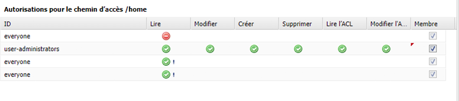

# Administration et sécurité des utilisateurs{#user-administration-and-security}

>[!CAUTION]
>
>AEM 6.4 a atteint la fin de la prise en charge étendue et cette documentation n’est plus mise à jour. Pour plus d’informations, voir notre [période de support technique](https://helpx.adobe.com/fr/support/programs/eol-matrix.html). Rechercher les versions prises en charge [here](https://experienceleague.adobe.com/docs/?lang=fr).

Ce chapitre décrit comment configurer et gérer l’autorisation utilisateur et décrit également la théorie sous-jacente au fonctionnement de l’authentification et de l’autorisation dans AEM.

## Utilisateurs et groupes dans AEM {#users-and-groups-in-aem}

Cette section traite plus en détail des différentes entités et des concepts associés afin de vous aider à configurer un concept de gestion des utilisateurs facile à gérer.

### Utilisateurs {#users}

Les utilisateurs se connectent à AEM avec leur compte. Chaque compte utilisateur est unique et contient les détails de base du compte, ainsi que les privilèges attribués.

Les utilisateurs sont souvent membres de groupes, ce qui simplifie l’allocation de ces autorisations et/ou privilèges.

### Groupes {#groups}

Les groupes sont des groupes d’utilisateurs et/ou d’autres groupes ; ils sont tous appelés membres d&#39;un groupe.

Le principal objectif des groupes est de simplifier le processus de maintenance en réduisant le nombre d’entités à mettre à jour : une modification apportée à un groupe est appliquée à tous les membres du groupe. Les groupes reflètent souvent :

* un rôle au sein de l’application ; par exemple une personne autorisée à naviguer dans le contenu ou une personne autorisée à contribuer au contenu.
* votre propre organisation ; vous pouvez étendre les rôles afin de différencier les contributeurs de différents services lorsqu’ils sont limités à différentes branches dans l’arborescence de contenu.

Par conséquent, les groupes tendent à rester stables, alors que les utilisateurs vont et viennent plus fréquemment.

Grâce à une planification et une structure propre, l’utilisation de groupes peut refléter votre structure, ce qui vous donne un aperçu clair et un mécanisme efficace pour les mises à jour.

### Utilisateurs et groupes intégrés {#built-in-users-and-groups}

AEM WCM installe un certain nombre d’utilisateurs et de groupes. Ces informations s’affichent lorsque vous accédez à la console de sécurité pour la première fois après l’installation.

Les tableaux suivants répertorient chaque élément avec :

* une brève description ;
* des recommandations quant aux modifications nécessaires.

*Modifiez tous les mots de passe par défaut* (si vous ne supprimez pas le compte lui-même dans certains cas).

<table> 
 <tbody> 
  <tr> 
   <td>ID de l'utilisateur</td> 
   <td>Type</td> 
   <td>Description</td> 
   <td>Recommandation</td> 
  </tr> 
  <tr> 
   <td>
administrateur
 
Mot de passe par défaut : admin
 </td> 
   <td>Utilisateur</td> 
   <td>
Compte d’administration système avec droits d’accès complets.
 
Ce compte est utilisé pour la connexion entre AEM WCM et CRX.
 
Si vous supprimez accidentellement ce compte, il sera recréé au redémarrage du référentiel (dans la configuration par défaut).
 
Le compte administrateur est une exigence de la plateforme AEM. Par conséquent, ce compte ne peut pas être supprimé.
 </td> 
   <td>
Adobe recommande vivement de modifier le mot de passe de ce compte utilisateur par défaut.
 
De préférence lors de l’installation, bien qu’elle puisse être réalisée par la suite.
 
Remarque : Ce compte ne doit pas être confondu avec le compte administrateur du moteur de servlet CQ.
 </td> 
  </tr> 
  <tr> 
   <td>
anonyme
 
 
 </td> 
   <td>Utilisateur</td> 
   <td>
Détient les droits par défaut pour l’accès non authentifié à une instance. Par défaut, il contient les droits d’accès minimaux.
 
Si vous supprimez ce compte par erreur, il sera recréé au redémarrage. Il ne peut pas être supprimé définitivement, mais il peut être désactivé.
 </td> 
   <td>Évitez de supprimer ou de désactiver ce compte, car cela aura une incidence négative sur le fonctionnement des instances d’auteur. Si des exigences de sécurité vous demandent de le supprimer, assurez-vous d’abord de tester correctement les effets qu’il a sur vos systèmes.</td> 
  </tr> 
  <tr> 
   <td>
auteur 
 
Mot de passe par défaut : author
 </td> 
   <td>Utilisateur</td> 
   <td>
Un compte d’auteur autorisé à écrire dans /content. Comprend les privilèges de contributeur et de surfeur.
 
Peut être utilisé comme webmaster, car il a accès à l’ensemble de l’arborescence /content.
 
Il ne s’agit pas d’un utilisateur intégré, mais d’un autre utilisateur de démonstration geometrixx
 </td> 
   <td>
Adobe vous recommande de supprimer complètement le compte ou de modifier le mot de passe par défaut.
 
De préférence lors de l’installation, bien qu’elle puisse être réalisée par la suite.
 </td> 
  </tr> 
  <tr> 
   <td>administrateurs</td> 
   <td>Groupe</td> 
   <td>
Groupe donnant des droits d’administrateur à tous ses membres. Seul l’administrateur est autorisé à modifier ce groupe.
 
Dispose de droits d’accès complets.
 </td> 
   <td>Si vous définissez une clause « deny-everyone » sur un nœud, les administrateurs auront uniquement accès si cette clause est de nouveau activée pour ce groupe.</td> 
  </tr> 
  <tr> 
   <td>content-authors</td> 
   <td>Groupe</td> 
   <td>
Groupe responsable de la modification du contenu. Nécessite des autorisations de lecture, de modification, de création et de suppression.
 </td> 
   <td>Vous pouvez créer vos propres groupes content-author avec des droits d’accès spécifiques au projet, à condition d’ajouter des autorisations de lecture, de modification, de création et de suppression.</td> 
  </tr> 
  <tr> 
   <td>contributeur</td> 
   <td>Groupe</td> 
   <td>
Droits de base qui permettent à l’utilisateur d’écrire du contenu (comme dans la fonctionnalité uniquement).
 
N’alloue aucun privilège à l’arborescence /content ; ceux-ci doivent être spécifiquement attribués aux groupes ou aux utilisateurs individuels.
 </td> 
   <td> </td> 
  </tr> 
  <tr> 
   <td>dam-users</td> 
   <td>Groupe</td> 
   <td>Groupe de référence prêt à l’emploi pour un utilisateur AEM Assets standard. Les membres de ce groupe disposent des privilèges appropriés pour activer le chargement/partage de ressources et de collections.</td> 
   <td> </td> 
  </tr> 
  <tr> 
   <td>everyone</td> 
   <td>Groupe</td> 
   <td>
Chaque utilisateur de l’AEM est membre du groupe de tous les membres, même si vous ne pouvez pas voir le groupe ou la relation d’appartenance dans tous les outils.
 
Ce groupe peut être considéré comme les droits par défaut, car il peut être utilisé pour appliquer des autorisations à tout le monde, même aux utilisateurs qui seront créés à l’avenir.
 </td> 
   <td>
Ne modifiez ou ne supprimez pas ce groupe.
 
La modification de ce compte a des implications supplémentaires en termes de sécurité.
 </td> 
  </tr> 
  <tr> 
   <td>tag-administrators</td> 
   <td>Groupe</td> 
   <td>Groupe autorisé à modifier des balises.</td> 
   <td> </td> 
  </tr> 
  <tr> 
   <td>user-administrators</td> 
   <td>Groupe</td> 
   <td>Autorise l’administration des utilisateurs, c’est-à-dire le droit de créer des utilisateurs et des groupes.</td> 
   <td> </td> 
  </tr> 
  <tr> 
   <td>éditeurs de workflow</td> 
   <td>Groupe</td> 
   <td>Groupe autorisé à créer et modifier des modèles de workflow.</td> 
   <td> </td> 
  </tr> 
  <tr> 
   <td>utilisateurs de workflow</td> 
   <td>Groupe</td> 
   <td>
Un utilisateur participant à un workflow doit être membre du groupe workflow-users. Cela lui donne un accès complet à : /etc/workflow/instances afin qu’il puisse mettre à jour l’instance de workflow.
 
Le groupe est inclus dans l’installation standard, mais vous devez y ajouter manuellement vos utilisateurs.
 </td> 
  </tr> 
 </tbody> 
</table>

## Autorisations dans AEM {#permissions-in-aem}

AEM utilise des listes de contrôle d’accès pour déterminer quelles sont les actions qu’un utilisateur ou un groupe peut effectuer et où.

### Autorisations et listes de contrôle d’accès {#permissions-and-acls}

Les autorisations définissent les personnes autorisées à effectuer des actions sur une ressource. Les autorisations sont le résultat d’évaluations de [contrôle d’accès](#access-control-lists-and-how-they-are-evaluated).

Vous pouvez modifier les autorisations accordées ou refusées à un utilisateur donné en cochant ou décochant les cases correspondant à chaque [action](security.md#actions) dans AEM. Une coche indique que l’action est autorisée. L’absence de coche indique que l’action est refusée.

L’emplacement de la coche dans la grille indique également les autorisations dont disposent les utilisateurs aux emplacements d’AEM (c’est-à-dire les chemins d’accès).

### Actions {#actions}

Les actions peuvent être effectuées sur une page (ressource). Pour chaque page dans la hiérarchie, vous pouvez spécifier quelle action l’utilisateur est autorisé à effectuer sur cette page. Les [autorisations](#permissions-and-acls) vous permettent d’autoriser ou de refuser une action.

<table> 
 <tbody> 
  <tr> 
   <td><strong>Action </strong></td> 
   <td><strong>Description </strong></td> 
  </tr> 
  <tr> 
   <td>Lecture</td> 
   <td>L’utilisateur est autorisé à lire la page et les pages enfants.</td> 
  </tr> 
  <tr> 
   <td>Modification</td> 
   <td>
L’utilisateur peut :
 
    <ul> 
     <li>modifier le contenu existant sur la page et sur les pages enfants ;</li> 
     <li>créer de nouveaux paragraphes sur la page ou une page enfant.</li> 
    </ul> 
Au niveau du JCR, les utilisateurs peuvent modifier une ressource en modifiant ses propriétés, via le verrouillage, la création de versions et modifications nt, et disposent d’une autorisation complète en écriture au niveau des nœuds définissant un nœud enfant jcr:content (par exemple, cq:Page, nt:file, cq:Asset).
 </td> 
  </tr> 
  <tr> 
   <td>Création</td> 
   <td>
L’utilisateur peut :
 
    <ul> 
     <li>créer une page ou une page enfant.</li> 
    </ul> 
Si l’action <strong>modifier</strong> est refusée, les sous-arborescences en dessous du nœud jcr:content sont spécifiquement exclues, car la création du nœud jcr:content et de ses nœuds enfants est considérée comme une modification de page. Ceci s’applique uniquement aux nœuds définissant un nœud enfant jcr:content.
 </td> 
  </tr> 
  <tr> 
   <td>Suppression</td> 
   <td>
L’utilisateur peut :
 
    <ul> 
     <li>supprimer des paragraphes existants de la page ou de toute page enfant ;</li> 
     <li>supprimer une page ou une page enfant.</li> 
    </ul> 
Si l’action <strong>modifier</strong> est refusée, les sous-arborescences en dessous du nœud jcr:content sont spécifiquement exclues, car la suppression du nœud jcr:content et de ses nœuds enfants est considérée comme une modification de page. Ceci s’applique uniquement aux nœuds définissant un nœud enfant jcr:content.
 </td> 
  </tr> 
  <tr> 
   <td>Lecture de l’ACL</td> 
   <td>L’utilisateur peut lire la liste de contrôle d’accès de la page ou des pages enfants.</td> 
  </tr> 
  <tr> 
   <td>Modification de l’ACL</td> 
   <td>L’utilisateur peut modifier la liste de contrôle d’accès de la page ou de toutes les pages enfants.</td> 
  </tr> 
  <tr> 
   <td>Réplication</td> 
   <td>L’utilisateur peut répliquer du contenu dans un autre environnement (l’environnement de publication, par exemple). L’autorisation est également appliquée à toutes les pages enfants.</td> 
  </tr> 
 </tbody> 
</table>

>[!NOTE]
>
>AEM génère automatiquement des groupes d’utilisateurs pour l’affectation de rôle (Propriétaire, Éditeur, Observateur) dans les [collections](/help/assets/managing-collections-touch-ui.md). Cependant, ajouter manuellement des listes de contrôle d’accès pour ces groupes peut introduire des vulnérabilités en matière de sécurité dans AEM. Adobe recommande d’éviter d’ajouter des listes de contrôle d’accès manuellement.

### Listes de contrôle d’accès et méthode d’évaluation {#access-control-lists-and-how-they-are-evaluated}

AEM WCM utilise des listes de contrôle d’accès (ACL) pour organiser les autorisations appliquées aux différentes pages.

Les listes de contrôle d’accès sont composées d’autorisations spécifiques et sont utilisées pour déterminer l’ordre dans lequel ces autorisations sont appliquées. La liste est établie selon la hiérarchie des pages concernées. Cette liste est ensuite analysée de bas en haut jusqu’à ce que la première autorisation appropriée à appliquer à une page soit trouvée.

>[!NOTE]
>
>Des listes de contrôle d’accès sont fournies avec les échantillons. Il est recommandé d’examiner et de déterminer ce qui convient à vos applications. Pour passer en revue les listes de contrôle d’accès incluses, aller à **CRXDE** et sélectionnez l’onglet **Contrôle d’accès** pour les nœuds suivants :
>
>`/etc/cloudservices/facebookconnect/geometrixx-outdoorsfacebookapp` : permet à tout le monde l’accès en lecture.
>`/etc/cloudservices/twitterconnect/geometrixx-outdoors-twitter-app`: permet à tout le monde de lire l’accès.
>`/home/users/geometrixx-outdoors`: permet à tous les utilisateurs d’accéder en lecture à `*/profile*` et\
>`*/social/relationships/following/*`.
>
>Votre application personnalisée peut définir l’accès pour d’autres relations, telles que `*/social/relationships/friend/*` ou `*/social/relationships/pending-following/*`.
>
>Lorsque vous créez des listes de contrôle d’accès spécifiques aux communautés, les membres rejoignant ces communautés peuvent se voir accorder des autorisations supplémentaires. Par exemple, ceci peut être le cas lorsque les utilisateurs rejoignent les communautés sur `/content/geometrixx-outdoors/en/community/hiking` ou `/content/geometrixx-outdoors/en/community/winter-sports`.

### États d’autorisation {#permission-states}

>[!NOTE]
>
>Pour les utilisateurs de CQ 5.3 :
>
>Contrairement aux versions précédentes de CQ, les autorisations **créer** et **supprimer** ne doivent plus être accordées si l’utilisateur doit uniquement modifier les pages. Au lieu de cela, accordez la valeur **modify** action uniquement si vous souhaitez que les utilisateurs puissent créer, modifier ou supprimer des composants sur des pages existantes.
>
>Pour des raisons de compatibilité descendante, les tests pour les actions ne prennent pas en compte le traitement spécial des noeuds définissant **jcr:content** en compte.

| **Action** | **Description** |
|---|---|
| Autoriser (coche) | La gestion de contenu web d’AEM permet à l’utilisateur d’effectuer l’action sur cette page ou sur n’importe quelle page enfant. |
| Refuser (aucune coche) | La gestion de contenu web d’AEM ne permet pas à l’utilisateur d’effectuer l’action sur cette page ou sur n’importe quelle page enfant. |

Les autorisations sont également appliquées à toutes les pages enfants.

Si une autorisation n’est pas héritée du nœud parent, mais dispose d’au moins une entrée locale pour lui, les symboles suivants sont ajoutés à la case à cocher. Une entrée locale est une entrée créée dans l’interface CRX 2.2 (les listes de contrôle d’accès avec caractères génériques ne peuvent actuellement être créées que dans CRX).

Pour une action sur un chemin d’accès donné :

<table> 
 <tbody> 
  <tr> 
   <td>* (astérisque)</td> 
   <td>Il existe au moins une entrée locale (active ou inactive). Ces listes de contrôle d’accès avec caractères génériques sont définies dans CRX.</td> 
  </tr> 
  <tr> 
   <td>! (point d’exclamation)</td> 
   <td>Au moins une entrée n’a actuellement aucun effet.</td> 
  </tr> 
 </tbody> 
</table>

Lorsque vous placez le pointeur de la souris sur l’astérisque ou le point d’exclamation, une info-bulle affiche plus de détails à propos des entrées déclarées. L’info-bulle est divisée en deux parties :

<table> 
 <tbody> 
  <tr> 
   <td>Partie supérieure</td> 
   <td>
Répertorie les entrées actives.
 </td> 
  </tr> 
  <tr> 
   <td>Partie inférieure</td> 
   <td>Répertorie les entrées non actives susceptibles d’avoir un effet à un autre endroit de l’arborescence (comme indiqué par un attribut spécial présent avec la liste de contrôle d’accès limitant la portée de l’entrée). Sinon, il s’agit d’une entrée dont l’effet a été révoqué par une autre entrée définie dans le chemin d’accès donné ou au niveau d’un nœud ancêtre.</td> 
  </tr> 
 </tbody> 
</table>

>[!NOTE]
>
>Si aucune autorisation n’est définie pour une page, toutes les actions sont refusées.

Voici des recommandations sur la gestion des listes de contrôle d’accès :

* N’affectez pas d’autorisations directement aux utilisateurs. Affectez-les uniquement aux groupes.

   Cela simplifiera la maintenance, dans la mesure où le nombre de groupes est beaucoup plus petit que le nombre d’utilisateurs et également moins volatile.

* Si vous souhaitez qu’un groupe/utilisateur puisse uniquement modifier les pages, ne lui affectez pas de droits de création ou de refus. Accordez-leur uniquement des droits de modification et de lecture.
* Utilisez l’autorisation Refuser avec modération. Dans la mesure du possible, utilisez uniquement Autoriser.

   L’utilisation de l’autorisation Autoriser peut avoir des effets inattendus si les autorisations sont appliquées dans un ordre différent de l’ordre prévu. Si un utilisateur est membre de plusieurs groupes, les instructions Refuser d’un groupe peuvent annuler l’instruction Autoriser d’un autre groupe ou vice versa. Il est difficile de garder un aperçu lorsque cela se produit et peut facilement donner des résultats imprévus, alors que les affectations Autoriser ne provoquent pas de tels conflits.

   Adobe vous recommande d’utiliser Autoriser plutôt que Refuser . [Bonnes pratiques](#best-practices).

Avant de modifier l’une des autorisations, assurez-vous de comprendre son fonctionnement et ses interactions. Consultez la documentation CRX pour illustrer comment AEM WCM [évalue les droits d’accès](/help/sites-administering/user-group-ac-admin.md#how-access-rights-are-evaluated) et des exemples sur la configuration des listes de contrôle d’accès.

### Autorisations {#permissions}

Les autorisations permettent aux utilisateurs et aux groupes d’accéder aux fonctionnalités d’AEM sur les pages AEM.

Vous passez en revue les autorisations par chemin d’accès en développant ou en réduisant les nœuds et vous pouvez suivre l’héritage des autorisations jusqu’au nœud racine.

Vous autorisez ou refusez les autorisations en cochant ou en décochant les cases appropriées.

### Affichage des informations détaillées sur les autorisations {#viewing-detailed-permission-information}

Outre la vue Grille, AEM fournit une vue détaillée des autorisations pour un utilisateur/groupe sélectionné dans un chemin d’accès donné. La vue détaillée fournit des informations supplémentaires.

Outre l’affichage des informations, vous pouvez également inclure ou exclure l’utilisateur ou le groupe actuel d’un groupe. Consultez la section [Ajout d’utilisateurs ou de groupes lors de l’ajout d’autorisations](#adding-users-or-groups-while-adding-permissions). Les modifications apportées ici sont immédiatement répercutées dans la portion supérieure de la vue détaillée.

Pour accéder à la vue détaillée, dans l’onglet **Autorisations**, cliquez sur **Détails** pour le groupe ou l’utilisateur et le chemin d’accès.

Les détails sont scindés en deux parties :

<table> 
 <tbody> 
  <tr> 
   <td>Partie supérieure</td> 
   <td>
Répète les informations affichées dans la grille de l’arborescence. Pour chaque action, une icône indique si l’action est autorisée ou refusée :
 
    <ul> 
     <li>aucune icône = aucune entrée déclarée</li> 
     <li>(coche) = action déclarée (autoriser)</li> 
     <li>(-) = action déclarée (refus)</li> 
    </ul> </td> 
  </tr> 
  <tr> 
   <td>Partie inférieure</td> 
   <td>
Affiche la grille des utilisateurs et des groupes qui correspondent aux critères suivants :
 
    <ul> 
     <li>Déclare une entrée pour le chemin d’accès ET</li> 
     <li>Est celui qui reçoit l’ID autorisable OU est un groupe</li> 
    </ul> </td> 
  </tr> 
 </tbody> 
</table>

### Emprunt de l’identité d’un utilisateur {#impersonating-another-user}

La fonction [Emprunter l’identité](/help/sites-authoring/user-properties.md#user-settings) permet à un utilisateur de travailler sous le nom d’un autre.

Cela signifie qu’un compte d’utilisateur peut spécifier d’autres comptes pouvant fonctionner avec son compte. En d’autres termes, si l’utilisateur B est autorisé à emprunter l’identité de l’utilisateur A, l’utilisateur B peut agir à l’aide des détails complets du compte de l’utilisateur A.

Cela permet aux comptes d’emprunteur d’identité d’effectuer des tâches comme s’ils utilisaient le compte qu’ils empruntaient ; par exemple, lors d’une absence ou pour partager une charge excessive à court terme.

>[!NOTE]
>
>Pour que l’emprunt d’identité fonctionne pour les utilisateurs non-administrateurs, l’emprunteur (dans le cas ci-dessus l’utilisateur B) doit disposer des autorisations de lecture dans le chemin `/home/users`.
>
>Pour plus d’informations sur la marche à suivre, consultez la section [Autorisations dans AEM](/help/sites-administering/security.md#permissions-in-aem).

>[!CAUTION]
>
>Si un compte emprunte l’identité d’un autre compte, il est très difficile de s’en rendre compte. Une entrée est créée dans le journal d’audit lorsque l’emprunt commence et se termine, mais les autres fichiers journaux (par exemple, le journal des accès) ne détiennent aucune information sur l’emprunt au niveau des événements. Ainsi, si l’utilisateur B emprunte l’identité de l’utilisateur A, tous les événements sembleront avoir été effectués par l’utilisateur A personnellement.

>[!CAUTION]
>
>Le verrouillage d’une page peut être réalisé lorsque vous empruntez l’identité d’un utilisateur. Toutefois, une page verrouillée de cette manière peut uniquement être déverrouillée par l’utilisateur dont l’identité a été empruntée ou par un utilisateur disposant des droits d’administration.
>
>Les pages ne peuvent pas être déverrouillées en empruntant l’identité de l’utilisateur qui les a verrouillées.

### Bonnes pratiques {#best-practices}

La section suivante décrit les bonnes pratiques relatives à l’utilisation des autorisations et des privilèges :

| Règle | Raison |
|--- |--- |
| *Utilisation de groupes* | Évitez d’affecter des droits d’accès utilisateur par utilisateur. Il existe plusieurs raisons à cela :<ul><li>Comme il y a beaucoup plus d’utilisateurs que de groupes, les groupes simplifient la structure.</li><li>Les groupes offrent une vue d’ensemble de tous les comptes.</li> <li>L’héritage est plus simple avec les groupes.</li><li>Les utilisateurs vont et viennent. Les groupes sont créés à long terme.</li></ul> |
| *Soyez positif* | Utilisez toujours l’instruction Autoriser pour spécifier les droits du groupe (chaque fois que possible). Évitez d’utiliser une instruction Refuser. Les groupes sont évalués dans l’ordre, et l’ordre peut être défini différemment par utilisateur. En d’autres termes : il se peut que vous ayez peu de contrôle sur l’ordre dans lequel les instructions sont mises en œuvre et évaluées. Si vous utilisez uniquement des instructions Autoriser, l’ordre n’a pas d’importance. |
| *Restez simple* | Il s’avèrera payant d’investir du temps et de réfléchir lors de la configuration d’une nouvelle installation. L’application d’une structure claire simplifie la maintenance et l’administration au jour le jour, ce qui garantit que vos collègues actuels et leurs successeurs peuvent comprendre facilement ce qui est mis en œuvre. |
| *Testez* | Utilisez une installation de test pour vous exercer et vous assurer que vous comprenez les relations entre les différents utilisateurs et groupes. |
| *Utilisateurs et groupes par défaut* | Mettez toujours à jour les utilisateurs et les groupes par défaut immédiatement après l’installation afin d’éviter tout problème de sécurité. |

## Gestion des utilisateurs et des groupes {#managing-users-and-groups}

Les utilisateurs incluent des personnes qui utilisent le système et des systèmes étrangers qui adressent des demandes au système.

Un groupe est un ensemble d’utilisateurs.

Les deux peuvent être configurés à l’aide de la fonctionnalité Administration des utilisateurs de la console de sécurité.

### Accès à l’administration des utilisateurs à l’aide de la console de sécurité {#accessing-user-administration-with-the-security-console}

Vous pouvez accéder à tous les utilisateurs, groupes et autorisations associées à l’aide de la console de sécurité. Toutes les procédures décrites dans cette section sont exécutées dans cette fenêtre.

Pour accéder à AEM sécurité WCM, effectuez l’une des opérations suivantes :

* Dans l’écran d’accueil ou à différents emplacements d’AEM, cliquez sur l’icône de sécurité :

* Accédez directement à `https://<server>:<port>/useradmin`. Assurez-vous de vous connecter à AEM avec des droits d’administration.

La fenêtre suivante s’affiche :

L’arborescence de gauche répertorie tous les utilisateurs et groupes actuellement dans le système. Vous pouvez sélectionner les colonnes à afficher, trier le contenu des colonnes et même modifier l’ordre d’affichage des colonnes en faisant glisser l’en-tête de colonne vers une nouvelle position.

Les onglets permettent d’accéder à diverses configurations :

<!-- ??? in table below. -->

| Tabulation | Description |
|--- |--- |
| Zone de filtrage | Mécanisme de filtrage des utilisateurs et des groupes répertoriés. Consultez la section [Gestion des utilisateurs et des groupes](#filtering-users-and-groups). |
| Masquer les utilisateurs | Bouton bascule permettant de masquer tous les utilisateurs, en ne laissant que les groupes. Consultez la section [Dissimulation des utilisateurs et des groupes](#hiding-users-and-groups). |
| Masquer les groupes | Bouton bascule qui masque tous les groupes répertoriés, laissant uniquement les utilisateurs. Consultez la section [Dissimulation des utilisateurs et des groupes](#hiding-users-and-groups). |
| Modifier | Un menu vous permettant de créer et de supprimer ainsi que d’activer et de désactiver des utilisateurs ou des groupes. Consultez les sections [Création d’utilisateurs et de groupes](#creating-users-and-groups) et [Suppression d’utilisateurs et de groupes](#deleting-users-and-groups). |
| Propriétés | Répertorie les informations sur l’utilisateur ou le groupe pouvant inclure des informations d’e-mail, une description et un nom. Vous permet également de modifier le mot de passe d’un utilisateur. Consultez les sections [Création d’utilisateurs et de groupes](#creating-users-and-groups), [Modification des propriétés d’utilisateur et de groupe](#modifying-user-and-group-properties) et [Modification d’un mot de passe utilisateur](#changing-a-user-password). |
| Groupes | Répertorie tous les groupes auxquels l’utilisateur ou le groupe sélectionné appartient. Vous pouvez affecter l’utilisateur ou le groupe sélectionné à d’autres groupes ou les supprimer des groupes. Consultez la section [Groupes](#adding-users-or-groups-to-a-group). |
| Membres | Disponible uniquement pour les groupes. Répertorie les membres d’un groupe spécifique. Consultez la section [Membres](#members-adding-users-or-groups-to-a-group). |
| Autorisations | Vous pouvez attribuer des autorisations à un utilisateur ou à un groupe. Permet de contrôler les éléments suivants :<ul><li>Les autorisations liées à des pages ou des nœuds spécifiques. Consultez la section [Définition des autorisations](#setting-permissions). </li><li>Les autorisations liées à la création et la suppression de pages et à la modification de hiérarchie. ??? vous permet d’[allouer des privilèges](#settingprivileges), par exemple la modification de hiérarchie, qui permet de créer et supprimer des pages.</li><li>Les autorisations liées aux [droits de réplication](#setting-replication-privileges) (généralement de l’auteur à la publication) selon un chemin d’accès.</li></ul> |
| Emprunteurs d’identité | Permet à un autre utilisateur d’emprunter l’identité d’un compte. Utile lorsque vous avez besoin qu’un utilisateur agisse au nom d’un autre utilisateur. Consultez la section [Emprunt d’identités utilisateurs](#impersonating-another-user). |
| Préférences | Permet de définir les [préférences d’un groupe ou d’un utilisateur](#setting-user-and-group-preferences). Par exemple, les préférences de langue. |

### Filtrage des utilisateurs et des groupes {#filtering-users-and-groups}

Vous pouvez filtrer la liste en entrant une expression de filtre, qui masque tous les utilisateurs et les groupes qui ne correspondent pas à l’expression. Vous pouvez également masquer des utilisateurs et des groupes à l’aide des boutons [Masquer les utilisateurs et Masquer les groupes](#hiding-users-and-groups).

Pour filtrer les utilisateurs ou les groupes :

1. Dans l’arborescence de gauche, tapez votre expression de filtre dans l’espace fourni. Par exemple, la saisie de **admin** affiche tous les utilisateurs et groupes contenant cette chaîne.
1. Cliquez sur la loupe pour filtrer la liste.

   

1. Cliquez sur le **x** lorsque vous souhaitez supprimer tous les filtres.

### Masquage des utilisateurs et des groupes {#hiding-users-and-groups}

Le masquage des utilisateurs ou des groupes est une autre façon de filtrer la liste de tous les utilisateurs et groupes à l’intérieur d’un système. Il existe deux mécanismes. Cliquer sur Masquer les utilisateurs masque tous les utilisateurs de la vue et cliquer sur Masquer Groupes masque tous les groupes de la vue (vous ne pouvez pas masquer des utilisateurs et des groupes en même temps). Pour filtrer la liste à l’aide d’une expression de filtre, voir [Filtrage des utilisateurs et des groupes](#filtering-users-and-groups).

Pour masquer les utilisateurs et les groupes :

1. Dans la console **Sécurité**, cliquez sur **Masquer les utilisateurs** ou **Masquer Groupes**. Le bouton sélectionné est mis en surbrillance.

   

1. Pour que les utilisateurs ou les groupes réapparaissent, cliquez de nouveau sur le bouton correspondant.

### Création d’utilisateurs et de groupes {#creating-users-and-groups}

Pour créer un groupe ou un utilisateur, procédez comme suit :

1. Dans l’arborescence de la console **Sécurité**, cliquez sur **Modifier**, puis sur **Créer un utilisateur** ou **Créer un groupe**.

   

1. Saisissez les informations requises, selon que vous créez un utilisateur ou un groupe.

   * Si vous sélectionnez **Créer un utilisateur**, entrez l’ID de connexion, le prénom et le nom, l’adresse électronique et un mot de passe. Par défaut, AEM crée un chemin d’accès en fonction de la première lettre du nom de famille, mais vous pouvez choisir un autre chemin d’accès.

   

   * Si vous sélectionnez **Créer un groupe**, entrez un ID de groupe et une description facultative.

   

1. Cliquez sur **Créer**. L’utilisateur ou le groupe que vous avez créé apparaît dans l’arborescence.

### Suppression d’utilisateurs et de groupes {#deleting-users-and-groups}

Pour supprimer un utilisateur ou un groupe :

1. Dans la console **Sécurité**, sélectionnez l’utilisateur ou le groupe que vous souhaitez supprimer. Si vous souhaitez supprimer plusieurs éléments, utilisez la combinaison Maj+clic ou Ctrl+clic pour les sélectionner.
1. Cliquez sur **Modifier**, puis sélectionnez Supprimer. AEM WCM vous demande si vous souhaitez supprimer l’utilisateur ou le groupe.
1. Cliquez sur **OK** pour confirmer ou sur Annuler pour annuler l’opération.

### Modification des propriétés d’utilisateur et de groupe {#modifying-user-and-group-properties}

Pour modifier les propriétés d’utilisateur et de groupe :

1. Dans la console **Sécurité**, double-cliquez sur le nom de l’utilisateur ou du groupe que vous souhaitez modifier.

1. Cliquez sur l’onglet **Propriétés**, effectuez les modifications requises, puis cliquez sur **Enregistrer**.

   

>[!NOTE]
>
>Le chemin d’accès de l’utilisateur s’affiche en bas des propriétés d’utilisateur. Il ne peut pas être modifié.

### Modification d’un mot de passe d’utilisateur {#changing-a-user-password}

Utilisez la procédure suivante pour modifier le mot de passe d’un utilisateur.

>[!NOTE]
>
>Vous ne pouvez pas utiliser la console Sécurité pour modifier le mot de passe de l’administrateur. Pour modifier le mot de passe du compte d’administrateur, utilisez la [console Utilisateurs](/help/sites-administering/granite-user-group-admin.md#changing-the-password-for-an-existing-user) fournie par les Opérations Granite.

1. Dans la console **Sécurité**, double-cliquez sur le nom de l’utilisateur dont vous souhaitez modifier le mot de passe.
1. Cliquez sur l’onglet **Propriétés** (s’il n’est pas déjà actif).

1. Cliquez sur **Définir le mot de passe**. La fenêtre Définir le mot de passe s’ouvre et vous pouvez y modifier votre mot de passe.

   

1. Saisissez le nouveau mot de passe deux fois ; comme ils ne sont pas affichés en clair, il s’agit d’une confirmation. s’ils ne correspondent pas, le système affiche une erreur.
1. Cliquez sur **Définir** pour activer le nouveau mot de passe du compte.

### Ajout d’utilisateurs ou de groupes à un groupe {#adding-users-or-groups-to-a-group}

AEM propose trois manières différentes d’ajouter des utilisateurs ou des groupes à un groupe existant :

* Lorsque vous vous trouvez dans le groupe, vous pouvez ajouter des membres (utilisateurs ou groupes).
* Lorsque vous êtes dans le membre, vous pouvez ajouter des membres à des groupes.
* Lorsque vous travaillez sur des autorisations, vous pouvez ajouter des membres à des groupes.

### Groupes - Ajout d’utilisateurs ou de groupes à un groupe {#groups-adding-users-or-groups-to-a-group}

L’onglet **Groupes** indique à quels groupes le compte actuel appartient. Vous pouvez l’utiliser pour ajouter le compte sélectionné à un groupe :

1. Double-cliquez sur le nom du compte (utilisateur ou groupe) que vous souhaitez affecter à un groupe.
1. Cliquez sur l’onglet **Groupes**. Une liste des groupes auxquels le compte appartient déjà s’affiche.
1. Dans l’arborescence, cliquez sur le nom du groupe que vous souhaitez ajouter au compte et faites-le glisser vers le volet **Groupes**. (Si vous souhaitez ajouter plusieurs utilisateurs, maintenez la touche Maj enfoncée et cliquez sur ces noms tout en maintenant la touche Ctrl enfoncée, puis faites-les glisser.)

   

1. Cliquez sur **Enregistrer** pour enregistrer vos modifications.

### Membres - Ajout d’utilisateurs ou de groupes à un groupe {#members-adding-users-or-groups-to-a-group}

L’onglet **Membres** fonctionne uniquement pour les groupes et indique quels utilisateurs et groupes appartiennent au groupe actuel. Vous pouvez l’utiliser pour ajouter des comptes à un groupe :

1. Double-cliquez sur le nom du groupe auquel vous souhaitez ajouter des membres.
1. Cliquez sur l’onglet **Membres**. Vous voyez une liste des membres qui appartiennent déjà à ce groupe.
1. Dans l’arborescence, cliquez sur le nom du membre que vous souhaitez ajouter au groupe et faites-le glisser vers le volet **Membres**. (Si vous souhaitez ajouter plusieurs utilisateurs, maintenez la touche Maj enfoncée et cliquez sur ces noms tout en maintenant la touche Ctrl enfoncée, puis faites-les glisser.)

   

1. Cliquez sur **Enregistrer** pour enregistrer vos modifications.

### Ajout d’utilisateurs ou de groupes lors de l’ajout d’autorisations {#adding-users-or-groups-while-adding-permissions}

Pour ajouter des membres à un groupe dans un chemin d’accès spécifique, procédez comme suit :

1. Double-cliquez sur le nom du groupe ou de l’utilisateur auquel vous souhaitez ajouter des utilisateurs.

1. Cliquez sur l’onglet **Autorisations**.

1. Accédez au chemin d’accès auquel vous souhaitez ajouter des autorisations et cliquez sur **Détails**. La partie inférieure de la fenêtre des détails indique qui dispose d’autorisations pour cette page.

   

1. Dans la colonne **Membre**, cochez la case correspondant aux membres qui doivent disposer d’autorisations au niveau de ce chemin d’accès. Décochez la case correspondant aux membres dont vous souhaitez supprimer les autorisations. Un triangle rouge apparaît dans la cellule sur laquelle vous avez apporté des modifications.
1. Cliquez sur **OK** pour enregistrer vos modifications.

### Suppression d’utilisateurs ou de groupes dans des groupes {#removing-users-or-groups-from-groups}

AEM propose trois manières différentes de supprimer des utilisateurs ou des groupes d’un groupe :

* Lorsque vous vous trouvez dans le profil du groupe, vous pouvez supprimer des membres (utilisateurs ou groupes).
* Lorsque vous vous trouvez dans le profil du membre, vous pouvez supprimer des membres des groupes.
* Lorsque vous travaillez sur des autorisations, vous pouvez supprimer des membres des groupes.

### Groupes - Suppression d’utilisateurs ou de groupes dans des groupes {#groups-removing-users-or-groups-from-groups}

Pour supprimer un compte d’utilisateur ou de groupe d’un groupe, procédez comme suit :

1. Double-cliquez sur le nom du groupe ou du compte utilisateur à supprimer d’un groupe.
1. Cliquez sur l’onglet **Groupes**. Vous voyez à quels groupes le compte sélectionné appartient.
1. Dans le volet **Groupes**, cliquez sur le nom de l’utilisateur ou du groupe que vous souhaitez supprimer du groupe et cliquez sur **Supprimer**. (Si vous souhaitez supprimer plusieurs comptes, utilisez la combinaison Maj+clic ou Ctrl+clic sur ces noms et cliquez sur **Supprimer**.)

   

1. Cliquez sur **Enregistrer** pour enregistrer vos modifications.

### Membres - Suppression d’utilisateurs ou de groupes dans des groupes {#members-removing-users-or-groups-from-groups}

Pour supprimer des comptes d’un groupe, procédez comme suit :

1. Double-cliquez sur le nom du groupe duquel vous souhaitez supprimer des membres.
1. Cliquez sur l’onglet **Membres**. Vous voyez une liste des membres qui appartiennent déjà à ce groupe.
1. Dans le volet **Membres**, cliquez sur le nom du membre que vous souhaitez supprimer du groupe et cliquez sur **Supprimer**. (Si vous souhaitez supprimer plusieurs utilisateurs, appuyez sur la touche Maj+clic ou Ctrl+clic sur ces noms, puis cliquez sur **Supprimer**.)

   

1. Cliquez sur **Enregistrer** pour enregistrer vos modifications.

### Suppression d’utilisateurs ou de groupes lors de l’ajout d’autorisations {#removing-users-or-groups-while-adding-permissions}

Pour supprimer des membres d’un groupe dans un chemin d’accès spécifique, procédez comme suit :

1. Double-cliquez sur le nom du groupe ou de l’utilisateur dont vous souhaitez supprimer des utilisateurs.

1. Cliquez sur l’onglet **Autorisations**.

1. Accédez au chemin d’accès dont vous souhaitez supprimer des autorisations et cliquez sur **Détails**. La partie inférieure de la fenêtre des détails indique qui dispose d’autorisations pour cette page.

   

1. Dans la colonne **Membre**, cochez la case correspondant aux membres qui doivent disposer d’autorisations au niveau de ce chemin d’accès. Décochez la case correspondant aux membres dont vous souhaitez supprimer les autorisations. Un triangle rouge apparaît dans la cellule sur laquelle vous avez apporté des modifications.
1. Cliquez sur **OK** pour enregistrer vos modifications.

### Synchronisation des utilisateurs {#user-synchronization}

Lorsque le déploiement consiste en une [ferme de publication](/help/sites-deploying/recommended-deploys.md#tarmk-farm), les utilisateurs et les groupes doivent être synchronisés sur tous les nœuds publics.

Pour en savoir plus sur la synchronisation des utilisateurs et son activation, voir [Synchronisation des utilisateurs](/help/sites-administering/sync.md).

## Gestion des autorisations {#managing-permissions}

Cette section décrit comment définir des autorisations, y compris des autorisations de réplication.

### Définition des autorisations {#setting-permissions}

Les autorisations permettent aux utilisateurs d’effectuer certaines opérations sur les ressources dans certains chemins d’accès. Elle offre également la possibilité de créer ou de supprimer des pages.

Pour ajouter, modifier ou supprimer des autorisations, procédez comme suit :

1. Dans la console **Sécurité**, double-cliquez sur le nom de l’utilisateur ou du groupe pour lequel vous souhaitez définir des autorisations ou [rechercher des nœuds](#searching-for-nodes).

1. Cliquez sur l’onglet **Autorisations**.

   

1. Dans la grille d’arborescence, cochez une case pour autoriser l’utilisateur ou le groupe sélectionné à effectuer une action ou décochez une case pour interdire à l’utilisateur ou au groupe sélectionné d’effectuer une action. Pour plus d’informations, cliquez sur **Détails**.

1. Lorsque vous avez terminé, cliquez sur **Enregistrer**.

### Définition des privilèges de réplication {#setting-replication-privileges}

Le droit de réplication est le droit de publier du contenu, qui peut être défini pour les groupes et les utilisateurs.

>[!NOTE]
>
>* Tous les droits de réplication appliqués à un groupe s’appliquent à tous les utilisateurs de ce groupe.
>* Les privilèges de réplication d’un utilisateur remplacent les privilèges de réplication d’un groupe.
>* Les droits de réplication Autoriser ont une priorité supérieure aux droits de réplication Refuser. Consultez la section [Autorisations dans AEM](#permissions-in-aem) pour plus d’informations.
>

Pour définir les privilèges de réplication :

1. Sélectionnez l’utilisateur ou le groupe dans la liste, double-cliquez pour l’ouvrir, puis cliquez sur **Autorisations**.
1. Dans la grille, accédez au chemin d’accès où vous souhaitez que l’utilisateur possède des autorisations de réplication ou [recherchez des nœuds](#searching-for-nodes).

1. Dans la colonne **Répliquer** du chemin d’accès sélectionné, cochez une case pour ajouter l’autorisation de réplication à cet utilisateur ou ce groupe ou décochez la case pour supprimer l’autorisation de réplication. AEM affiche un triangle rouge aux emplacements où vous avez apporté des modifications qui n’ont pas encore été enregistrées.

   

1. Cliquez sur **Enregistrer** pour enregistrer vos modifications.

### Recherche de noeuds {#searching-for-nodes}

Lors de l’ajout ou de la suppression d’autorisations, vous pouvez parcourir ou rechercher le noeud.

Il existe deux types différents de recherche de chemin :

* Recherche de chemin d’accès : si la chaîne de recherche commence par un &quot;/&quot;, la recherche recherchera les sous-noeuds directs du chemin d’accès donné :

Dans la zone de recherche, vous pouvez effectuer les opérations suivantes :

| Action | Effets |
|--- |--- |
| Touche fléchée à droite | Sélectionne un sous-nœud dans le résultat de la recherche. |
| Touche fléchée vers le bas | Redémarre la recherche. |
| Touche Entrée (Retour) | Sélectionne un sous-nœud et le charge dans la grille d’arborescence. |

* Recherche en texte intégral - Si la chaîne de recherche ne commence pas par le caractère « / », une recherche en texte intégral est effectuée sur tous les nœuds du chemin d’accès « /content ».

Pour effectuer une recherche sur les chemins d’accès ou le texte intégral, procédez comme suit :

1. Dans la console Sécurité, sélectionnez un utilisateur ou un groupe, puis cliquez sur l’onglet **Autorisations**.

1. Dans la zone de recherche, saisissez le terme à rechercher.

### Emprunter l’identité d’utilisateurs {#impersonating-users}

Vous pouvez spécifier un ou plusieurs utilisateurs autorisés à emprunter l’identité de l’utilisateur actuel. Cela signifie qu’ils peuvent passer les paramètres de leur compte à ceux de l’utilisateur actuel et agir au nom de cet utilisateur.

Utilisez cette fonction avec précaution, car elle peut autoriser des utilisateurs à exécuter des actions que leur propre compte d’utilisateur ne leur autorise pas. Lors de l’emprunt de l’identité d’un utilisateur, les utilisateurs sont informés qu’ils ne sont pas connectés en tant qu’eux-mêmes.

Il existe différents scénarios dans lesquels vous pouvez utiliser cette fonctionnalité, notamment :

* Si vous êtes absent du bureau, vous pouvez laisser une autre personne emprunter votre identité en votre absence. Grâce à cette fonctionnalité, vous pouvez vous assurer que quelqu’un dispose de vos droits d’accès et que vous n’avez pas besoin de modifier un profil utilisateur ni de fournir votre mot de passe.
* Vous pouvez utiliser cette fonction à des fins de débogage. Par exemple, pour voir à quoi ressemble le site web pour un utilisateur disposant de droits d’accès restreints. En outre, si un utilisateur se plaint de problèmes techniques, vous pouvez emprunter l’identité de cet utilisateur pour diagnostiquer et résoudre le problème.

Pour emprunter l’identité d’un utilisateur existant :

1. Dans l’arborescence, sélectionnez le nom de la personne à laquelle vous souhaitez affecter d’autres utilisateurs dont emprunter l’identité. Double-cliquez pour ouvrir.
1. Cliquez sur le bouton **Emprunteurs d’identité** .
1. Cliquez sur l’utilisateur devant pouvoir emprunter l’identité de l’utilisateur sélectionné. Faites glisser l’utilisateur (allant emprunter l’identité) de la liste vers le volet Emprunteurs d’identité. Le nom apparaît dans la liste.

   

1. Cliquez sur **Enregistrer**.

### Définition des préférences d’utilisateur et de groupe {#setting-user-and-group-preferences}

Pour définir les préférences de l’utilisateur et du groupe, notamment la langue, la gestion des fenêtres et les préférences de la barre d’outils :

1. Sélectionnez l’utilisateur ou le groupe dont vous souhaitez modifier les préférences dans l’arborescence de gauche. Pour sélectionner plusieurs utilisateurs ou groupes, utilisez les combinaisons Ctrl+clic ou Maj+clic sur vos sélections.
1. Cliquez sur le bouton **Préférences** .

   

1. Apportez les modifications nécessaires aux préférences du groupe ou de l’utilisateur, puis cliquez sur **Enregistrer** lorsque vous avez terminé.

### Configuration des utilisateurs ou des administrateurs pour qu’ils aient le droit de gérer d’autres utilisateurs {#setting-users-or-administrators-to-have-the-privilege-to-manage-other-users}

Pour attribuer à des utilisateurs ou administrateurs l’autorisation de supprimer/activer/désactiver d’autres utilisateurs :

1. Ajoutez au groupe d’administrateurs l’utilisateur devant recevoir l’autorisation de gérer d’autres utilisateurs et enregistrez vos modifications.

   

1. Dans l’onglet **Autorisations** de l’utilisateur, accédez au caractère « / » et, dans la colonne Répliquer, cochez la case pour autoriser la réplication au niveau de « / » et cliquez sur **Enregistrer**.

   

   L’utilisateur sélectionné peut désormais désactiver, activer, supprimer et créer des utilisateurs.

### Extension des privilèges au niveau d’un projet {#extending-privileges-on-a-project-level}

Si vous prévoyez d’implémenter des privilèges spécifiques à une application, les informations suivantes décrivent ce que vous devez savoir pour implémenter un privilège personnalisé et comment l’appliquer dans CQ :

L’autorisation de modification de la hiérarchie est couverte par une combinaison d’autorisations jcr. L’autorisation de réplication est nommée **crx:replicate** et est stockée/évaluée avec d’autres autorisations dans le référentiel jcr. Il n’est toutefois pas appliqué au niveau jcr.

La définition et l’enregistrement d’autorisations personnalisées font officiellement partie de l’[API Jackrabbit](https://jackrabbit.apache.org/api/2.8/org/apache/jackrabbit/api/security/authorization/PrivilegeManager.html) depuis la version 2.4 (voir aussi [JCR-2887](https://issues.apache.org/jira/browse/JCR-2887)). Des explications plus détaillées de ces usages sont offertes dans Gestion du contrôle d’accès JCR tel que défini dans le [JSR 283](https://jcp.org/en/jsr/detail?id=283) (section 16). En outre, l’API Jackrabbit définit quelques extensions.

Le mécanisme d’enregistrement des autorisations est reflété dans l’interface utilisateur sous **Configuration du référentiel**.

L’enregistrement de nouvelles autorisations (personnalisées) est lui-même protégé par une autorisation intégrée devant être accordée au niveau du référentiel (dans JCR : charger « null » comme paramètre « absPath » dans l’API ac mgt, voir le jsr 333 pour obtenir des détails). Par défaut, le membre **admin** et tous les membres du groupe d’administrateurs disposent de cette autorisation.

>[!NOTE]
>
>Bien que l’implémentation se charge de valider et d’évaluer les autorisations personnalisées, elle ne peut les appliquer que si ces autorisations sont des agrégats d’autorisations intégrées.
