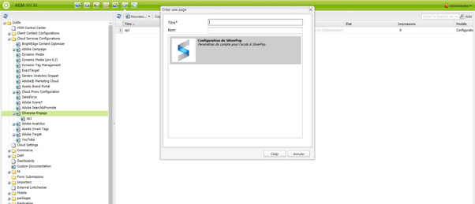

# Intégrer à Silverpop Engage{#integrating-with-silverpop-engage}

>[!CAUTION]
>
>AEM 6.4 a atteint la fin de la prise en charge étendue et cette documentation n’est plus mise à jour. Pour plus d’informations, voir notre [période de support technique](https://helpx.adobe.com/fr/support/programs/eol-matrix.html). Rechercher les versions prises en charge [here](https://experienceleague.adobe.com/docs/?lang=fr).

>[!NOTE]
>
>L’intégration à Silverpop **n’est pas** disponible par défaut. Vous devez télécharger le [module d’intégration Silverpop](https://www.adobeaemcloud.com/content/marketplace/marketplaceProxy.html?packagePath=/content/companies/public/adobe/packages/aem620/product/cq-mcm-integrations-silverpop-content) à partir de Package Share et l’installer sur votre instance. Une fois le package installé, vous pouvez le configurer comme décrit dans ce document.

L’intégration d’AEM à Silverpop Engage permet de gérer et d’envoyer des e-mails créés dans AEM via Silverpop. Elle vous permet également d’utiliser les fonctions de gestion de pistes de Silverpop via des formulaires AEM sur les pages AEM.

L’intégration offre les fonctionnalités suivantes :

* La possibilité de créer des emails dans AEM et de les publier dans Silverpop pour distribution.
* La possibilité de définir l’action d’un formulaire AEM pour créer un abonné Silverpop.

Une fois Silverpop Engage configuré, vous pouvez publier des newsletters ou des e-mails sur Silverpop Engage.

## Création d’une configuration Silverpop {#creating-a-silverpop-configuration}

Les configurations Silverpop peuvent être ajoutées via **Services cloud**, **Outils** ou **Points d’entrée d’API**. Toutes les méthodes sont décrites dans cette section.

### Configuration de Silverpop via Cloud Services {#configuring-silverpop-via-cloudservices}

Pour créer une configuration Silverpop en Cloud Services :

1. Dans AEM, appuyez ou cliquez sur **Outils** > **Déploiement** > **Services cloud**. (Ou accédez directement à `https://<hostname>:<port>/etc/cloudservices.html`).
1. Sous les services tiers, cliquez sur **Silverpop Engage** et ensuite sur **Configurer**. La fenêtre de configuration Silverpop s’ouvre.

   >[!NOTE]
   >
   >Silverpop Engage n’est pas disponible en tant qu’option sous les services tiers, sauf si vous téléchargez le module à partir du partage de modules.

1. Ajoutez un titre et, éventuellement, un nom, puis cliquez sur **Créer**. La fenêtre de configuration des **Paramètres de Silverpop** s’ouvre.
1. Saisissez le nom d’utilisateur et le mot de passe, puis sélectionnez un point de terminaison API dans la liste déroulante.
1. Cliquez sur **Connecter à Silverpop.** Une fois la connexion établie, vous voyez une boîte de dialogue de confirmation. Cliquez sur **OK** pour fermer la fenêtre. Vous pouvez accéder à Silverpop en cliquant sur **Accéder à Silverpop Engage**.
1. Silverpop a été configuré. Si vous souhaitez modifier la configuration, cliquez sur **Modifier**.
1. En outre, la structure Silverpop Engage peut être configurée pour les actions personnalisées lorsque vous fournissez un titre et un nom (facultatif). Cliquez sur Créer pour créer la structure de la connexion Silverpop déjà configurée.

   Les colonnes d’extension de données importées peuvent être utilisées ultérieurement par le composant AEM - **Texte et personnalisation**.

### Configuration de Silverpop via les outils {#configuring-silverpop-via-tools}

Pour créer une configuration Silverpop dans Outils :

1. Dans AEM, appuyez ou cliquez sur **Outils** > **Déploiement** > **Services cloud**. Ou accédez-y directement sur `https://<hostname>:<port>/misadmin#/etc`.
1. Sélectionnez **Outils**, puis **Configuration des services cloud** et ensuite **Silverpop Engage**.
1. Cliquez sur **Nouveau** pour ouvrir la fenêtre **Créer une page**.

   

1. Saisissez le **Titre** et éventuellement la variable **Nom**, puis cliquez sur **Créer**.
1. Saisissez les informations de configuration conformément à l’étape 4 de la procédure précédente. Suivez cette procédure pour terminer la configuration de Silverpop.

### Ajout de plusieurs configurations {#adding-multiple-configurations}

Pour ajouter plusieurs configurations :

1. Sur la page de bienvenue, cliquez sur **Services cloud** et cliquez sur **Silverpop Engage**. Cliquez sur le bouton **Afficher les configurations** qui s’affiche si une ou plusieurs configurations de Silverpop sont disponibles. Toutes les configurations disponibles sont répertoriées.
1. Cliquez sur le lien **+** en regard de Configurations disponibles. Cette action ouvre la fenêtre **Créer une configuration**. Suivez la procédure de configuration précédente pour créer une configuration.

### Configuration des points de terminaison d’API pour la connexion à Silverpop {#configuring-api-end-points-for-connecting-to-silverpop}

Actuellement, AEM comporte six points de terminaison non sécurisés (Engage 1 à 6). Silverpop fournit désormais deux nouveaux points de terminaison ainsi que de nouveaux points de terminaison de connexion pour les points existants.

Pour configurer les points d’entrée d’API :

1. Accédez à `/libs/mcm/silverpop/components/silverpoppage/dialog/items/general/items/apiendpoint/options node` sur `https://<hostname>:<port>/crxde.`.
1. Cliquez avec le bouton droit et sélectionnez **Créer**, puis **Créer un nœud**.
1. Pour le **Nom**, saisissez `sp-e0`, et pour le **Type**, choisissez `cq:Widget`.
1. Ajoutez deux propriétés au nœud que vous venez de créer :

   1. **Nom** : `text`, **Type** : `String`, **Valeur** : `Engage 0`
   1. **Nom** : `value`, **Type** : `String`, **Valeur** : `https://api0.silverpop.com`

   

   Cliquez sur le bouton « Enregistrer tout ».

1. Créez un autre nœud en saisissant pour le **nom** : `sp-e7`, et pour le **type** : `cq:Widget`.

   Ajoutez deux propriétés au nœud que vous venez de créer :

   1. **Nom** : `text`, **Type** : `String`, **Valeur** : `Pilot`
   1. **Nom** : `value`, **Type** : `String`, **Valeur** : `https://apipilot.silverpop.com/XMLAPI`

1. Pour modifier les points d’entrée d’API existants (Engage 1 à 6), cliquez sur chacun d’entre eux un par un et remplacez les valeurs comme suit :

   | **Nom du nœud** | **Valeur du point d’entrée existant** | **Nouvelle valeur de point d’entrée** |
   |---|---|---|
   | sp-e1 | https://api.engage1.silverpop.com/XMLAPI | https://api1.silverpop.com |
   | sp-e2 | https://api.engage2.silverpop.com/XMLAPI | https://api2.silverpop.com |
   | sp-e3 | https://api.engage3.silverpop.com/XMLAPI | https://api3.silverpop.com |
   | sp-e4 | https://api.engage4.silverpop.com/XMLAPI | https://api4.silverpop.com |
   | sp-e5 | https://api.engage5.silverpop.com/XMLAPI | https://api5.silverpop.com |
   | sp-e6 | https://api.pilot.silverpop.com/XMLAPI | https://api6.silverpop.com |

1. Cliquez sur **Enregistrer tout**. AEM est maintenant prêt à se connecter à Silverpop sur des points de terminaison sécurisés.

   
