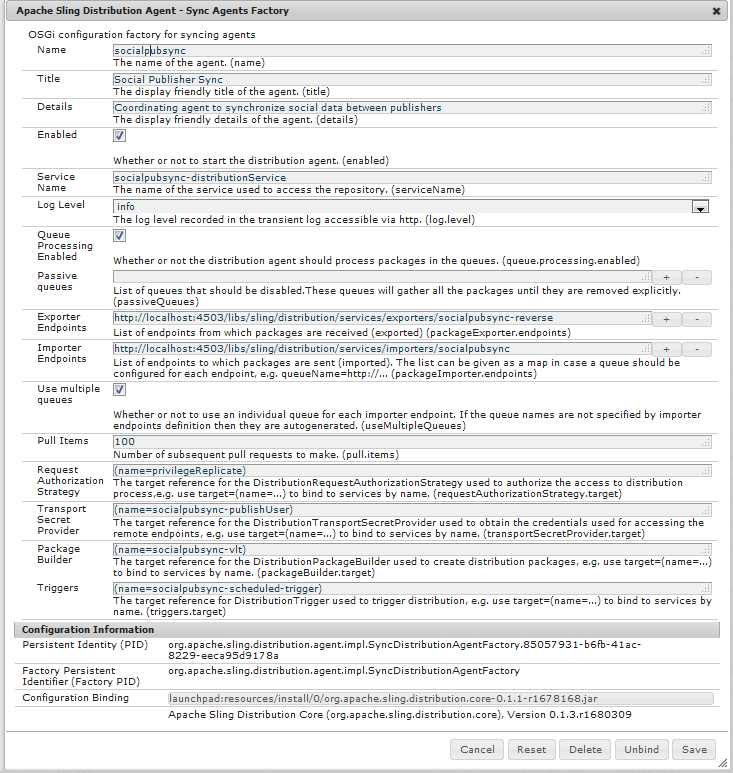
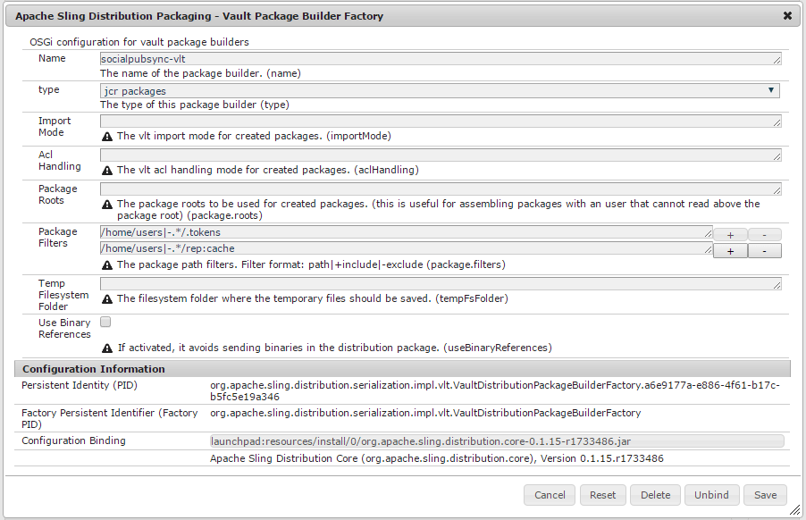

# Synchronisation des utilisateurs{#user-synchronization}

## Présentation {#introduction}

Lorsque le déploiement est une [batterie de publication](/help/sites-deploying/recommended-deploys.md#tarmk-farm), les membres doivent être en mesure de se connecter et de voir leurs données sur tout noeud de publication.

Les utilisateurs et les groupes d’utilisateurs (données utilisateur) créés dans l’environnement de publication ne sont pas nécessaires dans l’environnement de création.

La plupart des données utilisateur créées dans l’environnement de création sont destinées à rester dans l’environnement de création et à ne pas être copiées vers les instances de publication.

L’enregistrement et les modifications effectués sur une instance de publication doivent être synchronisés avec d’autres instances de publication afin de pouvoir accéder aux mêmes données utilisateur.

Depuis AEM 6.1, lorsque la synchronisation des utilisateurs est activée, les données utilisateur sont automatiquement synchronisées sur les instances de publication dans la ferme et ne sont pas créées en mode de création.

## Distribution Sling {#sling-distribution}

Les données utilisateur, ainsi que leurs [ACL](/help/sites-administering/security.md), sont stockées dans le [Oak Core](/help/sites-deploying/platform.md), la couche située sous le JCR Oak, et sont accessibles à l&#39;aide de l&#39;[API Oak](https://helpx.adobe.com/experience-manager/6-4/sites/developing/using/reference-materials/javadoc/org/apache/jackrabbit/oak/api/package-tree.html). Avec des mises à jour peu fréquentes, il est raisonnable que les données utilisateur soient synchronisées avec d’autres instances de publication à l’aide de [Sling Content Distribution](https://github.com/apache/sling/blob/trunk/contrib/extensions/distribution/README.md) (distribution Sling).

Les avantages de la synchronisation des utilisateurs à l’aide de la distribution Sling, par rapport à la réplication traditionnelle, sont les suivants :

* Les *utilisateurs*, *les profils d’utilisateur* et les *groupes d’utilisateurs* créés à la publication ne sont pas créés en mode de création.

* La distribution Sling définit des propriétés dans les événements JCR, permettant d’agir au niveau des écouteurs d’événements du côté publication sans se préoccuper des boucles de réplication infinies.
* La distribution Sling envoie uniquement les données utilisateur à des instances de publication non originaires, ce qui élimine le trafic inutile.
* [](/help/sites-administering/security.md) ACLset dans le noeud utilisateur sont inclus dans la synchronisation

>[!NOTE]
>
>Si des sessions sont requises, il est conseillé d’utiliser une solution SSO ou une session persistante et de demander aux clients de se connecter s’ils basculent vers un autre éditeur.

>[!CAUTION]
>
>La synchronisation du groupe ***administrateurs** *n’est pas prise en charge, même si la synchronisation des utilisateurs est activée. À la place, un échec de l’importation de la comparaison est consigné dans le journal des erreurs.
>
>Par conséquent, lorsque le déploiement est une batterie de publication, si un utilisateur est ajouté ou supprimé du groupe ***administrateurs** *, la modification doit être effectuée manuellement sur chaque instance de publication.

## Activer la synchronisation des utilisateurs {#enable-user-sync}

>[!NOTE]
>
>Par défaut, la synchronisation des utilisateurs est `disabled`.
>
>Activer la synchronisation des utilisateurs implique de modifier les configurations OSGi *existantes*.
>
>Aucune configuration nouvelle ne doit être ajoutée suite à l’activation de la synchronisation des utilisateurs.

La synchronisation des utilisateurs repose sur l’environnement de création pour gérer les distributions de données utilisateur, même si les données utilisateur ne sont pas créées en mode de création. Une grande partie, mais pas l’intégralité, de la configuration a lieu dans l’environnement de création et chaque étape identifie clairement si elle doit être effectuée en mode de création ou en mode de publication.

Vous trouverez ci-dessous les étapes nécessaires pour activer la synchronisation des utilisateurs, suivies d’une section [Résolution des incidents](#troubleshooting) :

### Conditions préalables {#prerequisites}

1. Si les utilisateurs et les groupes d’utilisateurs ont déjà été créés sur un éditeur, il est recommandé de [synchroniser manuellement](#manually-syncing-users-and-user-groups) les données utilisateur sur tous les éditeurs avant de configurer et d’activer la synchronisation des utilisateurs.

   Une fois la synchronisation des utilisateurs activée, seuls les utilisateurs et les groupes nouvellement créés sont synchronisés.

1. Vérifiez que le code le plus récent a été installé :

* [Mise à jour de la plateforme AEM](https://helpx.adobe.com/fr/experience-manager/kb/aem62-available-hotfixes.html)
* [Mises à jour d’AEM Communities](/help/communities/deploy-communities.md#latest-releases)

### 1. Agent de distribution Apache Sling - Fabrique d’agents de synchronisation  {#apache-sling-distribution-agent-sync-agents-factory}

**Activer la synchronisation des utilisateurs**

* **en mode de création**

   * connectez-vous avec des autorisations d’administrateur
   * accédez à la [console Web](/help/sites-deploying/configuring-osgi.md)

      * par exemple, [http://localhost:4502/system/console/configMgr](http://localhost:4502/system/console/configMgr)
   * localiser `Apache Sling Distribution Agent - Sync Agents Factory`

      * sélectionnez la configuration existante à ouvrir pour modification (icône de crayon)

         Vérifier `name`: **`socialpubsync`**

      * cochez la case `Enabled`
      * select `Save`




### 2. Créez l’utilisateur autorisé {#createauthuser}

**Configurez des autorisations** Cet utilisateur autorisé sera utilisé à l’étape 3 pour configurer la distribution Sling en mode de création.

* **sur chaque instance de publication**

   * connectez-vous avec des autorisations d’administrateur
   * accédez à la [console de sécurité](/help/sites-administering/security.md)

      * par exemple, [http://localhost:4503/useradmin](http://localhost:4503/useradmin)
   * créez un nouvel utilisateur

      * par exemple, `usersync-admin`
   * ajouter cet utilisateur au groupe d&#39;utilisateurs **`administrators`**
   * [ajoutez l’ACL de cet utilisateur à /home](#addacls)

      * `Allow jcr:all` avec restriction  `rep:glob=*/activities/*`


>[!CAUTION]
>
>Un nouvel utilisateur doit être créé.
>
>* L’utilisateur par défaut affecté est l’utilisateur **`admin`**.
>* Ne pas utiliser `*communities-user-admin *user*.*`

>


#### Comment ajouter une ACL {#addacls}

* accédez à CRXDE Lite

   * par exemple, [http://localhost:4503/crx/de](http://localhost:4503/crx/de)

* sélectionner le noeud `/home`
* dans le volet de droite, sélectionnez l’onglet `Access Control`
* sélectionnez le bouton `+` pour ajouter une entrée ACL.

   * **Entité de sécurité :** : *recherchez l’utilisateur créé pour la synchronisation des utilisateurs*
   * **Type** : `Allow`
   * **Privilèges** :  `jcr:all`
   * **** Restrictionsrep:glob:  `*/activities/*`
   * sélectionnez **OK**

* sélectionnez **Enregistrer tout**


Voir également

* [Gestion des droits d’accès](/help/sites-administering/user-group-ac-admin.md#access-right-management)
* Section de dépannage [Modifier l&#39;exception d&#39;opération pendant le traitement des réponses](#modify-operation-exception-during-response-processing).

### 3. Distribution Adobe Granite - Fournisseur secret du transport de mot de passe chiffré {#adobegraniteencpasswrd}

**Configurer les autorisations**

Une fois qu’un utilisateur autorisé, membre du groupe **`administrators`**utilisateur, a été créé sur toutes les instances de publication, cet utilisateur autorisé doit être identifié sur l’auteur comme ayant l’autorisation de synchroniser les données utilisateur de l’auteur à la publication.

* **en mode de création**

   * connectez-vous avec des autorisations d’administrateur
   * accédez à la [console Web](/help/sites-deploying/configuring-osgi.md)

      * par exemple, [http://localhost:4502/system/console/configMgr](http://localhost:4502/system/console/configMgr)
   * localiser `Adobe Granite Distribution - Encrypted Password Transport Secret Provider`
   * sélectionnez la configuration existante à ouvrir pour modification (icône de crayon)

      Vérifier `property name` : **`socialpubsync-publishUser`**

   * définissez le nom d’utilisateur et le mot de passe de l’[utilisateur autorisé](#createauthuser) créé en mode de publication à l’étape 2

      * par exemple, `usersync-admin`


### 4. Agent de distribution Apache Sling - Fabrique d’agents de file d’attente {#apache-sling-distribution-agent-queue-agents-factory}

**Activer la synchronisation des utilisateurs**

* **en mode de publication** :

   * connectez-vous avec des autorisations d’administrateur
   * accédez à la [console Web](/help/sites-deploying/configuring-osgi.md)

      * par exemple, [http://localhost:4503/system/console/configMgr](http://localhost:4503/system/console/configMgr)
   * localiser `Apache Sling Distribution Agent - Queue Agents Factory`

      * sélectionnez la configuration existante à ouvrir pour modification (icône de crayon)

         Vérifier `Name` : `socialpubsync-reverse`

      * cochez la case `Enabled`
      * sélectionner `Save`
   * **répétez** l’opération pour chaque instance de publication


### 5. Distribution Adobe Granite - Fabrique observateur diff.{#diffobserver}

**Activez la synchronisation des groupes**

* **sur chaque instance de publication** :

   * connectez-vous avec des autorisations d’administrateur
   * accédez à la [console Web](/help/sites-deploying/configuring-osgi.md)

      * par exemple, [http://localhost:4503/system/console/configMgr](http://localhost:4503/system/console/configMgr)
   * localiser `Adobe Granite Distribution - Diff Observer Factory`

      * sélectionnez la configuration existante à ouvrir pour modification (icône de crayon)

         Vérifier `agent name` : `socialpubsync-reverse`

      * cochez la case `Enabled`
      * sélectionner `Save`


### 6. Déclencheur de distribution Apache Sling - Fabrique de déclencheurs planifiés {#apache-sling-distribution-trigger-scheduled-triggers-factory}

**(Facultatif) modifiez l’intervalle d’interrogation**

Par défaut, l’auteur interroge les modifications toutes les 30 secondes. Pour modifier cet intervalle :

* **en mode de création**

   * connectez-vous avec des autorisations d’administrateur
   * accédez à la [console Web](/help/sites-deploying/configuring-osgi.md)

      * par exemple, [http://localhost:4502/system/console/configMgr](http://localhost:4502/system/console/configMgr)
   * localiser `Apache Sling Distribution Trigger - Scheduled Triggers Factory`

      * sélectionnez la configuration existante à ouvrir pour modification (icône de crayon)

         * Vérifier `Name` : `socialpubsync-scheduled-trigger`
      * définissez `Interval in Seconds` sur l’intervalle souhaité.
      * sélectionner `Save`


## Configuration de plusieurs instances de publication {#configure-for-multiple-publish-instances}

La configuration par défaut couvre une instance de publication unique. Puisque l’objectif de l’activation de la synchronisation des utilisateurs est de synchroniser plusieurs instances de publication (par exemple, pour une ferme de publication), les instances de publication supplémentaires doivent être ajoutées à la fabrique d’agents de synchronisation.

### 7. Agent de distribution Apache Sling - Fabrique d’agents de synchronisation {#apache-sling-distribution-agent-sync-agents-factory-1}

**Ajoutez des instances de publication :**

* **en mode de création**

   * connectez-vous avec des autorisations d’administrateur
   * accédez à la [console Web](/help/sites-deploying/configuring-osgi.md)

      * par exemple, [http://localhost:4502/system/console/configMgr](http://localhost:4502/system/console/configMgr)
   * localiser `Apache Sling Distribution Agent - Sync Agents Factory`

      * sélectionnez la configuration existante à ouvrir pour modification (icône de crayon)

         Vérifier `Name` : `socialpubsync`


* **Points de terminaison de l’exportateur** Il doit exister un point de terminaison de l’exportateur pour chaque éditeur. Par exemple, s’il existe 2 éditeurs, localhost:4503 et 4504, il doit y avoir 2 entrées :

   * http://localhost:4503/libs/sling/distribution/services/exporters/socialpubsync-reverse
   * http://localhost:4504/libs/sling/distribution/services/exporters/socialpubsync-reverse

* **Points de**
terminaison de l’importateurChaque éditeur doit disposer d’un point de terminaison d’importateur. Par exemple, s’il existe 2 éditeurs, localhost:4503 et 4504, il doit y avoir 2 entrées :

   * http://localhost:4503/libs/sling/distribution/services/importers/socialpubsync
   * http://localhost:4504/libs/sling/distribution/services/importers/socialpubsync

* sélectionner `Save`

### 8. Écouteur de synchronisation des utilisateurs AEM Communities {#aem-communities-user-sync-listener}

**(Facultatif) Synchroniser les nœuds JCR supplémentaires**

S’il existe des données personnalisées à synchroniser sur plusieurs instances de publication, alors :

* **sur chaque instance de publication**:

   * connectez-vous avec des autorisations d’administrateur
   * accédez à la [console Web](/help/sites-deploying/configuring-osgi.md)

      * par exemple, [http://localhost:4503/system/console/configMgr](http://localhost:4503/system/console/configMgr)
   * localiser `AEM Communities User Sync Listener`
   * sélectionnez la configuration existante à ouvrir pour modification (icône de crayon)

      Vérifier `Name`: `socialpubsync-scheduled-trigger`


* **Types de nœuds**

   Il s’agit de la liste des types de noeud qui seront synchronisés. Tout type de nœud autre que sling:Folder doit être répertorié ici (sling:folder est traité séparément).

    Liste par défaut des types de nœuds à synchroniser :

   * rep:User
   * nt:unstructured
   * nt:resource

* **Propriétés ignorables**

   Il s’agit de la liste des propriétés qui seront ignorées si une modification est détectée. Les modifications apportées à ces propriétés peuvent être synchronisées comme effet secondaire d’autres modifications (la synchronisation ayant toujours lieu au niveau du nœud), mais les modifications apportées à ces propriétés ne déclenchent pas en elles-mêmes de synchronisation.

    Propriété par défaut à ignorer :

   * cq:lastModified

* **Noeuds ignorables**

   Sous-chemins qui seront entièrement ignorés lors de la synchronisation. Aucun élément figurant dans ces sous-chemins d’accès ne sera synchronisé à un moment donné.

    Nœuds par défaut à ignorer :

   * .tokens
   * system

* **Dossiers distribués**

   La plupart des dossiers sling:Folders sont ignorés car la synchronisation n’est pas nécessaire. Les quelques exceptions sont répertoriées ici.

   Dossiers par défaut à synchroniser

   * segments/scoring
   * social/relationships
   * activités

### 9. Identifiant Sling unique  {#unique-sling-id}

>[!CAUTION]
>
>Si l’identifiant Sling correspond entre deux instances de publication ou plus, la synchronisation de groupe d’utilisateurs échoue.

Si l’identifiant Sling est identique pour plusieurs instances de modification dans une ferme de publication, les groupes d’utilisateurs ne sont pas synchronisés.

Pour vérifier que toutes les valeurs d’identifiant Sling diffèrent, sur chaque instance de publication :

1. accédez à `http://<host>:<port>/system/console/status-slingsettings`
1. vérifiez la valeur de l’**identifiant Sling**


Si l’identifiant Sling d’une instance de publication correspond à l’identifiant Sling d’une autre instance de publication, alors :

1. arrêtez l’une des instances de publication qui possède un identifiant Sling correspondant
1. dans le répertoire crx-quickstart/launchpad/felix

   * recherchez et supprimez le fichier nommé *sling.id.file*

      * par exemple, sur un système Linux :

         `rm -i $(find . -type f -name sling.id.file)`

      * par exemple, sur un système Windows :

         `use windows explorer and search for *sling.id.file*`

1. début de l’instance de publication

   * au démarrage, un nouvel identifiant Sling lui est affecté

1. vérifiez que l’**identifiant Sling** est à présent unique

Répétez ces étapes jusqu’à ce que toutes les instances de publication aient un identifiant Sling unique.

## Fabrique Vault Package Builder  {#vault-package-builder-factory}

Pour que les mises à jour soient correctement synchronisées, il est nécessaire de modifier le générateur de module vault en vue de la synchronisation des utilisateurs :

* pour chaque instance de publication AEM
* accédez à la [console Web](/help/sites-deploying/configuring-osgi.md)

   * par exemple, [http://localhost:4503/system/console/configMgr](http://localhost:4503/system/console/configMgr)

* recherchez `Apache Sling Distribution Packaging - Vault Package Builder Factor`

   * `Builder name: socialpubsync-vlt`

* sélectionnez l’icône de modification
* ajouter deux `Package Filters` :

   * `/home/users|-.*/.tokens`
   * `/home/users|-.*/rep:cache`

* gestion des stratégies :

   * pour remplacer les nœuds rep:policy existants par de nouveaux nœuds, ajoutez un troisième filtre de module :

      * `/home/users|+.*/rep:policy`
   * pour empêcher la distribution des stratégies, définissez

      * `Acl Handling :` `IGNORE`




## Ce qui se passe lorsque ... {#what-happens-when}

### L’utilisateur s’inscrit lui-même ou modifie le profil à la publication {#user-self-registers-or-edits-profile-on-publish}

Par défaut, les utilisateurs et les profils créés dans l’environnement de publication (inscription automatique) n’apparaissent pas dans l’environnement de création.

Lorsque la topologie est une [batterie de publication](/help/sites-deploying/recommended-deploys.md#tarmk-farm) et que la synchronisation des utilisateurs a été correctement configurée, les *utilisateur *et *profil utilisateur* sont synchronisés dans la batterie de publication à l’aide de la distribution Sling.

### Les utilisateurs ou les groupes d’utilisateurs sont créés à l’aide de la console Sécurité.{#users-or-user-groups-are-created-using-security-console}

Par défaut, les données utilisateur créées dans l’environnement de publication ne sont pas visibles dans l’environnement de création, et vice versa.

Lorsque la console [Administration et sécurité des utilisateurs](/help/sites-administering/security.md) est utilisée pour ajouter de nouveaux utilisateurs dans l’environnement de publication, la synchronisation des utilisateurs synchronise les nouveaux utilisateurs et leur appartenance à un groupe sur d’autres instances de publication, si nécessaire. La synchronisation des utilisateurs synchronise également les groupes d’utilisateurs créés via la console de sécurité.

## Résolution des incidents {#troubleshooting}

### Comment mettre la synchronisation des utilisateurs hors ligne {#how-to-take-user-sync-offline}

Pour que la synchronisation des utilisateurs puisse être mise hors ligne, afin de [supprimer un éditeur](#how-to-remove-a-publisher) ou de [synchroniser manuellement les données](#manually-syncing-users-and-user-groups), la file d’attente de distribution doit être vide et inactive.

Pour vérifier l’état de la file d’attente de distribution :

* en mode de création:

   * utilisation de [CRXDE Lite](/help/sites-developing/developing-with-crxde-lite.md)

      * rechercher des entrées dans `/var/sling/distribution/packages`

         * nœuds de dossier nommés selon le schéma `distrpackage_*`
   * à l’aide du [gestionnaire de modules](/help/sites-administering/package-manager.md)

      * recherchez les modules en attente (pas encore installés)

         * nommé avec le modèle `socialpubsync-vlt*`
         * créé par `communities-user-admin`


Lorsque la file d’attente de distribution est vide, désactivez la synchronisation des utilisateurs :

* en mode de création

   * *décochez *la case `Enabled` pour [Apache Sling Distribution Agent - Sync Agents Factory](#apache-sling-distribution-agent-sync-agents-factory)

Une fois les tâches accomplies, pour réactiver la synchronisation des utilisateurs :

* en mode de création

   * cochez la case `Enabled` pour [Apache Sling Distribution Agent - Sync Agents Factory](#apache-sling-distribution-agent-sync-agents-factory).

### Diagnostics de synchronisation des utilisateurs {#user-sync-diagnostics}

L’outil Diagnostics de synchronisation des utilisateurs est un outil qui vérifie la configuration et tente d’identifier les éventuels problèmes.

Sur l&#39;auteur, il vous suffit de naviguer à partir de la console principale jusqu&#39;à **Outils, opérations, diagnostic, diagnostics de synchronisation des utilisateurs.**

Entrer simplement dans la console Diagnostics de synchronisation des utilisateurs a pour effet d’afficher les résultats.

Voici ce qui s’affiche lorsque la synchronisation des utilisateurs n’a pas été activée :


#### Comment exécuter les diagnostics pour les éditeurs {#how-to-run-diagnostics-for-publishers}

Lorsque le diagnostic est exécuté à partir de l’environnement d’auteur, les résultats de réussite/échec incluent une section [INFO] présentant la liste des instances de publication configurées pour confirmation.

La liste comprend une URL de chaque instance de publication allant exécuter les diagnostics de cette instance. Le paramètre d&#39;URL `syncUser` est ajouté à l&#39;URL de diagnostic et sa valeur est définie sur l&#39;*utilisateur de synchronisation autorisé* créé à l&#39;[étape 2](/help/sites-administering/sync.md#createauthuser).

**Remarque** : Avant le lancement de l’URL, l’*utilisateur de synchronisation autorisé* doit déjà être connecté à cette instance de publication.


### Configuration ajoutée de manière incorrecte {#improperconfig}

Lorsque la synchronisation des utilisateurs ne fonctionne pas, le problème le plus courant est que des configurations supplémentaires ont été *ajoutées*. Au lieu de cela, la *configuration par défaut existante aurait dû être *modifiée*.

Voici comment les configurations par défaut modifiées doivent apparaître dans la console Web. Si plusieurs instances apparaissent, la configuration supplémentaire doit être supprimée.

#### (création) Un agent de distribution Apache Sling - Fabrique d’agents de synchronisation {#author-one-apache-sling-distribution-agent-sync-agents-factory}


#### (création) Une distribution Adobe Granite - Fournisseur secret du transport de mot de passe chiffré {#author-one-adobe-granite-distribution-encrypted-password-transport-secret-provider}


#### (publication) Un agent de distribution Apache Sling - Fabrique d’agents de file d’attente {#publish-one-apache-sling-distribution-agent-queue-agents-factory}


#### (modification) Une distribution Adobe Granite - Fabrique observateur diff.{#publish-one-adobe-granite-distribution-diff-observer-factory}


#### (création) Un déclencheur de distribution Apache Sling - Fabrique de déclencheurs planifiés {#author-one-apache-sling-distribution-trigger-scheduled-triggers-factory}


### Modification de l’exception d’opération pendant le traitement des réponses {#modify-operation-exception-during-response-processing}

Si les éléments suivants sont visibles dans le journal :

`org.apache.sling.servlets.post.impl.operations.ModifyOperation Exception during response processing.`

`java.lang.IllegalStateException: This tree does not exist`

Vérifiez ensuite que la section [2. Create Authorized User](#createauthuser) a été correctement suivi.

Cette section décrit la création d’un utilisateur autorisé, qui existe sur toutes les instances de publication, et son identification dans la configuration OSGi « Fournisseur secret » en mode de création. Par défaut, l’utilisateur est `admin`.

L&#39;utilisateur autorisé doit être membre du groupe d&#39;utilisateurs **`administrators`** et les autorisations de ce groupe ne doivent pas être modifiées.

L’utilisateur autorisé doit avoir explicitement les autorisations et la restriction suivante sur les instances de publication :

| **path** | **jcr:all** | **rep:glob** |
|---|---|---|
| /home | X | &amp;ast;/activités/&amp;ast; |
| /home/users | X | &amp;ast;/activités/&amp;ast; |
| /home/groups | X | &amp;ast;/activités/&amp;ast; |

En tant que membre du groupe `administrators`, l’utilisateur autorisé doit disposer des privilèges suivants sur toutes les instances de publication :

| **chemin** | **jcr:all** | **jcr:read** | **rep:write** |
|---|---|---|---|
| /etc/packages/sling/distribution |  |  | X |
| /libs/sling/distribution |  | X |  |
| /var |  |  | X |
| /var/eventing |  | X | X |
| /var/sling/distribution |  | X | X |

### La synchronisation du groupe d’utilisateurs a échoué  {#user-group-sync-failed}

Si l’identifiant Sling correspond entre deux instances de publication ou plus, la synchronisation de groupe d’utilisateurs échoue.

Voir la section [9. Identifiant Sling unique](#unique-sling-id).

### Synchronisation manuelle d’utilisateurs et de groupes d’utilisateurs  {#manually-syncing-users-and-user-groups}

* sur l’éditeur sur lequel les utilisateurs et les groupes d’utilisateurs existent :

   * [si elle est activée, désactivez la synchronisation des utilisateurs](#how-to-take-user-sync-offline)
   * [créez un module](/help/sites-administering/package-manager.md#creating-a-new-package) de `/home`

      * lors de la modification du module

         * onglet filtres : Filtre d&#39;Ajoute : Chemin racine : `/home`
         * Onglet Avancé : Gestion CA : `Overwrite`
   * [exportez le module](/help/sites-administering/package-manager.md#downloading-packages-to-your-file-system)


* sur d’autres instances de publication :

   * [importez le module](/help/sites-administering/package-manager.md#installing-packages)

Pour configurer ou activer la synchronisation des utilisateurs, passez à l’étape 1 : [Agent de distribution Apache Sling - Usine des agents de synchronisation](#apache-sling-distribution-agent-sync-agents-factory)

### Lorsqu’un éditeur n’est plus disponible {#when-a-publisher-becomes-unavailable}

Lorsqu’une instance de publication n’est plus disponible, elle ne doit pas être supprimée si elle doit être de nouveau en ligne à l’avenir. Les modifications sont mises en file d’attente pour l’éditeur et, une fois l’instance de nouveau en ligne, elles sont traitées.

Si l’instance de publication n’est jamais remise en ligne, si elle est hors ligne de manière permanente, elle doit être supprimée car l’accumulation de files d’attente entraînera une utilisation notable de l’espace disque dans l’environnement d’auteur.

Lorsqu’un éditeur est en panne, le journal de création comporte des exceptions similaires à :

```
28.01.2016 15:57:48.475 ERROR
 [pool-12-thread-34-org_apache_sling_distribution_queue_socialpubsync_endpoint1
 (org/apache/sling/distribution/queue/socialpubsync/endpoint1)]
 org.apache.sling.distribution.agent.impl.SimpleDistributionAgent [agent][socialpubsync] could not deliver package distrpackage_1454014575838_a2b45ec8-0400-42f3-bed8-ae09b66381cb
 org.apache.sling.distribution.packaging.DistributionPackageImportException: failed in importing package ...
```

### Comment supprimer un éditeur {#how-to-remove-a-publisher}

Pour supprimer un éditeur de l’[Agent de distribution Apache Sling - Fabrique d’agents de synchronisation](#apache-sling-distribution-agent-sync-agents-factory), la file d’attente de distribution doit être vide et silencieuse.

* en mode création :

   * [Mettez la synchronisation des utilisateurs hors ligne](#how-to-take-user-sync-offline)
   * suivez l’[étape 7](#apache-sling-distribution-agent-sync-agents-factory) pour supprimer l’éditeur des deux listes de serveur :

      * `Exporter Endpoints`
      * `Importer Endpoints`
   * réactivez la synchronisation des utilisateurs

      * cochez la case `Enabled` pour [Apache Sling Distribution Agent - Sync Agents Factory](#apache-sling-distribution-agent-sync-agents-factory).


