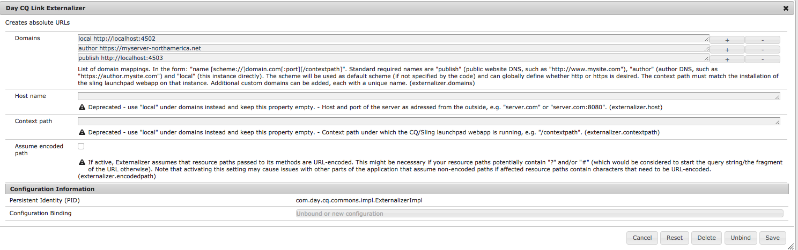

# Conditions préalables à l’intégration à Adobe Target{#prerequisites-for-integrating-with-adobe-target}

Dans le cadre de l&#39;intégration de [AEM et Adobe Target](/help/sites-administering/target.md), vous devez vous enregistrer auprès de Adobe Target, configurer l&#39;agent de réplication et sécuriser les paramètres d&#39;activité sur le noeud de publication.

## Inscription à Adobe Target {#registering-with-adobe-target}

Pour intégrer AEM à Adobe Target, vous devez disposer d’un compte Adobe Target valide. Ce compte doit disposer au minimum des autorisations **approbateur **niveau. Lorsque vous vous inscrivez à Adobe Target, vous recevez un code client. Vous avez besoin du code client et de vos nom d’utilisateur et mot de passe Adobe Target pour connecter AEM à Adobe Target.

Le code client identifie le compte client Adobe Target en appelant le serveur Adobe Target.

>[!NOTE]
>
>Votre compte doit également être activé par l’équipe Target pour pouvoir utiliser l’intégration.
>
>
>Si ce n’est pas encore le cas, contactez l’[Assistance clientèle Adobe Target](https://docs.adobe.com/content/help/en/target/using/cmp-resources-and-contact-information.html).

## Activation de l’agent de réplication Target {#enabling-the-target-replication-agent}

L&#39;agent de réplication [Test et Cible](/help/sites-deploying/replication.md) doit être activé sur l&#39;instance d&#39;auteur. Notez que cet agent de réplication n&#39;est pas activé par défaut si vous avez utilisé le mode d&#39;exécution [nosamplecontent](/help/sites-deploying/configure-runmodes.md#using-samplecontent-and-nosamplecontent) pour installer AEM. Pour plus d’informations sur la sécurisation de votre environnement de production, voir [Liste de contrôle de sécurité](/help/sites-administering/security-checklist.md).

1. Sur la page d’accueil d’AEM, cliquez ou appuyez sur **Outils** > **Déploiement** > **Réplication**.
1. Cliquez ou appuyez sur **Agents sur l’auteur**.
1. Cliquez ou appuyez sur l’agent de réplication **Test&amp;Target**, puis cliquez ou appuyez sur **Modifier**.
1. Sélectionnez l’option Activé, puis cliquez ou appuyez sur **OK**.

   >[!NOTE]
   >
   >Lorsque vous configurez l’agent de réplication Test&amp;Target, sous l’onglet **transport**, l’URI est défini par défaut sur **tnt:///**. Ne remplacez pas cet URI par **https://admin.testandtarget.omniture.com**.
   >
   >Veuillez noter que si vous tentez de tester la connexion avec **tnt:///**, elle renvoie une erreur. Ce comportement est attendu car cet URI est destiné à un usage interne uniquement et ne doit pas être utilisé avec **Test Connection**.

## Sécurisation du nœud de paramètres d’activité {#securing-the-activity-settings-node}

Vous devez sécuriser le nœud de paramètres d’activité **c:ActivitySettings** sur l’instance de publication de sorte qu’il ne soit pas accessible pour les utilisateurs normaux. Le nœud de paramètres d’activité doit être accessible uniquement au service gérant la synchronisation de l’activité avec Adobe Target.

Le noeud **cq:ActivitySettings** est disponible dans CRXDE Lite sous `/content/campaigns/*nameofbrand*`* *sous le noeud jcr:content des activités ;* *par exemple `/content/campaign/we-retail/master/myactivity/jcr:content/cq:ActivitySettings`. Ce nœud est créé après que vous ciblez un composant.

Le noeud **cq:ActivitySettings** sous l’activité jcr:content est protégé par les listes de contrôle d’accès suivantes :

* Tout refuser pour tout le monde
* Autoriser jcr:read,rep:write pour target-activity-authors (l’auteur est membre de ce groupe par défaut)
* Autoriser jcr:read,rep:write pour targetservice

Ces paramètres permettent de garantir que les utilisateurs ordinaires n’ont pas accès aux propriétés de nœud. Utilisez les mêmes listes ACL sur les instances de création et de publication. Voir [Administration utilisateur et sécurité](/help/sites-administering/security.md) pour plus d’informations.

## Configuration de l’externaliseur AEM {#configuring-the-aem-externalizer}

Lors de la modification d’une activité dans Adobe Target, l’URL pointe sur **localhost**, à moins que vous ne modifiiez l’URL sur le nœud de création AEM.

Pour configurer l’externaliseur AEM :

1. Accédez à la console Web OSGi à l’adresse **https://&lt;serveur>:&lt;port>/system/console/configMgr.**
1. Recherchez **Day CQ Link Externalizer** et saisissez le domaine du nœud de création.

   

