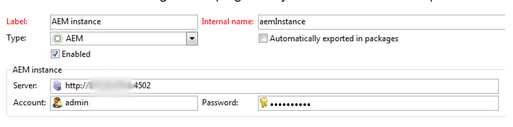

# Résoudre les incidents liés à votre intégration Adobe Campaign{#troubleshooting-your-adobe-campaign-integration}

>[!CAUTION]
>
>AEM 6.4 a atteint la fin de la prise en charge étendue et cette documentation n’est plus mise à jour. Pour plus d’informations, voir notre [période de support technique](https://helpx.adobe.com/fr/support/programs/eol-matrix.html). Rechercher les versions prises en charge [here](https://experienceleague.adobe.com/docs/?lang=fr).

>[!NOTE]
>
>Cette page s’applique au Campaign Classic.

Les conseils de dépannage suivants permettent de résoudre les problèmes les plus courants que vous pouvez rencontrer lorsque vous intégrez AEM avec Adobe Campaign :

## Conseils pratiques de dépannage {#general-troubleshooting-tips}

Pour les deux intégrations, vous pouvez vérifier si les appels HTTP sont envoyés (AEM > Adobe Campaign, Adobe Campaign > AEM) :

* Lorsque les intégrations échouent, assurez-vous que ces appels arrivent de l’autre côté (pour éviter les problèmes de pare-feu/SSL).
* En ce qui concerne la fonctionnalité AEM, vous constaterez que les appels JSON sont demandés à partir de l’interface de création d’AEM ; ils ne devraient pas engendrer d’erreur HTTP 500. Si vous voyez des erreurs HTTP 500, vérifiez le fichier `error.log` pour plus d’informations à leur sujet.
* L’augmentation du niveau de débogage pour les classes de campagne dans AEM aide également à résoudre les problèmes.

## Si la connexion échoue {#if-the-connection-fails}

Vérifiez que vous avez configuré l’opérateur **aemserver** dans Adobe Campaign.

## Si les images n’apparaissent pas dans la console Adobe Campaign {#if-images-do-not-appear-in-the-adobe-campaign-console}

Vérifiez la source HTML et confirmez que vous pouvez ouvrir l’URL à partir de l’ordinateur client. Si localhost:4503 ne figure pas dans l’URL, modifiez la configuration de l’Externaliseur de liens Day CQ sur votre instance de création afin qu’elle pointe vers une instance de publication accessible à partir de l’ordinateur de la console Adobe Campaign.

Consultez la section [Configuration de l’externaliseur.](/help/sites-administering/campaignstandard.md#configuring-the-externalizer)

## Si vous ne pouvez pas vous connecter d’AEM à Adobe Campaign {#if-you-cannot-connect-from-aem-to-adobe-campaign}

Recherchez le message d’erreur suivant dans Adobe Campaign :

`No datasource defined in the instance 'default'.`

`Make sure the DNS alias used to access the server is correct (for example, avoid hard-coded IP addresses). (iRc=16384)`

Pour résoudre ce problème, modifiez les éléments suivants dans **$CAMPAIGN_HOME/conf/config-&lt;nom-instance>.xml** :

`<dataStore hosts="*" lang="en_GB">`

## Si aucune donnée ne s’affiche dans la boîte de dialogue Adobe Campaign {#if-no-data-displays-in-the-adobe-campaign-dialog}

Dans Adobe Campaign, assurez-vous qu’il n’y a aucune barre oblique (/) après le numéro de port.



## Si vous recevez un avertissement concernant votre paramètre setlocale {#if-you-get-a-warning-about-your-setlocale}

Si vous voyez l’erreur `"Warning: setlocale: LC_CTYPE cannot change locale"` lors du démarrage du service Apache HTTPD, vérifiez que les **paramètres régionaux en_CA.ISO-8859-15** sont installés sur le système.

Vous pouvez vérifier s’ils sont installés à l’aide de `local -a`. S’il n’est pas installé, vous pouvez le corriger. **/usr/local/neolane/nl6/env.sh** et remplacez le paramètre régional par un paramètre installé.

## Si vous obtenez une erreur lors de la compilation du script &#39;get_nms_amcGetSeedMetaData_jssp&#39; {#if-you-get-an-error-while-compiling-script-get-nms-amcgetseedmetadata-jssp}

Si le message d’erreur suivant s’affiche dans le fichier journal d’AEM :

`com.day.cq.mcm.campaign.impl.CampaignConnectorImpl Internal Adobe Campaign error: response body is Error while compiling script 'get_nms_amcGetSeedMetaData_jssp' line 45: String.prototype.toJSON called on incompatible XML.`

Procédez comme suit :

1. Ouvrir le fichier **$CAMPAIGN_HOME/datakit/nms/fra/js/amcIntegration.js**
1. Modifiez la ligne 467 de la méthode amcGetSeedMetaData.
1. Remplacez `label : [inclView.@label](mailto:inclView.@label)` par `label : String([inclView.@label](mailto:inclView.@label))`.

1. Enregistrez.
1. Relancez le serveur.

## Si Adobe Campaign affiche une erreur lors du clic sur le bouton Synchroniser {#if-adobe-campaign-displays-an-error-when-clicking-the-synchronize-button}

Si l’erreur suivante s’affiche lorsque vous cliquez sur le bouton **Synchroniser** dans Adobe Campaign Classic :

`Error while executing the method ‘aemListContent' of service [nms:delivery](https://nmsdelivery/)`

Pour résoudre ce problème, assurez-vous que l’URL de connexion AEM configurée dans les comptes externes est accessible à partir de l’ordinateur.

Un saut à partir d’un **localhost** à une adresse IP qui a résolu ce problème.

## Si vous obtenez une erreur &quot;Impossible d’analyser XTK Date+Time &#39;undefined&#39; {#if-you-get-a-cannot-parse-xtk-date-time-undefined-error}

Après avoir cliqué sur Synchroniser, vous obtenez une erreur indiquant qu’un script s’est produit sur les pages : Impossible d’analyser XTK Date+Time &#39;undefined&#39; : n’est pas une valeur XTK valide.

Cela se produit en présence d’informations obsolètes relatives à Adobe Campaign sur l’instance AEM. Vous pouvez résoudre ce problème en supprimant toutes les configurations d’intégration d’Adobe Campaign sur AEM et en les reconstruisant. Créez ensuite un modèle.

## Si une connexion à SSL affiche une erreur lors de la configuration du service cloud {#if-a-connection-to-ssl-displays-an-error-when-setting-up-the-cloud-service}

Dans le fichier error.log d’AEM, les éléments suivants s’affichent :

```xml
javax.net.ssl.SSLProtocolException: handshake alert:  unrecognized_name
at sun.security.ssl.ClientHandshaker.handshakeAlert(Unknown Source)
at sun.security.ssl.SSLSocketImpl.recvAlert(Unknown Source)
at sun.security.ssl.SSLSocketImpl.readRecord(Unknown Source)
at sun.security.ssl.SSLSocketImpl.performInitialHandshake(Unknown Source)
at sun.security.ssl.SSLSocketImpl.writeRecord(Unknown Source)
at sun.security.ssl.AppOutputStream.write(Unknown Source)
```

Veuillez lever un ticket auprès de l’équipe d’assistance d’Adobe Campaign.

## Si vous voyez http au lieu des liens https attendus dans la boîte de dialogue de synchronisation {#if-you-see-http-instead-of-an-expected-https-links-in-the-synchronization-dialog}

Avec la configuration suivante :

* Adobe Campaign hébergé à l’aide de https pour la communication avec l’auteur AEM
* Terminaison du proxy inverse SSL
* Instance de création AEM On-Premise

Lorsque vous essayez de synchroniser le contenu dans la livraison Adobe Campaign, AEM renvoie une liste de newsletters. Toutefois, les URL vers les newsletters figurant dans la liste sont des adresses HTTP. Lorsque vous sélectionnez l’un des éléments de la liste, une erreur se produit.

Pour résoudre ce problème :

* Le dispatcher ou le proxy inverse doit être configuré pour transmettre le protocole d’origine sous forme d’en-tête.
* Le *filtre SSL du service HTTP Felix Apache* dans la configuration OSGi ([https://&lt;hôte>:&lt;port>/system/console/configMgr](http://localhost:4502/system/console/configMgr)) doit être configuré avec les paramètres d’en-tête respectifs. Consultez [https://felix.apache.org/documentation/subprojects/apache-felix-http-service.html#using-the-ssl-filter](https://felix.apache.org/documentation/subprojects/apache-felix-http-service.html#using-the-ssl-filter)

## Si le modèle personnalisé que vous avez créé ne peut pas être sélectionné dans les propriétés de la page {#if-the-custom-template-i-created-cannot-be-selected-in-page-properties}

Lors de la création d’un modèle de courrier pour Adobe Campaign, vous devez inclure la propriété **acMapping** avec la valeur **mapRecipient** dans le nœud **jcr:content** du modèle ou vous ne pourrez pas sélectionner le modèle Adobe Campaign dans les **Propriétés de la page** au sein d’AEM (le champ est désactivé).

## Si vous recevez l’erreur « com.day.cq.mcm.campaign.servlets.util.ParameterMapper » dans vos journaux {#if-you-get-the-error-com-day-cq-mcm-campaign-servlets-util-parametermapper-in-your-logs}

Lorsque vous utilisez votre modèle personnalisé, vous recevez l’erreur « com.day.cq.mc m.campaign.servlets.util.ParameterMapper » dans vos journaux. Dans ce cas, veillez à installer le pack de fonctionnalités 6576 à partir du [Partage de packages](/help/sites-administering/package-manager.md#package-share). Ce problème se produit car une valeur vide est créée du côté du gestionnaire de campagnes Adobe Campaign si la propriété acMapping est définie sur une valeur autre que recipient.firstName.
