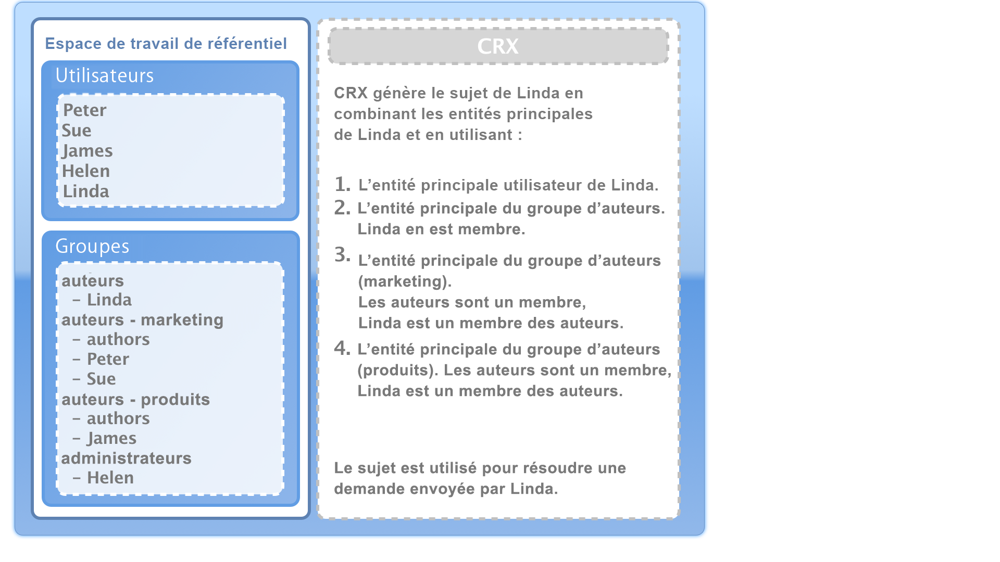
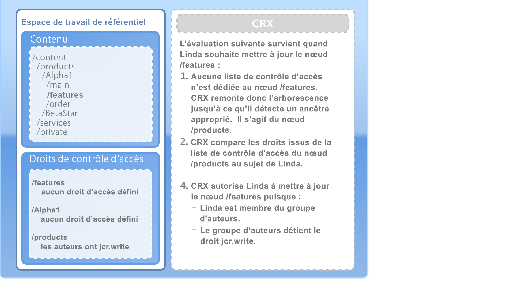
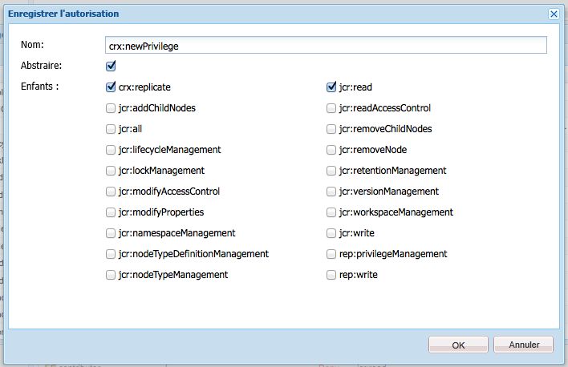
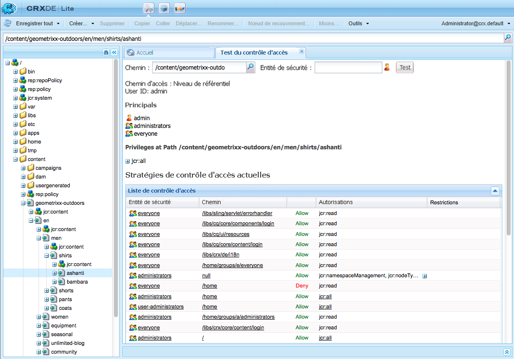

# Administration des utilisateurs, des groupes et des droits d’accès{#user-group-and-access-rights-administration}

L’activation de l’accès à un référentiel CRX comprend plusieurs rubriques :

* [Droits d’accès](#how-access-rights-are-evaluated) : concepts se rapportant à leur définition et à leur évaluation
* [Administration des utilisateurs](#user-administration) : gestion des comptes individuels utilisés pour l’accès
* [Administration des groupes](#group-administration) : simplifiez la gestion des utilisateurs en formant des groupes

* [Gestion des droits d’accès](#access-right-management) : définition des stratégies qui contrôlent comment ces utilisateurs et ces groupes peuvent accéder à des ressources

Les éléments de base sont les suivants :

**User** ComptesCRX authentifie l&#39;accès en identifiant et en vérifiant un utilisateur (par cette personne, ou une autre application) selon les détails contenus dans le compte utilisateur.

Dans CRX, chaque compte utilisateur est un nœud dans l’espace de travail. Un compte d’utilisateur CRX possède les propriétés suivantes :

* Il représente un seul utilisateur de CRX.
* Il comporte un nom d’utilisateur et un mot de passe.
* Il s’applique à cet espace de travail.
* Il ne peut pas avoir de sous-utilisateurs. Pour les droits d’accès hiérarchisés, vous devez utiliser des groupes.

* Vous pouvez spécifier des droits d’accès pour le compte utilisateur.

    En revanche, pour simplifier la gestion, il est recommandé (dans la plupart des cas) d’affecter des droits d’accès aux comptes de groupe. L’affectation de droits d’accès à chaque utilisateur devient très rapidement difficile à gérer (à l’exception de certains utilisateurs système lorsqu’il n’y a qu’une ou deux instances).

**Les comptes de groupe** Les comptes de groupe sont des collections d&#39;utilisateurs et/ou d&#39;autres groupes. Ils sont utilisés pour simplifier la gestion, car toute modification des droits d’accès affectés à un groupe est appliquée automatiquement à tous les utilisateurs de ce groupe. Un même utilisateur n’est pas tenu de faire partie d’un groupe, mais il appartient souvent à plusieurs.

Dans CRX, un groupe possède les propriétés suivantes :

* Il représente un groupe d’utilisateurs avec des droits d’accès communs. Par exemple, des créateurs ou des développeurs.
* Il s’applique à cet espace de travail.
* Il peut comporter des membres, qui peuvent être des utilisateurs individuels ou des groupes.
* Il est possible de hiérarchiser les groupes grâce aux relations des membres. Vous ne pouvez pas placer de groupes directement sous un autre groupe dans le référentiel.

* Vous pouvez définir les droits d’accès pour tous les membres d’un groupe.

**Access** RightsCRX utilise Access Rights pour contrôler l’accès à des zones spécifiques du référentiel.

Cette opération est effectuée en affectant des autorisations pour autoriser ou refuser l’accès à une ressource (nœud ou chemin d’accès) dans le référentiel. Lorsque différentes autorisations peuvent être affectées, ils doivent être évalués afin de déterminer la combinaison qui s’applique à la demande actuelle.

CRX permet de configurer les droits d’accès pour des comptes utilisateur et des comptes de groupe. Les mêmes principes de base de l’évaluation sont ensuite appliqués aux deux.

## Évaluation des droits d’accès {#how-access-rights-are-evaluated}

>[!NOTE]
>
>CRX met en œuvre le [contrôle d’accès défini par la spécification JSR-283](https://docs.adobe.com/content/docs/en/spec/jcr/2.0/16_Access_Control_Management.html).
>
>L’installation standard du référentiel CRX est configurée de manière à utiliser des listes de contrôle d’accès dépendant des ressources. Il s’agit d’une mise en œuvre possible du contrôle d’accès JSR-283 et l’une des mises en œuvre présentes avec Jackrabbit.

### Sujets et entités  {#subjects-and-principals}

CRX utilise deux concepts clés lors de l’évaluation des droits d’accès :

* Une **entité de sécurité** est une entité qui transfère des droits d’accès. Les entités comportent les éléments suivants :

   * Compte d’utilisateur
   * Un compte de groupe

      Si un compte utilisateur appartient à un ou à plusieurs groupes, il est également associé à chacune de ces entités de groupe.

* Un **sujet** est utilisé pour représenter la source de la demande.

    Il est utilisé pour centraliser les droits d’accès applicables pour cette demande. Ils proviennent de :

   * Principal utilisateur

      Droits que vous attribuez directement au compte d’utilisateur.

   * Tous les groupes principaux associés à cet utilisateur

      Tous les droits attribués à l’un des groupes auxquels l’utilisateur appartient.
   Le résultat est ensuite utilisé pour autoriser ou refuser l’accès à la ressource demandée.

#### Compilation de la liste de droit d’accès pour un sujet  {#compiling-the-list-of-access-rights-for-a-subject}

Dans CRX, le sujet dépend des éléments suivants :

* Entité de sécurité de l’utilisateur
* Toutes les entités de groupe associées à cet utilisateur

La liste des droits d’accès applicables au sujet est créée à partir :

* des droits affectés directement au compte utilisateur
* et de tous les droits affectés aux groupes auxquels appartient l’utilisateur



>[!NOTE]
>
>* CRX ne prend en compte aucune hiérarchie d’utilisateurs lorsqu’il compile la liste.
>* CRX n’utilise une hiérarchie des groupes que lorsque vous incluez un groupe comme membre d’un autre groupe. Il n’y a aucun héritage automatique des droits d’accès d’un groupe.
>* L’ordre dans lequel vous spécifiez les groupes n’affecte pas les droits d’accès.

>


### Résolution d’une demande et droits d’accès  {#resolving-request-and-access-rights}

Lorsque CRX traite la demande, il compare la demande d’accès du sujet à la liste de contrôle d’accès sur le nœud du référentiel :

Ainsi, si Linda demande de mettre à jour le noeud `/features` dans la structure de référentiel suivante :



### Ordre de priorité {#order-of-precedence}

Dans CRX, les droits d’accès sont évalués comme suit :

* Les entités de l’utilisateur prévalent toujours sur les entités de groupe indépendamment de :

   * leur ordre dans la liste de contrôle d’accès
   * leur position dans la hiérarchie de nœuds

* Pour une entité de sécurité donnée, il existe (au plus) 1 entrée de refus et 1 entrée d’autorisation sur un nœud donné. La mise en œuvre efface toujours les entrées redondantes et s’assure que les mêmes autorisations ne figurent pas à la fois dans les entrées d’autorisation et de refus.

>[!NOTE]
>
>Ce processus d’évaluation est adapté au contrôle d’accès dépendant des ressources d’une installation CRX standard.

Prenons deux exemples où l&#39;utilisateur `aUser` est membre du groupe `aGroup` :

```xml
   + parentNode
     + acl
       + ace: aUser - deny - write
     + childNode
       + acl
         + ace: aGroup - allow - write
       + grandChildNode
```

Dans le cas ci-dessus :

* `aUser` n’est pas autorisée à écrire sur  `grandChildNode`le site.

```xml
   + parentNode
     + acl
       + ace: aUser - deny - write
     + childNode
       + acl
         + ace: aGroup - allow - write
         + ace: aUser - deny - write
       + grandChildNode
```

Dans ce cas :

* `aUser` n’est pas autorisée à écrire sur  `grandChildNode`le site.

* Le second ACE pour `aUser` est redondant.

Les droits d’accès de plusieurs entités de groupe sont évalués en fonction de leur ordre dans la hiérarchie et dans une liste de contrôle d’accès unique.

### Bonnes pratiques {#best-practices}

Le tableau ci-dessous contient des recommandations et les meilleures pratiques :

<table> 
 <tbody> 
  <tr> 
   <td>Recommandation...</td> 
   <td>Raison...</td> 
  </tr> 
  <tr> 
   <td><i>Utiliser des groupes</i></td> 
   <td><p>Evitez d’attribuer des droits d’accès utilisateur par utilisateur. Il y a plusieurs raisons à cela :</p> 
    <ul> 
     <li>Vous avez beaucoup plus d’utilisateurs que de groupes, de sorte que les groupes simplifient la structure.</li> 
     <li>Les groupes vous aident à fournir un aperçu de tous les comptes.</li> 
     <li>L'héritage est plus simple avec les groupes.</li> 
     <li>Les utilisateurs vont et viennent. Les groupes sont créés à long terme.</li> 
    </ul> </td> 
  </tr> 
  <tr> 
   <td><i>Être positif</i></td> 
   <td><p>Utilisez toujours les instructions Allow pour spécifier les droits d'accès de l'entité de sécurité du groupe (dans la mesure du possible). Évitez d’utiliser une instruction Deny.</p> <p>Les entités de groupe sont évaluées dans l’ordre dans la hiérarchie et dans la liste de contrôle d’accès unique.</p> </td> 
  </tr> 
  <tr> 
   <td><i>Conserver simple</i></td> 
   <td><p>Investir du temps et réfléchir lors de la configuration d'une nouvelle installation sera bien payé.</p> <p>L’application d’une structure claire simplifie la maintenance et l’administration au jour le jour, ce qui garantit que vos collègues actuels et/ou leurs successeurs peuvent comprendre facilement ce qui est mis en œuvre.</p> </td> 
  </tr> 
  <tr> 
   <td><i>Test</i></td> 
   <td>Utilisez une installation de test pour vous exercer et vous assurer que vous comprenez les relations entre les différents utilisateurs et groupes.</td> 
  </tr> 
  <tr> 
   <td><i>Utilisateurs / groupes par défaut</i></td> 
   <td>Mettez toujours à jour les utilisateurs et les groupes par défaut immédiatement après l’installation afin d’éviter tout problème de sécurité.</td> 
  </tr> 
 </tbody> 
</table>

## Administration des utilisateurs {#user-administration}

Une boîte de dialogue standard est utilisée pour l’**administration des utilisateurs**.

Vous devez être connecté à l’espace de travail approprié, puis accéder à la boîte de dialogue à partir du :

* lien **Administration des utilisateurs** dans la console principale de CRX
* menu **Sécurité** de CRX Explorer


**Propriétés**

* **ID utilisateur** Nom abrégé du compte, utilisé lors de l’accès à CRX.

* **Nom de l’entité de sécurité** Nom entier du compte.

* **Mot de passe** Nécessaire lors de l’accès à CRX avec ce compte.

* **ntlmhash** Affecté automatiquement pour chaque nouveau compte et mis à jour lorsque le mot de passe est modifié.

* Vous pouvez ajouter de nouvelles propriétés en définissant un nom, un type et une valeur. Cliquez sur Enregistrer (symbole de coche verte) pour chaque nouvelle propriété.

**Appartenance** au groupeAffiche tous les groupes auxquels appartient le compte. La colonne Hérité indique l’appartenance héritée en raison de l’appartenance à un autre groupe.

Si vous cliquez sur un ID de groupe (le cas échéant), [Administration des groupes](#group-administration) s’affiche pour ce groupe.

**** PersonnalisateursAvec la fonctionnalité d’emprunt d’identité, un utilisateur peut travailler pour un autre utilisateur.

Cela signifie qu’un compte utilisateur peut spécifier d’autres comptes (utilisateur ou groupe) compatibles avec son compte. En d’autres termes, si l’utilisateur B est autorisé à emprunter l’identité de l’utilisateur A, l’utilisateur B peut agir à l’aide des détails du compte utilisateur (dont l’ID, le nom et les droits d’accès) de l’utilisateur A.

Cela permet aux comptes d’emprunteurs d’identité d’exécuter des tâches comme s’ils utilisaient le compte dont ils empruntent l’identité. Par exemple, lors d’une absence ou pour partager une charge excessive à court terme.

Si un compte emprunte l’identité d’un autre compte, il est très difficile de s’en rendre compte. Les fichiers journaux ne contiennent pas d’informations sur le fait que l’emprunt de l’identité s’est produit lors des événements. Par conséquent, si l’utilisateur B emprunte l’identité de l’utilisateur A, tous les événements semblent avoir été exécutés personnellement par l’utilisateur A.

### Création d’un compte utilisateur {#creating-a-user-account}

1. Ouvrez la boîte de dialogue **Administration des utilisateurs**.
1. Cliquez sur **Créer un utilisateur**.
1. Vous pouvez alors saisir les propriétés :

   * **ID utilisateur** utilisé comme nom de compte.
   * **Mot de passe** nécessaire lors de la connexion.
   * **Nom de l’entité de sécurité** pour fournir un nom textuel entier.
   * **Chemin d’accès intermédiaire**, qui peut être utilisé pour former une arborescence.

1. Cliquez sur le bouton Enregistrer (symbole de coche verte).
1. La boîte de dialogue est développée afin que vous puissiez :

   1. configurer **des propriétés** ;
   1. afficher l’**appartenance à un groupe** ;
   1. définir **des emprunteurs d’identité**.

>[!NOTE]
>
>Une perte de performances peut parfois être observée lors de l’enregistrement de nouveaux utilisateurs dans des installations comportant un nombre élevé :
>
>* utilisateurs ;
>* de groupes avec de nombreux membres

>


### Mise à jour d’un compte utilisateur  {#updating-a-user-account}

1. Avec la boîte de dialogue **Administration des utilisateurs**, ouvrez la liste de tous les comptes.

1. Parcourez l’arborescence.
1. Cliquez sur le compte nécessaire pour l’ouvrir afin de le modifier.
1. Apportez une modification, puis cliquez sur Enregistrer (symbole de coche verte) pour cette entrée.
1. Cliquez sur **Fermer** pour terminer ou sur **Liste** pour revenir à la liste de tous les comptes utilisateur.

### Suppression d’un compte utilisateur  {#removing-a-user-account}

1. Avec la boîte de dialogue **Administration des utilisateurs**, ouvrez la liste de tous les comptes.

1. Parcourez l’arborescence.
1. Sélectionnez le compte nécessaire et cliquez sur **Supprimer un utilisateur.** Le compte est supprimé immédiatement.

>[!NOTE]
>
>Le nœud pour cette entité de sécurité est supprimé du référentiel.
>
>Les entrées de droit d’accès ne sont pas supprimées. Cela permet de s’assurer de l’intégrité de l’historique.

### Définition des propriétés {#defining-properties}

Vous pouvez définir des **propriétés** pour de nouveaux comptes ou des comptes existants :

1. Ouvrez la boîte de dialogue **Administration des utilisateurs** pour le compte approprié.
1. Définissez le nom d’une **propriété**.
1. Sélectionnez le **type** dans la liste déroulante.
1. Définissez la **valeur**.
1. Cliquez sur Enregistrer (symbole de coche verte) pour la nouvelle propriété.

Les propriétés existantes peuvent être supprimées en cliquant sur le symbole de corbeille.

À l’exception du mot de passe, les propriétés ne peuvent pas être modifiées. Elles doivent être supprimées et recréées.

#### Modification du mot de passe  {#changing-the-password}

Le **mot de passe** est une propriété spéciale, qui peut être modifiée en cliquant sur le lien **Modifier le mot de passe**.

Vous pouvez également modifier le mot de passe de votre propre compte utilisateur dans le menu **Sécurité** dans CRX Explorer.

### Définition d’un emprunteur d’identité  {#defining-an-impersonator}

Vous pouvez définir des emprunteurs d’identité pour de nouveaux comptes ou des comptes existants :

1. Ouvrez la boîte de dialogue **Administration des utilisateurs** pour le compte approprié.
1. Spécifiez le compte qui doit avoir l’autorisation d’emprunter l’identité de ce compte.

   Vous pouvez utiliser Parcourir... pour sélectionner un compte existant.

1. Cliquez sur Enregistrer (symbole de coche verte) pour la nouvelle propriété.

## Administration des groupes {#group-administration}

Une boîte de dialogue standard est utilisée pour l’**administration des groupes**.

Vous devez être connecté à l’espace de travail approprié, puis accéder à la boîte de dialogue à partir du :

* lien **Administration des groupes** dans la console principale de CRX
* menu **Sécurité** de CRX Explorer


**Propriétés**

* **ID de groupe** Nom abrégé du compte de groupe.

* **Nom de l’entité de sécurité** Nom textuel entier pour le compte de groupe.

* Vous pouvez ajouter de nouvelles propriétés en définissant un nom, un type et une valeur. Cliquez sur Enregistrer (symbole de coche verte) pour chaque nouvelle propriété.
* **Membres** Vous pouvez ajouter des utilisateurs, ou d’autres groupes, en tant que membres de ce groupe.

**Appartenance** au groupeAffiche tous les groupes auxquels appartient le compte de groupe actuel. La colonne Hérité indique l’appartenance héritée en raison de l’appartenance à un autre groupe.

Cliquez sur un ID de groupe pour ouvrir la boîte de dialogue de ce groupe.

**** MembresRépertorie tous les comptes (utilisateurs et/ou groupes) qui sont membres du groupe actuel.

La colonne **Hérité** indique l’appartenance héritée en raison de l’appartenance à un autre groupe.

>[!NOTE]
>
>Lorsque le rôle Propriétaire, Éditeur ou Observateur est attribué à un utilisateur sur n’importe quel dossier de ressources, un nouveau groupe est créé. Le nom du groupe est au format `mac-default-<foldername>` pour chaque dossier dans lequel les rôles sont définis.

### Création d’un compte de groupe {#creating-a-group-account}

1. Ouvrez la boîte de dialogue **Administration des groupes**.
1. Cliquez sur **Créer un groupe**.
1. Vous pouvez alors saisir les propriétés :

   * **Nom de l’entité de sécurité** pour fournir un nom textuel entier.
   * **Chemin d’accès intermédiaire**, qui peut être utilisé pour former une arborescence.

1. Cliquez sur le bouton Enregistrer (symbole de coche verte).
1. La boîte de dialogue est développée afin que vous puissiez :

   1. configurer **des propriétés** ;
   1. afficher l’**appartenance à un groupe** ;
   1. gérer **des membres**.

### Mise à jour d’un compte de groupe  {#updating-a-group-account}

1. Avec la boîte de dialogue **Administration des groupes**, ouvrez la liste de tous les comptes.

1. Parcourez l’arborescence.
1. Cliquez sur le compte nécessaire pour l’ouvrir afin de le modifier.
1. Apportez une modification, puis cliquez sur Enregistrer (symbole de coche verte) pour cette entrée.
1. Cliquez sur **Fermer** pour terminer ou sur **Liste** pour revenir à la liste de tous les comptes de groupe.

### Suppression d’un compte de groupe  {#removing-a-group-account}

1. Avec la boîte de dialogue **Administration des groupes**, ouvrez la liste de tous les comptes.

1. Parcourez l’arborescence.
1. Sélectionnez le compte nécessaire et cliquez sur **Supprimer un groupe.** Le compte est supprimé immédiatement.

>[!NOTE]
>
>Le nœud pour cette entité de sécurité est supprimé du référentiel.
>
>Les entrées de droit d’accès ne sont pas supprimées. Cela permet de s’assurer de l’intégrité de l’historique.

### Définition des propriétés {#defining-properties-1}

Vous pouvez définir des propriétés pour de nouveaux comptes ou des comptes existants :

1. Ouvrez la boîte de dialogue **Administration des groupes** pour le compte approprié.
1. Définissez le nom d’une **propriété**.
1. Sélectionnez le **type** dans la liste déroulante.
1. Définissez la **valeur**.
1. Cliquez sur Enregistrer (symbole de coche verte) pour la nouvelle propriété.

Les propriétés existantes peuvent être supprimées en cliquant sur le symbole de corbeille.

### Membres  {#members}

Vous pouvez ajouter des membres au groupe actuel :

1. Ouvrez la boîte de dialogue **Administration des groupes** pour le compte approprié.
1. Ou :

   * Saisissez le nom du membre nécessaire (compte utilisateur ou de groupe).
   * Ou utilisez **Parcourir** pour rechercher et sélectionner l’entité de sécurité (compte utilisateur ou de groupe) à ajouter.

1. Cliquez sur Enregistrer (symbole de coche verte) pour la nouvelle propriété.

Ou supprimez un membre existant en cliquant sur le symbole de corbeille.

## Gestion des droits d’accès  {#access-right-management}

Avec l&#39;onglet **Contrôle d&#39;accès** du CRXDE Lite, vous pouvez définir les stratégies de contrôle d&#39;accès et attribuer les privilèges associés.

Par exemple, pour **Chemin d’accès actuel**, sélectionnez la ressource nécessaire dans le volet de gauche, l’onglet Contrôle d’accès dans le volet inférieur droit :


Les stratégies sont classées en fonction des éléments suivants :

* **Stratégies de contrôle d’accès applicable** Ces stratégies peuvent être appliquées.

    Ce sont les stratégies disponibles pour créer une stratégie locale. Une fois que vous avez sélectionné et ajouté une stratégie applicable, elle devient une stratégie locale.

* **Stratégies de contrôle d’accès locales** Ce sont les stratégies de contrôle d’accès que vous avez appliquées. Vous pouvez les mettre à jour, les trier ou les supprimer.

   La stratégie locale remplace toutes les stratégies héritées du parent.

* **Stratégies de contrôle d’accès actuelles** Ce sont les stratégies de contrôle d’accès désormais en vigueur pour toutes les demandes d’accès. Elles affichent les stratégies agrégées dérivées des stratégies locales et des stratégies héritées du parent.

### Sélection d’une stratégie {#policy-selection}

Les stratégies peuvent être sélectionnées pour les éléments suivants :

* **Chemin d’accès actuel** Comme dans l’exemple ci-dessus, sélectionnez une ressource dans le référentiel. Les stratégies de ce « chemin d’accès actuel » s’affichent.

* **Référentiel** Sélectionne le contrôle d’accès de niveau de référentiel. Par exemple, lorsque vous définissez la variable 
`jcr:namespaceManagement` , qui n’est pertinent que pour le référentiel, et non pour un noeud.

* **Entité de sécurité** Entité de sécurité enregistrée dans le référentiel.

   Vous pouvez saisir le nom de l’**entité de sécurité** ou cliquer sur l’icône à droite du champ pour afficher la boîte de dialogue **Sélectionner une entité de sécurité**.

    Cela permet de **rechercher** un **utilisateur** ou un **groupe**. Sélectionnez l’entité de sécurité nécessaire dans la liste qui s’affiche, puis cliquez sur **OK** pour reprendre la valeur dans la zone de dialogue précédente.


>[!NOTE]
>
>Pour simplifier la gestion, il est recommandé d’affecter des droits d’accès à des comptes de groupe et non à des comptes utilisateur individuels.
>
>Il est plus facile de gérer quelques groupes, plutôt que de nombreux comptes utilisateur.

### Autorisations  {#privileges}

Les autorisations ci-dessous peuvent être sélectionnées lors de l’ajout d’une entrée de contrôle d’accès (pour plus d’informations, voir [API de sécurité](https://docs.adobe.com/docs/en/spec/javax.jcr/javadocs/jcr-2.0/javax/jcr/security/Privilege.html)) :

<table> 
 <tbody> 
  <tr> 
   <th><strong>Nom du privilège</strong></th> 
   <th><strong>Qui contrôle le privilège de...</strong></th> 
  </tr> 
  <tr> 
   <td><code>jcr:read</code></td> 
   <td>Récupérez un noeud et lisez ses propriétés et leurs valeurs.</td> 
  </tr> 
  <tr> 
   <td><code>rep:write</code></td> 
   <td>Il s'agit d'un privilège d'agrégat spécifique à jackrabbit de jcr:write et jcr:nodeTypeManagement.<br /> </td> 
  </tr> 
  <tr> 
   <td><code>jcr:all</code></td> 
   <td>Il s'agit d'un privilège d'agrégat qui contient tous les autres privilèges prédéfinis.</td> 
  </tr> 
  <tr> 
   <td><strong>Avancé</strong></td> 
   <td> </td> 
  </tr> 
  <tr> 
   <td><code>crx:replicate</code></td> 
   <td>Effectuez la réplication d’un noeud.</td> 
  </tr> 
  <tr> 
   <td><code>jcr:addChildNodes</code></td> 
   <td>Créez des noeuds enfants d’un noeud.</td> 
  </tr> 
  <tr> 
   <td><code>jcr:lifecycleManagement</code></td> 
   <td>Effectuez des opérations de cycle de vie sur un noeud.</td> 
  </tr> 
  <tr> 
   <td><code>jcr:lockManagement</code></td> 
   <td>verrouiller et déverrouiller un noeud ; actualisez un verrou.</td> 
  </tr> 
  <tr> 
   <td><code>jcr:modifyAccessControl</code></td> 
   <td>Modifiez les stratégies de contrôle d'accès d’un noeud.</td> 
  </tr> 
  <tr> 
   <td><code>jcr:modifyProperties</code></td> 
   <td>Créez, modifiez et supprimez les propriétés d’un noeud.</td> 
  </tr> 
  <tr> 
   <td><code>jcr:namespaceManagement</code></td> 
   <td>Enregistrer, annuler l'inscription et modifier les définitions d'espace de nommage.</td> 
  </tr> 
  <tr> 
   <td><code>jcr:nodeTypeDefinitionManagement</code></td> 
   <td>Importez des définitions de type de noeud dans le référentiel.</td> 
  </tr> 
  <tr> 
   <td><code>jcr:nodeTypeManagement</code></td> 
   <td>Ajoutez et supprimez les types de noeud de mixin et modifiez le type de noeud Principal d’un noeud. Cela inclut également les appels de Node.addNode et les méthodes d’importation XML, dans lesquels le type mixin ou principal du nouveau nœud est spécifié explicitement.</td> 
  </tr> 
  <tr> 
   <td><code>jcr:readAccessControl</code></td> 
   <td>Lisez la stratégie de contrôle d'accès d’un noeud.</td> 
  </tr> 
  <tr> 
   <td><code>jcr:removeChildNodes</code></td> 
   <td>Supprimez les noeuds enfants d’un noeud.</td> 
  </tr> 
  <tr> 
   <td><code>jcr:removeNode</code></td> 
   <td>Supprimez un noeud.</td> 
  </tr> 
  <tr> 
   <td><code>jcr:retentionManagement</code></td> 
   <td>Effectuez des opérations de gestion de la rétention sur un noeud.</td> 
  </tr> 
  <tr> 
   <td><code>jcr:versionManagement</code></td> 
   <td>Effectuez des opérations de contrôle de version sur un noeud.</td> 
  </tr> 
  <tr> 
   <td><code>jcr:workspaceManagement</code></td> 
   <td>Création et suppression d’espaces de travail via l’API JCR.</td> 
  </tr> 
  <tr> 
   <td><code>jcr:write</code></td> 
   <td>Il s’agit d’un privilège d’agrégat qui contient : <br /> - jcr:modifyProperties<br /> - jcr:addChildNodes<br /> - jcr:removeNode<br /> - jcr:removeChildNodes</td> 
  </tr> 
  <tr> 
   <td><code>rep:privilegeManagement</code></td> 
   <td>Enregistrez un nouveau privilège.</td> 
  </tr> 
 </tbody> 
</table>

### Enregistrement de nouvelles autorisations {#registering-new-privileges}

Vous pouvez également enregistrer de nouvelles autorisations :

1. Dans la barre d’outils, sélectionnez **Outils**, puis **Autorisations** pour afficher les autorisations actuellement enregistrées.

   

1. Utilisez l’icône **Enregistrer l’autorisation** (**+**) pour afficher la boîte de dialogue et définir une nouvelle autorisation.

   

1. Cliquez sur **OK** pour enregistrer. L’autorisation peut maintenant être sélectionnée.

### Ajout d’une entrée de contrôle d’accès {#adding-an-access-control-entry}

1. Sélectionnez votre ressource et ouvrez l’onglet **Contrôle d’accès**.

1. Pour ajouter une **stratégie de contrôle d’accès locale**, cliquez sur l’icône **+** à droite de la liste **Stratégie de contrôle d’accès applicable** :

   

1. Une nouvelle entrée s’affiche sous **Stratégies de contrôle d’accès locales :**

   

1. Cliquez sur l’icône **+** pour ajouter une nouvelle entrée :

   

   >[!NOTE]
   >
   >Actuellement, une solution de contournement est nécessaire pour spécifier une chaîne vide.
   >
   >À cet effet, vous devez utiliser &quot;&quot;.

1. Définissez votre stratégie de contrôle d’accès et cliquez sur **OK** pour l’enregistrer. La nouvelle stratégie :

   * Est répertoriée sous **Stratégies de contrôle d’accès locales** ;
   * comporte des modifications qui se reflètent dans les **stratégies de contrôle d’accès actuelles**.

CRX valide votre sélection pour une entité de sécurité donnée, il existe (au plus) 1 entrée de refus et 1 entrée d’autorisation sur un nœud donné. La mise en œuvre efface toujours les entrées redondantes et s’assure que les mêmes autorisations ne figurent pas à la fois dans les entrées d’autorisation et de refus.

### Organisation des stratégies de contrôle d’accès locales  {#ordering-local-access-control-policies}

L’ordre dans la liste indique l’ordre dans lequel les stratégies sont appliquées.

1. Dans le tableau **Stratégies de contrôle d’accès locales**, sélectionnez l’entrée souhaitée et faites-la glisser vers la nouvelle position dans le tableau.

   

1. Les modifications sont affichées dans les tableaux pour les **stratégies de contrôle d’accès locales** et **actuelles**.

### Suppression d’une stratégie de contrôle d’accès {#removing-an-access-control-policy}

1. Dans le tableau **Stratégies de contrôle d’accès locales**, cliquez sur l’icône rouge (-) à droite de l’entrée.

1. L’entrée est supprimée dans les tableaux des **stratégies de contrôle d’accès locales** et **actuelles**.

### Test d’une stratégie de contrôle d’accès {#testing-an-access-control-policy}

1. Dans la barre d’outils de CRXDE Lite, sélectionnez **Outils**, puis **Tester le contrôle d’accès**.

1. Une nouvelle boîte de dialogue s’affiche dans le volet supérieur droit. Sélectionnez le **chemin d’accès** et/ou l’**entité de sécurité** à tester.

1. Cliquez sur **Test** pour afficher les résultats de votre sélection :

   

