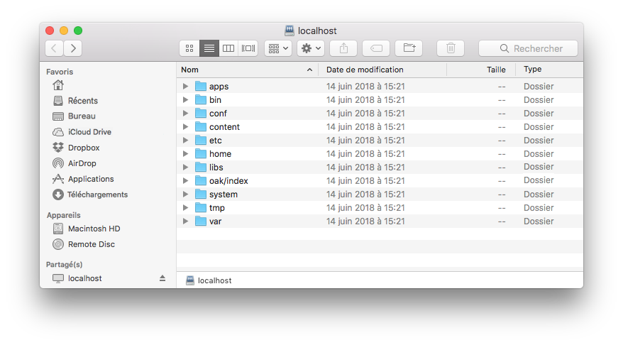
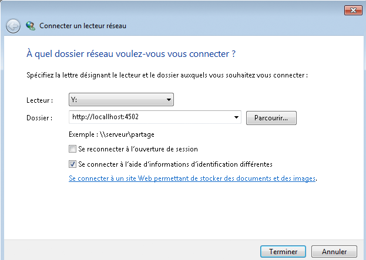
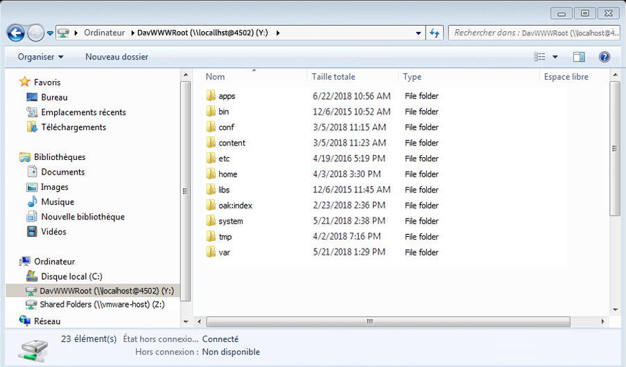

# Accès WebDAV{#webdav-access}

Pour vous connecter à AEM par le biais de WebDAV KDE, procédez comme suit :

Dans AEM, la prise en charge de WebDAV permet d’afficher et de modifier le contenu du référentiel. La connexion par le biais de WebDAV permet d’accéder directement au référentiel de contenu depuis votre ordinateur de bureau. Les fichiers texte et PDF ajoutés au référentiel par le biais de la connexion WebDAV sont indexés automatiquement sur le texte intégral et peuvent faire l’objet de recherches à l’aide des interfaces de recherche standard et des API Java standard.

## Général {#general}

[Des instructions détaillées selon le système d’exploitation](/help/sites-administering/webdav-access.md#connecting-via-webdav) sont incluses dans ce document, mais grosso modo, pour vous connecter à votre référentiel à l’aide du protocole WebDAV, vous pointez le client WebDAV vers l’emplacement suivant :

```xml
http://localhost:4502
```



Cette adresse URL, lors d’une connexion au niveau du système d’exploitation, permet à WebDAV d’accéder à l’espace de travail par défaut (`crx.default`). Si cette approche est plus simple pour l’utilisateur, elle n’offre toutefois pas la flexibilité supplémentaire de spécifier des noms d’espace de travail, ce qui peut être effectué à l’aide d’[adresses URL WebDAV](/help/sites-administering/webdav-access.md#webdav-urls) supplémentaires.

AEM affiche le contenu du référentiel comme suit :

* Un nœud du type `nt:folder` s’affiche sous la forme d’un dossier. Les nœuds situés sous le nœud `nt:folder` s’affichent comme contenu du dossier.

* Un nœud du type `nt:file` s’affiche sous la forme d’un fichier. Les nœuds situés sous le nœud `nt:file` ne sont pas répertoriés, mais ils constituent le contenu du fichier.

Lorsque vous utilisez WebDAV pour créer et modifier des dossiers et des fichiers, AEM crée et modifie les nœuds `nt:folder` et `nt:file` nécessaires. Si vous prévoyez d’utiliser WebDAV pour importer et exporter du contenu, utilisez, autant que possible, les types de nœuds `nt:file` et `nt:folder`.

>[!NOTE]
>
>Avant de configurer WebDAV, reportez-vous aux [exigences techniques](/help/sites-deploying/technical-requirements.md#webdav-clients).

## Adresses URL de WebDAV {#webdav-urls}

L’adresse URL du serveur WebDAV possède la structure suivante :

<table> 
 <colgroup>
  <col width="100" />
  <col width="100" />
  <col width="100" />
  <col width="100" />
  <col width="100" />
 </colgroup>
 <tbody>
  <tr>
   <td>
    <code>
     <strong>URL Component</strong>
    </code></td> 
   <td><code>https://&lt;host&gt;:&lt;port&gt;</code></td> 
   <td><code>/&lt;crx-webapp-path&gt;</code></td> 
   <td><code>/repository</code></td> 
   <td><code>/&lt;workspace&gt;</code></td> 
  </tr>
  <tr>
   <td>
    <code>
     <strong>Example</strong>
    </code></td> 
   <td><code>http://localhost:4502</code></td> 
   <td><code>/crx</code></td> 
   <td><code>/repository</code></td> 
   <td><code>/crx.default</code></td> 
  </tr>
  <tr>
   <td><strong>Description</strong></td> 
   <td>Hôte et port sur lequel AEM s’exécute</td> 
   <td>Chemin d’accès de l’application Web du référentiel AEM</td> 
   <td>Chemin vers lequel la servlet WebDAV est mappée</td> 
   <td>Nom de l’espace de travail</td> 
  </tr>
 </tbody>
</table>

Si vous modifiez l’élément &lt;workspace> dans le chemin d’accès, vous pouvez mapper des espaces de travail autres que l’espace de travail par défaut (`crx.default`). Par exemple, pour mapper un espace de travail appelé `staging`, utilisez l’adresse URL suivante :

```xml
http://localhost:4502/crx/repository/staging
```

## Connexion par le biais de WebDAV {#connecting-via-webdav}

[Comme mentionné ci-dessus](/help/sites-administering/webdav-access.md#general), pour vous connecter à votre référentiel à l’aide du protocole WebDAV, vous devez pointer votre client WebDAV vers votre emplacement de référentiel. Cependant, en fonction du système d’exploitation, la procédure de connexion au client diffère et il peut être nécessaire de configurer le système d’exploitation.

Vous trouverez ci-après des instructions de connexion aux systèmes d’exploitation suivants :

* [Windows](/help/sites-administering/webdav-access.md#windows)
* [Mac OS](/help/sites-administering/webdav-access.md#macos)
* [Linux](/help/sites-administering/webdav-access.md#linux)

### Windows {#windows}

Pour connecter correctement un système Microsoft Windows 7 (et version ultérieure) à une instance AEM qui n’est pas sécurisée avec SSL, l’option d’établissement d’une authentification de base par un réseau non sécurisé doit être activée explicitement dans Windows. Pour ce faire, il est nécessaire d’apporter une modification dans le Registre Windows de WebClient :

Une fois le Registre mis à jour, une instance AEM peut être mappée sous forme d’unité.

#### Configuration Windows 7 et version ultérieure {#windows-and-greater-configuration}

Pour mettre à jour le registre afin d’activer l’authentification de base par un réseau non sécurisé :

1. Cherchez la sous-clé du registre suivante :

   ```xml
   HKEY_LOCAL_MACHINE\SYSTEM\CurrentControlSet\Services\WebClient\Parameters
   ```

1. Set the `BasicAuthLevel` registry entry subkey to a value of `2` or greater.

   Si la sous-clé est absente, ajoutez-la.

1. Vous devez redémarrer le système pour que la modification du registre soit appliquée.

See [Microsoft Support KB 841215](https://support.microsoft.com/default.aspx/kb/841215) for more information on this registry change.

See [Microsoft Support KB 2445570](https://support.microsoft.com/kb/2445570) for information about improving the responsivness of the WebDav Client under Windows.

>[!NOTE]
>
>Adobe recommande de créer un utilisateur Windows avec les mêmes informations d’identification que l’utilisateur du référentiel. Autrement, vous risquez de rencontrer des conflits d’autorisations.

#### Configuration de Windows 8 {#windows-configuration}

Sous Windows 8, vous devez également modifier l’entrée de registre [comme indiqué pour Windows 7 et version ultérieure](/help/sites-administering/webdav-access.md#windows-and-greater-configuration). Cependant, auparavant, vous devez activer la fonctionnalité Desktop Experience afin d’afficher l’entrée de registre.

To enable the Desktop Experience, open **Server Manager**, then **Features**, then **Add Features**, then **Desktop Experience**.

Après le redémarrage, l’entrée de registre décrite pour Windows 7 et version ultérieure est disponible. Modifiez-la comme indiqué pour Windows 7 et version ultérieure.

#### Connexion dans Windows {#connecting-in-windows}

Pour vous connecter à AEM par le biais de WebDAV dans un environnement Windows, procédez comme suit :

1. Open **Windows Explorer** or **File Explorer** and click on **Computer** or **This PC**.

   

1. Cliquez sur **Connecter un lecteur réseau** pour lancer l’assistant.
1. Saisissez les informations de mappage :

   * **Lecteur** : sélectionnez une lettre disponible
   * **Dossier**: `http://localhost:4502`
   * Activez l’option **Se connecter à l’aide d’informations d’identification différentes**.
   Cliquez sur Terminer.

   

   >[!NOTE]
   >
   >Si AEM est situé sur un autre port, utilisez ce numéro de port au lieu de 4502. De même, si vous n’exécutez pas le référentiel de contenu sur votre ordinateur local, remplacez `localhost` par le nom ou l’adresse IP du serveur correspondant.

1. Enter username `admin` and password `admin`. Adobe recommande d’utiliser le compte administrateur préconfiguré pour le test.

   

1. L’assistant se ferme. Le lecteur qui vient d’être mappé est ouvert dans l’Explorateur Windows ou dans l’Explorateur de fichiers.

   

Windows a maintenant mappé AEM comme lecteur par le biais de WebDAV et vous pouvez l’utiliser comme n’importe quel autre lecteur.

### Mac OS {#macos}

Aucune étape de configuration n’est nécessaire pour se connecter par le biais de WebDAV sous Mac OS. Il suffit de vous connecter au serveur WebDAV.

1. Dans le **Finder**, cliquez sur **Aller** puis sur **Se connecter au serveur** ou appuyez sur **Commande+k**.
1. Dans la fenêtre **Se connecter au serveur**, saisissez l’emplacement d’AEM :

   * `http://localhost:4502`
   >[!NOTE]
   >
   >Si AEM est situé sur un autre port, utilisez ce numéro de port au lieu de 4502. De même, si vous n’exécutez pas le référentiel de contenu sur votre ordinateur local, remplacez `localhost` par le nom ou l’adresse IP du serveur correspondant.

1. Lorsque vous êtes invité à vous authentifier, saisissez le nom d’utilisateur `admin` et le mot de passe `admin`. Adobe recommande d’utiliser le compte administrateur préconfiguré pour le test.

Mac OS est maintenant connecté à AEM par le biais de WebDAV. Vous pouvez l’utiliser comme n’importe quel autre dossier sur votre Mac.

### Linux {#linux}

La connexion par le biais de WebDAV sous Linux ne nécessite aucune configuration, mais implique de suivre quelques étapes pour établir la connexion, qui varie en fonction de votre environnement de bureau.

#### GNOME {#gnome}

Pour vous connecter à AEM par le biais de WebDAV avec GNOME, procédez comme suit :

1. Dans Nautilus (explorateur de fichiers), sélectionnez **Emplacements**, puis **Connecter à un serveur**.
1. Dans la fenêtre **Connecter à un serveur**, sélectionnez le type de service WebDAV (HTTP).

1. Dans **Server**, saisissez `http://localhost:4502/crx/repository/crx.default`

   >[!NOTE]
   >
   >Si AEM est situé sur un autre port, utilisez ce numéro de port au lieu de 4502. De même, si vous n’exécutez pas le référentiel de contenu sur votre ordinateur local, remplacez `localhost` par le nom ou l’adresse IP du serveur correspondant.

1. In **Folder**, enter `/dav`
1. Enter the username `admin`. Adobe recommande d’utiliser le compte administrateur préconfiguré pour le test.
1. Ne renseignez pas le port et saisissez un nom pour la connexion.
1. Cliquez sur **Connecter**. AEM vous invite à saisir votre mot de passe.
1. Saisissez le mot de passe `admin` et cliquez sur **Connecter**.

GNOME a maintenant monté AEM en tant que volume et vous pouvez l&#39;utiliser comme n&#39;importe quel autre volume.

#### KDE {#kde}

1. Ouvrez l’assistant Dossier réseau.
1. Sélectionnez **WebFolder** (webdav), puis cliquez sur Suivant.
1. Sous **Nom**, saisissez un nom de connexion.
1. Dans **Utilisateur**, saisissez `admin.` Adobe recommande d’utiliser le compte d’administrateur préconfiguré.
1. Dans **Server**, saisissez `http://localhost:4502/crx/repository/crx.default`

   >[!NOTE]
   >
   >Si AEM est situé sur un autre port, utilisez ce numéro de port au lieu de 4502. De même, si vous n’exécutez pas le référentiel de contenu sur votre ordinateur local, remplacez `localhost` par le nom ou l’adresse IP du serveur correspondant.

1. In **Folder**, enter `dav`

1. Cliquez sur **Enregistrer et connecter**.
1. Lorsque vous êtes invité à saisir votre mot de passe, saisissez `admin` et cliquez sur **Connecter**.

KDE a désormais monté AEM en tant que volume et vous pouvez l’utiliser comme n’importe quel autre volume.
