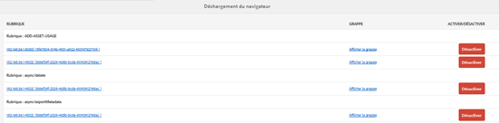
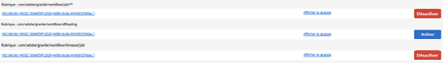
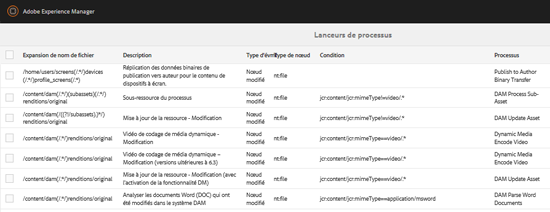
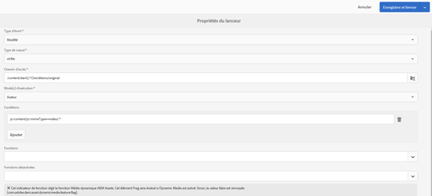
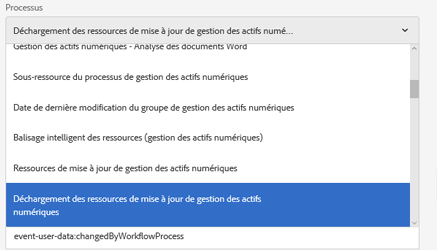
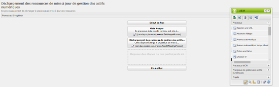
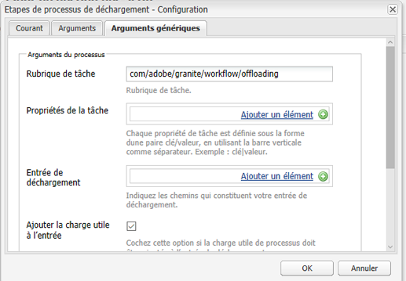
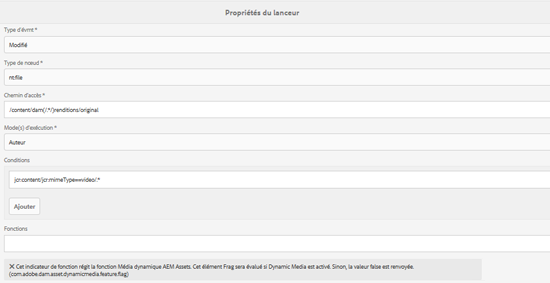
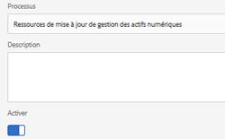

# Déchargeur de workflow de ressources{#assets-workflow-offloader}

Le déchargeur de workflow de ressources permet à plusieurs instances Adobe Experience Manager (AEM) Assets de réduire la charge de traitement sur l’instance principale. La charge de traitement est répartie entre l’instance principale et les différentes instances de déchargement (auxiliaires) que vous y ajoutez. La répartition de la charge de traitement des ressources augmente l’efficacité et la vitesse de traitement des ressources par AEM Assets. De plus, elle contribue à allouer des ressources dédiées pour traiter des ressources d’un type MIME particulier. Par exemple, vous pouvez réserver un nœud spécifique de votre topologie au traitement des ressources InDesign.

## Configuration de la topologie du déchargeur  {#configure-offloader-topology}

Utilisez Configuration Manager pour ajouter l’URL de l’instance de responsable et les noms d’hôte des instances de déchargeur pour les demandes de connexion sur l’instance de responsable.

1. Appuyez/cliquez sur le logo de l&#39;AEM et choisissez **Outils** > **Opérations** > **Console Web** pour ouvrir Configuration Manager.
1. Dans la console Web, sélectionnez **Sling** > **Gestion de la topologie**.

   

1. Dans la page Gestion de la topologie, appuyez/cliquez sur le lien **Configurer le service Discovery.Oak**.

   

1. Dans la page Configuration de Discovery Service, spécifiez l&#39;URL du connecteur pour l&#39;instance de filet de conduite dans le champ **URL du connecteur de topologie**.

   

1. Dans le champ **Liste autorisée du connecteur de topologie**, spécifiez l’adresse IP ou les noms d’hôte des instances de déchargeur autorisées à se connecter à l’instance de responsable. Appuyez/cliquez sur **Enregistrer**.

   

1. Pour afficher les instances de déchargement connectées à l’instance principale, sélectionnez **Tools** > **Deployment** > **Topology** et appuyez/cliquez sur la vue Cluster.

## Désactivation du déchargement  {#disable-offloading}

1. Appuyez/cliquez sur le logo de l’AEM, puis choisissez **Outils** > **Déploiement** > **Déchargement**. La page **Déchargement du navigateur** affiche les rubriques et les instances de serveur qui peuvent utiliser les rubriques.

   

1. Désactivez la rubrique *com/adobe/granite/workflow/déchargement* sur les instances de filet de conduite avec lesquelles les utilisateurs interagissent pour télécharger ou modifier des ressources AEM.

   

## Configuration des lanceurs de workflow sur l’instance principale {#configure-workflow-launchers-on-the-leader-instance}

Configurez les lanceurs de processus pour qu’ils utilisent le flux de travail **DAM Update Asset Offloading** sur l’instance de début plutôt que le flux de travail **Dam Update Asset**.

1. Appuyez/cliquez sur le logo de l&#39;AEM, puis choisissez **Outils** > **Workflow** > **Lanceurs** pour ouvrir la console **Processus des lanceurs**.

   

1. Localisez les deux configurations de lanceur avec le type d&#39;événement **Node créé** et **Node modifié** respectivement, qui exécutent le flux de travaux **DAM Update Asset**.
1. Pour chaque configuration, cochez la case qui la précède, puis cliquez sur l&#39;icône **Propriétés de la Vue** de la barre d&#39;outils pour afficher la boîte de dialogue **Propriétés du lanceur**.

   

1. Dans la liste **Workflow**, sélectionnez **DAM Update Asset Offloading** et appuyez/cliquez sur **Enregistrer**.

   

1. Appuyez/cliquez sur le logo de l&#39;AEM, puis choisissez **Outils** > **Workflow** > **Modèles** pour ouvrir la page **Modèles de flux de travail**.
1. Sélectionnez le flux de travail **Déchargement des ressources de mise à jour de gestion des actifs**, puis appuyez/cliquez sur **Modifier** dans la barre d’outils pour afficher ses détails.

   

1. Affichez le menu contextuel de l&#39;étape **Déchargement du flux de travaux DAM**, puis choisissez **Modifier**. Vérifiez la saisie dans le champ **Rubrique de tâche** de l’onglet **Arguments génériques** de la boîte de dialogue de configuration.

   

## Désactivation des lanceurs de workflow sur les instances de déchargement {#disable-the-workflow-launchers-on-the-offloader-instances}

Désactivez les lanceurs de processus qui exécutent le workflow **DAM Update Asset** sur l&#39;instance de filet de conduite.

1. Appuyez/cliquez sur le logo de l&#39;AEM, puis choisissez **Outils** > **Workflow** > **Lanceurs** pour ouvrir la console **Processus des lanceurs**.

   

1. Localisez les deux configurations de lanceur avec le type d&#39;événement **Node créé** et **Node modifié** respectivement, qui exécutent le flux de travaux **DAM Update Asset**.
1. Pour chaque configuration, cochez la case qui la précède, puis cliquez sur l&#39;icône **Propriétés de la Vue** de la barre d&#39;outils pour afficher la boîte de dialogue **Propriétés du lanceur**.

   

1. Dans la section **Activer **, faites glisser le curseur pour désactiver le lanceur de flux de travail et appuyez/cliquez sur **Enregistrer** pour le désactiver.

   

1. Téléchargez tout fichier de type image sur l’instance de filet de conduite. Vérifiez les miniatures générées et réportées pour l’actif par l’instance déchargée.

