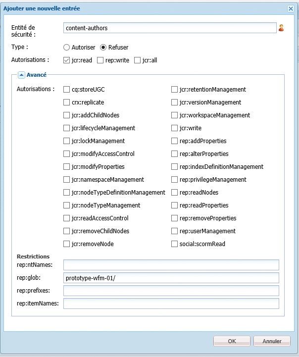
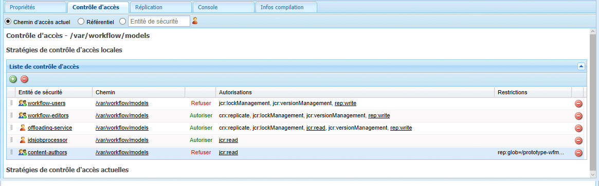
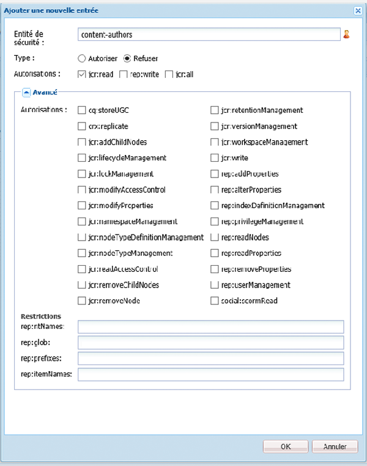
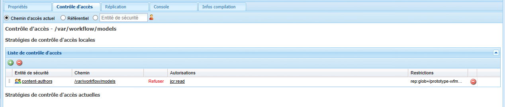

# Gestion de l’accès aux workflows{#managing-access-to-workflows}

>[!CAUTION]
>
>AEM 6.4 a atteint la fin de la prise en charge étendue et cette documentation n’est plus mise à jour. Pour plus d’informations, voir notre [période de support technique](https://helpx.adobe.com/fr/support/programs/eol-matrix.html). Rechercher les versions prises en charge [here](https://experienceleague.adobe.com/docs/?lang=fr).

Configurez les listes de contrôle d’accès en fonction des comptes d’utilisateurs pour autoriser (ou désactiver) le démarrage et la participation aux workflows.

## Autorisations utilisateur requises pour les workflows {#required-user-permissions-for-workflows}

Des actions sur les workflows peuvent être entreprises dans les cas suivants :

* Vous utilisez le compte `admin`.
* Le compte a été affecté au groupe par défaut `workflow-users` :

   * ce groupe contient tous les privilèges nécessaires pour que vos utilisateurs puissent exécuter des actions de workflow.
   * lorsque le compte se trouve dans ce groupe, il n’a accès qu’aux workflows qu’il a initiés.

* Le compte a été affecté au groupe par défaut `workflow-administrators` :

   * ce groupe détient tous les privilèges nécessaires pour que vos utilisateurs privilégiés puissent surveiller et administrer les workflows.
   * lorsque le compte se trouve dans ce groupe, il a accès à tous les workflows.

>[!NOTE]
>
>Il s’agit des conditions requises minimales. Votre compte doit également être le participant affecté ou un membre du groupe affecté pour prendre des mesures spécifiques.

## Configuration de l’accès aux workflows {#configuring-access-to-workflows}

Les modèles de workflows héritent d’une liste de contrôle d’accès par défaut pour contrôler les interactions possibles des utilisateurs avec les workflows. Pour personnaliser l’accès des utilisateurs à un workflow, modifiez la liste de contrôle d’accès (ACL) dans le référentiel du dossier contenant le noeud de modèle de workflow :

* [Appliquez une liste de contrôle d’accès pour le modèle spécifique de workflow sous /var/workflow/models.](/help/sites-administering/workflows-managing.md#apply-an-acl-for-the-specific-workflow-model-to-var-workflow-models)
* [Créez un sous-dossier dans /var/workflow/models et appliquez-lui la liste de contrôle d’accès.](/help/sites-administering/workflows-managing.md#create-a-subfolder-in-var-workflow-models-and-apply-the-acl-to-that)

>[!NOTE]
>
>Pour plus d’informations sur l’utilisation de CRXDE Lite pour configurer des listes de contrôle d’accès, voir [Gestion des droits d’accès](/help/sites-administering/user-group-ac-admin.md#access-right-management).

### Appliquer une liste de contrôle d’accès pour le modèle spécifique de workflow sous /var/workflow/models {#apply-an-acl-for-the-specific-workflow-model-to-var-workflow-models}

Si le modèle de workflow est stocké dans le dossier `/var/workflow/models`, vous pouvez affecter une liste de contrôle d’accès spécifique et ne se rapportant qu’à ce workflow, dans le dossier :

1. Ouvrez le CRXDE Lite dans votre navigateur web (par exemple, [http://localhost:4502/crx/de](http://localhost:4502/crx/de)).
1. Dans l’arborescence de noeuds, sélectionnez le noeud du dossier des modèles de workflow :

   `/var/workflow/models`

1. Cliquez sur l’onglet **Contrôle d’accès**.
1. Dans le **Stratégies de contrôle d’accès locales** (**Liste de contrôle d’accès**), cliquez sur l’icône plus pour **Ajouter une entrée**.
1. Dans le **Ajouter une nouvelle entrée** Ajoutez une nouvelle boîte de dialogue ACE avec les propriétés suivantes :

   * **Principal** : `content-authors`
   * **Type** : `Deny`
   * **Autorisations** : `jcr:read`
   * **rep:glob** : référence au workflow spécifique

   

   Le tableau **Liste de contrôle d’accès** comprend maintenant la restriction pour `content-authors` dans le modèle de workflow `prototype-wfm-01`.

   

1. Cliquez sur **Enregistrer tout**.

   Le workflow `prototype-wfm-01` n’est plus disponible pour les membres du groupe `content-authors`.

### Créez un sous-dossier dans /var/workflow/models et appliquez-lui la liste de contrôle d’accès. {#create-a-subfolder-in-var-workflow-models-and-apply-the-acl-to-that}

Votre [l’équipe de développement peut créer les workflows dans un sous-dossier.](/help/sites-developing/workflows-models.md#creating-a-new-workflow) de

`/var/workflow/models`

comparable aux workflows de gestion des ressources numériques stockés sous

`/var/workflow/models/dam/`

Vous pouvez alors ajouter une liste de contrôle d’accès dans le dossier proprement dit.

1. Ouvrez le CRXDE Lite dans votre navigateur web (par exemple, [http://localhost:4502/crx/de](http://localhost:4502/crx/de)).
1. Dans l’arborescence de noeuds, sélectionnez le noeud du dossier individuel dans le dossier des modèles de workflow ; par exemple :

   `/var/workflow/models/prototypes`

1. Cliquez sur l’onglet **Contrôle d’accès**.
1. Dans le tableau **Stratégie de contrôle d’accès applicable**, cliquez sur l’icône « + » pour **ajouter** une entrée.
1. Dans le **Stratégies de contrôle d’accès locales** (**Liste de contrôle d’accès**), cliquez sur l’icône plus pour **Ajouter une entrée**.
1. Dans le **Ajouter une nouvelle entrée** Ajoutez une nouvelle boîte de dialogue ACE avec les propriétés suivantes :

   * **Principal** : `content-authors`
   * **Type** : `Deny`
   * **Autorisations** : `jcr:read`

   >[!NOTE]
   >
   >Comme lors de l’[application d’une liste de contrôle d’accès pour le modèle de workflow spécifique à /var/workflow/models](/help/sites-administering/workflows-managing.md#apply-an-acl-for-the-specific-workflow-model-to-var-workflow-models), vous pouvez inclure une propriété rep:glob pour limiter l’accès à un workflow spécifique.

   

   Le tableau **Liste de contrôle d’accès** comprend maintenant la restriction pour `content-authors` dans le dossier `prototypes`.

   

1. Cliquez sur **Enregistrer tout**.

   Les modèles du dossier `prototypes` ne sont plus disponibles pour les membres du groupe `content-authors`.
