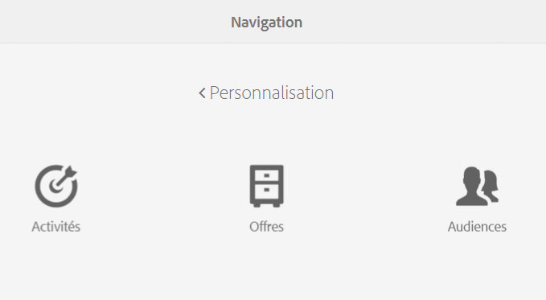
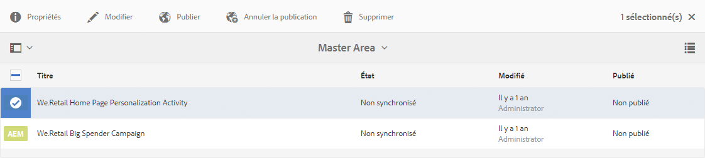
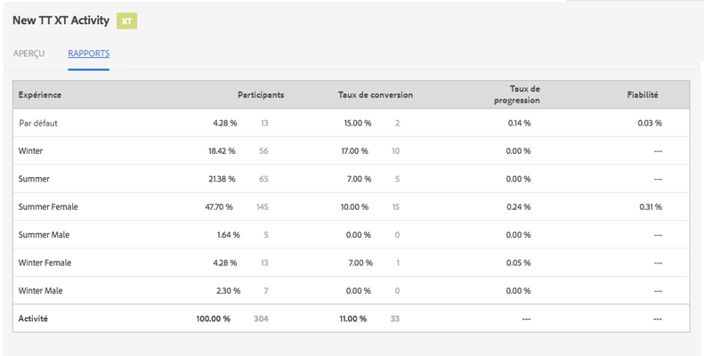
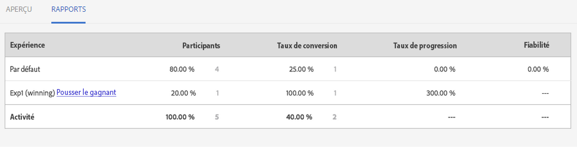
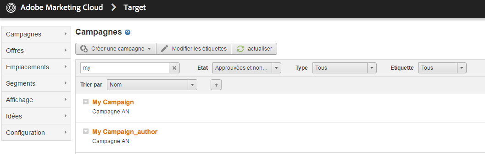

# Gestion des activités{#managing-activities}

>[!CAUTION]
>
>AEM 6.4 a atteint la fin de la prise en charge étendue et cette documentation n’est plus mise à jour. Pour plus d’informations, voir notre [période de support technique](https://helpx.adobe.com/fr/support/programs/eol-matrix.html). Rechercher les versions prises en charge [here](https://experienceleague.adobe.com/docs/?lang=fr).

La console Activités vous permet de créer, d’organiser et de gérer les [activités](/help/sites-authoring/personalization.md#activities) marketing de vos marques :

* Ajoutez des marques.
* Pour chaque marque, ajoutez et configurez les activités.
* Gérez les activités.

>[!NOTE]
>
>Si vous utilisez Adobe Target comme moteur de ciblage, vous pouvez également [afficher les données de performances de vos activités ;](#viewing-performance-and-converting-winning-experiences-a-b-test). Si vous utilisez des tests A/B, vous pouvez [convertir les gagnants](#viewing-performance-and-converting-winning-experiences-a-b-test).

Dans la console Activités , les activités sont organisées par marque. Vous pouvez utiliser des marques et des dossiers pour structurer l’organisation de vos activités. Vous accédez à la console Activités en appuyant/cliquant sur **Personnalisation** et en appuyant/cliquant **Activités**.

Les activités sont disponibles en mode Ciblage pour [créer du contenu ciblé](/help/sites-authoring/content-targeting-touch.md), où vous pouvez également créer des activités. Les activités que vous créez en mode Ciblage apparaissent dans la console Activités .

Les activités sont affichées avec un libellé décrivant le type d’activité défini :

* XT - Ciblage d’expérience Adobe Target
* A/B - Test A/B Adobe Target
* AEM - Ciblage Adobe Experience Manager (basé sur contexthub ou clientcontext)

>[!NOTE]
>
>Les types d’activités disponibles sont déterminés par ce qui suit :
>
>* Si la variable **xt_only** est activée sur le client Adobe Target (clientcode) utilisé côté AEM pour se connecter à Adobe Target, puis vous pouvez créer **only** Activités XT dans AEM.
>
>* Si la variable **xt_only** options est **not** activée sur le client Adobe Target (clientcode), vous pouvez créer **both** Activités XT et A/B dans AEM.
>
>**Remarque :** L’option **xt_only** est un paramètre appliqué à un certain client Adobe Target (clientcode) et peut uniquement être modifiée directement dans Adobe Target. Vous ne pouvez pas activer ni désactiver cette option dans AEM.

>[!CAUTION]
>
>Vous devez sécuriser le nœud de paramètres d’activité **c:ActivitySettings** sur l’instance de publication de sorte qu’il ne soit pas accessible pour les utilisateurs normaux. Le nœud de paramètres d’activité doit être accessible uniquement au service gérant la synchronisation de l’activité avec Adobe Target.
>
>Voir [Conditions préalables à l’intégration à Adobe Target](/help/sites-administering/target-requirements.md) pour plus d’informations.

## Création d’une marque à l’aide de la console Activités {#creating-a-brand-using-the-activities-console}

Créez une marque pour laquelle vous souhaitez gérer les activités marketing.

Quand vous créez une marque avec la console Activités, elle apparaît également dans la [console Offres](/help/sites-authoring/offerlib.md) où vous pouvez créer des offres pour les expériences de vos activités.

1. Dans la console Navigation, cliquez ou appuyez sur **Personnalisation**. Cliquez ou appuyez sur **Activités**.

   

1. Dans la console Activités, cliquez ou appuyez sur **Créer** then **Créer une marque**.
1. Sélectionnez le modèle de marque et cliquez ou appuyez sur **Suivant**.
1. Saisissez le titre de la marque tel que vous souhaitez le voir apparaître dans les consoles Activités et Offres . Vous pouvez éventuellement saisir ou sélectionner une ou plusieurs balises à associer à la marque.
1. Cliquez ou appuyez sur **Créer**. Votre marque apparaît dans la console Activités.

## Ajout/modification d’une activité à l’aide de la console Activités {#adding-editing-an-activity-using-the-activities-console}

Ajoutez une activité ou modifiez une activité existante pour concentrer vos efforts marketing sur des audiences spécifiques. Lorsque vous créez/modifiez une activité, vous spécifiez les informations suivantes :

* **Nom :** nom de l’activité.
* **Moteur de ciblage :** [AEM](/help/sites-authoring/personalization.md#aem) ou [Adobe Target](/help/sites-authoring/personalization.md#adobe-target) comme moteur du contenu ciblé.

* **Sélectionnez une configuration Target :** (Adobe Target uniquement) Configuration du cloud que cette activité doit utiliser pour se connecter à Adobe Target. Cette option s’affiche uniquement lorsque Adobe Target est sélectionné pour le moteur de ciblage.
* **Type d’activité :** Type d’activité - Test A/B ou Ciblage de l’expérience
* **Objectif :** (facultatif) description de l’activité.
* **Expériences :** correspond aux noms d’audience et aux segments marketing que vous ciblez.
* **Pourcentages de trafic :** si Test A/B est sélectionné, vous pouvez modifier le volume de trafic (en pourcentage) affecté à chaque expérience.
* **Durée :** période d’application de l’activité.
* **Priorité :** priorité relative de l’activité. Lorsque les activités fournissent du contenu pour les mêmes segments d’utilisateurs, l’activité de priorité supérieure est prioritaire.
* **Mesure de l’objectif :** si Adobe Target est sélectionné comme moteur de ciblage, vous pouvez ajouter des mesures de succès à l’activité. Une mesure de succès est requise.

>[!NOTE]
>
>Les nouvelles activités Adobe Target doivent être **créées** dans l’éditeur de contenu ciblé et non dans la console **Activités**, car la synchronisation avec Adobe Target échouera.
>
>Vous pouvez toutefois modifier les activités Adobe Target existantes dans la console.

Pour ajouter une activité :

1. Cliquez ou appuyez sur une marque pour laquelle vous créez l’activité, puis cliquez ou appuyez sur **Créer** et ensuite sur **Créer une activité**. Si vous effectuez une modification, sélectionnez l’activité, puis cliquez ou appuyez sur **Modifier**.
1. Fournissez les informations suivantes, puis cliquez ou appuyez sur **Suivant**:

   * Nom de l’activité.
   * Le moteur de ciblage à utiliser. ContextHub (AEM) est sélectionné par défaut. Si vous devez utiliser Adobe Target, créez l&#39;activité dans l&#39;éditeur de contenu ciblé.
   * Si vous avez sélectionné Adobe Target comme moteur de ciblage, sélectionnez/modifiez la configuration de cloud à utiliser pour vous connecter à Adobe Target. (Veillez à ne pas sélectionner une structure que vous avez créée pour votre configuration cloud.)
   * (Facultatif) Objectif ou description de l’activité.
   * Sélectionnez le Type d’activité.

1. Ajoutez une ou plusieurs expériences à l’activité. Cliquez ou appuyez sur **Ajouter une expérience**.
1. Si vous utilisez AEM ciblage ou ciblage d’expérience Adobe Target :

   1. Cliquez ou appuyez sur **Sélectionner l’audience** et sélectionnez le segment ciblé par votre expérience.
   1. Appuyez ou cliquez sur **Ajouter une expérience**, saisissez un nom, puis appuyez ou cliquez sur **OK**.
   1. Appuyez ou cliquez sur **Suivant**.

   Si vous utilisez des tests A/B Adobe Target :

   1. Cliquez ou appuyez sur le crayon dans la zone audiences pour sélectionner une audience.
   1. Appuyez ou cliquez sur **Ajouter une expérience**, saisissez un nom, puis appuyez ou cliquez sur **OK**.
   1. Saisissez le pourcentage du trafic qui affiche chaque expérience.
   1. Appuyez ou cliquez sur **Suivant**.

1. Pour indiquer le moment où l’activité commence, utilisez la variable **Début** pour sélectionner l’une des valeurs suivantes :

   * **Après activation :** l’activité commence lorsque la page contenant le contenu ciblé est activée.
   * **Date et heure spécifiées :** Heure spécifique. Lorsque vous sélectionnez cette option, cliquez ou appuyez sur l’icône du calendrier, sélectionnez une date et indiquez l’heure de début de l’activité.

1. Pour spécifier le moment où l’activité se termine, utilisez le menu déroulant Fin pour sélectionner l’une des valeurs suivantes :

   * **Lorsque désactivé**: L’activité se termine lorsque la page contenant le contenu ciblé est désactivée.
   * **Date et heure spécifiées :** heure spécifique. Lorsque vous sélectionnez cette option, cliquez ou appuyez sur l’icône du calendrier, sélectionnez une date et indiquez l’heure de fin de l’activité.

1. Pour spécifier une priorité pour l’activité, utilisez le curseur pour sélectionner l’une des options suivantes : **Faible**, **Normal** ou **Élevée**.
1. Si vous utilisez Adobe Target comme moteur de ciblage, sélectionnez ce que vous souhaitez mesurer avec cette activité. Voir [Configuration de l’activité et définition des objectifs](/help/sites-authoring/content-targeting-touch.md) pour plus d’informations sur les mesures de succès disponibles. Vous devez sélectionner au moins un objectif.
1. Cliquez ou appuyez sur **Enregistrer**.

   >[!NOTE]
   >
   >Après avoir créé une activité, vous devez la publier afin qu’elle soit disponible.

## Publication et dépublication des activités {#publishing-and-unpublishing-activities}

Vous devez publier les activités pour les rendre disponibles. À l’inverse, vous pouvez rendre les activités indisponibles en les dépubliant.

>[!NOTE]
>
>Lorsque vous dépubliez une activité, l’état de l’activité ne change que si vous actualisez la page.

Pour publier ou annuler la publication d’activités :

1. Cliquez ou appuyez sur la marque, puis sur la zone contenant l’activité que vous souhaitez publier ou dont vous souhaitez annuler la publication.
1. Appuyez ou cliquez sur l’icône en regard de l’activité ou des activités que vous souhaitez publier ou dont vous souhaitez annuler la publication.

   

1. Pour publier, appuyez ou cliquez sur **Publier**. Pour annuler la publication, appuyez ou cliquez sur **Annuler la publication**. Votre activité ou vos activités sont publiées ou non publiées et leur état change dans la console Activités (une actualisation peut s’avérer nécessaire).

## Activités sur les instances de création et de publication {#activities-on-author-and-publish-instances}

Lorsqu’une activité qui utilise le moteur ciblé Adobe Target est activée, une seconde activité est créée sur l’instance de publication :

* L’activité sur l’instance d’auteur effectue le suivi de l’activité sur l’instance d’auteur et est utile pour simuler l’expérience du visiteur. Les analyses enregistrées pour cette activité ne reflètent que ce qui se produit sur l’instance de création.
* L’activité sur l’instance de publication reflète l’activité sur le serveur de publication et y répond. Il s’agit de l’activité qui s’exécute sur le site web public. Seule l’activité de publication est pertinente pour le suivi et l’analyse de l’utilisation du site public réel.

## Affichage des performances et conversion des expériences gagnantes (test A/B) {#viewing-performance-and-converting-winning-experiences-a-b-test}

Vous pouvez voir les performances de n’importe quelle activité Adobe Target (XT ou A/B). Si vous utilisez des tests A/B, vous pouvez également convertir l’expérience gagnante, qui devient alors l’expérience par défaut.

Pour afficher les performances des activités et convertir les expériences gagnantes :

1. Dans **Personnalisation**, cliquez ou appuyez sur **Activités** pour accéder à la console **Activités**.
1. Cliquez ou appuyez sur la marque dont vous souhaitez voir les activités.
1. Sélectionnez l’activité, cliquez ou appuyez sur **Afficher les propriétés **et cliquez sur le bouton **Rapports** et sélectionnez l’activité pour laquelle vous souhaitez afficher les performances/convertir des expériences gagnantes. Les données de performances sont affichées.

   

1. Cliquez ou appuyez sur le lien **** Pousser l’expérience gagnante afin de pousser cette expérience comme expérience par défaut.

   La conversion de l’expérience gagnante effectue les opérations suivantes :

   * Elle désactive l’activité en cours.
   * Elle modifie toutes les pages et remplace le contenu ciblé par le contenu de l’expérience gagnante. Le contenu de l’expérience gagnante devient une partie de la page normale **sans** ciblage.

   

   Une expérience gagnante est l’expérience qui génère plus d’effet élévateur dans les rapports, en fonction du taux de conversion.

1. Cliquez ou appuyez sur **Oui** pour confirmer que vous souhaitez convertir le gagnant, en désactivant l’expérience actuelle et en la remplaçant par le contenu de l’expérience gagnante.

## Synchronisation des activités avec Adobe Target {#synchronizing-activities-with-adobe-target}

Les activités qui utilisent le moteur de ciblage Adobe Target sont synchronisées avec les campagnes Adobe Target. Une activité est automatiquement synchronisée dans Adobe Target lorsque les conditions suivantes sont remplies :

* L’activité contient au moins une expérience.
* Au moins une expérience contient un segment mappé et une offre.
* Chaque expérience de l’activité doit comporter le même nombre d’offres.

Ces conditions s’appliquent aux activités sur les instances de création et de publication.

Lorsqu&#39;une activité est synchronisée, une campagne correspondante est créée dans Adobe Target :

* Les activités sur l’instance de publication portent le même nom que la campagne Adobe Target correspondante.
* Les activités sur l’instance de création correspondent à des campagnes Target du même nom avec le suffixe `_author`.

Les activités _author sont synchronisées immédiatement lorsque l’activité est modifiée. La synchronisation immédiate permet la simulation des activités avec ClientContext ou ContextHub.

Les activités de publication sont synchronisées lorsque l’activité est publiée sur l’instance de publication AEM.

## Résolution des problèmes de synchronisation d’activité {#troubleshooting-activity-synchronization}

Lorsque AEM synchronise une activité avec Adobe Target, AEM ajoute une propriété appelée `thirdPartyId`. La valeur de cette propriété est basée sur le chemin de l’activité dans le référentiel AEM. Dans Adobe Target, les campagnes ne peuvent avoir la même valeur pour la propriété `thirdPartyId`. Par conséquent, une activité ne se synchronise pas si une campagne existante (d’un autre type A/B ou XT) dans Adobe Target utilise la même valeur pour `thirdPartyId`.

Cette situation peut se produire dans les cas suivants :

1. Une activité est créée et synchronisée avec Adobe Target.
1. Sur une autre instance d’AEM, une activité est créée sous la même marque et portant le même nom. La synchronisation de cette activité échoue en cas de tentative.

Cette situation peut également se produire dans les cas suivants :

1. Une activité est créée et synchronisée avec Adobe Target. L&#39;activité est alors supprimée sur AEM.
1. Une activité est créée sous la même marque et en utilisant le même nom que l’activité supprimée. La synchronisation de cette activité échoue en cas de tentative.

Pour éviter des problèmes de synchronisation, utilisez toujours des noms uniques pour les activités. Si une activité ne se synchronise pas, vous pouvez supprimer la campagne dans Adobe Target qui porte le même nom si elle n’est pas utilisée.

>[!NOTE]
>
>Lorsque vous créez une campagne dans Adobe Target, elle affecte la propriété `thirdPartyId t` à chaque campagne. Lorsque vous supprimez la campagne dans Adobe Target, `thirdPartyId` n’est pas supprimé. Vous ne pouvez pas réutiliser la propriété `thirdPartyId` pour des campagnes de différents types (AB, XT) et elle ne peut pas être supprimée manuellement. Pour éviter ce problème, attribuez un nom unique à chaque campagne. Ainsi, les noms de campagne ne peuvent pas être réutilisés dans différents types de campagnes.
>
>Si vous utilisez le même nom dans le même type de campagne, vous remplacerez la campagne existante.
>
>Lors de la synchronisation, si le message d’erreur « Échec de la demande. `thirdPartyId` existe déjà » s’affiche, modifiez le nom de la campagne et resynchronisez-la.
