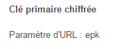
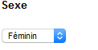

# Composants d’Adobe Campaign{#adobe-campaign-components}

Lorsque vous procédez à l’intégration à Adobe Campaign, des composants sont disponibles pour l’utilisation de newsletters et de formulaires. Ils sont tous deux décrits dans ce document.

## Composant Newsletter Adobe Campaign {#adobe-campaign-newsletter-components}

Tous les composants d’Adobe Campaign appliquent les méthodes recommandées décrites dans les [bonnes pratiques pour les modèles de courrier électronique](/help/sites-administering/best-practices-for-email-templates.md) et dépendent du langage de balisage [HTL](https://helpx.adobe.com/fr/experience-manager/htl/using/overview.html) d’Adobe.

Lorsque vous ouvrez une newsletter/un courrier électronique configuré de manière à être intégré à Adobe Campaign, les composants ci-dessous doivent s’afficher dans la section **Newsletter Adobe Campaign** :

* Titre (Campaign)
* Image (Campaign)
* Lien (Campaign)
* Modèle d’image Scene7 (Campaign)
* Référence ciblée (Campaign)
* Texte et image (Campaign)
* Texte et personnalisation (Campaign)

La section qui suit contient une description de ces composants.

Les composants apparaissent comme suit :

### Titre (Campaign) {#heading-campaign}

Le composant Titre permet d’afficher les éléments suivants :

* Nom de la page actuelle (lorsque le champ **Titre** est vide)
* Texte spécifié dans le champ **Titre**

Vous modifiez directement le composant **Titre (Campaign)**. Laissez ce champ vide pour utiliser le titre de la page.

Vous pouvez configurer les éléments suivants :

* **Titre**
Si vous souhaitez utiliser un autre nom que le titre de la page, saisissez-le ici.

* **Niveau de titre (1, 2, 3, 4)** Niveau de titre d’après la catégorie de titre HTML 1-4.

L’exemple ci-dessous présente le composant Titre (Campaign) affiché.

### Image (Campaign) {#image-campaign}

Le composant Image (Campaign) affiche une image et le texte qui l’accompagne selon les paramètres spécifiés.

Vous pouvez charger une image, puis la modifier et la manipuler (par exemple, la recadrer, la faire pivoter ou y ajouter un lien/titre/texte).

Vous pouvez faire glisser et déposer une image à partir de l’[explorateur de ressources](/help/sites-authoring/author-environment-tools.md#assets-browser) directement sur le composant ou sa [boîte de dialogue Configurer](/help/sites-authoring/editing-content.md#edit-configure-copy-cut-delete-paste). Vous pouvez également charger une image à partir de la boîte de dialogue Configurer ; celle-ci contrôle également toutes les définitions, ainsi que la manipulation de l’image :

>[!NOTE]
>
>You must enter information in the **Alt Text** field, or the image cannot be saved.

After the image is uploaded (and not before) you can use [inplace editing](/help/sites-authoring/editing-content.md#edit-configure-copy-cut-delete-paste) to crop/rotate the image as required:

>[!NOTE]
>
>L’éditeur statique utilise la taille d’origine et les proportions de l’image lors de la modification. Vous pouvez également spécifier les propriétés de hauteur et de largeur. Les restrictions de taille et de format définies dans les propriétés sont appliquées lorsque vous enregistrez vos modifications.
>
>Selon votre instance, des restrictions minimales et maximales peuvent aussi être imposées par la [conception de la page](/help/sites-developing/designer.md). Ces restrictions sont développées lors de la mise en œuvre du projet.

Différentes autres options sont disponibles en mode Plein écran. Par exemple, Carte et Zoom :

Lorsqu’une image est chargée, vous pouvez configurer ce qui suit :

* **Map**

   Pour mapper une image, sélectionnez Zone cliquable. Vous pouvez spécifier comment créer la zone cliquable (rectangle, polygone, etc.) et où la zone doit pointer.

* **Options**

   Sélectionnez Recadrer pour recadrer une image. Utilisez la souris pour effectuer le recadrage.

* **Rotation**

   Pour faire pivoter une image, sélectionnez Pivoter. Utilisez-le à plusieurs reprises jusqu’à ce que l’image soit pivotée comme vous le souhaitez.

* **Effacer**

   Permet de supprimer l’image actuelle.

* Barre de zoom (classique uniquement)

   Pour effectuer un zoom arrière et avant sur l’image, utilisez le curseur situé en dessous de l’image (et au-dessus des boutons OK et Annuler).

* **Titre**

   Titre de l’image.

* **Texte de remplacement**

   Texte alternatif à utiliser lors de la création de contenu accessible.

* **Lier à**

   Créez un lien vers des ressources ou d’autres pages de votre site Web.

* **Description**

   Description de l’image.

* **Taille**

   Permet de définir la hauteur et la largeur de l’image.

>[!NOTE]
>
>Pour enregistrer l’image, vous devez renseigner le champ **Texte de remplacement** sur l’**onglet Avancé**. Sinon, le message d’erreur ci-dessous s’affiche :
>
>`Validation failed. Verify the values of the marked fields.`

L’exemple ci-dessous présente le composant Image (Campaign) affiché.

### Lien (Campaign) {#link-campaign}

Le composant Lien (Campaign) permet d’ajouter un lien à votre newsletter.

Vous pouvez configurer les éléments ci-dessous sur les onglets **Affichage**, **Informations d’URL** ou **Avancé** :

* **Légende du lien**

   Légende du lien. Il s’agit du texte que les utilisateurs voient.

* **Info-bulle de lien**

   Ajoute des informations supplémentaires sur la manière d’utiliser le lien.

* **LinkType**

   In the drop-down list, select between a **Custom URL** and an **Adaptive Document**. Ce champ est obligatoire. Si vous sélectionnez l’URL personnalisée, vous pouvez indiquer l’URL du lien. Si vous sélectionnez Document adaptatif, vous pouvez préciser le chemin d’accès au document.

* **Paramètre d’URL supplémentaire**

   Ajoutez d’autres paramètres d’URL. Cliquez sur Ajouter un élément pour ajouter plusieurs éléments.

>[!NOTE]
>
>You must enter information in the **Link Type** field in the **URL Info** tab, or the component cannot save and you see the following error message:
>
>`Validation failed. Verify the values of the marked fields.`

L’exemple ci-dessous présente le composant Lien (Campaign) affiché.

### Modèle d’image Scene7 (Campaign) {#scene-image-template-campaign}

[Les modèles](https://help.adobe.com/en_US/scene7/using/WS60B68844-9054-4099-BF69-3DC998A04D3C.html) d’image Scene7 sont des fichiers d’image superposés où le contenu et les propriétés peuvent être paramétrés en fonction de la variabilité. Le composant **Modèle d’image** permet d’utiliser des modèles Scene7 dans des newsletters et de modifier les valeurs des paramètres de modèle. En outre, vous pouvez utiliser des variables de métadonnées Adobe Campaign à l’intérieur des paramètres, de sorte que chaque utilisateur expérimente l’image d’une manière personnalisée.

Cliquez sur **Modifier** pour configurer le composant. Vous pouvez configurer les paramètres décrits dans cette section. This Scene7 Image template is described in detail in [Scene7 Image Template component](/help/assets/scene7.md#image-template).

De plus, le panneau Paramètres répertorie tous les paramètres de modèle définis pour le modèle dans Scene7. Pour chacun de ces paramètres, vous pouvez personnaliser la valeur, insérer des variables ou rétablir leur valeur par défaut.

### Référence ciblée (Campaign) {#targeted-reference-campaign}

Le composant Référence ciblée (Campaign) permet de créer une référence à un paragraphe ciblé.

Dans ce composant, vous accédez au paragraphe ciblé pour le sélectionner.

Cliquez sur l’icône du dossier pour accéder au paragraphe à référencer. Une fois que vous avez terminé, cliquez sur l’icône de la coche.

### Texte et image (Campaign) {#text-image-campaign}

Le composant Texte et image (Campaign) permet d’ajouter un bloc de texte et une image.

Lorsque vous cliquez pour configurer le composant, sélectionnez Texte ou Image.

Sélectionnez **Texte** pour afficher un éditeur intégré :

Sélectionnez **Image** pour afficher l’éditeur statique pour les images :

Pour plus d’informations sur l’utilisation des images, reportez-vous à la section [Composant Image (Campaign)](#image-campaign). Pour plus d’informations sur l’utilisation de texte, reportez-vous à la section [Composant Texte et personnalisation (Campaign)](#text-personalization-campaign).

Comme pour les composants Texte et personnalisation (Campaign) et Image (Campaign), vous pouvez configurer :

* **Texte**

   Saisissez du texte. Utilisez la barre d’outils pour modifier la mise en forme, créer des listes et ajouter des liens.

* **Image**

   Faites glisser une image à partir de l’Outil de recherche de contenu ou cliquez pour accéder à une image. Recadrez ensuite l’image ou faites-la pivoter.

* **Propriétés** de l’image (propriétés **de l’image** avancée)

   Sous cet onglet, vous pouvez spécifier les paramètres suivants :

   * **Titre**

      Titre du bloc de texte. Il s’affiche lorsque l’utilisateur pointe dessus avec la souris.

   * **Texte de remplacement**

      Texte de remplacement à afficher lorsque l’image ne peut pas être affichée.

   * **Lier à**

      Créez un lien vers des ressources ou d’autres pages de votre site Web.

   * **Description**

      Description de l’image.

   * **Taille**

      Permet de définir la hauteur et la largeur de l’image.

>[!NOTE]
>
>Le champ **Texte de remplacement** sur l’onglet **Avancé** est obligatoire. Autrement, vous ne pouvez pas enregistrer le composant, et le message d’erreur ci-dessous s’affiche :
>
>`Validation failed. Verify the values of the marked fields.`

L’exemple ci-dessous présente le composant Texte et image (Campaign) affiché.

### Texte et personnalisation (Campaign) {#text-personalization-campaign}

The Text &amp; Personalization (Campaign) component lets you enter a text block using a WYSIWYG editor, with functionality provided by the [Rich Text editor](/help/sites-authoring/rich-text-editor.md). De plus, ce composant permet d’utiliser des champs de contexte et des blocs de personnalisation, disponibles dans Adobe Campaign. Reportez-vous également à la section [Insertion d’une personnalisation](/help/sites-authoring/campaign.md#inserting-personalization).

Une série d’icônes permet de mettre en forme le texte (attributs de police, alignement, liens, listes et retrait). The functionality is basically the same in [both UIs](/help/sites-authoring/editing-content.md), although the look-and-feel is different:

Dans l’éditeur statique, vous pouvez ajouter du texte, modifier l’alignement, ajouter et supprimer des liens, ajouter des champs de contexte ou des blocs de personnalisation et passer en mode Plein écran. Une fois que vous avez fini d’ajouter du texte/une personnalisation, sélectionnez la coche pour enregistrer vos modifications (ou cliquez sur « x » pour annuler). See [Inplace editing](/help/sites-authoring/editing-content.md#edit-configure-copy-cut-delete-paste) for more information.

>[!NOTE]
>
>* Les champs de personnalisation disponibles dépendent du modèle Adobe Campaign auquel votre newsletter est liée.
>* Après avoir sélectionné un persona dans ContextHub, les champs de personnalisation sont remplacés automatiquement par les données du profil sélectionné.

>
>
Reportez-vous à la section [Insertion d’une personnalisation](/help/sites-authoring/campaign.md#inserting-personalization).

>[!NOTE]
>
>Seuls les champs définis dans le schéma **nms:seedMember** ou l’une de ses extensions sont pris en compte. Les attributs des tables liés à **nms:seedMember** ne sont pas disponibles.

## Composants Formulaire d’Adobe Campaign {#adobe-campaign-form-components}

Vous utilisez des composants Adobe Campaign pour créer un formulaire que les utilisateurs remplissent pour s’abonner à une newsletter, s’en désabonner ou mettre à jour leur profil utilisateur. Pour plus d’informations, reportez-vous à la section [Création de formulaires Adobe Campaign](/help/sites-authoring/adobe-campaign-forms.md).

Chaque champ d’un composant peut être associé à un champ de base de données Adobe Campaign. Les champs disponibles varient selon le type de données qu’ils contiennent, comme indiqué dans la section [Composants et type de données](#components-and-data-type). Si vous étendez le schéma de destinataire dans Adobe Campaign, les nouveaux champs sont disponibles dans les composants dont les types de données concordent.

When you open a form that is configured to integrate with Adobe Campaign, you see the following components in the **Adobe Campaign** section:

* Case à cocher (Campaign)
* Champ de date (Campaign) et champ de date/HTML5 (Campaign)
* Clé primaire chiffrée (Campaign)
* Affichage d’erreur (campagne)
* Clé de réconciliation masquée (Campaign)
* Champ numérique (Campaign)
* Champ d’option (Campaign)
* Liste de contrôle d’abonnements (Campaign)
* Champ de texte (Campaign)

Les composants apparaissent comme suit :

Cette section décrit en détail chaque composant.

### Composants et type de données {#components-and-data-type}

Le tableau ci-dessous décrit les composants disponibles pour afficher et modifier des données de profil Adobe Campaign. Chaque composant peut être associé à un champ de profil Adobe Campaign pour afficher sa valeur et mettre à jour le champ lorsque le formulaire est envoyé. Les différents composants ne peuvent être associés qu’aux champs d’un type de données approprié.

<table> 
 <tbody> 
  <tr> 
   <td>
<strong>Composant</strong>
 </td> 
   <td>
<strong>Type de données d’un champ Adobe Campaign </strong>
 </td> 
   <td>
<strong>Exemple de champ</strong>
 </td> 
  </tr> 
  <tr> 
   <td>
Case à cocher (Campaign)
 </td> 
   <td>
booléen
 </td> 
   <td>
Plus un contact (par n’importe quel canal)
 </td> 
  </tr> 
  <tr> 
   <td>
Champ de date (Campaign)
 
Champ de date/HTML 5 (Campaign)
 </td> 
   <td>
date
 </td> 
   <td>
Date de naissance
 </td> 
  </tr> 
  <tr> 
   <td>
Champ numérique (Campaign)
 </td> 
   <td>
numérique (octet, court, long, double)
 </td> 
   <td>
Âge
 </td> 
  </tr> 
  <tr> 
   <td>
Champ d’option (Campaign)
 </td> 
   <td>
octet avec des valeurs associées
 </td> 
   <td>
Sexe
 </td> 
  </tr> 
  <tr> 
   <td>
Champ de texte (Campaign)
 </td> 
   <td>
chaîne
 </td> 
   <td>
Courrier électronique
 </td> 
  </tr> 
 </tbody> 
</table>

### Paramètres communs à la plupart des composants {#settings-common-to-most-components}

Les composants Adobe Campaign possèdent des paramètres communs à tous les composants (à l’exception des composants Clé primaire chiffrée et Clé de rapprochement masquée).

Dans la plupart des composants, vous pouvez configurer les éléments suivants :

#### Titre et texte {#title-and-text}

* **Titre**

   Si vous souhaitez utiliser un nom autre que le nom de l’élément, entrez-le ici.

* **Masquer le titre**

   Cochez cette case si vous ne souhaitez pas que le titre soit visible.

* **Description**

   Ajoutez une description dans le champ pour indiquer des informations supplémentaires pour les utilisateurs.

* **N’afficher que la valeur**

   Affiche uniquement la valeur, s’il y en a une

#### Adobe Campaign {#adobe-campaign}

Vous pouvez configurer les éléments suivants :

* **Correspondance**

   Sélectionnez un champ de personnalisation Adobe Campaign, le cas échéant.

* **Clé de réconciliation**

   Cochez cette case si ce champ fait partie de la clé de réconciliation.

#### Contraintes {#constraints}

* **Requis**

   Activez cette case à cocher pour que ce composant soit requis ; autrement dit, les utilisateurs doivent saisir une valeur.

* **Message obligatoire**

   Vous pouvez éventuellement ajouter un message indiquant que le champ est requis.

#### Style {#styling}

* **CSS** Indiquez les classes CSS à utiliser pour ce composant.

### Case à cocher (Campaign) {#checkbox-campaign}

Le composant Case à cocher (Campaign) permet à l’utilisateur de modifier les champs de profil Adobe Campaign de type données booléennes. Par exemple, vous pouvez créer un composant Case à cocher (Campaign) qui permet au destinataire d’indiquer qu’il ne souhaite être contacté par aucun canal.

Vous pouvez [configurer les paramètres communs à la plupart des composants Adobe Campaign](#settings-common-to-most-components) dans le composant Case à cocher (Campaign).

L’exemple ci-dessous présente le composant Case à cocher (Campaign) affiché.

### Champ de date (Campaign) et champ de date/HTML5 (Campaign) {#date-field-campaign-and-date-field-html-campaign}

Utilisez le champ de date pour permettre aux destinataires d’indiquer une date. Par exemple, vous souhaitez peut-être que les destinataires indiquent leur date de naissance. Le format de date correspond au format utilisé dans votre instance Adobe Campaign.

Outre les [paramètres communs à la plupart des composants Adobe Campaign](#settings-common-to-most-components), vous pouvez configurer les éléments suivants :

* **Contraintes - Liste déroulante Contrainte**

   You can select - **None** or **Date**- to add the constraint of a date or no constraint. Si vous sélectionnez la date, la réponse que les utilisateurs renseignent dans le champ doit correspondre à un format de date.

* **Message de contrainte**

   En outre, vous pouvez ajouter un message de contrainte pour que les utilisateurs sachent comment formater correctement leurs réponses.
* **Style - Largeur** Ajustez la largeur du champ en cliquant ou en appuyant sur le bouton 
**+** et **-** icônes ou saisie d’un nombre.

L’exemple ci-dessous présente le composant Champ de date (Campaign), dont la largeur ajustée, affiché.

### Clé primaire chiffrée (Campaign) {#encrypted-primary-key-campaign}

Ce composant définit le nom du paramètre d’URL qui contient l’identifiant d’un profil Adobe Campaign (**Identifiant de ressource principal** ou **Clé primaire chiffrée** respectivement dans Adobe Campaign Standard et Adobe Campaign 6.1).

Chaque formulaire affichant et modifiant des données de profil Adobe Campaign **doit** comporter un composant Clé primaire chiffrée.

Vous pouvez configurer les éléments ci-dessous dans le composant Clé primaire chiffrée (Campaign) :

* **Titre et texte - Nom de l’élément**

   Par défaut, la valeur de encryptedPK est définie. Il suffit de modifier le nom d’élément lorsqu’il crée un conflit avec le nom d’un autre élément sur le formulaire. Deux champs de formulaire ne peuvent pas porter le même nom d’élément.
* **Adobe Campaign – Paramètre d’URL** Ajoutez le paramètre d’URL de l’EPK. Par exemple, vous pouvez utiliser la valeur 
**epk**.

L’exemple ci-dessous présente le composant Clé primaire chiffrée (Campaign) affiché.

### Affichage d’erreur (campagne) {#error-display-campaign}

Ce composant permet d’afficher les erreurs du système principal. La gestion des erreurs du formulaire doit être définie vers l’avant pour que le composant fonctionne correctement.

L’exemple ci-dessous présente le composant Affichage d’une erreur (Campaign) affiché.

### Clé de réconciliation masquée (Campaign) {#hidden-reconciliation-key-campaign}

Le composant Clé de réconciliation masquée (Campaign) vous permet d’ajouter des champs masqués dans le cadre de la clé de réconciliation à un formulaire.

Vous pouvez configurer les éléments ci-dessous dans le composant Clé de réconciliation masquée (Campaign) :

* **Titre et texte - Nom de l’élément**

   La valeur par défaut est reconcilKey. Il suffit de modifier le nom d’élément lorsqu’il crée un conflit avec le nom d’un autre élément sur le formulaire. Deux champs de formulaire ne peuvent pas porter le même nom d’élément.
* **Adobe Campaign – Mappage** Associez-la à un champ de personnalisation Adobe Campaign.

L’exemple ci-dessous présente le composant Clé de réconciliation masquée (Campaign) affiché.

### Champ numérique (Campaign) {#numeric-field-campaign}

Utilisez le champ numérique pour permettre aux destinataires de saisir des nombres, comme leur âge.

Outre les [paramètres communs à la plupart des composants Adobe Campaign](#settings-common-to-most-components), vous pouvez configurer les éléments suivants :

* **Contraintes - Liste déroulante Contrainte**

   You can select - **None** or **Numeric** - to add the constraint of either a number or no constraint. Si vous sélectionnez Nombre, la réponse saisie par les utilisateurs dans le champ doit être numérique.

* **Message de contrainte**

   En outre, vous pouvez ajouter un message de contrainte pour que les utilisateurs sachent comment formater correctement leurs réponses.
* **Style - Largeur** Ajustez la largeur du champ en cliquant ou en appuyant sur le bouton 
**+** et **-** icônes ou saisie d’un nombre.

L’exemple ci-dessous présente le composant Champ numérique (Campaign), dont la largeur est configurée, affiché.

### Champ d’option (Campaign) {#option-field-campaign}

Cette liste déroulante permet de sélectionner une option. Par exemple, le sexe ou le statut d’un destinataire.

Vous pouvez [configurer les paramètres communs à la plupart des composants Adobe Campaign](#settings-common-to-most-components) dans le composant Champ d’option (Campaign). Pour remplir la liste déroulante, sélectionnez le champ approprié dans les champs de personnalisation d’Adobe Campaign en cliquant ou en appuyant sur le symbole Adobe Campaign et en accédant au champ.

L’exemple ci-dessous présente le composant Champ d’option (Campaign) affiché.

### Liste de contrôle d’abonnements (Campaign) {#subscriptions-checklist-campaign}

Utilisez le composant **Liste de contrôle d’abonnements (Campaign)** pour modifier les abonnements associés à un profil Adobe Campaign.

Lorsque vous ajoutez ce composant à un formulaire, il affiche tous les abonnements disponibles sous forme de cases à cocher et permet à l’utilisateur de sélectionner les abonnements souhaités. When users submit the form, this component subscribes the user to or unsubscribes the user from the selected services depending on the form action type (**Adobe Campaign: Subscribe to Services** or **Adobe Campaign: Unsubscribe from Services**).

>[!NOTE]
>
>Le composant ne vérifie pas les services auxquels l’utilisateur est déjà abonné/dont il est désabonné.

Vous pouvez [configurer les paramètres communs à la plupart des composants Adobe Campaign](#settings-common-to-most-components) dans le composant Liste de contrôle d’abonnements (Campaign). (Il n’y a pas de configuration Adobe Campaign disponible pour ce composant.)

L’exemple ci-dessous présente le composant Liste de contrôle d’abonnements (Campaign) affiché.

### Champ de texte (Campaign) {#text-field-campaign}

Le composant Champ de texte (Campaign) qui vous permet de saisir des données de type chaîne, comme un prénom, un nom de famille, une adresse, une adresse électronique, etc.

Outre les [paramètres communs à la plupart des composants Adobe Campaign](#settings-common-to-most-components), vous pouvez configurer les éléments suivants :

* **Contraintes - Liste déroulante Contrainte**

   You can select - **None, Email,** or **Name (no umlauts)**- to add the constraint of either an email address, name, or no constraint. Si vous sélectionnez l’option Courrier électronique, la réponse saisie par les utilisateurs dans le champ doit correspondre à une adresse électronique. Si vous sélectionnez Nom, il doit s’agit d’un nom (les trémas ne sont pas autorisés).

* **Message de contrainte**

   En outre, vous pouvez ajouter un message de contrainte pour que les utilisateurs sachent comment formater correctement leurs réponses.

* **Style - Largeur**

   Adjust the width of the field by clicking or tapping the **+** and **-** icons or entering a number.

L’exemple ci-dessous présente le composant Champ de texte (Campaign) affiché.

