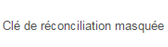

# Composants d’Adobe Campaign{#adobe-campaign-components}

>[!CAUTION]
>
>AEM 6.4 a atteint la fin de la prise en charge étendue et cette documentation n’est plus mise à jour. Pour plus d’informations, voir notre [période de support technique](https://helpx.adobe.com/fr/support/programs/eol-matrix.html). Rechercher les versions prises en charge [here](https://experienceleague.adobe.com/docs/?lang=fr).

Lors de l’intégration à Adobe Campaign, des composants sont disponibles pour lorsque vous utilisez des newsletters et des formulaires. Les deux sont décrits dans ce document.

## Composants Newsletter Adobe Campaign {#adobe-campaign-newsletter-components}

Tous les composants d’Adobe Campaign appliquent les méthodes recommandées décrites dans les [bonnes pratiques pour les modèles d’e-mail](/help/sites-administering/best-practices-for-email-templates.md) et dépendent du langage de balisage [HTL](https://helpx.adobe.com/fr/experience-manager/htl/using/overview.html) d’Adobe.

Lorsque vous ouvrez une newsletter ou un e-mail configuré de manière à être intégré à Adobe Campaign, les composants ci-dessous doivent s’afficher dans la section **Newsletter Adobe Campaign** :

* Titre (Campaign)
* Image (Campaign)
* Lien (Campaign)
* Modèle d’image Dynamic Media (Campaign)
* Référence ciblée (Campaign)
* Texte et image (Campaign)
* Texte et personnalisation (Campaign)

Vous trouverez une description de ces composants dans la section suivante.

Les composants se présentent comme suit :

### Titre (Campaign) {#heading-campaign}

Le composant d’en-tête peut :

* Affichez le nom de la page active en laissant le champ **Titre** champ vide.
* Afficher un texte que vous spécifiez dans la variable **Titre** champ .

Vous modifiez la variable **En-tête (Campaign)** composant directement. Laisser vide pour utiliser le titre de la page.

Vous pouvez configurer les éléments suivants :

* **Titre**
Si vous souhaitez utiliser un autre nom que le titre de la page, saisissez-le ici.

* **Niveau de titre (1, 2, 3, 4)**
Niveau de titre d’après la catégorie de titre HTML 1-4.

L’exemple ci-dessous présente le composant Titre (Campaign) affiché.

### Image (Campaign) {#image-campaign}

Le composant Image (campagne) affiche une image et le texte qui l’accompagne selon les paramètres spécifiés.

Vous pouvez télécharger une image, puis la modifier et la manipuler (par exemple, la recadrer, la faire pivoter, ajouter un lien/titre/texte).

Vous pouvez faire glisser et déposer une image à partir de l’[explorateur de ressources](/help/sites-authoring/author-environment-tools.md#assets-browser) directement sur le composant ou sa [boîte de dialogue Configurer](/help/sites-authoring/editing-content.md#edit-configure-copy-cut-delete-paste). Vous pouvez également charger une image à partir de la boîte de dialogue Configurer ; celle-ci contrôle également toutes les définitions, ainsi que la manipulation de l’image :

>[!NOTE]
>
>Pour enregistrer l’image, vous devez renseigner le champ **Texte de remplacement**.

Une fois l’image transférée (pas avant), vous pouvez utiliser la [modification statique](/help/sites-authoring/editing-content.md#edit-configure-copy-cut-delete-paste) pour recadrer/faire pivoter l’image, au besoin :

>[!NOTE]
>
>L’éditeur statique utilise la taille et les proportions d’origine de l’image lors de l’édition. Vous pouvez également spécifier des propriétés de hauteur et de largeur. Toute restriction de taille et de proportion définie dans les propriétés est appliquée lorsque vous enregistrez vos modifications.
>
>Selon votre instance, des restrictions minimales et maximales peuvent aussi être imposées par la [conception de la page](/help/sites-developing/designer.md). Ces restrictions sont développées lors de la mise en œuvre du projet.

Différentes autres options sont disponibles en mode Plein écran. Par exemple, Carte et Zoom :

Lorsqu’une image est chargée, vous pouvez configurer ce qui suit :

* **Map**

   Pour mapper une image, sélectionnez Mapper. Vous pouvez spécifier ensuite comment créer la zone cliquable (rectangle, polygone, etc.) et l’emplacement sur lequel la zone doit pointer.

* **Recadrer**

   Sélectionnez recadrer pour effectuer un recadrage d’une image. Utilisez la souris pour effectuer le recadrage.

* **Rotation**

   Pour faire pivoter une image, sélectionnez Rotation. Répétez l’opération jusqu’à ce que l’image ait pivoté comme vous le souhaitez.

* **Effacer**

   Permet de supprimer l’image actuelle.

* Barre de zoom (classique uniquement)

   Pour effectuer un zoom arrière et avant sur l’image, utilisez le curseur situé en dessous de l’image (et au-dessus des boutons OK et Annuler).

* **Titre**

   Titre de l’image.

* **Texte de remplacement**

   Texte de remplacement à utiliser lors de la création de contenu accessible.

* **Lier à**

   Créez un lien vers les ressources ou d’autres pages de votre site Web.

* **Description**

   Description de l’image.

* **Taille**

   Permet de définir la hauteur et la largeur de l’image.

>[!NOTE]
>
>Pour enregistrer l’image, vous devez renseigner le champ **Texte de remplacement** sur l’**onglet Avancé**. Sinon, le message d’erreur ci-dessous s’affiche :
>
>`Validation failed. Verify the values of the marked fields.`

L’exemple ci-dessous présente le composant Image (Campaign) affiché.

### Lien (Campaign) {#link-campaign}

Le composant Lien (Campaign) vous permet d’ajouter un lien à votre newsletter.

Vous pouvez configurer les éléments ci-dessous sur les onglets **Affichage**, **Informations d’URL** ou **Avancé** :

* **Légende du lien**

   Légende du lien. Il s’agit du texte que les utilisateurs voient.

* **Info-bulle des liens**

   Ajoute des informations supplémentaires sur l’utilisation du lien.

* **LinkType**

   Dans la liste déroulante, sélectionnez entre un **URL personnalisée** et un **Document adaptatif**. Ce champ est obligatoire. Si vous sélectionnez URL personnalisée, vous pouvez fournir l’URL du lien. Si vous sélectionnez Document adaptatif, vous pouvez fournir le chemin du document.

* **Paramètre d’URL supplémentaire**

   Ajoutez d’autres paramètres d’URL. Cliquez sur Ajouter un élément pour ajouter plusieurs éléments.

>[!NOTE]
>
>Pour enregistrer le composant, vous devez renseigner le champ **Type de lien** sur l’onglet **Informations sur l’URL**. Autrement, le message d’erreur ci-dessous s’affiche :
>
>`Validation failed. Verify the values of the marked fields.`

L’exemple ci-dessous présente le composant Lien (Campaign) affiché.

### Modèle d&#39;image Scene7 (Campaign) {#scene-image-template-campaign}

[Modèles d’image Scene7](https://experienceleague.adobe.com/docs/dynamic-media-classic/using/template-basics/quick-start-template-basics.html#template-basics) Les couches sont des fichiers image superposés, où le contenu et les propriétés peuvent être paramétrés pour la variabilité. Le **Modèle d’image** vous permet d’utiliser des modèles Dynamic Media Classic (anciennement Scene7) dans des newsletters et de modifier les valeurs des paramètres de modèle. De plus, vous pouvez utiliser des variables de métadonnées Adobe Campaign dans les paramètres de sorte que chaque utilisateur visualise l’image de façon personnalisée.

Cliquez sur **Modifier** pour configurer le composant. Vous pouvez configurer les paramètres décrits dans cette section. Ce modèle d’image Dynamic Media Classic (anciennement Scene7) est décrit en détail à la section [Composant Modèle d’image Scene7](/help/assets/scene7.md#image-template).

En outre, le panneau des paramètres répertorie tous les paramètres de modèle définis pour le modèle dans Dynamic Media Classic (anciennement Scene7). Pour chacun de ces paramètres, vous pouvez adapter la valeur, insérer des variables ou les réinitialiser à leur valeur par défaut.

### Référence ciblée (Campaign) {#targeted-reference-campaign}

Le composant Référence ciblée (Campaign) permet de créer une référence à un paragraphe ciblé.

Dans ce composant, vous accédez au paragraphe ciblé pour le sélectionner.

Cliquez sur l’icône de dossier pour accéder au paragraphe à référencer. Lorsque vous avez terminé, cliquez sur la coche.

### Texte et image (Campaign) {#text-image-campaign}

Le composant Texte et image (Campaign) ajoute un bloc de texte et une image.

Lorsque vous cliquez pour configurer le composant, sélectionnez Texte ou Image.

Sélection **Texte** affiche un éditeur en ligne :

Sélection **Image** affiche l’éditeur statique pour les images :

Voir [Composant Image (Campaign)](#image-campaign) pour plus d’informations sur l’utilisation des images. Voir [Composant Texte et personnalisation (Campaign)](#text-personalization-campaign) pour plus d’informations sur l’utilisation du texte.

Comme pour les composants Texte et personnalisation (Campaign) et Image (Campaign), vous pouvez configurer :

* **Texte**

   Entrer le texte. Utilisez la barre d’outils pour modifier le formatage, créer des listes et ajouter des liens.

* **Image**

   Faites glisser une image à partir de l’outil de recherche de contenu ou cliquez sur pour accéder à une image. Recadrez ou faites pivoter selon vos besoins.

* **Propriétés de l’image** (**Propriétés d’image avancées**)

   Sous cet onglet, vous pouvez spécifier les paramètres suivants :

   * **Titre**

      Le titre du bloc ; s’affiche lorsque vous pointez dessus.

   * **Texte de remplacement**

      Texte de remplacement à afficher lorsque l’image ne peut pas être affichée.

   * **Lier à**

      Créez un lien vers les ressources ou d’autres pages de votre site Web.

   * **Description**

      Description de l’image.

   * **Taille**

      Définit la hauteur et la largeur de l’image.

>[!NOTE]
>
>Le champ **Texte de remplacement** sur l’onglet **Avancé** est obligatoire. Autrement, vous ne pouvez pas enregistrer le composant, et le message d’erreur ci-dessous s’affiche :
>
>`Validation failed. Verify the values of the marked fields.`

L’exemple ci-dessous présente le composant Texte et image (Campaign) affiché.

### Texte et personnalisation (Campaign) {#text-personalization-campaign}

Le composant Texte et personnalisation (Campaign) permet de saisir un bloc de texte en utilisant un éditeur WYSIWYG, avec les fonctionnalités de l’[éditeur de texte enrichi](/help/sites-authoring/rich-text-editor.md). De plus, ce composant permet d’utiliser des champs de contexte et des blocs de personnalisation, disponibles dans Adobe Campaign. Reportez-vous également à la section [Insertion d’une personnalisation](/help/sites-authoring/campaign.md#inserting-personalization).

Une série d’icônes permet de mettre en forme le texte (attributs de police, alignement, liens, listes et retrait). Les fonctionnalités sont globalement identiques dans [les deux IU](/help/sites-authoring/editing-content.md), même si l’affichage est différent :

Dans l’éditeur statique, vous pouvez ajouter du texte, modifier la justification, ajouter et supprimer des liens, ajouter des champs contextuels ou des blocs de personnalisation, puis passer en mode plein écran. Une fois l’ajout de texte/la personnalisation terminé, cochez la case pour enregistrer vos modifications (ou x pour annuler). Pour plus d’informations, reportez-vous à la section [Modification statique.](/help/sites-authoring/editing-content.md#edit-configure-copy-cut-delete-paste)

>[!NOTE]
>
>* Les champs de personnalisation disponibles dépendent du modèle Adobe Campaign auquel votre newsletter est liée.
>* Après avoir sélectionné un persona dans ContextHub, les champs de personnalisation sont remplacés automatiquement par les données du profil sélectionné.
>
>Voir [Insertion de la personnalisation](/help/sites-authoring/campaign.md#inserting-personalization).

>[!NOTE]
>
>Seuls les champs définis dans le schéma **nms:seedMember** ou l’une de ses extensions sont pris en compte. Les attributs des tables liés à **nms:seedMember** ne sont pas disponibles.

## Composants Formulaire d’Adobe Campaign {#adobe-campaign-form-components}

Vous utilisez les composants Adobe Campaign pour créer un formulaire que les utilisateurs remplissent pour s’abonner à une newsletter, se désabonner d’une newsletter ou mettre à jour leurs profils utilisateur. Voir [Création d’Adobe Campaign Forms](/help/sites-authoring/adobe-campaign-forms.md) pour plus d’informations.

Chaque champ de composant peut être associé à un champ de base de données Adobe Campaign. Les champs disponibles varient en fonction du type de données qu’ils contiennent, comme décrit dans la section . [Composants et type de données](#components-and-data-type). Si vous étendez votre schéma de destinataires dans Adobe Campaign, les nouveaux champs seront disponibles dans les composants dont les types de données correspondent.

Lorsque vous ouvrez un formulaire configuré pour être intégré à Adobe Campaign, les composants ci-dessous de la section **Adobe Campaign** s’affichent :

* Case à cocher (Campaign)
* Champ de date (Campaign) et champ de date/HTML 5 (Campaign)
* Clé primaire chiffrée (Campaign)
* Affichage d’erreur (campagne)
* Clé de réconciliation masquée (Campaign)
* Champ numérique (Campaign)
* Champ d&#39;option (Campaign)
* Liste de contrôle d’abonnements (Campaign)
* Champ de texte (Campaign)

Les composants se présentent comme suit :

Cette section décrit en détail chaque composant.

### Composants et type de données {#components-and-data-type}

Le tableau suivant décrit les composants disponibles pour afficher et modifier les données de profil Adobe Campaign. Chaque composant peut être mappé à un champ de profil Adobe Campaign pour afficher sa valeur et mettre à jour le champ lors de l’envoi du formulaire. Les différents composants ne peuvent être associés qu’à des champs d’un type de données approprié.

<table> 
 <tbody> 
  <tr> 
   <td>
<strong>Composant</strong>
 </td> 
   <td>
<strong>Type de données du champ Adobe Campaign</strong>
 </td> 
   <td>
<strong>Exemple de champ</strong>
 </td> 
  </tr> 
  <tr> 
   <td>
Case à cocher (Campaign)
 </td> 
   <td>
booléen
 </td> 
   <td>
Ne plus contacter (tous canaux)
 </td> 
  </tr> 
  <tr> 
   <td>
Champ de date (Campaign)
 
Champ de date/HTML 5 (Campaign)
 </td> 
   <td>
date
 </td> 
   <td>
Date de naissance
 </td> 
  </tr> 
  <tr> 
   <td>
Champ numérique (Campaign)
 </td> 
   <td>
numérique (octet, court, long, double)
 </td> 
   <td>
Age
 </td> 
  </tr> 
  <tr> 
   <td>
Champ d'option (Campaign)
 </td> 
   <td>
byte avec valeurs associées
 </td> 
   <td>
Sexe
 </td> 
  </tr> 
  <tr> 
   <td>
Champ de texte (Campaign)
 </td> 
   <td>
chaîne
 </td> 
   <td>
E-mail
 </td> 
  </tr> 
 </tbody> 
</table>

### Paramètres communs à la plupart des composants {#settings-common-to-most-components}

Les paramètres des composants Adobe Campaign sont communs à tous les composants (à l’exception des composants Clé Principal chiffrée et Clé de réconciliation masquée).

Dans la plupart des composants, vous pouvez configurer les éléments suivants :

#### Titre et texte {#title-and-text}

* **Titre**

   Si vous souhaitez utiliser un autre nom que le nom de l&#39;élément, saisissez-le ici.

* **Masquer le titre**

   Cochez cette case si vous ne souhaitez pas que le titre soit visible.

* **Description**

   Ajoutez une description dans ce champ pour donner des informations supplémentaires pour les utilisateurs.

* **N’afficher que la valeur**

   Affiche uniquement la valeur, s’il en existe une

#### Adobe Campaign {#adobe-campaign}

Vous pouvez configurer les éléments suivants :

* **Mappage**

   Sélectionnez un champ de personnalisation Adobe Campaign, le cas échéant.

* **Clé de réconciliation**

   Cochez cette case si ce champ fait partie de la clé de réconciliation.

#### Contraintes {#constraints}

* **Requis**

   Cochez cette case pour que ce composant soit requis ; en d’autres termes, les utilisateurs doivent saisir une valeur.

* **Message obligatoire**

   Vous pouvez éventuellement ajouter un message stipulant que le champ est obligatoire.

#### Style {#styling}

* **CSS**
Indiquez les classes CSS à utiliser pour ce composant.

### Case à cocher (Campaign) {#checkbox-campaign}

Le composant Case à cocher (Campaign) permet à l’utilisateur de modifier les champs de profil Adobe Campaign de type données booléennes. Par exemple, vous pouvez disposer d’un composant Case à cocher (Campaign) qui permet au destinataire d’indiquer qu’il ne souhaite être contacté via aucun canal.

Vous pouvez [configuration des paramètres communs à la plupart des composants Adobe Campaign](#settings-common-to-most-components) dans le composant Case à cocher (Campaign).

L’exemple suivant illustre l’affichage d’un composant Case à cocher (Campaign).

### Champ de date (Campaign) et champ de date/HTML 5 (Campaign) {#date-field-campaign-and-date-field-html-campaign}

Utilisez le champ date pour permettre aux destinataires d&#39;atteindre une date. par exemple, vous souhaitez peut-être que les destinataires indiquent leur date de naissance. Le format de date correspond au format utilisé dans votre instance Adobe Campaign.

Outre les [paramètres communs à la plupart des composants Adobe Campaign](#settings-common-to-most-components), vous pouvez configurer les éléments suivants :

* **Contraintes - Contrainte** menu déroulant

   Vous pouvez sélectionner : **Aucun** ou **Date**- pour ajouter une contrainte de date ou aucune contrainte. Si vous sélectionnez Date, la réponse que les utilisateurs renseignent dans le champ doit correspondre à un format de date.

* **Message de contrainte**

   En outre, vous pouvez ajouter un message de contrainte pour que les utilisateurs sachent comment formater correctement leurs réponses.
* **Style - Largeur**
Ajustez la largeur du champ en cliquant ou en appuyant sur le bouton 
**+** et **-** des icônes ou la saisie d’un nombre.

L’exemple ci-dessous présente le composant Champ de date (Campaign), dont la largeur ajustée, affiché.

### Clé primaire chiffrée (Campaign) {#encrypted-primary-key-campaign}

Ce composant définit le nom du paramètre d’URL qui contiendra l’identifiant d’un profil Adobe Campaign (**Identifiant de ressource principal** ou **Clé Principale cryptée** dans Adobe Campaign Standard et la version 6.1, respectivement).

Chaque formulaire affichant et modifiant les données de profil Adobe Campaign **must** inclure un composant Clé Principal chiffrée.

Vous pouvez configurer les éléments suivants dans le composant Clé Principal chiffrée (Campaign) :

* **Titre et texte - Nom de l’élément**

   La valeur par défaut est encryptedPK. Il suffit de modifier le nom de l’élément lorsqu’il entre en conflit avec le nom d’un autre élément du formulaire. Aucun champ de formulaire ne peut avoir le même nom d’élément.
* **Adobe Campaign – Paramètre d’URL** Ajoutez le paramètre d’URL de l’EPK. Par exemple, vous pouvez utiliser la valeur 
**epk**.

L’exemple suivant illustre l’affichage d’un composant Clé Principal chiffrée (Campaign).

### Affichage d’erreur (campagne) {#error-display-campaign}

Ce composant vous permet d’afficher les erreurs du serveur principal. La gestion des erreurs du formulaire doit être définie sur Transférer pour que le composant fonctionne correctement.

L’exemple suivant montre un composant Affichage d’erreur (Campaign) affiché.

### Clé de réconciliation masquée (Campaign) {#hidden-reconciliation-key-campaign}

Le composant Clé de réconciliation masquée (Campaign) permet d’ajouter des champs masqués dans le cadre de la clé de réconciliation d’un formulaire.

Vous pouvez configurer les éléments ci-dessous dans le composant Clé de réconciliation masquée (Campaign) :

* **Titre et texte - Nom de l’élément**

   La valeur par défaut est reconcilKey. Il suffit de modifier le nom de l’élément lorsqu’il entre en conflit avec le nom d’un autre élément du formulaire. Aucun champ de formulaire ne peut avoir le même nom d’élément.
* **Adobe Campaign – Mappage** Mappez-la à un champ de personnalisation Adobe Campaign.

L’exemple ci-dessous présente le composant Clé de réconciliation masquée (Campaign) affiché.

### Champ numérique (Campaign) {#numeric-field-campaign}

Utilisez le champ numérique pour permettre aux destinataires de saisir des nombres, par exemple leur âge.

Outre les [paramètres communs à la plupart des composants Adobe Campaign](#settings-common-to-most-components), vous pouvez configurer les éléments suivants :

* **Contraintes - Contrainte** menu déroulant

   Vous pouvez sélectionner : **Aucun** ou **Numérique** - pour ajouter une contrainte de nombre ou aucune contrainte. Si vous sélectionnez Numérique, la réponse saisie par les utilisateurs dans le champ doit être numérique.

* **Message de contrainte**

   En outre, vous pouvez ajouter un message de contrainte pour que les utilisateurs sachent comment formater correctement leurs réponses.
* **Style - Largeur**
Ajustez la largeur du champ en cliquant ou en appuyant sur le bouton 
**+** et **-** des icônes ou la saisie d’un nombre.

L’exemple ci-dessous présente le composant Champ numérique (Campaign), dont la largeur est configurée.

### Champ d&#39;option (Campaign) {#option-field-campaign}

Cette liste déroulante vous permet de sélectionner une option. par exemple, le genre ou le statut d&#39;un destinataire.

Vous pouvez [configuration des paramètres communs à la plupart des composants Adobe Campaign](#settings-common-to-most-components) dans le composant Champ d’option (Campaign). Pour remplir la liste déroulante, sélectionnez le champ approprié dans les champs de personnalisation d’Adobe Campaign en cliquant ou en appuyant sur le symbole Adobe Campaign et en accédant au champ.

L’exemple ci-dessous présente le composant Champ d’option (Campaign) affiché.

### Liste de contrôle d’abonnements (Campaign) {#subscriptions-checklist-campaign}

Utilisez le composant **Liste de contrôle d’abonnements (Campaign)** pour modifier les abonnements associés à un profil Adobe Campaign.

Lorsque vous ajoutez ce composant à un formulaire, il affiche tous les abonnements disponibles sous forme de cases à cocher et permet à l’utilisateur de sélectionner les abonnements souhaités. Lorsque les utilisateurs envoient le formulaire, ce composant abonne l’utilisateur aux services sélectionnés ou l’en désabonne en fonction du type d’action de formulaire (**Adobe Campaign : S’abonner à des services** ou **Adobe Campaign : Se désabonner de services**).

>[!NOTE]
>
>Le composant ne vérifie pas les services auxquels l’utilisateur est déjà abonné/dont il est désabonné.

Vous pouvez [configuration des paramètres communs à la plupart des composants Adobe Campaign](#settings-common-to-most-components) dans le composant Liste de contrôle d’abonnements (Campaign). (Aucune configuration Adobe Campaign n’est disponible pour ce composant.)

L’exemple suivant illustre l’affichage d’un composant Liste de contrôle d’abonnements (Campaign).

### Champ de texte (Campaign) {#text-field-campaign}

Le composant Champ de texte (Campaign) qui permet de saisir des données de type chaîne, telles qu’un prénom, un nom, une adresse, une adresse électronique, etc.

Outre les [paramètres communs à la plupart des composants Adobe Campaign](#settings-common-to-most-components), vous pouvez configurer les éléments suivants :

* **Contraintes - Contrainte** menu déroulant

   Vous pouvez sélectionner : **Aucun, Email,** ou **Nom (pas de trémas)**- pour ajouter la contrainte d’une adresse électronique, d’un nom ou d’aucune contrainte. Si vous sélectionnez l’option E-mail, la réponse saisie par les utilisateurs dans le champ doit correspondre à une adresse électronique. Si vous sélectionnez Nom, il doit s’agit d’un nom (les trémas ne sont pas autorisés).

* **Message de contrainte**

   En outre, vous pouvez ajouter un message de contrainte pour que les utilisateurs sachent comment formater correctement leurs réponses.

* **Style - Largeur**

   Ajustez la largeur du champ en cliquant ou en appuyant sur le bouton **+** et **-** des icônes ou la saisie d’un nombre.

L’exemple ci-dessous présente le composant Champ de texte (Campaign) affiché.

