# Environnement et outils de création{#authoring-the-environment-and-tools}

L’environnement de création d’AEM comprend divers mécanismes permettant d’organiser et de modifier votre contenu. Les outils proposés sont accessibles dans les divers éditeurs de pages et consoles.

## Gestion de votre site {#managing-your-site}

Dans la console **Sites**, vous pouvez parcourir et gérer votre site web en utilisant la barre d’en-tête, la barre d’outils, les icônes d’action (applicables à la ressource sélectionnée), les chemins de navigation et, s’ils sont sélectionnés, les rails secondaires (par ex., référence et frise chronologique).

Par exemple, le mode Carte : 

## Modification du contenu de la page {#editing-page-content}

Vous pouvez modifier une page dans l’éditeur de page. Par exemple :

`http://localhost:4502/editor.html/content/we-retail/us/en/equipment.html`

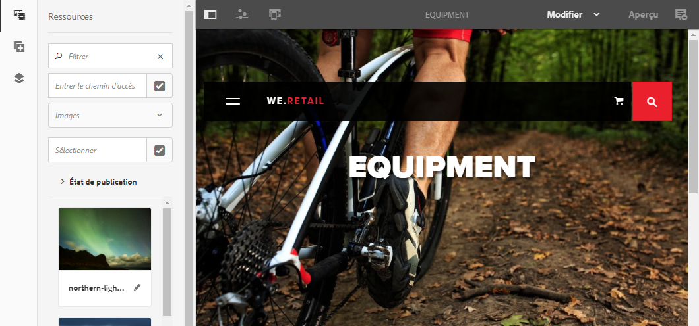

>[!NOTE]
>
>La première fois que vous ouvrez une page pour la modifier, les différentes fonctions vous sont présentées dans une série de diapositives.
>
>Vous pouvez ignorer cette présentation ou la revoir à tout moment en la sélectionnant dans le menu **Informations sur la page**.

## Accès à l’aide {#accessing-help}

Lorsque vous modifiez une page, l’**Aide** est accessible depuis :

* le sélecteur [**Informations sur la page **](/help/sites-authoring/editing-page-properties.md#page-properties)qui vous indique les diapositives d’introduction (comme c’est le cas lors de votre premier accès à l’éditeur) ;
* la boîte de dialogue [Configuration](/help/sites-authoring/editing-content.md#edit-configure-copy-cut-delete-paste) pour des composants spécifiques (au moyen de l’icône ? de la barre d’outils de la boîte de dialogue) qui vous fournit une aide contextuelle.

D’autres [ressources d’aide sont accessibles depuis les consoles](/help/sites-authoring/basic-handling.md#accessing-help).

## Explorateur de composants    {#components-browser}

L’explorateur de composants présente tous les composants que vous pouvez utiliser sur la page active. Faites-les glisser à l’emplacement de votre choix, puis modifiez-les pour ajouter du contenu.

L’explorateur de composants est un onglet du panneau latéral (de même que l’[explorateur de ressources](/help/sites-authoring/author-environment-tools.md#assets-browser) et l’[arborescence de contenu](/help/sites-authoring/author-environment-tools.md#content-tree)). Pour ouvrir (ou fermer) le panneau latéral, utilisez l’icône en haut à gauche de la barre d’outils :

Lorsque vous ouvrez le panneau latéral, il s’ouvre en glissant depuis le côté gauche (sélectionnez l’onglet **Composants** si nécessaire). De là, vous pouvez parcourir tous les composants disponibles pour votre page.

L’aspect et la gestion de l’explorateur dépendent du type d’appareil utilisé :

>[!NOTE]
>
>Un appareil mobile est détecté si sa largeur est inférieure à 1 024 px. C’est également le cas pour les petites fenêtres sur les ordinateurs de bureau.

* **Appareils mobiles (p. ex. iPad)**

   Le navigateur de composants couvre complètement la page en cours de modification.

   Pour ajouter des composants à votre page, maintenez le composant requis enfoncé et déplacez-le vers la droite - l’explorateur de composants se ferme pour afficher à nouveau la page - où vous pouvez positionner le composant.

   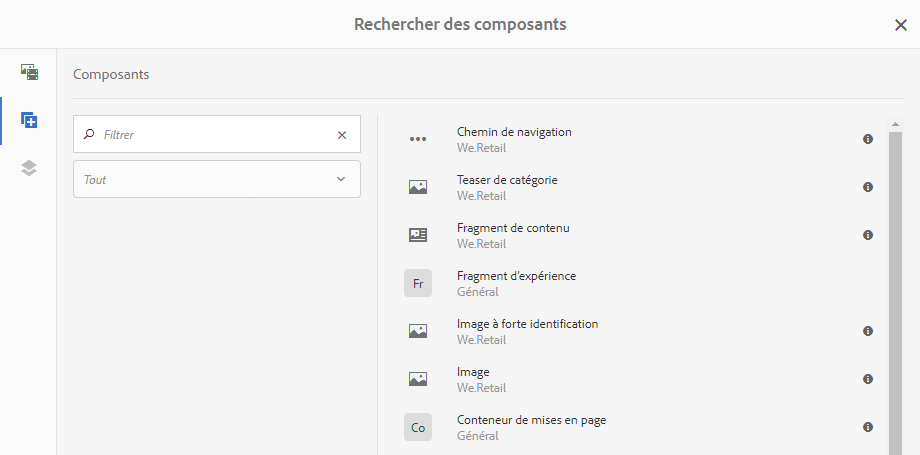

* **Poste de travail**

   Le navigateur de composants s&#39;ouvre sur le côté gauche de la fenêtre.

   Pour ajouter un composant à votre page, cliquez sur le composant souhaité et faites-le glisser vers l’emplacement requis.

   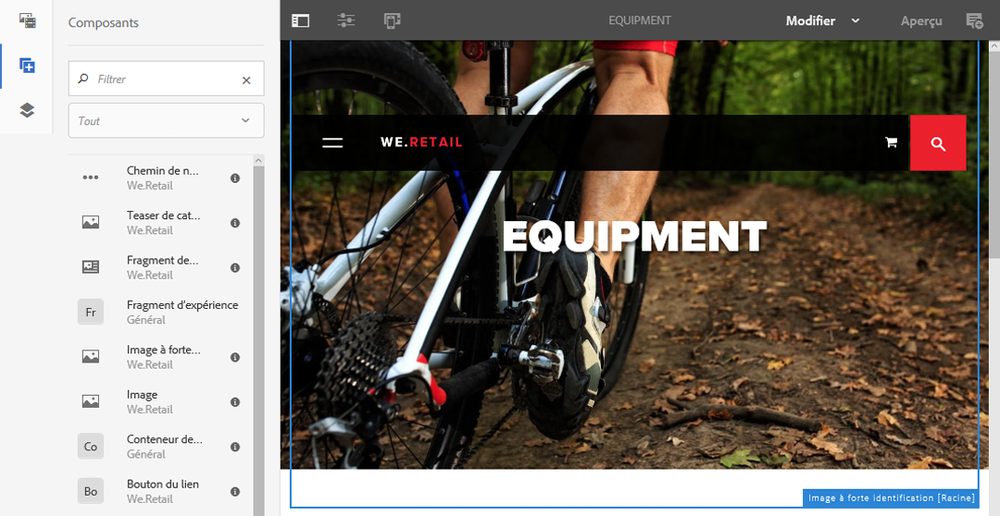

   Les composants sont représentés par

   * Nom du composant
   * Groupe de composants (en gris)
   * Icône ou abréviation

      * Les icônes de composants standard sont monochromes.
      * Les abréviations correspondent toujours aux deux premiers caractères du nom du composant.

   Dans la barre d’outils supérieure de l’explorateur de composants, vous pouvez effectuer les opérations suivantes :

   * Filtrer les composants par nom
   * Restreindre l’affichage à un groupe spécifique à l’aide de la liste déroulante

   Pour obtenir une description plus détaillée du composant, vous pouvez cliquer ou appuyer sur l’icône d’informations en regard du composant dans le navigateur Composants (le cas échéant).

   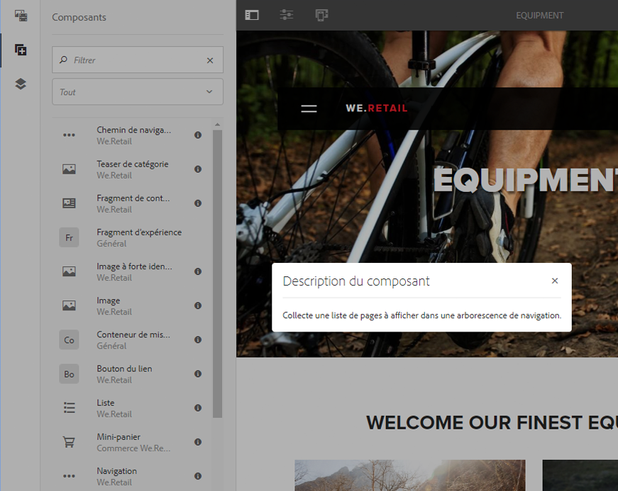

   Pour plus d’informations sur les composants disponibles, voir [Console Composants](/help/sites-authoring/default-components-console.md).

## Explorateur de ressources {#assets-browser}

L’explorateur de ressources présente toutes les ressources que vous pouvez utiliser directement sur la page active.

L’explorateur de ressources est un onglet du panneau latéral (de même que l’[explorateur de composants](/help/sites-authoring/author-environment-tools.md#components-browser) et l’[arborescence de contenu](/help/sites-authoring/author-environment-tools.md#content-tree)). Pour ouvrir ou fermer le panneau latéral, utilisez l’icône en haut à gauche de la barre d’outils :

Lorsque vous ouvrez le panneau latéral, il s’ouvre en glissant depuis le côté gauche. Sélectionnez l’onglet **Ressources** si nécessaire.

Une fois l’explorateur de ressources ouvert, vous pouvez parcourir toutes les ressources disponibles pour votre page. Le défilement infini permet de développer la liste quand cela s’avère nécessaire.

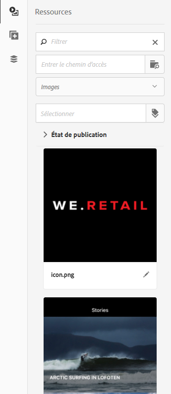

Pour ajouter une ressource à votre page, sélectionnez-la et faites-la glisser jusqu’à l’emplacement requis. Il peut s’agir :

* d’un composant existant du type approprié.

   * Par exemple, vous pouvez faire glisser une ressource de type image sur un composant Image ;

* d’un [emplacement réservé](/help/sites-authoring/editing-content.md#component-placeholder) dans le système de paragraphes où créer un composant du type approprié.

   * Par exemple, vous pouvez faire glisser une ressource de type image sur le système de paragraphes afin de créer un composant Image.

>[!NOTE]
>
>Vous pouvez agir ainsi pour des ressources et des types de composants spécifiques. Voir [Insertion d’un composant à l’aide de l’explorateur de ressources](/help/sites-authoring/editing-content.md#inserting-a-component-using-the-assets-browser) pour en savoir plus.

Dans la barre d’outils supérieure de l’explorateur de ressources, vous pouvez filtrer les ressources par :

* Nom
* Chemin
* Type de ressource (images, manuscrits, documents, vidéos, pages, paragraphes ou produits)
* Caractéristiques des ressources telles que l’orientation (portrait, paysage, carré) et le style (couleur, monochrome, niveaux de gris)

   * Disponible uniquement pour certains types de ressources

L’aspect et la gestion de l’explorateur dépendent du type d’appareil utilisé :

>[!NOTE]
>
>Un appareil mobile est détecté si la largeur est inférieure à 1 024 px. C’est également le cas pour les petites fenêtres sur les ordinateurs de bureau.

* **Appareil mobile, par exemple iPad**

   L’explorateur de ressources couvre entièrement la page en cours de modification.

   Pour ajouter une ressource à votre page, maintenez appuyée la ressource requise et déplacez-la vers la droite (l’explorateur de ressources se ferme pour afficher de nouveau la page) pour l’ajouter au composant requis.

   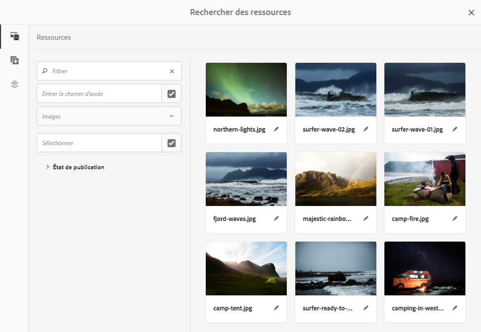

* **Poste de travail**

   L’explorateur de ressources s’ouvre sur le côté gauche de la fenêtre.

   Pour ajouter une ressource à votre page, cliquez dessus et faites-la glisser sur le composant ou l’emplacement requis.

   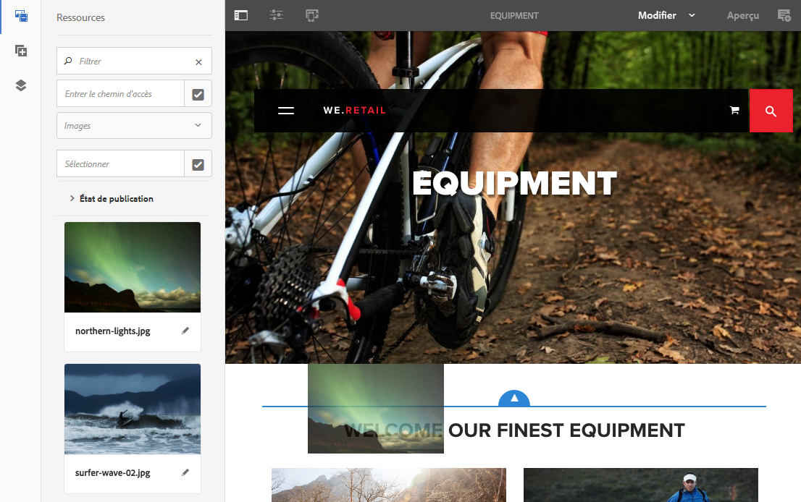

Si vous devez modifier rapidement une ressource, vous pouvez lancer [l’éditeur de ressources](/help/assets/managing-assets-touch-ui.md) directement depuis l’explorateur de ressources en cliquant sur l’icône Modifier affichée en regard du nom de la ressource.

## Arborescence de contenu    {#content-tree}

L’**arborescence de contenu** présente une vue d’ensemble des composants sur la page sous forme de structure hiérarchique pour que vous puissiez visualiser la composition de la page en un seul coup d’œil.

L’arborescence de contenu est un onglet du panneau latéral (de même que l’explorateur de composants et l’explorateur de ressources). Pour ouvrir (ou fermer) le panneau latéral, utilisez l’icône en haut à gauche de la barre d’outils :

Lorsque vous ouvrez le panneau latéral, il s’ouvre en glissant depuis le côté gauche. Sélectionnez l’onglet **Arborescence de contenu** si nécessaire. Vous pouvez alors voir une représentation de votre page ou modèle sous forme d’arborescence, qui vous permet de comprendre plus facilement la structure hiérarchique de son contenu. Sur une page complexe, elle vous permet en outre de passer plus facilement d’un composant à l’autre.

Comme une page peut souvent être composée de nombreux composants du même type, l’arborescence des composants affiche un texte descriptif (en gris) après le nom du type de composant (en noir). Le texte descriptif provient des propriétés communes du composant, telles que le titre ou le texte.

Les types de composants sont affichés dans la langue de l’utilisateur, tandis que le texte descriptif du composant dépend de la langue de la page.

Cliquez sur le chevron en regard d’un composant pour réduire ou développer ce niveau.

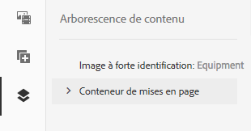

Cliquez sur le composant pour mettre en surbrillance le composant dans l’éditeur de page.

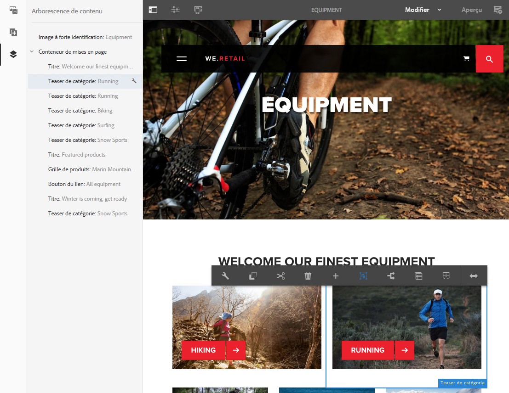

Si le composant sur lequel vous cliquez dans l’arborescence est modifiable, une icône de clé s’affiche à droite du nom. Cliquez sur cette icône pour ouvrir directement la boîte de dialogue de modification de ce composant.

>[!NOTE]
>
>L’arborescence de contenu n’est pas disponible si vous modifiez une page sur un appareil mobile (si la largeur de l’explorateur est inférieure à 1 024 px).

## Fragments – Explorateur de contenu associé {#fragments-associated-content-browser}

Si votre page contient des fragments de contenu, vous aurez dans ce cas également accès à l’[explorateur de contenu associé](/help/sites-authoring/content-fragments.md#using-associated-content).

## Références {#references}

**Références** signale toutes les connexions avec la page sélectionnée :

* Plans directeurs
* Lancements
* Live copies
* Copies de langue
* Utilisation du composant de référence
* Références aux pages de produit (depuis la console Commerce – Produits)

Ouvrez la console appropriée, puis accédez à la ressource requise et ouvrez **Références** à l’aide de :

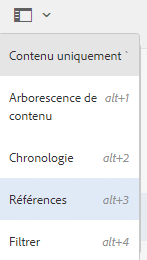

[Sélectionnez la ressource qui vous intéresse](/help/sites-authoring/basic-handling.md#viewing-and-selecting-resources) pour afficher la liste des types de références correspondant à cette ressource :

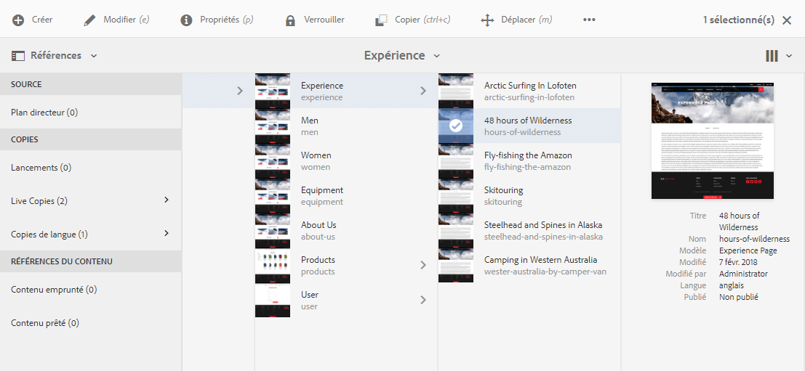

Sélectionnez le type de référence approprié pour en savoir plus. Dans certains cas, d’autres actions sont disponibles lorsque vous sélectionnez une référence particulière, notamment :

* Instances du composant Référence (par ex. lorsque vous naviguez jusqu’à la page de référence/référencée)
* [Références aux pages de produit](/help/sites-administering/generic.md#showing-product-references) (depuis la console Commerce – Produits)
* [Lancements](/help/sites-authoring/launches.md)
* Live Copies affiche les chemins d’accès à toutes les Live Copies basées sur la ressource sélectionnée.
* [Blueprint](/help/sites-administering/msm-best-practices.md)
* [Copies de langue](/help/sites-administering/tc-manage.md#creating-translation-projects-using-the-references-panel)

Par exemple, vous pouvez corriger une référence rompue dans un composant Référence :

## Événements – Chronologie {#events-timeline}

Pour accéder aux ressources appropriées (par ex. des pages de la console **Sites** ou des ressources de la console **Ressources**), utilisez la [chronologie afin d’afficher l’activité récente d’un élément sélectionné](/help/sites-authoring/basic-handling.md#timeline).

Ouvrez la console appropriée, puis accédez à la ressource requise et ouvrez la **Chronologie** à l’aide de :

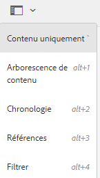

[Sélectionnez la ressource requise](/help/sites-authoring/basic-handling.md#viewing-and-selecting-resources), puis **Tout afficher** ou **Activités** afin de répertorier les activités récentes pour les ressources sélectionnées :

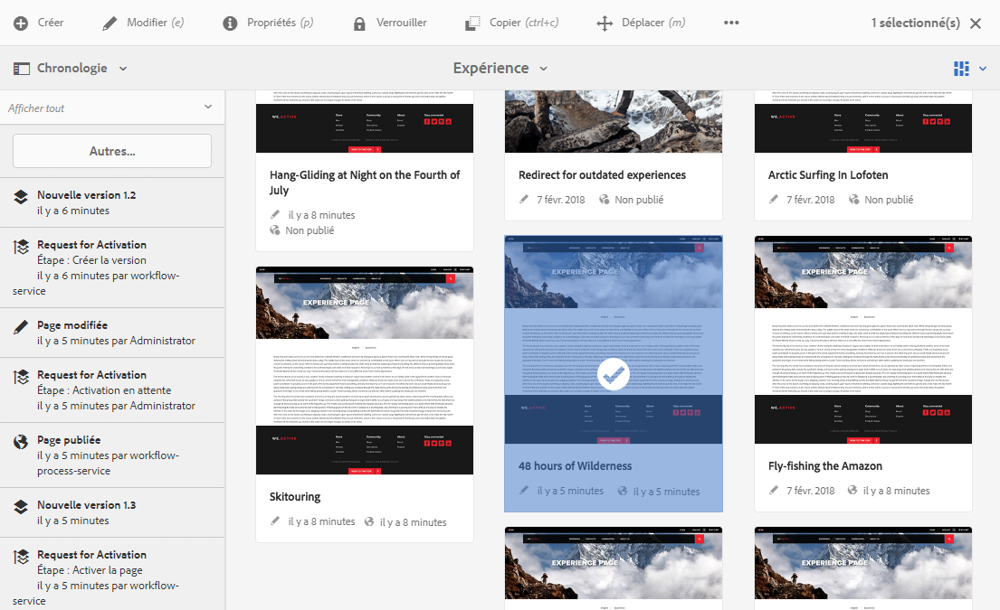

## Informations sur la page {#page-information}

L’icône Informations sur la page (icône d’égaliseur) ouvre un menu qui fournit également des détails sur la dernière modification et la dernière publication. Selon les caractéristiques de la page (et du site sur lequel elle se trouve), d’autres options peuvent être disponibles :

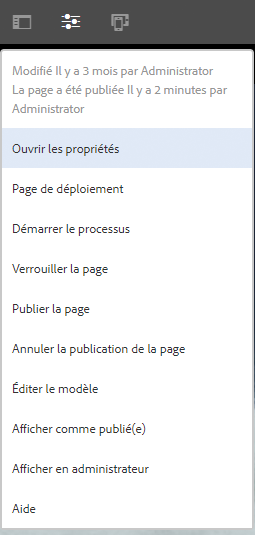

* [Ouvrir les propriétés](/help/sites-authoring/editing-page-properties.md)
* [Déployer la page](/help/sites-administering/msm.md#msm-from-the-ui)
* [Démarrer le workflow](/help/sites-authoring/workflows-applying.md#starting-a-workflow-from-the-page-editor)
* [Verrouiller la page](/help/sites-authoring/editing-content.md#locking-a-page)
* [Publier la page](/help/sites-authoring/publishing-pages.md#publishing-pages)
* [Annuler la publication de la page](/help/sites-authoring/publishing-pages.md#unpublishing-pages)
* [Afficher comme publié(e) ](/help/sites-authoring/editing-content.md#view-as-published)
* [Afficher en administrateur](/help/sites-authoring/basic-handling.md#viewing-and-selecting-resources)
* [Aide](/help/sites-authoring/basic-handling.md#accessing-help)

Le cas échéant, le menu **Informations sur la page** propose également les options suivantes :

* [Convertir le lancement](/help/sites-authoring/launches-promoting.md) si la page correspond à un lancement.
* [Modifier le modèle](/help/sites-authoring/templates.md) si la page est basée sur un modèle [modifiable](/help/sites-authoring/templates.md#editable-and-static-templates)

* [Ouvrir dans l’interface utilisateur](/help/sites-authoring/select-ui.md#switching-to-classic-ui-when-editing-a-page) classique si cette option a été [activée par un administrateur](/help/sites-administering/enable-classic-ui-editor.md)

Le menu **Informations sur la page** peut en outre donner accès à des analyses et recommandations, le cas échéant.

## Modes de page    {#page-modes}

Lors de la modification d’une page, plusieurs modes permettent d’effectuer différentes actions :

* [Modifier](/help/sites-authoring/editing-content.md) : mode à utiliser lors de la modification du contenu de la page.
* [Mise en page](/help/sites-authoring/responsive-layout.md) : permet de créer et de modifier une mise en page réactive en fonction du type d’appareil utilisé (si la page est basée sur un conteneur de mises en page).

* [Génération de modèles automatique](/help/sites-authoring/scaffolding.md) : permet de créer un jeu volumineux de pages partageant la même structure, mais avec un contenu différent.
* [Développeur](/help/sites-developing/developer-mode.md) : permet d’accomplir diverses opérations (certains droits sont requis), notamment la vérification des détails techniques d’une page et de ses composants.

* [Conception](/help/sites-authoring/default-components-designmode.md) : permet d’activer/désactiver les composants à utiliser sur une page et de configurer la conception du composant (si la page est basée sur un [modèle statique](/help/sites-authoring/templates.md#editable-and-static-templates)).

* [Ciblage](/help/sites-authoring/content-targeting-touch.md) : optimise la pertinence du contenu grâce au ciblage et aux mesures à l’échelle de tous les canaux.
* [Activity Map](/help/sites-authoring/pa-using.md) : affiche les données d’analyse de la page.

* [Timewarp](/help/sites-authoring/working-with-page-versions.md#timewarp) : permet d’afficher l’état d’une page à un moment donné.
* [État de Live Copy](/help/sites-authoring/editing-content.md#live-copy-status) : donne un aperçu rapide de l’état de la live copy et des composants qui sont ou non hérités.
* [Aperçu](/help/sites-authoring/editing-content.md#previewing-pages) : permet d’afficher la page comme elle sera présentée dans l’environnement de publication ou de naviguer au moyen des liens figurant dans le contenu.

* [Annoter](/help/sites-authoring/annotations.md) : permet d’ajouter ou d’afficher des annotations sur la page.

Vous pouvez accéder à ces modes en cliquant sur les icônes dans le coin supérieur droit ; l’icône active se changera alors pour refléter le mode sélectionné :

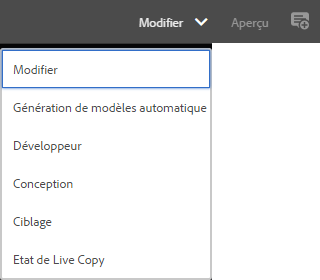

>[!NOTE]
>
>* Certains modes peuvent ne pas être disponibles en fonction des caractéristiques de la page.
>* L’accès à certains modes implique que vous disposiez des droits ou autorisations appropriés.
>* Le mode Développeur n’est pas accessible sur les appareils mobiles en raison de restrictions d’espace.
>* Utilisez le [raccourci clavier](/help/sites-authoring/page-authoring-keyboard-shortcuts.md) (`Ctrl-Shift-M`) pour permuter entre l’**Aperçu** et le mode actuellement sélectionné (par ex. **Modifier**, **Mise en page**, etc.).

>

## Sélection du chemin d’accès {#path-selection}

Lors de la création, il est souvent nécessaire de sélectionner une autre ressource, par exemple pour définir un lien vers une autre page ou ressource ou sélectionner une image. Pour faciliter la sélection d’un chemin d’accès, les [champs de chemin d’accès](/help/sites-authoring/author-environment-tools.md#path-fields) proposent la saisie automatique et [l’explorateur de chemins d’accès](/help/sites-authoring/author-environment-tools.md#path-browser) permet une sélection plus efficace.

### Champs de chemin d’accès {#path-fields}

L’exemple utilisé ici à titre d’illustration est le composant Image. Pour plus d’informations sur l’utilisation et la modification des composants, voir [Composants de création de pages](/help/sites-authoring/default-components.md).

Les champs de chemin d’accès intègrent désormais une fonctionnalité de saisie automatique et d’anticipation pour faciliter la localisation des ressources. Si vous commencez à taper dans le champ de chemin d’accès, AEM proposera les chemins d’accès correspondants au fur et à mesure de la saisie.

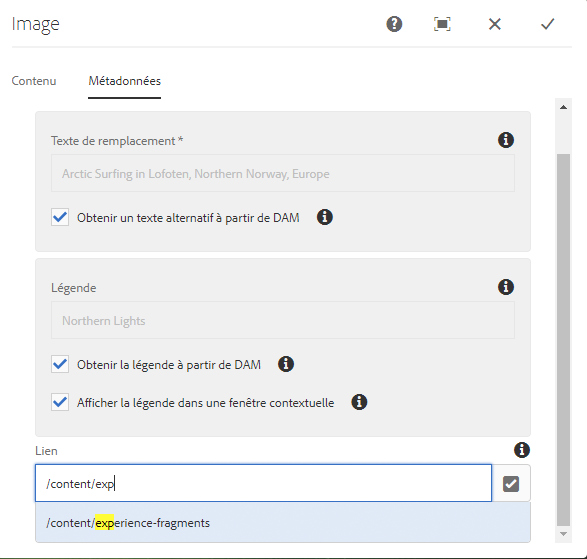

Si vous cliquez sur le bouton **Ouvrir la boîte de dialogue de sélection** dans le champ de chemin d’accès, la boîte de dialogue [Explorateur de chemins d’accès](/help/sites-authoring/author-environment-tools.md#path-browser) s’ouvre pour vous permettre d’accéder à des options de sélection plus détaillées.

### Explorateur de chemins d’accès {#path-browser}

L’explorateur de chemins d’accès est organisé de la même façon que le [mode Colonnes](/help/sites-authoring/basic-handling.md#column-view) de la console Sites afin de permettre une sélection plus détaillée des ressources.

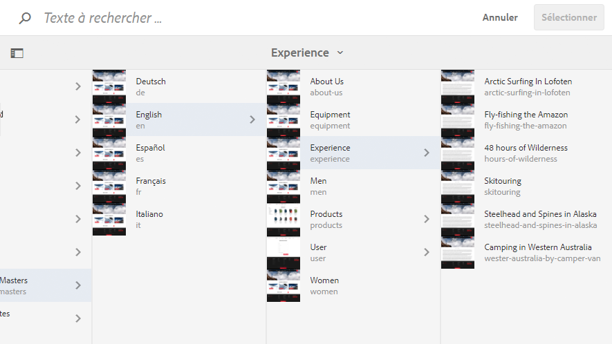

Lorsqu’une ressource est sélectionnée, le bouton **Sélectionner** situé en haut à droit de la boîte de dialogue devient actif. Cliquez ou appuyez dessus pour confirmer la sélection, ou sur **Annuler** pour annuler.

Si le contexte permet la sélection de plusieurs ressources, la sélection d’une ressource active également le bouton Sélectionner, mais ajoute également le nombre de ressources sélectionnées en haut à droite de la fenêtre. Cliquez sur le X en regard du nombre pour tout désélectionner.

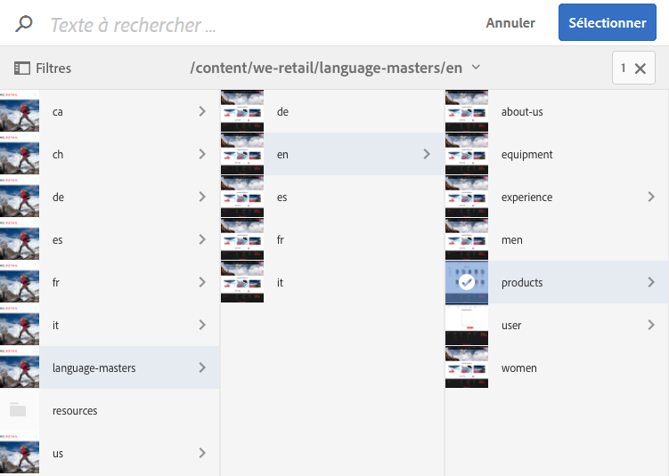

Les chemins de navigation peuvent être utilisés pour passer rapidement d’une ressource à l’autre dans la hiérarchie des ressources.

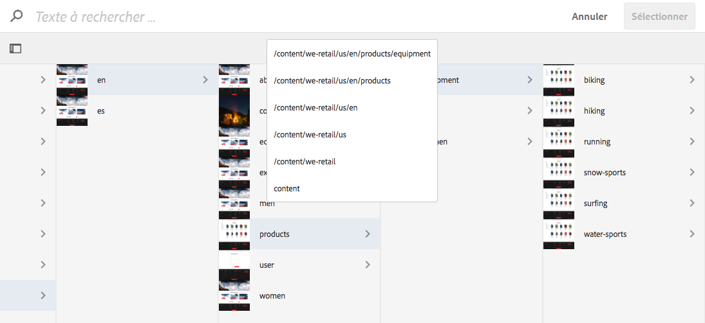

Vous pouvez à tout moment utiliser le champ de recherche situé en haut de la boîte de dialogue.

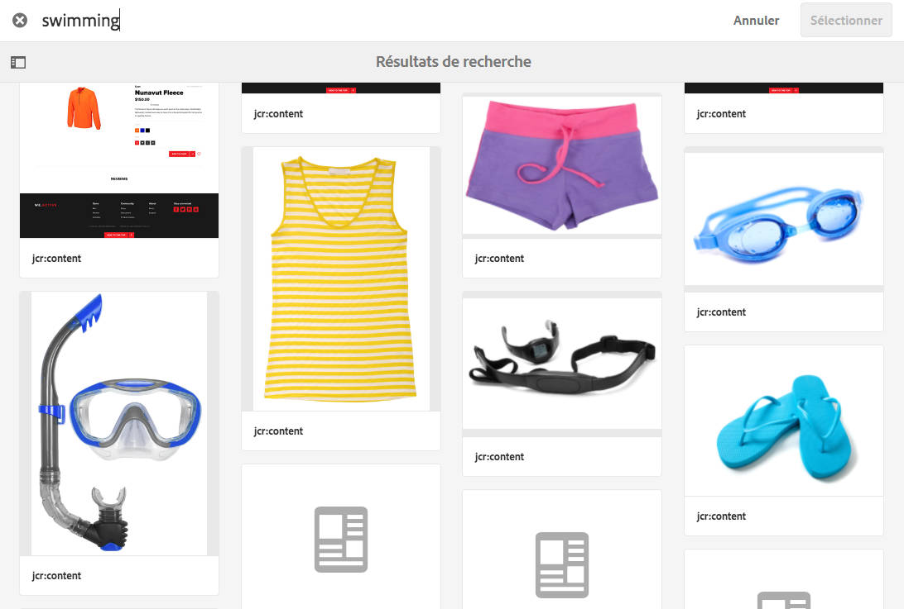

Cliquez sur la croix (X) dans le champ de recherche pour effacer la recherche.

Pour affiner votre recherche, vous pouvez afficher les options de filtre et filtrer vos résultats en fonction du chemin d’accès.

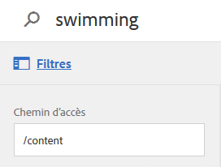

## Raccourcis clavier {#keyboard-shortcuts}

Divers [raccourcis clavier](/help/sites-authoring/page-authoring-keyboard-shortcuts.md) sont disponibles.
