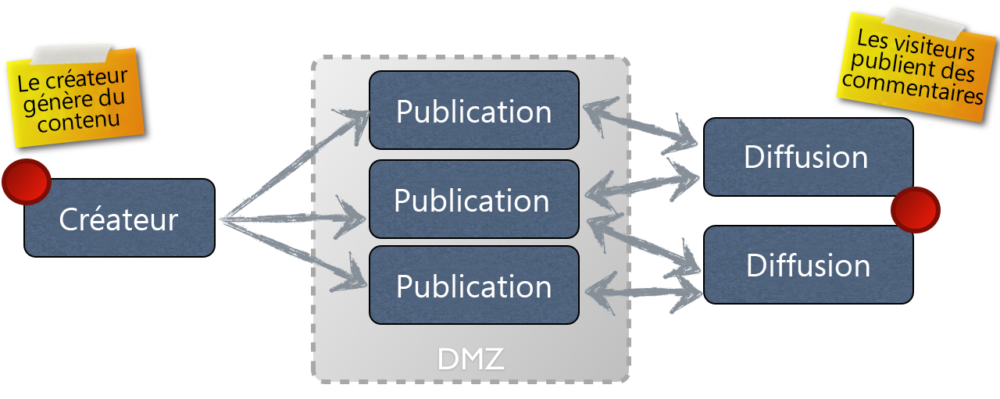

# Concept de création et de publication{#authoring}

AEM vous propose deux environnements :

* Création
* Publication

Ces environnements interagissent afin que vous puissiez rendre le contenu disponible sur votre site web, pour que vos visiteurs puissent le lire.

L’environnement de création fournit les mécanismes de création, de mise à jour et de révision de ce contenu avant de le publier :

* Un auteur crée et révise le contenu (qui peut être de plusieurs types, par ex. pages, ressources, publications, etc.)
* qui, à un moment donné, sera publié sur votre site web.

Dans l’environnement de création, les fonctions d’AEM sont accessibles dans deux interfaces utilisateur. Dans l’environnement de publication, vous concevez l’aspect de l’interface proposée aux utilisateurs.

## Environnement de création {#author-environment}

L’auteur travaille dans ce qu’on appelle l’**[environnement de création](/help/sites-authoring/home.md)**. Il s’agit d’une interface facile à utiliser (interface utilisateur graphique) pour créer le contenu. En fait, cette interface se trouve habituellement derrière le pare-feu d’une entreprise qui fournit une protection complète et implique que l’auteur se connecte à l’aide d’un compte doté des droits d’accès appropriés.

>[!NOTE]
>
>Votre compte doit disposer des droits d’accès appropriés pour la création, la modification ou la publication de contenu.

En fonction de la configuration de votre instance et de vos droits d’accès personnels, vous pouvez effectuer diverses tâches sur votre contenu, par exemple :

* générer un nouveau contenu ou modifier le contenu existant sur une page
* utiliser les modèles prédéfinis pour créer des pages de contenu ;
* créer, modifier et gérer vos ressources et collections
* créer, modifier et gérer vos publications ;
* développer vos campagnes et les ressources associées
* développer et gérer des sites communautaires
* déplacer, copier ou supprimer des pages de contenu, des ressources, etc. ;
* publier des pages, des ressources, etc. (ou annuler leur publication).

Certaines tâches administratives peuvent aussi vous aider à gérer votre contenu :

* worfklow qui déterminent le mode de gestion des modifications ; par exemple, appliquer une révision avant une publication.
* projets qui coordonnent des tâches individuelles.

>[!NOTE]
>
>Pour la plupart des tâches, l’environnement de création permet également d’[administrer](/help/sites-administering/home.md) AEM.

## Environnement de publication {#publish-environment}

Une fois prêt, le contenu du site AEM est publié sur l&#39;**environnement de publication**. Ici, vos pages sont mises à la disposition de l’audience prévue, en fonction de l’aspect global de l’interface que vous avez conçue.

Dans le cas d’un site web ordinaire, l’environnement de publication est situé à l’intérieur de la zone DMZ ; en d’autres termes, il est disponible sur Internet, mais il ne bénéficie plus de la protection absolue de votre réseau interne.

Lorsque le site AEM est un [site communautaire](/help/communities/overview.md), ou inclut des [composants de Communities](/help/communities/author-communities.md), des utilisateurs (membres) connectés peuvent interagir avec les fonctions de Communities. Par exemple, ils peuvent publier sur un forum, publier un commentaire ou suivre d’autres membres. Les membres peuvent être autorisés à effectuer des activités normalement réservées à l’environnement de création, telles que la création de nouvelles pages (groupes de communautés), d’articles de blog et la modération des publications d’autres membres.

>[!NOTE]
>
>Il existe malheureusement une interférence dans la terminologie utilisée. Cela peut se produire avec les fonctions suivantes :
>
>* **Publier/Annuler la publication**
   >  Termes principalement utilisés pour évoquer les opérations qui rendent votre contenu publiquement accessible dans votre environnement de publication (ou non).
   >
   >
* **Activer/Désactiver**
   >  Ces termes sont synonymes de publication/annulation de la publication. Elles sont plus courantes dans l’interface utilisateur classique.
   >
   >
* **Répliquer/Réplication**
   >  Il s&#39;agit des termes techniques utilisés pour indiquer le mouvement des données (par exemple, le contenu des pages, les fichiers, le code, les commentaires des utilisateurs) d&#39;un environnement à l&#39;autre ; c’est-à-dire lors de la publication ou de la réplication inversée des commentaires d’utilisateur.
>

## Dispatcher {#dispatcher}

Afin que les visiteurs de votre site web bénéficient de performances optimales, le **[dispatcher](https://helpx.adobe.com/experience-manager/dispatcher/user-guide.html) met en œuvre des mécanismes de mise en cache et d’équilibrage de la charge.**
