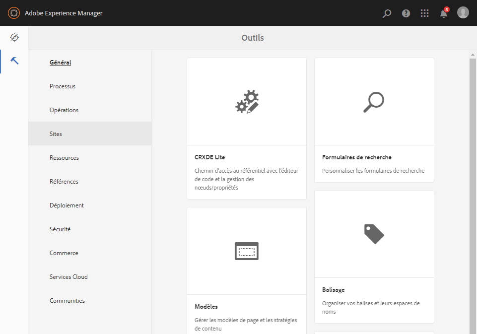
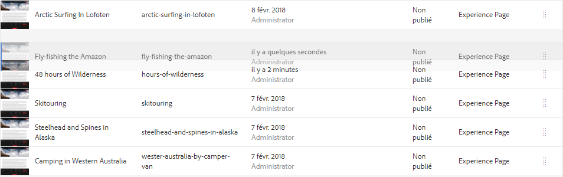
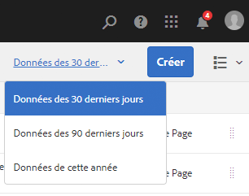

# Manipulation de base {#basic-handling}

>[!CAUTION]
>
>AEM 6.4 a atteint la fin de la prise en charge étendue et cette documentation n’est plus mise à jour. Pour plus d’informations, voir notre [période de support technique](https://helpx.adobe.com/fr/support/programs/eol-matrix.html). Rechercher les versions prises en charge [here](https://experienceleague.adobe.com/docs/?lang=fr).

>[!NOTE]
>
>* Cette page est conçue pour donner un aperçu des opérations de gestion de base lors de l’utilisation de l’environnement de création AEM. Il s’appuie sur la console **Sites**.
>
>* Certaines fonctionnalités ne sont pas disponibles dans toutes les consoles et d’autres peuvent être disponibles dans certaines consoles. Des informations spécifiques sur les consoles individuelles et leurs fonctionnalités associées seront traitées plus en détail sur d’autres pages.
>* Des raccourcis clavier sont disponibles dans toute l’application AEM, notamment lors de l’[utilisation des consoles](/help/sites-authoring/keyboard-shortcuts.md) et de la [modification de pages](/help/sites-authoring/page-authoring-keyboard-shortcuts.md).
>

## Prise en main {#getting-started}

### Interface utilisateur pour écrans tactiles {#a-touch-enabled-ui}

L’interface utilisateur d’AEM a été activée pour les écrans tactiles. Les interfaces de ce type permettent d’interagir de manière tactile avec le logiciel en appuyant sur l’écran, en maintenant la pression du doigt ou en le faisant glisser. Cela contraste avec la manière dont l’interface de bureau classique fonctionne avec les actions de la souris, telles que cliquer, double-cliquer, cliquer avec le bouton droit et pointer avec la souris. Étant donné que seuls les gestes sont requis, l’interface utilisateur tactile est entièrement opérationnelle sur les tablettes mobiles et offre également toutes les fonctionnalités sur l’ordinateur de bureau.

### Premiers pas {#first-steps}

Une fois connecté, vous accédez au [panneau de navigation](/help/sites-authoring/basic-handling.md#global-navigation). Ce point sera abordé plus en détail dans la section suivante.

Cliquez sur l’une des options pour ouvrir la console correspondante. La console **Sites** est utilisée dans ce document pour garantir une bonne compréhension de l’utilisation de base d’AEM.

Cliquez ou appuyez sur **Sites** pour commencer.

### Navigation dans le produit {#product-navigation}

Chaque fois qu’un utilisateur accède à une console pour la première fois, un tutoriel sur la navigation dans un produit est lancé. Prenez une minute pour cliquer ou appuyez dessus pour obtenir une bonne vue d’ensemble de la gestion de base des AEM.

Cliquez ou appuyez sur **Compris !** pour accéder à la page suivante de la présentation. Cliquez ou appuyez sur **Fermer** ou cliquez ou appuyez en dehors de la boîte de dialogue de présentation pour la fermer.

La présentation redémarrera la prochaine fois que vous accéderez à la console, sauf si vous cochez l’option . **Ne plus afficher**.

## Navigation globale {#global-navigation}

Pour passer d’une console à une autre, utilisez le panneau de navigation globale. Cela se déclenche sous la forme d’une liste déroulante plein écran lorsque vous cliquez ou appuyez sur le lien Adobe Experience Manager dans le coin supérieur gauche de l’écran.

Vous pouvez fermer le panneau de navigation globale en cliquant ou en appuyant sur **Fermer** pour revenir à votre position précédente.

>[!NOTE]
>
>Lorsque vous vous connectez pour la première fois, vous obtenez l’événement **Navigation** du panneau.

La navigation globale se compose de deux panneaux, représentés par des icônes dans la marge gauche de l’écran :

* **Navigation** : représenté par une boussole 
* **Outils** - Représenté par un marteau

Les options disponibles dans ces panneaux sont décrites ci-dessous.

1. Panneau de navigation :

   

   Les consoles suivantes sont disponibles à partir du panneau de navigation :

<table> 
 <tbody>
  <tr>
   <td><strong>Console</strong></td> 
   <td><strong>Objectif</strong></td> 
  </tr>
  <tr>
   <td>Ressources  </td> 
   <td>Ces consoles permettent d’importer et de <a href="/help/assets/assets.md">gérer des ressources numériques</a> telles que des images, des vidéos, des documents et des fichiers audio. Utilisez ces ressources dans n’importe quel site Web exécuté sur la même instance d’AEM. </td> 
  </tr>
  <tr>
   <td>Communities</td> 
   <td>Cette console vous permet de créer et de gérer des <a href="/help/communities/sites-console.md">sites communautaires</a> pour <a href="/help/communities/overview.md#engagement-community">engagement</a> et <a href="/help/communities/overview.md#enablement-community">activation</a>.</td> 
  </tr>
  <tr>
   <td>Commerce </td> 
   <td>Cela vous permet de gérer les produits, les catalogues de produits et les commandes liés à vos <a href="/help/sites-administering/ecommerce.md">Commerce</a> sites.</td> 
  </tr>
  <tr>
   <td>Fragments d’expérience</td> 
   <td>Un <a href="/help/sites-authoring/experience-fragments.md">fragment d’expérience</a> est une expérience autonome qui peut être réutilisée sur plusieurs canaux et qui comporte des variantes, ce qui vous évite de devoir copier et coller à plusieurs reprises des expériences ou des parties d’expériences.</td> 
  </tr>
  <tr>
   <td>Forms</td> 
   <td>Cette console vous permet de créer, gérer et traiter vos <a href="/help/forms/using/introduction-aem-forms.md">formulaires et documents</a>&gt;.</td> 
  </tr>
  <tr>
   <td>Personnalisation</td> 
   <td>Cette console fournit une <a href="/help/sites-authoring/personalization.md">framework d’outils pour créer du contenu ciblé et présenter des expériences personnalisées</a>.</td> 
  </tr>
  <tr>
   <td>Projets</td> 
   <td>Le <a href="/help/sites-authoring/touch-ui-managing-projects.md">La console Projets vous donne un accès direct à vos projets.</a>. Les projets sont des tableaux de bord virtuels. Utilisez-les pour composer une équipe, puis pour donner à cette équipe un accès aux ressources, aux workflows et aux tâches, afin que tous les membres de l’équipe puissent travailler sur un objectif commun.   </td> 
  </tr>
  <tr>
   <td>Sites</td> 
   <td>Les consoles Sites vous permettent de <a href="/help/sites-authoring/author-environment-tools.md">créer, afficher et gérer des sites web</a> s’exécutant sur votre instance AEM. Grâce à ces consoles, vous pouvez créer, modifier, copier, déplacer et supprimer des pages de site web, démarrer des workflows et publier des pages.  </td> 
  </tr>
 </tbody>
</table>

1. Dans le panneau Outils, chaque option du panneau latéral contient un éventail de sous-menus. Le [Consoles Outils](/help/sites-administering/tools-consoles.md) Cette section vous donne accès à un certain nombre d’outils et de consoles spécialisés pour la gestion des sites web, des ressources numériques et d’autres aspects du référentiel de contenu.

   

## En-tête {#the-header}

L’en-tête est toujours présent en haut de l’écran. Bien que la plupart des options de l’en-tête restent les mêmes, quel que soit l’endroit où vous vous trouvez dans le système, certaines sont spécifiques au contexte.

* [Navigation globale](#global-navigation)

   Sélectionnez le lien **Adobe Experience Manager** pour naviguer entre les consoles.

   

* [Rechercher](/help/sites-authoring/search.md)

   

   Vous pouvez également utiliser la [touche de raccourci](/help/sites-authoring/keyboard-shortcuts.md) `/` (barre oblique) pour appeler la recherche à partir de n’importe quelle console.

* [Aide](#accessing-help)

   

* [Solutions de Marketing Cloud](https://www.adobe.com/fr/marketing-cloud.html)

   

* [Notifications](/help/sites-authoring/inbox.md)

   

   Cette icône contiendra un badge indiquant le nombre de notifications incomplètes actuellement attribuées.

   >[!NOTE]
   >
   >L’AEM d’usine est préchargée avec des tâches administratives affectées au groupe d’utilisateurs administrateurs. Voir [Votre boîte de réception - Tâches administratives prêtes à l’emploi](/help/sites-authoring/inbox.md#out-of-the-box-administrative-tasks) pour plus d’informations.

* [Propriétés de l’utilisateur](/help/sites-authoring/user-properties.md)

   

* [Sélecteur de rail](/help/sites-authoring/basic-handling.md#rail-selector)

   

   Les options présentées dépendent de la console active. Par exemple, dans la console **Sites**, vous ne pouvez sélectionner que le contenu (valeur par défaut), la frise chronologique, les références ou le panneau latéral de filtrage.

   

* Chemin de navigation

   

   Le chemin de navigation est situé au milieu du rail. Il affiche toujours la description de l’élément sélectionné et vous permet de naviguer au sein d’une console spécifique. Dans la console Sites, vous pouvez parcourir les différents niveaux de votre site Web.

   Il vous suffit de cliquer sur le texte du chemin de navigation pour afficher une liste déroulante répertoriant les niveaux de la hiérarchie de l’élément actuellement sélectionné. Cliquez sur une entrée pour accéder à cet emplacement.

   

* Sélection de la période d’Analytics

   

   Cet élément est disponible dans la vue Liste uniquement. Pour plus d’informations, consultez [Vue Liste](#list-view).

* Bouton **Créer**

   

   Une fois que vous cliquez dessus, les options affichées sont adaptées à la console ou au contexte.

* [Vues](/help/sites-authoring/basic-handling.md#viewing-and-selecting-resources)

   

   Vous pouvez basculer entre le mode Colonne, Carte, Liste et les paramètres d’affichage.

   

## Accès à l’Aide    {#accessing-help}

Plusieurs ressources d’aide sont disponibles :

* **Barre d’outils Console**

   Selon votre emplacement, la variable **Aide** ouvre les ressources appropriées :

   

* **Navigation**

   La première fois que vous naviguez dans le système, [une série de diapositives présente la navigation au sein d’AEM](/help/sites-authoring/basic-handling.md#product-navigation).

* **Éditeur de page**

   La première fois que vous modifiez une page, une série de diapositives présente l’éditeur de page.

   

   Parcourez cet aperçu comme vous le feriez avec l’[aperçu de navigation du produit](/help/sites-authoring/basic-handling.md#product-navigation) la première fois que vous accédez à une console.

   Dans le menu [**Informations sur la page**, sélectionnez l’option **Aide**](/help/sites-authoring/author-environment-tools.md#accessing-help) pour afficher de nouveau cette présentation à tout moment.

* **Console Outils**

   Dans la **Outils** vous pouvez également accéder à la console externe. **Ressources**:

   * **Documentation**
Affichez la documentation de Web Experience Management.

   * **Ressources pour les développeurs**
Ressources et téléchargements pour les développeurs.
   >[!NOTE]
   >
   >Vous pouvez accéder à un aperçu des raccourcis clavier disponibles à tout moment à l’aide de la touche `?` (point d’interrogation) lorsque vous vous trouvez dans une console.
   >
   >Pour une présentation de tous les raccourcis clavier, reportez-vous à la documentation suivante :
   >
   >* [Raccourcis clavier lors de la modification de pages](/help/sites-authoring/page-authoring-keyboard-shortcuts.md)
   >* [Raccourcis clavier pour les consoles](/help/sites-authoring/keyboard-shortcuts.md)

## Barre d’outils Actions {#actions-toolbar}

Lorsque vous sélectionnez une ressource (une page ou une ressource, par exemple), diverses actions sont indiquées par des icônes, avec un texte explicatif dans la barre d’outils. Ces actions dépendent de différents éléments :

* La console active.
* Le contexte actuel.
* Si vous êtes en [mode de sélection](#viewing-and-selecting-resources).

L’action disponible dans la barre d’outils change pour tenir compte des actions que vous pouvez effectuer sur les éléments sélectionnés.

La manière dont vous [sélectionnez une ressource](/help/sites-authoring/basic-handling.md#viewing-and-selecting-resources) dépend du mode.

En raison des restrictions d’espace dans certaines fenêtres, la barre d’outils peut rapidement dépasser l’espace disponible. Lorsque cela se produit, d’autres options s’affichent. En cliquant ou en appuyant sur les points de suspension (**…**), vous ouvrez un menu déroulant contenant toutes les actions restantes. Par exemple, après avoir sélectionné une page dans la console **Sites** :

>[!NOTE]
>
>Les icônes individuelles disponibles sont documentées par rapport à la console, à la fonction ou au scénario approprié.

## Actions rapides {#quick-actions}

Dans [Mode Carte](#quick-actions) certaines actions sont disponibles sous forme d’icônes d’action rapide et se trouvent dans la barre d’outils. Les icônes d’action rapide sont disponibles pour un seul élément à la fois, ce qui évite d’avoir à présélectionner.

Les actions rapides sont visibles lorsque vous pointez (ordinateur de bureau) sur une carte de ressource. Les actions rapides disponibles dépendent de la console et du contexte. Voici, par exemple, les actions rapides d’une page dans le **Sites** console :

## Affichage et sélection de ressources {#viewing-and-selecting-resources}

L’affichage, la navigation et la sélection sont identiques sur le plan conceptuel dans tous les modes, mais leur manipulation comporte de légères variations en fonction du mode utilisé.

Vous pouvez afficher, parcourir et sélectionner (pour effectuer d’autres opérations) vos ressources dans n’importe quel mode disponible. Chaque mode peut être sélectionné par le biais d’une icône située en haut à droite :

* [Mode Colonnes](#column-view)
* [Mode Carte](#card-view)

* [Vue Liste](#list-view)

>[!NOTE]
>
>Par défaut, AEM Assets n’affiche pas les rendus originaux des ressources dans l’interface utilisateur sous forme de miniatures dans aucune des vues. Si vous êtes administrateur, vous pouvez utiliser des superpositions pour configurer AEM Assets afin d’afficher les rendus originaux sous forme de miniatures.

### Sélection de ressources {#selecting-resources}

La sélection d’une ressource en particulier dépend de la combinaison du mode et de l’appareil :

<table> 
 <tbody>
  <tr>
   <td> </td> 
   <td>Sélectionner</td> 
   <td>Désélectionner</td> 
  </tr>
  <tr>
   <td>Mode Colonnes  </td> 
   <td>
    <ul> 
     <li>Ordinateur de bureau :  cliquez sur la vignette</li> 
     <li>Appareil mobile :  appuyez sur la vignette</li> 
    </ul> </td> 
   <td>
    <ul> 
     <li>Ordinateur de bureau :  cliquez sur la vignette</li> 
     <li>Appareil mobile :  appuyez sur la vignette</li> 
    </ul> </td> 
  </tr>
  <tr>
   <td>Mode Carte  </td> 
   <td>
    <ul> 
     <li>Ordinateur de bureau :  pointez, puis utilisez l’action rapide</li> 
     <li>Appareil mobile :  maintenez la carte enfoncée</li> 
    </ul> </td> 
   <td>
    <ul> 
     <li>Ordinateur de bureau :  cliquez sur la carte</li> 
     <li>Appareil mobile :  appuyez sur la carte</li> 
    </ul> </td> 
  </tr>
  <tr>
   <td>Vue Liste</td> 
   <td>
    <ul> 
     <li>Ordinateur de bureau :  cliquez sur la vignette</li> 
     <li>Appareil mobile :  appuyez sur la vignette</li> 
    </ul> </td> 
   <td>
    <ul> 
     <li>Ordinateur de bureau :  cliquez sur la vignette</li> 
     <li>Appareil mobile :  appuyez sur la vignette</li> 
    </ul> </td> 
  </tr>
 </tbody>
</table>

#### Tout désélectionner {#deselecting-all}

Dans tous les cas, lorsque vous sélectionnez des éléments, leur nombre est affiché dans le coin supérieur droit de la barre d’outils.

Vous pouvez désélectionner tous les éléments et quitter le mode de sélection en cliquant ou en appuyant sur le X en regard du nombre.

Dans toutes les vues, vous pouvez désélectionner tous les éléments en appuyant sur la touche Échap du clavier si vous utilisez un ordinateur de bureau.

#### Exemple de sélection {#selecting-example}

1. Par exemple, en mode Carte :

   

1. Une fois que vous avez sélectionné une ressource, l’en-tête de premier niveau est couvert par la [barre d’outils Actions](#actions-toolbar), qui permet d’accéder aux actions actuellement applicables à la ressource sélectionnée.

   Pour quitter le mode de sélection, sélectionnez **X** en haut à droite.

### Mode Colonnes {#column-view}

Le mode Colonnes permet une navigation visuelle d’une arborescence de contenu à travers une série de colonnes en cascade. Ce mode vous permet de visualiser et de parcourir l’arborescence de votre site web.

La sélection d’une ressource dans la colonne la plus à gauche affiche les ressources enfants dans une colonne située à droite. La sélection d’une ressource dans la colonne de droite affiche alors les ressources enfants dans une autre colonne à droite, etc.

* Vous pouvez naviguer de haut en bas dans l’arborescence en appuyant ou en cliquant sur le nom de la ressource ou sur le chevron situé à droite du nom de la ressource.

   * Le nom de la ressource et le chevron sont mis en surbrillance lorsque vous appuyez ou cliquez dessus.

   

   * Les enfants de la ressource sur laquelle l’utilisateur a cliqué/a cliqué sont affichés dans la colonne située à droite de la ressource sur laquelle l’utilisateur a cliqué/a cliqué.
   * Si vous appuyez ou cliquez sur un nom de ressource sans enfant, ses détails s’affichent dans la colonne finale.

* Appuyez ou cliquez sur la miniature pour sélectionner la ressource.

   * Lorsqu’elle est sélectionnée, une coche s’affiche sur la miniature et le nom de la ressource est également mis en surbrillance.
   * Les détails de la ressource sélectionnée sont affichés dans la dernière colonne.

   

   Lorsqu’une page est sélectionnée en mode Colonne, la page sélectionnée s’affiche dans la dernière colonne avec les détails suivants :

   * Titre de la page
   * Nom de page (partie de l’URL de la page)
   * Modèle sur lequel la page est basée
   * Date de dernière modification
   * Dernier utilisateur à modifier la page
   * Langage de page
   * État de publication

### Mode Carte {#card-view}

* Le mode Carte affiche des cartes d’informations pour chaque élément au niveau actuel. Elles fournissent des informations telles que :

   * une représentation visuelle du contenu de la page ;.
   * Titre de la page.
   * Dates importantes (telles que la dernière modification, la dernière publication).
   * Si la page est verrouillée, masquée ou fait partie d’une Live Copy.
   * Le cas échéant, le moment auquel vous devez effectuer une action dans le cadre d’un workflow.

      * Les marqueurs qui indiquent les actions requises peuvent être liés aux entrées de votre [Boîte de réception](/help/sites-authoring/inbox.md).

* [Actions rapides](#quick-actions) sont également disponibles dans cette vue, comme la sélection et les actions courantes, telles que la modification.

   

* Vous pouvez parcourir l’arborescence vers le bas en appuyant/cliquant sur des cartes (en veillant à éviter les actions rapides), ou vers le haut en utilisant le [chemin de navigation dans l’en-tête](/help/sites-authoring/basic-handling.md#the-header).

### Vue Liste {#list-view}

* La vue Liste répertorie les informations pour chaque ressource au niveau actuel.
* Vous pouvez parcourir l’arborescence vers le bas en appuyant/cliquant sur le nom de la ressource, ou vers le haut en utilisant le [chemin de navigation dans l’en-tête](/help/sites-authoring/basic-handling.md#the-header).

* Pour sélectionner facilement tous les éléments de la liste, utilisez la case à cocher située dans le coin supérieur gauche de la liste.

   

   * Lorsque tous les éléments de la liste sont sélectionnés, cette case à cocher s’affiche.

      * Cliquez ou appuyez sur la case à cocher pour tout désélectionner.
   * Lorsque seuls certains éléments sont sélectionnés, un signe moins apparaît.

      * Cliquez ou appuyez sur la case à cocher pour tout sélectionner.
      * Cliquez ou appuyez à nouveau sur la case à cocher pour tout désélectionner.

* Sélectionnez les colonnes à afficher à l’aide de l’option **Paramètres d’affichage** située sous le bouton Vues. Les colonnes suivantes peuvent être affichées :

   * **Nom** - Nom de page, qui peut s’avérer utile dans un environnement de création multilingue, car il fait partie de l’URL de la page et ne change pas, quelle que soit la langue.
   * **Modifié** - Date de dernière modification et date de dernière modification par l’utilisateur
   * **Publié** : statut de la publication.
   * **Modèle** : modèle sur lequel la page est basée.
   * **Analyse de page**
   * **Visiteurs uniques**
   * **Durée sur la page**

   

   Par défaut, la colonne **Nom** est affichée ; ce nom fait partie de l’URL de la page. Dans certains cas, il se peut que l’auteur doive accéder à des pages dans une autre langue. Aussi, le fait de voir le nom de la page (qui reste généralement inchangé) peut s’avérer très utile si l’auteur ne connaît pas la langue de la page.

* Modifiez l’ordre des éléments à l’aide de la barre verticale en pointillés tout à droite de chaque élément de la liste.

>[!NOTE]
>
>La modification de l’ordre fonctionne uniquement dans un dossier ordonné dont la valeur `jcr:primaryType` est `sling:OrderedFolder`.

Cliquez ou appuyez sur la barre de sélection verticale, puis faites glisser l’élément vers un nouvel emplacement dans la liste.

* Vous pouvez afficher les données Analytics en affichant les colonnes appropriées à l’aide de la boîte de dialogue Paramètres d’affichage .

   Vous pouvez filtrer les données Analytics pour les 30, 90 ou 365 derniers jours à l’aide des options de filtrage situées à droite de l’en-tête.

   

## Sélecteur de rail {#rail-selector}

Le **sélecteur de rail** est disponible dans le coin supérieur gauche de la fenêtre et affiche des options en fonction des consoles actives.

Par exemple, dans la console Sites, vous pouvez sélectionner le contenu uniquement (valeur par défaut), l’arborescence de contenu, la chronologie, les références ou le panneau latéral de filtrage.

Si Contenu uniquement est sélectionné, alors seule l’icône de rail s’affiche. Si n’importe quelle autre option est sélectionnée, le nom des options apparaît en regard de l’icône de rail.

>[!NOTE]
>
>Des [raccourcis clavier](/help/sites-authoring/keyboard-shortcuts.md) sont disponibles pour basculer rapidement entre les options d’affichage du rail.

### Arborescence de contenu {#content-tree}

L’arborescence de contenu peut être utilisée pour parcourir rapidement la hiérarchie du site dans le panneau latéral et afficher de nombreuses informations sur les pages du dossier actif.

Grâce au panneau latéral de l’arborescence de contenu associé à un mode Liste ou Carte, les utilisateurs peuvent facilement voir la structure hiérarchique du projet et naviguer facilement dans la structure de contenu à l’aide du panneau latéral de l’arborescence de contenu, ainsi que consulter les informations détaillées sur la page en mode Liste.

>[!NOTE]
>
>Une fois qu’une entrée est sélectionnée dans la vue de hiérarchie, les touches fléchées permettent de naviguer rapidement dans la hiérarchie.
>
>Reportez-vous à la section [raccourcis clavier](/help/sites-authoring/keyboard-shortcuts.md) pour plus d’informations.

### Chronologie {#timeline}

La frise chronologique peut être utilisée pour afficher et/ou lancer des événements qui se sont produits sur la ressource sélectionnée. Pour ouvrir la colonne Chronologie, utilisez le sélecteur de rail :

La colonne Chronologie permet d’effectuer les actions suivantes :

* Afficher divers événements liés à un élément sélectionné.

   * Les types d’événements peuvent être sélectionnés dans la liste déroulante :

      * [Commentaires](#TimelineAddingandViewingComments)
      * Annotations
      * Activités
      * [Lancements](/help/sites-authoring/launches.md)
      * [Versions](/help/sites-authoring/working-with-page-versions.md)
      * [Workflows](/help/sites-authoring/workflows-applying.md)

         * à l’exception des [workflows transitoires](/help/sites-developing/workflows.md#transient-workflows), car aucune information historique n’est enregistrée pour ceux-ci
      * et Afficher tout

* [Ajouter/afficher des commentaires sur l’élément sélectionné. ](#TimelineAddingandViewingComments) La zone **Commentaire** s’affiche dans la partie inférieure de la liste des événements. Saisissez un commentaire, puis appuyez sur Entrée pour l’enregistrer. Il s’affiche si vous sélectionnez l’option **Commentaires** ou **Tout afficher**.

* Certaines consoles possèdent des fonctionnalités supplémentaires. Par exemple, dans la console Sites, vous pouvez :

   * [enregistrer une version](/help/sites-authoring/working-with-page-versions.md) ;.
   * [Démarrer un workflow](/help/sites-authoring/workflows-applying.md).

Ces fonctionnalités sont accessibles par le biais du chevron en regard du champ **Commentaires**.

### Références {#references}

Les **références** affichent toutes les connexions avec la ressource sélectionnée. Par exemple, dans la variable **Sites** console [références](/help/sites-authoring/author-environment-tools.md#references) pour les pages affiche :

* [Lancements](/help/sites-authoring/launches.md#launches-in-references-sites-console)
* [Live Copies](/help/sites-administering/msm-livecopy-overview.md)
* [Copies de langue](/help/sites-administering/tc-prep.md#seeing-the-status-of-language-roots)
* Références de contenu (contenu emprunté et/ou prêté par le composant Référence, par exemple)

### Filtrer {#filter}

Cette action ouvre un panneau similaire à [Rechercher](/help/sites-authoring/search.md) avec les filtres d’emplacement correspondants déjà définis, ce qui permet de filtrer davantage le contenu que vous souhaitez afficher.

