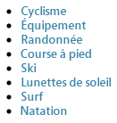
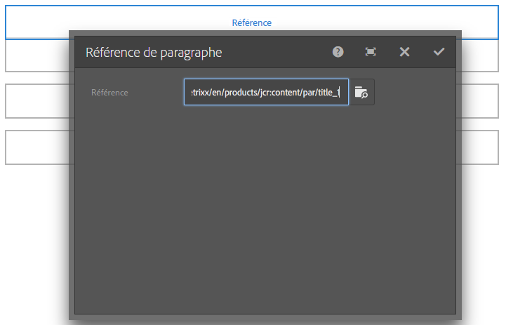
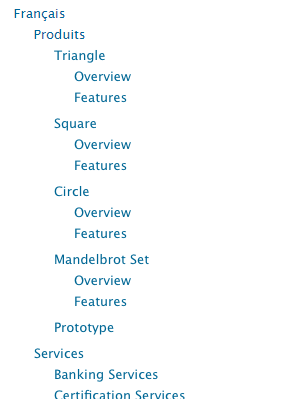
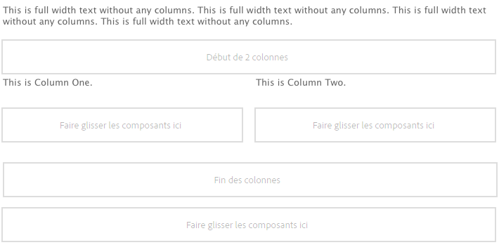
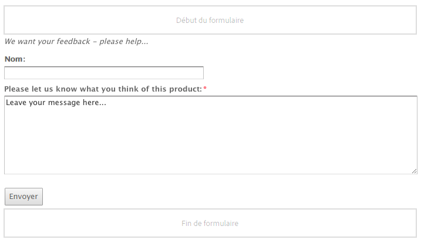
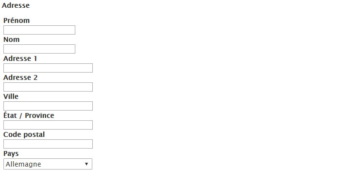

# Composants de base{#foundation-components}

>[!CAUTION]
>
>AEM 6.4 a atteint la fin de la prise en charge étendue et cette documentation n’est plus mise à jour. Pour plus d’informations, voir notre [période de support technique](https://helpx.adobe.com/fr/support/programs/eol-matrix.html). Rechercher les versions prises en charge [here](https://experienceleague.adobe.com/docs/?lang=fr).

>[!NOTE]
>
>Cette section décrit les composants de base, qui sont disponibles avec AEM pour de nombreuses versions et sont disponibles clé en main dans une installation standard d’AEM. Cependant, certains composants de base ont été abandonnés avec AEM 6.4.
>
>Adobe recommande d’utiliser les éléments les plus modernes et les plus extensibles [composants principaux](https://helpx.adobe.com/experience-manager/core-components/using/authoring.html). Ils sont inclus dans l’[échantillon de contenu We.Retail](/help/sites-developing/we-retail.md) et peuvent également être [installés séparément et utilisés pour le développement](https://helpx.adobe.com/experience-manager/core-components/using/using.html) par votre administrateur.

Les composants de base ont été conçus pour être utilisés lors de la création de contenu d’une page web standard. Ils forment un sous-ensemble des composants prêts à l’emploi pour une installation standard d’AEM.

Certains d’entre eux sont immédiatement accessibles via l’explorateur de composants, d’autres sont également disponibles dans le [mode de conception](/help/sites-authoring/default-components-designmode.md) (si la page est basée sur un modèle statique) ou en [modifiant le modèle](/help/sites-authoring/templates.md) (si la page est basée sur un modèle modifiable).

L’utilisation des composants de base est prise en charge, mais ils ont été remplacés par des composants principaux qui offrent plus d’extensibilité et de flexibilité.

>[!NOTE]
>
>Cette section ne traite que des composants disponibles « prêts à l’emploi » dans une installation AEM standard.
>
>En fonction de votre instance, vous disposez peut-être de composants personnalisés développés explicitement pour vos besoins. Ces composants peuvent même avoir le même nom que certains composants traités ici.

Les composants sont disponibles sur la page **Composants** dans le panneau latéral de l’éditeur de page lorsque [modification d’une page](/help/sites-authoring/editing-content.md).

Vous pouvez sélectionner un composant et le faire glisser vers l’emplacement souhaité sur votre page. Vous pouvez ensuite la modifier à l’aide de :

* [Configurer les propriétés](/help/sites-authoring/editing-page-properties.md)
* [Modifier le contenu](/help/sites-authoring/editing-content.md)
* [Modifier le contenu - Mode plein écran](/help/sites-authoring/editing-content.md#edit-content-full-screen-mode)

Les composants sont triés selon différentes catégories appelées groupes de composants, notamment :

* [Général](#general): Comprend des composants de base, notamment du texte, des images, des tableaux et des graphiques.
* [Colonnes](#columns): Comprend les composants nécessaires pour organiser la mise en page du contenu.
* [Formulaire](#form): Inclut tous les composants nécessaires à la création d’un formulaire.

## Général {#general}

Les composants Général sont les composants de base que vous utilisez pour créer du contenu.

### Elément de compte {#account-item}

>[!CAUTION]
>Ce composant de base est obsolète. Adobe recommande plutôt l’utilisation des [composants principaux](https://experienceleague.adobe.com/docs/experience-manager-core-components/using/introduction.html?lang=fr).

Vous pouvez définir un lien avec un titre et une description.


### Image adaptative {#adaptive-image}

>[!CAUTION]
>Ce composant de base est obsolète. Adobe recommande d’utiliser la variable [Composant d’image des composants principaux](https://experienceleague.adobe.com/docs/experience-manager-core-components/using/components/image.html?lang=fr) au lieu de .

Le composant d’image adaptative génère des images dimensionnées en fonction de la fenêtre dans laquelle s’ouvre la page web. Pour utiliser le composant, vous devez fournir une image issue du système de fichiers ou du gestionnaire des actifs numériques. Une fois la page web ouverte, le navigateur télécharge une copie de l’image qui a été redimensionnée afin qu’elle convienne à la fenêtre active.

Les caractéristiques suivantes peuvent déterminer la taille de la fenêtre :

* Écran du périphérique : Les périphériques mobiles affichent généralement les pages web afin qu’elles s’étendent sur tout l’écran.
* Taille de la fenêtre du navigateur Web : Les utilisateurs d’ordinateurs portables et de bureau peuvent redimensionner les fenêtres du navigateur web.

Par exemple, le composant génère une petite image lorsque la page web s’ouvre sur un téléphone mobile et une image de taille moyenne sur une tablette. Sur un ordinateur portable, le composant génère une grande image lorsque la page s’ouvre dans un navigateur plein écran. Lorsque le navigateur web est redimensionné pour s’adapter à une partie de l’écran, le composant s’adapte en fournissant une image plus petite et en actualisant l’affichage.

#### Formats d’image pris en charge {#supported-image-formats}

Vous pouvez utiliser des fichiers image des extensions de nom de fichier suivantes avec le composant Image adaptative :

* .jpg
* .jpeg
* .png
* .gif &amp;ast;&amp;ast;

>[!CAUTION]
>
>&amp;ast;&amp;ast; Les fichiers .gif animés ne sont pas pris en charge dans AEM pour les rendus adaptatifs.

#### Tailles et qualité des images {#images-sizes-and-quality}

Le tableau suivant répertorie la largeur de l’image générée en fonction de la largeur de la fenêtre d’affichage. La hauteur de l’image générée est calculée pour préserver le rapport L/H et éviter l’apparition de bandes blanches sur les bords de l’image. Le recadrage peut être utilisé pour éviter les espaces blancs.

Si l’image est au format JPEG, sa qualité peut aussi dépendre de la taille de la fenêtre d’affichage, Les qualités de JPEG suivantes sont possibles :

* Faible (0,42)
* Moyen (0,82)
* Élevée (1,00)

| Plage de largeurs de la fenêtre d’affichage (pixels) | Largeur de l’image (pixels) | Qualité JPEG | Type de périphérique ciblé |
|---|---|---|---|
| largeur &lt;= 319 | 320 | faible |  |
| largeur = 320 | 320 | moyenne | Téléphone mobile (portrait) |
| 320 &lt; largeur &lt; 481 | 480 | moyenne | Téléphone mobile (paysage) |
| 480 &lt; largeur &lt; 769 | 476 | élevé | Tablette (portrait) |
| 768 &lt; largeur &lt; 1 025 | 620 | élevé | Tablette (paysage) |
| largeur &lt;= 1025 | full (taille d’origine) | élevé | Poste de travail |

#### Propriétés {#properties}

La boîte de dialogue permet de modifier les propriétés pour votre instance du composant Image adaptative. Parmi ces propriétés, nombreuses sont celles qui sont communes au composant d’image sur lequel il est basé. Les propriétés sont disponibles dans deux onglets :

* **Image**

   * **Image**

      Faites glisser une image à partir de l’outil de recherche de contenu ou cliquez pour ouvrir une fenêtre de navigation dans laquelle vous pouvez charger une image. Une fois l’image chargée, vous pouvez la recadrer, la faire pivoter ou la supprimer. Pour effectuer un zoom arrière et avant sur l’image, utilisez le curseur situé en dessous de l’image (et au-dessus des boutons OK et Annuler).

   * **Recadrer**

      Recadrer une image. Faites glisser la bordure pour recadrer l’image.

   * **Rotation**

      Cliquez plusieurs fois sur Rotation pour faire pivoter l’image selon vos besoins.

   * **Effacer**
Permet de supprimer l’image actuelle.

* **Avancé**

   * **Titre**

      Le composant Image adaptative n’utilise pas cette propriété.

   * **Texte de remplacement**

      Texte de remplacement à utiliser pour l’image.

   * **Lier à**

      Le composant Image adaptative n’utilise pas cette propriété.

   * **Description**

      Le composant Image adaptative n’utilise pas cette propriété.

#### Extension du composant d’image adaptative {#extending-the-adaptive-image-component}

Pour plus d’informations sur la personnalisation du composant Image adaptative, voir [Présentation du composant d’image adaptative](/help/sites-developing/responsive.md#using-adaptive-images).

### Carrousel {#carousel}

Le composant Carrousel vous permet d’afficher des images associées à des pages individuelles :

* un à la fois
* pour une courte période
* dans un ordre que vous spécifiez
* avec un délai que vous spécifiez

Les commandes cliquables permettent également à l’utilisateur de parcourir les pages affichées en temps réel, à la demande. Cliquez sur l’image de page actuellement visible pour accéder à cette page. En d’autres termes, le carrousel agit comme une commande de navigation.

#### Propriétés {#properties-1}

Ces onglets sont disponibles dans deux onglets :

* **Carrousel**

   Vous indiquez ici le fonctionnement du carrousel :

   * Vitesse de lecture

      Durée en millisecondes avant l’affichage de la diapositive suivante.

   * Temps de transition

      Durée en millisecondes de la transition entre deux diapositives.

   * Type des commandes

      Différentes options sont disponibles dans un menu déroulant. par exemple, boutons Aperçu / Suivant, commutateurs de haut à droite.

* **Liste**

   Vous spécifiez ici la manière dont les pages sont incluses dans votre carrousel :

   * **Construire la liste avec**

      Il existe plusieurs façons de créer une liste de pages : Pages enfants, Liste fixe, Recherche ou Recherche avancée (toutes décrites ci-dessous).

      Notez que quelle que soit la méthode choisie, les pages que vous incluez dans votre liste doivent déjà être associées à une image. C’est cette image qui s’affichera dans le carrousel. S’il n’existe aucune image pour une page donnée sous les Propriétés de page de cette page, vous devez associer une image à la page avant de commencer, car dans le cas contraire, le carrousel affichera une page vierge (ou presque vide). Voir [Modification des propriétés de page](/help/sites-authoring/editing-page-properties.md).

      Selon l’élément choisi, un nouveau panneau s’affiche :

      * **Options des pages enfants**

         * **Page parente**
Spécifiez un chemin d’accès manuellement ou à l’aide du sélecteur. Laissez vide pour utiliser la page actuelle comme page parente.
      * **Options de la liste fixe**

         * **Pages**
Sélectionnez une liste de pages. Utilisez 
`+` pour ajouter d’autres entrées et les boutons haut/bas pour ajuster l’ordre.
      * **Options de recherche**

         * **Démarrer dans**

            Spécifiez un chemin de départ manuellement ou à l’aide du sélecteur.

         * **Requête de recherche**

            Vous pouvez entrer une requête de recherche en texte brut.
      * **Options de la recherche avancée**

         * **Notation des prédicats de QueryBuilder**

            Vous pouvez saisir une requête de recherche à l’aide de la notation de prédicat de QueryBuilder. Par exemple, vous pouvez saisir « fulltext=Marketing » pour que toutes les pages comportant « Marketing » dans leur contenu s’affichent dans le carrousel.

            Consultez [API QueryBuilder](/help/sites-developing/querybuilder-api.md) pour découvrir une étude complète sur les expressions de requête et d’autres exemples.
   * **Classer par**

      Sélectionner `jcr:title`, `jcr:created`, `cq:lastModified`ou `cq:template` dans le menu déroulant.

   * **Limite**

      le nombre maximal d’éléments que vous souhaitez utiliser dans le carrousel ; cette option est facultative.


>[!NOTE]
>
>Vous pouvez créer un composant de carrousel personnalisé pour Adobe Experience Manager qui affiche les ressources numériques situées dans la gestion des actifs numériques AEM. Pour plus d’informations, voir [Création de composants de carrousel personnalisés pour Adobe Experience Manager](https://experienceleague.adobe.com/docs/experience-manager-learn/getting-started-wknd-tutorial-develop/overview.html?lang=fr&amp;CID=RedirectAEMCommunityKautuk).

### Graphique {#chart}

Le composant Graphique vous permet d’ajouter un graphique à barres, en courbes ou en secteurs. AEM crée un graphique à partir des données que vous fournissez. Vous fournissez des données en les saisissant directement dans l’onglet Données ou en copiant et en collant une feuille de calcul.

* **Données**

   * **Données de graphique**

      Entrez vos données de graphique au format CSV ; Le format Valeurs séparées par des virgules utilise des virgules (&quot;,&quot;) comme séparateur de champ.

* **Avancé**

   * **Type de graphique**

      Effectuez une sélection depuis Diagramme circulaire, Graphique en courbes et Graphique en barres.

   * **Texte de remplacement**

      Texte de remplacement qui s’affiche à la place du graphique.

   * **Largeur**

      Largeur du graphique en pixels.

   * **Hauteur**

      Hauteur du graphique en pixels.

L’exemple suivant illustre des données de graphique suivies de l’histogramme qui en résulte :

 

>[!NOTE]
>
>Vous pouvez créer un contrôle graphique d’AEM personnalisé qui affiche les données situées dans AEM JCR. Pour plus d’informations, voir [Affichage des données Adobe Experience Manager dans un graphique](https://helpx.adobe.com/experience-manager/using/displaying-experience-manager-data-chart.html).

### Fragment de contenu {#content-fragment}

[Fragments de contenu](/help/sites-authoring/content-fragments.md) sont créées et gérées en tant que ressources indépendantes de la page. Vous pouvez ensuite utiliser ces fragments et leurs variantes lors de la création de vos pages de contenu.

### Importateur de conception {#design-importer}

Vous pouvez ainsi charger un fichier zip contenant un module de conception.

### Télécharger {#download}

Le composant Télécharger crée un lien dans la page web sélectionnée pour télécharger un fichier spécifique. Vous pouvez soit faire glisser une ressource à partir de l’outil de recherche de contenu, soit charger un fichier.

* **Télécharger**

   * **Description**

      Courte description affichée avec le lien de téléchargement.

   * **File**

      Fichier pouvant être téléchargé sur la page web obtenue. Faites glisser une ressource à partir de l’outil de recherche de contenu ou cliquez sur la zone pour télécharger le fichier à télécharger.

L’exemple suivant montre le composant Télécharger dans Geometrixx :


### Externe {#external}

Le composant d’intégration d’application externe (**Externe**) permet d’incorporer des applications externes dans une page AEM en utilisant un iframe.

* **Externe**

   * **Application cible**

      Indiquez l&#39;URL de l&#39;application web à intégrer. par exemple :

      ```
      https://en.wikipedia.org/wiki/Main_Page
      ```

   * **Transmettre les paramètres**

      Cochez la case correspondant aux paramètres à transmettre à l’application, le cas échéant.

   * **Largeur et hauteur**

      Définissez la taille de l’iframe.

L’application externe est intégrée au système de paragraphes de la page AEM, par exemple, lorsque vous utilisez une application cible de `https://en.wikipedia.org/wiki/Main_Page` :


>[!NOTE]
>
>Selon votre cas d’utilisation, d’autres options sont disponibles pour l’intégration d’applications externes, par exemple. la valeur [Intégration de portlets](/help/sites-administering/aem-as-portal.md).

### Modèle  {#flash}

>[!CAUTION]
>Ce composant de base est obsolète. Adobe recommande plutôt l’utilisation des [composants principaux](https://experienceleague.adobe.com/docs/experience-manager-core-components/using/introduction.html?lang=fr).

>[!CAUTION]
>
>Ce composant n’est plus censé fonctionner sans nécessiter une personnalisation détaillée au niveau du projet.

Le composant Flash vous permet de charger une animation Flash. Vous pouvez faire glisser une ressource Flash de l’outil de recherche de contenu sur le composant, ou vous pouvez utiliser la boîte de dialogue :

* **Flash**

   * **Animation Flash**

      Fichier d’animation Flash. Faites glisser une ressource à partir de l’outil de recherche de contenu ou cliquez pour ouvrir une fenêtre de navigation.

   * **Taille**

      Dimensions en pixels de la zone d’affichage contenant l’animation.

* **Image de remplacement**

   Autre image à afficher.

* **Avancé**

   * **Menu contextuel**

      Indique si le menu contextuel doit être affiché ou masqué.

   * **Mode Fenêtre**

      Permet de spécifier comment la fenêtre doit apparaître (opaque, transparente ou comme une fenêtre distincte, par exemple).

   * **Couleur d’arrière-plan**

      Couleur de fond sélectionnée à partir de la palette de couleurs fournie.

   * **Version minimale**

      Version minimale d’Adobe Flash Player requise pour exécuter l’animation. La valeur par défaut est 9.0.0.

   * **Attributs**

      Tous les autres attributs requis.

### Image {#image}

Le composant Image affiche une image et le texte qui l’accompagne selon les paramètres définis.

Vous pouvez télécharger une image, puis la modifier et la manipuler (par exemple, la recadrer, la faire pivoter ou y ajouter un lien/titre/texte).

Vous pouvez faire glisser et déposer une image à partir du [Explorateur de ressources](/help/sites-authoring/author-environment-tools.md#assets-browser) directement sur le composant ou son [Boîte de dialogue de configuration](/help/sites-authoring/editing-content.md#component-edit-dialog). Vous pouvez également télécharger une image à partir de la boîte de dialogue Configurer ; cette boîte de dialogue contrôle également toutes les définitions et la manipulation de l’image :


Une fois l’image chargée (et pas avant), utilisez la [modification statique](/help/sites-authoring/editing-content.md#edit-content) pour recadrer/faire pivoter l’image si nécessaire :


>[!NOTE]
>
>L’éditeur statique utilise la taille et les proportions d’origine de l’image lors de l’édition. Vous pouvez également spécifier des propriétés de hauteur et de largeur. Toute restriction de taille et de proportion définie dans les propriétés est appliquée lorsque vous enregistrez vos modifications.
>
>Selon votre instance, des restrictions minimales et maximales peuvent aussi être imposées par la [conception de la page](/help/sites-developing/designer.md). Ces restrictions sont développées lors de la mise en œuvre du projet.

Différentes autres options sont disponibles en mode Plein écran. Par exemple, Carte et Zoom :


>[!NOTE]
>
>Internet Explorer ne permet pas de surveiller la progression du chargement.
>
>Les utilisateurs d’Internet Explorer doivent charger l’image, cliquer sur **OK**, puis rouvrir l’image pour afficher le fichier chargé dans l’aperçu et être en mesure d’y apporter des modifications (un recadrage, par exemple).
>
>Voir [Plateformes prises en charge](/help/release-notes/release-notes.md#supported-platforms) pour plus d’informations sur les fonctionnalités de HTML5 utilisées par AEM.

Lorsqu’une image est chargée, vous pouvez configurer ce qui suit :

* **Map**

   Pour mapper une image, sélectionnez Mapper. Vous pouvez spécifier ensuite comment créer la zone cliquable (rectangle, polygone, etc.) et l’emplacement sur lequel la zone doit pointer.

* **Recadrer**

   Sélectionnez recadrer pour effectuer un recadrage d’une image. Utilisez la souris pour effectuer le recadrage.

* **Rotation**

   Pour faire pivoter une image, sélectionnez Rotation. Répétez l’opération jusqu’à ce que l’image ait pivoté comme vous le souhaitez.

* **Effacer**

   Permet de supprimer l’image actuelle.

* **Titre**

   Titre de l’image.

* **Texte de remplacement**

   Texte de remplacement à utiliser lors de la création de contenu accessible.

* **Lier à**

   Créez un lien vers les ressources ou d’autres pages de votre site Web.

* **Description**

   Description de l’image.

* **Taille**

   Permet de définir la hauteur et la largeur de l’image.

>[!NOTE]
>
>Certaines options ne sont disponibles que dans l’éditeur plein écran.

L’image finale (avec son **Titre** et sa **Description**) peut s’afficher comme suit :


### Conteneur de disposition {#layout-container}

Ce composant fournit un système de paragraphes/grille qui permet d’ajouter et de positionner des composants dans une [grille réactive](/help/sites-authoring/responsive-layout.md). Vous pouvez ainsi définir différentes dispositions de contenu selon la largeur des périphériques cibles (téléphones, tablettes et ordinateurs de bureau, notamment).


>[!NOTE]
>
>Ce composant a été mis en œuvre avec le [langage de modèle HTML (HTL)](https://helpx.adobe.com/fr/experience-manager/htl/user-guide.html).

### Liste {#list}

Le composant Liste vous permet de configurer des critères de recherche pour l’affichage d’une liste :

* **Liste**

   * **Construire la liste avec**

      Vous indiquez ici où la liste doit récupérer son contenu. Il existe plusieurs méthodes :

   * Selon l’élément choisi, un nouveau panneau s’affiche :

      * **Options des pages enfants**

         * **Enfants de** (Page parente)

            Spécifiez un chemin manuellement ou à l’aide du sélecteur. Laisser ce champ vide pour utiliser la page active en tant que Parent.
      * **Options de la liste fixe**

         * **Pages**

            Sélectionnez une liste de pages. Utilisez + pour ajouter d’autres entrées et les boutons haut/bas pour ajuster l’ordre.
      * **Options de recherche**

         * **Démarrer dans**

            Spécifiez un chemin de départ manuellement ou à l’aide du sélecteur.

         * **Requête de recherche**

            Vous pouvez entrer une requête de recherche en texte brut.
      * **Options de la recherche avancée**

         * **Notation des prédicats de QueryBuilder**

            Vous pouvez saisir une requête de recherche à l’aide de la notation de prédicat de QueryBuilder. Par exemple, vous pouvez saisir « fulltext=Marketing » pour que toutes les pages comportant « Marketing » dans leur contenu s’affichent dans le carrousel.

            Consultez [API QueryBuilder](/help/sites-developing/querybuilder-api.md) pour découvrir une étude complète sur les expressions de requête et d’autres exemples.
      * **Balises**

         Permet de spécifier la **Page parente**, les **Tags / Mots-clés** et les critères de correspondance.
   * **Afficher comme**

      Permet de spécifier comment les éléments doivent être répertoriés (Liens, Teasers et Actualités).

   * **Classer par**

      Permet de spécifier si la liste doit être classée. Si c’est le cas, indique les critères à utiliser pour le tri. Vous pouvez saisir un critère ou en sélectionner un dans la liste déroulante fournie à cet effet.

   * **Limite**

      Permet de spécifier le nombre maximal d’éléments à afficher dans la liste.

   * **Activer le flux**

      Indique si un flux RSS doit être activé pour la liste.

   * **Paginer après**

      Vous pouvez indiquer ici le nombre d’éléments de la liste à afficher simultanément. Une liste comportant plus d’éléments que ce qui est spécifié utilise la pagination pour afficher la liste en plusieurs parties.


L’exemple suivant illustre un composant **Liste** affichant une liste de pages enfants. La conception est contrôlée par les définitions CSS personnalisées d’une conception de site.



### Connexion {#login}

>[!CAUTION]
>Ce composant de base est obsolète. Adobe recommande plutôt l’utilisation des [composants principaux](https://experienceleague.adobe.com/docs/experience-manager-core-components/using/introduction.html?lang=fr).

>[!CAUTION]
>
>Ce composant n’est plus censé fonctionner sans nécessiter une personnalisation détaillée au niveau du projet.

Ces options fournissent les champs de nom d’utilisateur et de mot de passe.


Vous pouvez configurer :

* Se connecter

   * Libellé de section

      Texte d’introduction pour les champs de saisie.

   * Libellé du nom de l’utilisateur

      Texte pour étiqueter le champ de nom d’utilisateur.

   * Libellé du mot de passe

      Texte pour étiqueter le champ du mot de passe.

   * Libellé du bouton Se connecter

      Texte du bouton de connexion.

   * Rediriger vers

      Vous pouvez spécifier la page de votre site Web qui doit s’ouvrir une fois l’utilisateur connecté.

* Déjà connecté

   * Libellé du bouton Continuer

      Texte indiquant que l’utilisateur est déjà connecté.

### Statut de la commande {#order-status}

>[!CAUTION]
>
>Ce composant n’est plus censé fonctionner sans nécessiter une personnalisation détaillée au niveau du projet.

* **Titre**

   * **Titre**

      Spécifiez le texte du titre à afficher.

   * **Lien**

      Spécifiez la page (produit) pour laquelle le statut de la commande doit être affiché.

   * **Type / Taille**

      Faites votre choix dans la sélection fournie.


### Référence {#reference}

Le **Référence** vous permet de référencer du texte à partir d’une autre page de votre site web AEM (dans l’instance active). Le contenu du paragraphe référencé s’affiche alors comme s’il se trouvait sur la page active. Le contenu est mis à jour lorsque le paragraphe source est modifié (une actualisation de la page peut s’avérer nécessaire).

* **Référence de paragraphe**

   * **Référence**

      Spécifiez le chemin d’accès à la page et au paragraphe à référencer (y compris le contenu).

Pour spécifier le chemin d’accès à un paragraphe, vous devez le suffixer (vers la page) avec :

`.../jcr:content/par/<paragraph-ID>`

Par exemple :

`/content/geometrixx-outdoors/en/equipment/biking/cajamara/jcr:content/par/similar-products`

Outre qu’il référence un paragraphe spécifique, le chemin peut également être modifié pour spécifier un système de paragraphes entier. Pour ce faire, vous pouvez suffixer le chemin avec :

`/jcr:content/par`

Par exemple :

`/content/geometrixx-outdoors/en/equipment/biking/cajamara/jcr:content/par`

Une fois configuré, le contenu s’affiche exactement comme sur la page source. Le fait qu’il s’agisse d’une référence n’apparaît que lorsque vous ouvrez le composant pour le modifier :



### Rechercher {#search-features}

>[!CAUTION]
>Ce composant de base est obsolète. Adobe recommande plutôt l’utilisation du [composant principal Recherche rapide](https://experienceleague.adobe.com/docs/experience-manager-core-components/using/components/quick-search.html?lang=fr).

Le composant Rechercher offre des capacités de recherche à votre page.

Vous pouvez configurer :

* Rechercher

   * **Types de nœuds**

      Si la recherche doit se limiter à un type de nœud spécifique, indiquez-le ici. Par exemple, `cq:Page`.

   * **Chemin d’accès de la recherche**

      Indiquez la page racine de la branche que vous souhaitez rechercher.

   * **Texte du bouton de recherche**

      Nom affiché sur le bouton de recherche actuel.

   * **Texte des statistiques**

      Texte affiché au-dessus des résultats de la recherche.

   * **Texte Aucun résultat**

      Si la recherche ne renvoie aucun résultat, le texte entré ici est affiché.

   * **Vérifier l’orthographe du texte**

      Si une personne saisit un terme similaire, ce texte est affiché devant le terme.

      Par exemple, si vous saisissez geometrixxe, le système affiche « Vouliez-vous dire : geometrixx ».

   * **Texte Pages similaires**

      Texte affiché à côté d’un résultat pour des pages similaires. Cliquez sur ce lien pour afficher les pages comportant du contenu similaire.

   * **Texte Recherches connexes**

      Texte affiché à côté des recherches de termes et sujets associés.

   * **Texte Tendances des recherches**

      Titre situé au-dessus des termes de recherche saisis par les utilisateurs.

   * **Libellé Pages de résultats**

      Texte qui apparaît en bas de cette liste avec des liens vers d’autres pages de résultats.

   * **Libellé Précédent**

      Nom qui apparaît sur le lien vers les pages de recherche précédentes.

   * **Libellé Suivant**

      Nom qui apparaît sur le lien vers les pages de recherche suivantes.

L’exemple ci-dessous montre le composant Recherche après une recherche du mot *geometrixx* dans le répertoire racine d’une installation standard. Il présente également la pagination des résultats :


L’exemple suivant montre un terme de recherche mal orthographié et non disponible :


### Plan du site {#sitemap}

>[!CAUTION]
>Ce composant de base est obsolète. Adobe recommande plutôt d’utiliser les composants principaux [Navigation](https://experienceleague.adobe.com/docs/experience-manager-core-components/using/components/navigation.html?lang=fr), [Navigation de langue](https://experienceleague.adobe.com/docs/experience-manager-core-components/using/components/language-navigation.html?lang=fr) et [Chemin de navigation](https://experienceleague.adobe.com/docs/experience-manager-core-components/using/components/breadcrumb.html?lang=fr).

Liste automatique du plan du site qui (avec les paramètres par défaut) répertorie toutes les pages (sous forme de liens actifs) du site Web actuel. Par exemple (extrait) :



Si nécessaire, vous pouvez configurer l’option suivante :

* **Plan du site**

   * **Chemin racine**

      Chemin d’accès à partir duquel la liste doit commencer.

### Slideshow {#slideshow}

>[!CAUTION]
>Ce composant de base est obsolète. Adobe recommande plutôt l’utilisation du [composant principal Carrousel](https://experienceleague.adobe.com/docs/experience-manager-core-components/using/components/carousel.html?lang=fr).

>[!CAUTION]
>
>Ce composant n’est plus censé fonctionner sans nécessiter une personnalisation détaillée au niveau du projet.

Ce composant vous permet de charger une série d’images à afficher sous forme de diaporama dans la page. Vous pouvez ajouter ou supprimer des images et leur attribuer un titre. Sous Avancé , vous pouvez également spécifier la taille de la zone d’affichage.

Vous pouvez configurer :

* **Diapositives**

   * **Nouvelle diapositive**

      Spécifiez une sélection de diapositives à l’aide des boutons **Ajouter** (et **Supprimer**).

   * **Titre**

      Indiquez un titre si nécessaire. Celui-ci est superposé sur la diapositive appropriée.

* **Avancé**

   * **Taille**

      Permet de spécifier la largeur et la hauteur en pixels.

Le composant Diaporama affiche ensuite de façon répétée chaque image en séquence pendant une courte durée, avant de passer en fondu à la diapositive suivante :


### Tableau {#table}

>[!CAUTION]
>Ce composant de base est obsolète. Adobe recommande plutôt l’utilisation du [composant principal Texte](https://experienceleague.adobe.com/docs/experience-manager-core-components/using/components/text.html?lang=fr).

>[!NOTE]
>
>Le **Tableau** est basé sur la variable [Éditeur de texte enrichi](/help/sites-authoring/rich-text-editor.md), comme l’est la variable **[Texte](#text)** composant.
>
>Il est recommandé d’utiliser la variable **Tableau** pour les tableaux, bien qu’ils puissent également être construits avec la propriété **Texte** composant.

Le **Tableau** est préconfiguré pour vous permettre de créer, de remplir et de mettre en forme un tableau. La boîte de dialogue vous permet de configurer votre tableau et de créer le contenu en effectuant l’une des opérations suivantes :

* à partir de zéro
* en copiant-collant une feuille de calcul ou un tableau à partir d’un éditeur externe (Excel, OpenOffice, Bloc-notes, etc.).

Vous pouvez apporter des modifications standard au contenu à l’aide de l’éditeur intégré :


En mode Plein écran, vous pouvez configurer la disposition du tableau :


La capture d’écran ci-après illustre l’utilisation du composant Tableau (la conception est déterminée par le CSS propre au site) :


### Nuage de balises {#tag-cloud}

Un nuage de balises affiche une sélection des balises appliquées au contenu de votre site web sous forme graphique :


Lorsque vous configurez le composant Nuage de balises, vous pouvez spécifier les options suivantes :

* **Balises à afficher**

   Emplacement à partir duquel les balises à afficher sont rassemblées. Faites votre choix entre une page, une page avec tous les enfants ou toutes les balises.

* **Page**

   Sélectionnez la page à référencer.

* **Aucun lien sur les balises**

   Permet de spécifier si les balises affichées doivent se comporter comme des liens.

Pour plus d’informations sur l’application de balises, voir [Utilisation des balises](/help/sites-authoring/tags.md).

### Texte {#text}

>[!NOTE]
>
>Le **Texte** est basé sur la variable [Éditeur de texte enrichi](/help/sites-authoring/rich-text-editor.md), comme l’est la variable **[Tableau](#table)** composant.
>
>Il est recommandé d’utiliser la variable **Tableau** pour les tableaux, bien qu’ils puissent également être construits avec la propriété **Texte** composant.

Le composant Texte vous permet de saisir un bloc de texte à l’aide d’un éditeur WYSIWYG, avec une fonctionnalité fournie par l’[éditeur de texte enrichi](/help/sites-authoring/rich-text-editor.md). Une série d’icônes vous permettent de mettre le texte en forme (police, alignement, liens, listes et mise en retrait).


Lorsque vous ouvrez la **boîte de dialogue de configuration**, vous pouvez également définir les éléments suivants :

* **Espacement**
* **Style de texte**

Le texte formaté s’affiche alors sur la page ; la conception réelle dépendra du CSS du site :


Pour plus d’informations sur le composant Texte et les fonctions de l’éditeur de texte enrichi, reportez-vous à la page [Éditeur de texte enrichi](/help/sites-authoring/rich-text-editor.md).

#### Édition statique {#inplace-editing}

Outre le mode d’édition de texte enrichi basé sur la boîte de dialogue, AEM propose un mode d’[édition statique](/help/sites-authoring/editing-content.md) qui permet l’édition directe du texte tel qu’il est affiché dans la disposition.

### Texte et Image {#text-image}

Le composant Texte et image permet d’ajouter un bloc de texte et une image. Vous pouvez également ajouter et modifier du texte et des images séparément. Voir [Texte](#text) et [Image](#image) composants pour plus de détails.


Vous pouvez configurer :

* **Styles de composant** (**Styles**)

   Vous pouvez aligner ici l’image à droite ou à gauche. Le paramètre par défaut est aligné à **Gauche**, avec l’image à gauche.

* **Propriétés de l’image** (**Propriétés d’image avancées**)

   Sous cet onglet, vous pouvez spécifier les paramètres suivants :

   * **Ressource image**

      Téléchargez l’image requise.

   * **Titre**

      Le titre du bloc ; s’affiche lorsque vous pointez dessus.

   * **Texte de remplacement**

      Texte de remplacement à afficher lorsque l’image ne peut pas être affichée. Si rien n’est indiqué, le titre est utilisé.

   * **Lier à**

      Spécifiez un chemin cible.

   * **Description**

      Description de l’image.

   * **Taille**

      Définit la hauteur et la largeur de l’image.

L’exemple suivant illustre un composant Texte et image avec l’image alignée sur la gauche :


### Titre {#title}

Le composant Titre peut effectuer l’une des opérations suivantes :

* afficher le nom de la page active ; pour ce faire, laissez le champ Titre vide.
* afficher un texte que vous indiquez dans le champ Titre .

Vous pouvez configurer :

* **Titre**
Si vous souhaitez utiliser un autre nom que le titre de la page, saisissez-le ici.

* **Lien**
URI si le titre doit servir de lien.

* **Type/Taille**
Sélectionnez Petit ou Grand dans la liste déroulante. Petit est généré en tant qu’image. L’option Grand est générée sous forme de texte.

L’exemple suivant illustre une **Titre** composant affiché ; la conception est déterminée par le CSS spécifique au site.


### Vidéo {#video}

>[!CAUTION]
>
>Ce composant n’est plus censé fonctionner sans nécessiter une personnalisation détaillée au niveau du projet.

Le **Vidéo** vous permet de placer un élément vidéo prédéfini prêt à l’emploi sur une page.

Voir aussi [Configuration du composant Vidéo](/help/sites-administering/config-video.md) à utiliser avec les éléments HTML5.

Après avoir placé une instance du composant sur votre page, vous pouvez configurer les éléments suivants :

* Vidéo

   * **Ressource vidéo**

   Transférez ou déposez la ressource vidéo.

   * **Taille**

      La taille native de la vidéo (largeur x hauteur en pixels) s’affiche dans les cases en regard de la Taille (voir ci-dessus). Saisissez ici manuellement la largeur et la hauteur pour remplacer les dimensions natives de la vidéo. Cliquez sur **OK** pour faire disparaître la boîte de dialogue.


>[!NOTE]
>
>Les formats pris en charge sont les suivants :
>
>* `.mp4`
>* `Ogg`
>* `FLV` (Flash video)
>


## Colonnes {#columns}

Les colonnes sont un mécanisme permettant de contrôler la mise en page du contenu dans AEM. Dans une installation standard, des composants pour créer deux et/ou trois colonnes sont fournis.

L’exemple suivant illustre le composant 2 colonnes utilisé. Vous pouvez utiliser des espaces réservés pour les nouveaux composants :



### 2 colonnes {#columns-1}

Composant Contrôle de colonne qui utilise par défaut 2 colonnes égales.

### 3 colonnes {#columns-2}

Composant Contrôle de colonne qui utilise par défaut 3 colonnes égales.

### Contrôle de colonne {#column-control}

Le composant Contrôle de colonne permet aux utilisateurs de sélectionner la manière dont ils souhaitent fractionner le contenu du panneau principal de la page web en plusieurs colonnes. Les utilisateurs peuvent sélectionner le nombre de colonnes requis (dans une liste prédéfinie), puis créer, supprimer ou déplacer du contenu dans chacune des colonnes.

* **Contrôle de colonne**

   * **Disposition des colonnes**

      Sélectionnez le nombre de colonnes à afficher. Une fois créée, chaque colonne dispose de son propre lien pour faire glisser des composants ou des ressources lors de l’ajout de contenu.

## Formulaire {#form}

Les composants Formulaire servent à créer des formulaires permettant aux visiteurs d’envoyer leur saisie. Les composants Forms et de formulaire peuvent être utilisés pour collecter des informations, notamment les commentaires des utilisateurs (par exemple, un questionnaire de satisfaction client) et des informations sur les utilisateurs (par exemple, l’enregistrement des utilisateurs).

>[!NOTE]
>
>Voir [Aide d’AEM Forms](/help/forms/home.md) pour plus d’informations sur AEM Forms.

Forms est constitué de plusieurs composants différents :

* **Formulaire**

   Le composant Formulaire définit le début et la fin d’un nouveau formulaire dans la page. D’autres composants peuvent ensuite être placés entre ces éléments, tels que des tableaux, des téléchargements, etc.

* **Champs et éléments de formulaire**

   Les champs et éléments de formulaire comprennent par exemple les zones de texte, les cases d’option, les images, etc. L’utilisateur exécute souvent une action dans un champ de formulaire (saisie de texte, par exemple). Pour plus d’informations, reportez-vous à la section Eléments de formulaire individuels .

* **Composants de profil**

   Les composants de profil se rapportent aux profils du visiteur utilisés pour la collaboration sociale et d’autres domaines dans lesquels la personnalisation des visiteurs est requise.

Vous trouverez ci-dessous un exemple de formulaire constitué du composant **Formulaire** (début et fin) avec deux champs de **texte de formulaire** pour la saisie et un champ de **texte général** pour le texte d’introduction, ainsi qu’un bouton **Envoyer**.



>[!NOTE]
>
>Vous trouverez des informations sur le développement et la personnalisation des formulaires à la [page de développement de formulaires](/help/sites-developing/developing-forms.md). Ces informations concernent l’ajout d’actions, de contraintes, le préchargement de champs et l’utilisation de scripts pour lancer un appel à l’action par un service, entre autres.

### Paramètres communs à (plusieurs) composants de formulaire {#settings-common-to-many-form-components}

Bien que chacun des composants de formulaire ait un objectif différent, la plupart sont composés d’options et de paramètres similaires.

Lors de la configuration de l’un des composants de formulaire, les onglets suivants sont disponibles dans la boîte de dialogue :

* **Titre et texte**

   Ici, vous devez spécifier les informations de base, telles que le titre du formulaire et le texte d’accompagnement. Le cas échéant, il vous permet également de définir d’autres informations clés, telles que si le champ peut être sélectionné plusieurs fois et si des éléments peuvent être sélectionnés.

* **Valeurs initiales**

   Permet de spécifier une valeur par défaut.

* **Contraintes**

   Vous pouvez indiquer ici si un champ est obligatoire et y placer des contraintes (par exemple, doit être numérique, etc.).

* **Style**

   Indique la taille et le style des champs.

>[!NOTE]
>
>Les champs affichés varient considérablement en fonction du composant individuel.

Ces onglets vous fournissent les paramètres nécessaires. elles peuvent dépendre du type de composant individuel, mais peuvent inclure :

* **Titre et texte**

   * **Nom de l’élément**

      Nom de l’élément de formulaire. Indique l’emplacement de stockage des données dans le référentiel.

      Ce champ est obligatoire et ne doit contenir que les caractères suivants :

      * caractères alphanumériques
      * `_ . / : -`
   * **Titre**

      Titre affiché avec le champ. Si rien n’est indiqué, le titre par défaut s’affiche.

   * **Description**

      Permet de fournir des informations supplémentaires à l’utilisateur, si nécessaire. Sur le formulaire, cette option est affichée sous le champ, dans une police plus petite que le titre.

   * **Afficher/Masquer**

      Détermine le moment où le champ est visible.


* **Valeurs initiales**

   * **Valeur par défaut**

      La valeur affichée dans le champ à l’ouverture du formulaire ; avant que l’utilisateur n’ait saisi des données.

* **Contraintes**

   * **Requis**

      Dépend du type de composant de formulaire, fournit une ou plusieurs cases à cocher pour indiquer que ce champ ou certaines parties de ce champ sont obligatoires.

   * **Message obligatoire**

      Un message qui informe les utilisateurs que ce champ est obligatoire ; un champ obligatoire est également marqué d’un astérisque.

   * **Contrainte**

      Contraintes disponibles qui dépendent du type de composant de formulaire.

   * **Message de contrainte**

      Message qui informe les utilisateurs de ce qui est obligatoire.

* **Style**

   * **Taille**

      En lignes et en colonnes.

   * **Largeur**

      En pixels.

   * **CSS**

### Formulaire (composant) {#form-component}

Le composant Formulaire définit le début et la fin d’un formulaire à l’aide de la fonction **Début du formulaire** et **Fin de formulaire** éléments . Ils sont toujours associés pour s’assurer que le formulaire est correctement défini.


Entre le début et la fin d’un formulaire, vous pouvez ajouter des composants qui définissent les champs de saisie réels à l’intention des utilisateurs.

>[!NOTE]
>
>Le composant de formulaire des composants de base ne prend en charge que l’utilisation d’autres composants de base Formulaire (bouton, texte, masqué, etc.). L’utilisation des composants de formulaire des [composants principaux](https://experienceleague.adobe.com/docs/experience-manager-core-components/using/introduction.html?lang=fr) dans un formulaire de composant de base (et vice versa) n’est pas prise en charge.

#### Début du formulaire {#start-of-form}

Ce composant est nécessaire pour définir le début d’un nouveau formulaire sur une page. Vous pouvez configurer :

* **Formulaire**

   * **Page de remerciement**

      Page à référencer pour remercier les visiteurs pour leur message. Si rien n’est indiqué, le formulaire s’affiche de nouveau après envoi.

   * **Démarrer le processus**
Détermine le workflow qui est déclenché une fois le formulaire envoyé.

* **Avancé**

   * **Type d’action**
Un formulaire nécessite une action. L’action définit l’opération déclenchée avec les données soumises par l’utilisateur (semblable à action= en langage HTML). Certains ont besoin d’une 
**Configuration de l’action**.

      Plusieurs types d’action sont inclus dans une installation AEM standard :

      * **Demande de compte**
      * **Créer le contenu**
      * **Créer un prospect**
      * **Créer un compte et le mettre à jour**
      * **Service de messagerie électronique : créer un abonné et l’ajouter à la liste**
      * **Service de messagerie électronique : envoyer un message de répondeur automatique**
      * **Service de messagerie électronique : désabonner l’utilisateur de la liste**
      * **Modifier la communauté**
      * **Modifier la (les) ressource(s)**
      * **Modifier la (les) ressource(s) contrôlée(s) du workflow**
      * **Courrier**
      * **Détails de la commande passée**
      * **Mise à jour du profil**
      * **Réinitialiser le mot de passe**
      * **Définir le mot de passe**
      * **Stocker le contenu**

         Il s’agit du type d’action par défaut.

      * **Stocker le contenu avec les chargements**
      * **Envoyer la commande**
      * **Désabonner l’abonné**
      * **Mettre à jour la commande**
   * **Identifiant de formulaire**

      L’identifiant du formulaire l’identifie de façon unique. Utilisez cet identifiant si plusieurs formulaires figurent sur une seule page ; assurez-vous qu’ils présentent des identifiants différents.

   * **Chemin de chargement**

      Chemin d’accès aux propriétés de nœud, utilisé pour charger les valeurs prédéfinies dans les champs du formulaire.

      Il s’agit d’un champ facultatif qui permet de spécifier le chemin à un nœud dans le référentiel. Lorsque ce nœud comporte des propriétés qui correspondent aux noms des champs, les champs adéquats du formulaire sont préchargés avec la valeur de ces propriétés. S’il n’existe aucune correspondance, le champ contient la valeur par défaut.

      Le champ **Chemin de chargement** vous permet de précharger des valeurs dans les champs obligatoires du formulaire. Consultez [Préchargement des valeurs de formulaire](/help/sites-developing/developing-forms.md#preloading-form-values).

   * **Validation du client**

      Indique si la validation du client est requise pour ce formulaire (la validation du serveur est *toujours* effectuée). Cela peut être réalisé conjointement avec la variable **Captcha Forms** composant.

   * **Type de ressource de validation**

      Définit le type de ressource de validation si vous souhaitez valider la totalité du formulaire (et non des champs séparés). Si vous validez le formulaire dans son intégralité, vous devez également inclure l’un des éléments suivants :

      * Un script pour la validation du client

         `/apps/<myApp>/form/<myValidation>/formclientvalidation.jsp`

      * Un script pour la validation du côté serveur

         `/apps/<myApp>/form/<myValidation>/formservervalidation.jsp`
   * **Configuration de l’action**

      Les options disponibles dans **Configuration de l’action** dépendent du **Type d’action** sélectionné :

      * **Demande de compte**

         * **Page Créer un compte**

            Page utilisée lors de la création d’un compte.
      * **Créer le contenu**

         * Chemin d’accès au contenu

            Chemin d’accès à tout type de contenu utilisé par le formulaire. Saisissez un chemin qui se termine par une barre oblique `/`. La barre oblique signifie que, pour chaque port de formulaire, un nouveau nœud est créé à l’emplacement indiqué, par exemple :

            `/forms/feedback/`

         * **Type**

            Sélectionnez le type requis.

         * **Formulaire**

            Spécifiez le formulaire.

         * **Rendu avec**

            Sélectionnez l’option désirée dans la liste.

         * **Type de ressource**

            S’il est défini, il est ajouté à chaque commentaire sous la forme `sling:resourceType`.

         * **Sélecteur d’affichage**
      * **Créer un prospect**

         * **Le prospect sera ajouté à cette liste.**

            Spécifiez la liste de prospects requise.
      * **Créer un compte et le mettre à jour**

         * **Groupe initial**

            Groupe auquel affecter un nouvel utilisateur.

         * **Accueil**

            Page à afficher après une connexion réussie.

         * **Chemin**

            Chemin (relatif) vers l’emplacement de création et de stockage du nouveau compte.

         * **Afficher des données...**

            Cliquez sur ce bouton pour accéder aux informations sur les résultats de formulaire dans l’éditeur en masse. Vous avez alors la possibilité d’exporter les informations vers un fichier `.tsv` (séparé par des tabulations) (en vue de l’utiliser, par exemple, dans une feuille de calcul Excel).
      * **Courrier**

         * **De**

            Saisissez l’adresse électronique d’où doit provenir le courrier électronique.

         * **Envoyer à**

            Saisissez la ou les adresses électroniques auxquelles le formulaire doit être envoyé.

         * **CC**

            Saisissez la ou les adresses électroniques en CC.

         * **CCI**

            Saisissez la ou les adresses email en Cci.

         * **Objet**

            Saisissez l’objet du courrier électronique.
      * **Réinitialiser le mot de passe**

         * **Page Changer le mot de passe**

            Page utilisée lors de la modification du mot de passe.
      * **Stocker le contenu**

         * **Chemin d’accès au contenu**

            Chemin d’accès à tout type de contenu utilisé par le formulaire. Saisissez un chemin qui se termine par une barre oblique `/`. La barre oblique signifie que, pour chaque port de formulaire, un nouveau nœud est créé à l’emplacement indiqué, par exemple :

            `/forms/feedback/`

         * **Afficher des données...**

            Cliquez sur ce bouton pour accéder aux informations sur les résultats de formulaire dans l’éditeur en masse. Vous avez alors la possibilité d’exporter les informations vers un fichier .tsv (séparé par des tabulations) (en vue de l’utiliser, par exemple, dans une feuille de calcul Excel).
      * **Stocker le contenu avec les chargements**

         Cette option présente les mêmes options que **Stocker le contenu**.

      * **Désabonner l’abonné**

         * **Le prospect sera supprimé de cette liste.**

            Spécifiez la liste de prospects requise.


#### Fin de formulaire {#end-of-form}

Ceci marque la fin du formulaire. Vous pouvez configurer les options suivantes :

* **Fin de formulaire**

   * **Afficher le bouton Envoyer**

      Indique si un bouton Envoyer doit être affiché ou non.

   * **Envoyer le nom**

      Identifiant si vous utilisez plusieurs boutons d’envoi dans un formulaire.

   * **Envoyer le titre**

      Nom qui s’affiche sur le bouton, tel que Envoyer ou Envoyer.

   * **Afficher le bouton Réinitialiser**

      Cochez la case pour que le bouton Réinitialiser soit visible.

   * **Réinitialiser le titre**

      Nom qui s’affiche sur le bouton Réinitialiser .

   * **Description**

      Informations qui s’affichent sous le bouton.

### Nom de compte {#account-name}

Ce composant permet à l’utilisateur de saisir un nom de compte :


### Adresse {#address}

Ce composant permet d’ajouter une adresse internationale au format suivant :



Le composant est configuré pour une utilisation immédiate, mais vous pouvez modifier la configuration si nécessaire. Par exemple, des contraintes peuvent être ajoutées pour les éléments individuels de l’adresse. Si vous laissez les champs vides, les paramètres par défaut seront utilisés.

### Captcha {#captcha}

>[!CAUTION]
>Ce composant de base est obsolète. Adobe recommande plutôt l’utilisation des [composants principaux](https://experienceleague.adobe.com/docs/experience-manager-core-components/using/introduction.html?lang=fr).

>[!CAUTION]
>
>Ce composant n’est plus censé fonctionner sans nécessiter une personnalisation détaillée au niveau du projet.

Le composant Captcha requiert que l’utilisateur saisisse une chaîne alphanumérique comme affichée à l’écran. La chaîne change à chaque actualisation.


Vous pouvez configurer différents paramètres pour ce composant, notamment un message à afficher lorsque la chaîne captcha n’est pas valide.

### Groupe de cases à cocher {#checkbox-group}

Une case à cocher vous permet de créer une liste composée d’une ou de plusieurs cases à cocher (plusieurs d’entre elles peuvent être simultanément cochées).


Vous pouvez spécifier différents paramètres, notamment un titre, une description et un nom d’élément. Les boutons + et - vous permettent d’ajouter ou de supprimer des éléments, puis de les positionner à l’aide des flèches haut et bas.

>[!NOTE]
>
>Utilisation **Chemin de chargement des éléments** vous pouvez précharger la liste de groupes de cases à cocher avec des valeurs.
>
>Consultez [Préchargement des champs de formulaire avec de multiples valeurs](/help/sites-developing/developing-forms.md#preloading-form-fields-with-multiple-values).

### Informations de la carte de crédit {#credit-card-details}

>[!CAUTION]
>Ce composant de base est obsolète. Adobe recommande plutôt l’utilisation des [composants principaux](https://experienceleague.adobe.com/docs/experience-manager-core-components/using/introduction.html?lang=fr).

Ce composant vous permet de fournir les champs nécessaires pour saisir les informations de carte de crédit. Vous pouvez le configurer pour spécifier les types de cartes acceptés et les informations requises (par exemple, le code de sécurité).


### Liste déroulante {#dropdown-list}

Une liste déroulante peut être configurée pour fournir à votre utilisation une plage de valeurs à sélectionner :


Vous pouvez spécifier un titre et les éléments à afficher dans la liste. Les boutons + et - vous permettent d’ajouter ou de supprimer des éléments de liste, puis de les positionner à l’aide des boutons Haut et Bas. Vous pouvez indiquer si les utilisateurs sont autorisés à sélectionner plusieurs éléments de la liste, ainsi que tout élément qui doit être automatiquement sélectionné la première fois qu’ils ouvrent la liste (valeurs initiales).

>[!NOTE]
>
>Utilisation **Chemin de chargement des éléments** vous pouvez précharger la liste déroulante avec des valeurs.
>
>Consultez [Préchargement des champs de formulaire avec de multiples valeurs](/help/sites-developing/developing-forms.md#preloading-form-fields-with-multiple-values).

### Chargement du fichier {#file-upload}

Le composant Chargement du fichier fournit à l’utilisateur un moyen pour sélectionner un fichier et le charger.


>[!NOTE]
>
>Vous pouvez créer un composant de chargement personnalisé pour charger des fichiers vers un servlet Sling. Pour plus d’informations, voir [Chargement de fichiers dans Adobe Experience Manager](https://helpx.adobe.com/experience-manager/using/uploading-files-aem1.html).

### Champ masqué {#hidden-field}

Ce composant permet de créer un champ masqué. Ceux-ci peuvent être utilisés à diverses fins, par exemple, lorsque vous devez exécuter une action après avoir soumis le formulaire ou lorsque des données masquées sont nécessaires au post-traitement.


>[!NOTE]
>
>Vous pouvez également personnaliser votre formulaire pour afficher ou masquer des composants de formulaire spécifiques en fonction de la valeur d’autres champs du formulaire. La modification de la visibilité d’un champ de formulaire est utile lorsque le champ n’est nécessaire que dans des conditions spécifiques.
>
>Voir [Affichage et masquage des composants de formulaire](/help/sites-developing/developing-forms.md#showing-and-hiding-form-components).

### Bouton Image {#image-button}

Un bouton d’image permet de créer un bouton comportant vos texte et image :


### Téléchargement de l’image {#image-upload}

Le composant Chargement de l’image fournit à l’utilisateur un moyen pour sélectionner un fichier image et le charger.


### Champ du lien {#link-field}

Le champ Lien permet à l’utilisateur de spécifier une URL.


Le plus souvent utilisé pour le formulaire d’événement de calendrier, où il est utilisé pour le champ URL/lien d’un événement.

### Champ Mot de passe {#password-field}

Ce composant permet à l’utilisateur de saisir son mot de passe :


### Réinitialisation du mot de passe {#password-reset}

Ce composant fournit deux champs à votre utilisateur pour :

* saisie d’un mot de passe
* saisie répétée du mot de passe pour vérifier que la saisie est correcte.

Avec les paramètres par défaut, le composant apparaît comme suit :


### Groupe de cases d’option {#radio-group}

Un groupe de cases d’option fournit une liste composée d’une ou de plusieurs cases d’option (une seule case peut être sélectionnée à un moment donné).

Vous pouvez spécifier le nom de l’élément avec un titre et une description À l’aide des boutons + et - , ajouter ou supprimer des éléments, les positionner avec les flèches haut et bas et spécifier une valeur par défaut si nécessaire :


>[!NOTE]
>
>L’option **Chemin de chargement des éléments** permet de précharger des valeurs dans les cases d’option.
>
>Consultez [Préchargement des champs de formulaire avec de multiples valeurs](/help/sites-developing/developing-forms.md#preloading-form-fields-with-multiple-values).

### Bouton Envoyer {#submit-button}

Ce composant vous permet de créer un bouton Envoyer avec le texte par défaut :


Ou votre propre texte :


### Champ des balises {#tags-field}

Ce champ vous permet de sélectionner des balises :


Vous pouvez spécifier différents paramètres, notamment les espaces de noms, à l’aide de l’onglet spécialisé :

* **Champ de balise**

   * **Espaces de noms autorisés**

      * **Geometrixx Outdoors**
      * **Workflow**
      * **Forum**
      * **Images de photothèque**
      * **Geometrixx Media**
      * **Balises standard**
      * **Marketing**
      * **Propriétés de l’élément**
   * **Largeur en pixels**
   * **Taille de la fenêtre contextuelle**


### Champ de texte {#text-field}

Le champ de texte standard peut être configuré selon la taille et la largeur requises avec votre propre message :


### Bouton d’envoi du workflow {#workflow-submit-button-s}

Permet de créer un bouton Envoyer à utiliser dans un workflow.


