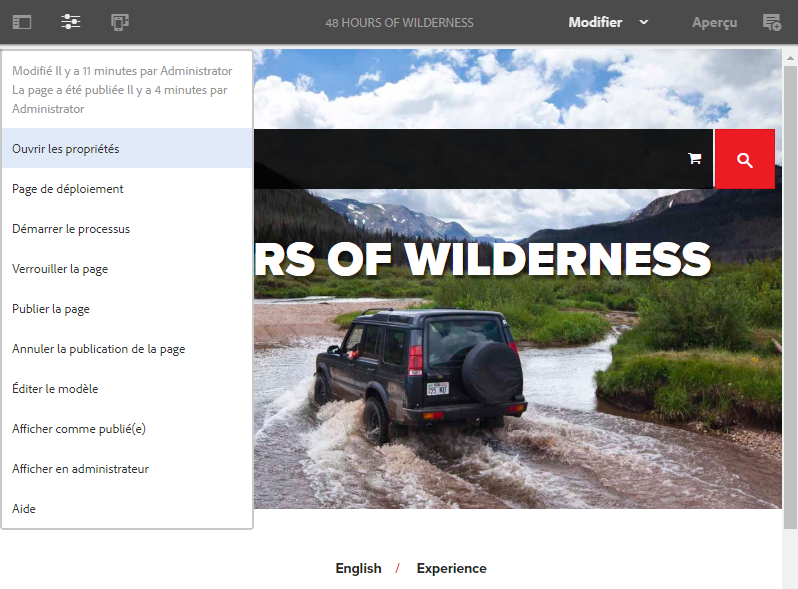
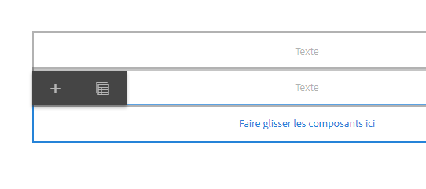
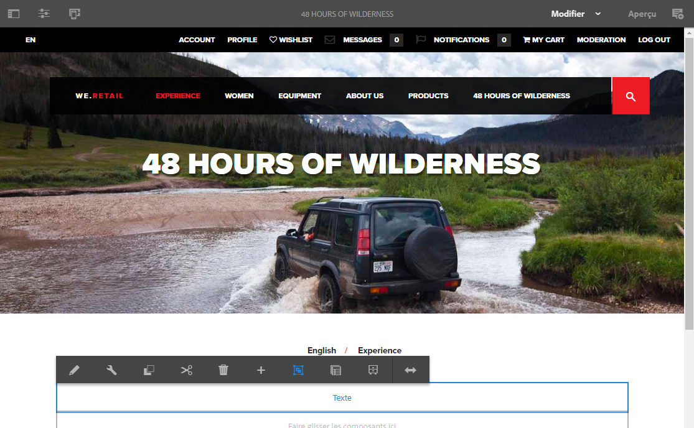

# Modification du contenu de la page{#editing-page-content}

>[!CAUTION]
>
>AEM 6.4 a atteint la fin de la prise en charge étendue et cette documentation n’est plus mise à jour. Pour plus d’informations, voir notre [période de support technique](https://helpx.adobe.com/fr/support/programs/eol-matrix.html). Rechercher les versions prises en charge [here](https://experienceleague.adobe.com/docs/?lang=fr).

Une fois la page créée (une nouvelle page ou dans le cadre d’un lancement ou d’une Live Copy), vous pouvez modifier le contenu pour effectuer toute mise à jour dont vous avez besoin.

Le contenu est ajouté à l’aide de [components](/help/sites-authoring/default-components-console.md) (approprié au type de contenu) qui peut être glissé sur la page. Ils peuvent ensuite être modifiés sur place, déplacés ou supprimés.

>[!NOTE]
>
>Votre compte a besoin de la fonction [droits d’accès appropriés](/help/sites-administering/security.md) et [permissions](/help/sites-administering/security.md#permissions) pour modifier des pages.
>
>En cas de problème, contactez votre administrateur système.

>[!NOTE]
>
>Si votre page et/ou modèle ont été configurés correctement, vous pouvez utiliser la [mise en page réactive](/help/sites-authoring/responsive-layout.md) lors de la modification.

>[!NOTE]
>
>En mode **Édition**, les liens dans votre contenu sont visibles, mais ils ne sont **pas accessibles**. Utilisez le [mode Aperçu](#previewing-pages) pour naviguer en suivant les liens.

## Barre d’outils Page {#page-toolbar}

La barre d’outils Page permet d’accéder à la fonctionnalité appropriée, en fonction de la configuration de la page.

La barre d&#39;outils permet d&#39;accéder à de nombreuses options. Selon votre contexte et votre configuration actuels, certaines options peuvent ne pas être disponibles.

* **Activer/désactiver le panneau latéral**

   Cela ouvre/ferme le panneau latéral, qui contient la balise [Explorateur de ressources](/help/sites-authoring/author-environment-tools.md#assets-browser), [Explorateur de composants](/help/sites-authoring/author-environment-tools.md#components-browser), et [Arborescence de contenu](/help/sites-authoring/author-environment-tools.md#content-tree).

   

* **Informations sur la page**

   Permet d’accéder au [Informations sur la page](/help/sites-authoring/author-environment-tools.md#page-information) menu comprenant les détails de la page et les actions qui peuvent être entreprises sur la page, notamment l’affichage et la modification des informations de la page, l’affichage des propriétés de la page et la publication/annulation de la publication de la page.

   

* **Emulateur**

   Active/désactive la variable [barre d’outils de l’émulateur](/help/sites-authoring/responsive-layout.md#selecting-a-device-to-emulate), qui est utilisé pour émuler l’aspect de la page sur un autre appareil. Cette option est automatiquement basculée en mode de mise en page.

   

* **ContextHub**

   Ouvre la [hub contextuel](/help/sites-authoring/ch-previewing.md). Uniquement disponible en mode Aperçu.

   

* **Titre de la page**

   C&#39;est purement informatif.

   

* **Sélecteur de mode**

   Affiche le [mode](/help/sites-authoring/author-environment-tools.md#page-modes) en cours et vous permet d’en sélectionner un autre, tel que Modifier, Disposition, Timewarp ou Ciblage.

   

* **Aperçu**

   Permet d’activer le [mode Aperçu](/help/sites-authoring/editing-content.md#preview-mode). Cette option affiche la page telle qu’elle apparaîtra une fois publiée.

   

* **Annoter**

   Permet d’ajouter des [annotations](/help/sites-authoring/annotations.md) sur la page lors de la révision d’une page. Après la première annotation, l’icône prend la forme d’un nombre indiquant le nombre d’annotations sur la page.

   

### Notification de statut {#status-notification}

Si la page fait partie d’un ou de plusieurs [workflows](/help/sites-authoring/workflows.md), ces informations s’affichent dans une barre de notification située en haut de l’écran lorsque vous la modifiez.

>[!NOTE]
>
>La barre d’état n’est visible que pour les comptes d’utilisateurs disposant des privilèges appropriés.

La notification répertorie le workflow qui s’exécute sur la page. Si l’utilisateur est impliqué dans l’étape de workflow actuelle, les options pour [affecte l’état du workflow](/help/sites-authoring/workflows-participating.md) et obtenir plus d’informations sur le workflow sont également disponibles, par exemple :

* **Terminer** : ouvre la boîte de dialogue **Terminer l’élément de travail**.

* **Déléguer** : ouvre la boîte de dialogue **Terminer l’élément de travail**.

* **Afficher les détails** : ouvre la fenêtre **Détails** du workflow

L’utilisation de la barre de notification pour terminer et déléguer des étapes de workflow fonctionne de la même manière que la [participation à des workflows](/help/sites-authoring/workflows-participating.md) depuis la boîte de réception de notifications.

Si la page est soumise à plusieurs workflows, leur nombre est indiqué à droite de la notification, avec des chevrons, pour vous permettre de les parcourir.

## Espace réservé du composant {#component-placeholder}

L’espace réservé du composant est un indicateur qui indique où un composant sera positionné lorsque vous le déposez, au-dessus du composant que vous survolez actuellement.

* Lors de l’ajout d’un nouveau composant à la page (en le faisant glisser depuis l’explorateur de composants) :

   

* Lors du déplacement d’un composant existant :

   

## Insertion d’un composant {#inserting-a-component}

### Insertion d’un composant depuis l’explorateur de composants {#inserting-a-component-from-the-components-browser}

Vous pouvez ajouter un nouveau composant à l’aide de l’[explorateur de composants](/help/sites-authoring/author-environment-tools.md#components-browser). L’[espace réservé du composant](#component-placeholder) indique où le composant va être positionné :

1. Assurez-vous que votre page est en mode [**Modifier**](/help/sites-authoring/author-environment-tools.md#page-modes).
1. Ouvrez l’[explorateur de composants](/help/sites-authoring/author-environment-tools.md#components-browser).
1. Faites glisser le composant jusqu’à la [position requise](#component-placeholder).

1. [Modifiez](#edit-configure-copy-cut-delete-paste) le composant.

>[!NOTE]
>
>Sur un appareil mobile, l’explorateur de composants remplit tout l’écran. Une fois que vous commencez à faire glisser un composant, l’explorateur se ferme pour afficher à nouveau la page afin que vous puissiez placer le composant.

### Insertion d’un composant à partir du système de paragraphes {#inserting-a-component-from-the-paragraph-system}

Vous pouvez ajouter un nouveau composant à l’aide de la case **Faire glisser les composants ici** du système de paragraphes :

1. Assurez-vous que votre page est en mode [**Modifier**](/help/sites-authoring/author-environment-tools.md#page-modes).
1. Il existe deux façons de sélectionner et d’ajouter un nouveau composant à partir du système de paragraphes :

   * Sélectionnez la **Insérer un composant** (+) à partir de la barre d’outils d’un composant existant ou de la fonction **Faire glisser des composants ici** de la boîte.

   

   * Si vous utilisez un ordinateur de bureau, vous pouvez double-cliquer sur la zone **Faire glisser les composants ici**.

   La boîte de dialogue **Insérer un nouveau composant** s’affiche pour vous permettre de sélectionner le composant nécessaire :

   

1. Le composant sélectionné est alors ajouté au bas de la page. [Modifiez](#edit-content) le composant selon les besoins.

### Insertion d’un composant à partir de l’Explorateur de ressources {#inserting-a-component-using-the-assets-browser}

Vous pouvez également ajouter un nouveau composant à la page en faisant glisser un élément depuis l’[explorateur de ressources](/help/sites-authoring/author-environment-tools.md#assets-browser). Un nouveau composant du type approprié (et contenant l’élément) est ainsi créé automatiquement.

Cette procédure est valide pour les types de ressources suivants (certains dépendent du système de pages/paragraphes) :

<table> 
 <tbody>
  <tr>
   <th>Type de ressource</th> 
   <th>Type de composant résultant</th> 
  </tr>
  <tr>
   <td>Image</td> 
   <td>Image</td> 
  </tr>
  <tr>
   <td>Document</td> 
   <td>Télécharger</td> 
  </tr>
  <tr>
   <td>Produit</td> 
   <td>Produit</td> 
  </tr>
  <tr>
   <td>Vidéo</td> 
   <td>Flash</td> 
  </tr>
  <tr>
   <td>Fragment de contenu</td> 
   <td>Fragment de contenu  </td> 
  </tr>
 </tbody>
</table>

>[!NOTE]
>
>Ce comportement peut être configuré pour votre installation. Voir [Configuration d’un système de paragraphes pour que le glissement d’une ressource crée une instance de composant](/help/sites-developing/developing-components.md#configuring-a-paragraph-system-so-that-dragging-an-asset-creates-a-component-instance) pour plus de détails.

Pour créer un composant en faisant glisser l’un des types de ressources ci-dessus, suivez ces étapes :

1. Assurez-vous que votre page est en mode [**Modifier**](/help/sites-authoring/author-environment-tools.md#page-modes).
1. Ouvrez le [explorateur de ressources](/help/sites-authoring/author-environment-tools.md#assets-browser).
1. Faites glisser la ressource vers la position requise. Le [espace réservé du composant](#component-placeholder) vous indique où le composant sera positionné.

   Un composant, adapté au type de ressource, est créé à l’emplacement requis ; il contient la ressource sélectionnée.

1. [Modifier](#edit-content) le composant si nécessaire.

>[!NOTE]
>
>Sur un appareil mobile, l’explorateur de ressources remplit tout l’écran. Une fois que vous commencez à faire glisser une ressource, l’explorateur se ferme pour afficher à nouveau la page afin que vous puissiez la placer.

Si, lors de l’exploration des ressources, vous estimez que vous devez apporter une modification rapide à une ressource, vous pouvez lancer la variable [éditeur de ressources](/help/assets/managing-assets-touch-ui.md) directement à partir du navigateur en cliquant sur l’icône de modification en regard du nom de la ressource.

## Modifier/Configurer/Copier/Couper/Supprimer/Coller {#edit-configure-copy-cut-delete-paste}

La sélection d’un composant ouvre la barre d’outils, qui permet d’accéder à diverses actions pouvant être réalisées sur le composant.

Les actions disponibles pour l’utilisateur sont affichées comme il convient ; ces actions ne peuvent pas toutes être décrites ici.

* **Modifier**

   [En fonction du type de composant](/help/sites-authoring/default-components.md), vous pouvez [en modifier le contenu](#edit-content). Une barre d’outils est souvent disponible.

   

* **Configurer**

   [En fonction du type de composant](/help/sites-authoring/default-components.md), vous pouvez modifier et configurer ses propriétés. En général, une boîte de dialogue s’ouvre.

   

* **Copier**

   Le composant est alors copié dans le Presse-papiers. Après l’action de collage, le composant d’origine reste.

   

* **Couper**

   Le composant est alors copié dans le Presse-papiers. Après l’action de collage, le composant d’origine est supprimé.

   

* **Supprimer**

   Cela supprime le composant de la page avec votre confirmation.

   

* **Insérer le composant**

   La boîte de dialogue s’ouvre alors pour [ajouter un nouveau composant](/help/sites-authoring/editing-content.md#inserting-a-component-from-the-paragraph-system).

   

* **Coller**

   Le composant est alors collé du Presse-papiers sur la page. Si l’original est conservé, cela dépend de l’utilisation de la copie ou de la coupure.

   * Vous pouvez effectuer un collage sur la même page ou sur une autre.
   * L’élément collé est collé au-dessus de l’élément dans lequel vous sélectionnez l’action de collage.
   * L’action Pate ne s’affiche que si du contenu se trouve dans le Presse-papiers.

   

   >[!NOTE]
   >
   >Si vous effectuez un collage sur une autre page qui était déjà ouverte avant l’opération de couper/copier, vous devez actualiser la page pour afficher le contenu collé.

* **Groupe**

   Vous pouvez ainsi sélectionner plusieurs composants à la fois. Vous pouvez obtenir le même résultat sur un ordinateur de bureau à l’aide d’une **Ctrl+Clic** ou **Commande + clic**.

   

* **Parent**

   Permet de sélectionner le composant parent du composant sélectionné.

   

* **Mise en page**

   Cela vous permet de modifier la variable [layout](/help/sites-authoring/editing-content.md#edit-component-layout) du composant sélectionné. Cela s’applique uniquement au composant sélectionné et n’active pas la fonction [Mode Mise en page](/help/sites-authoring/author-environment-tools.md#page-modes) pour la page entière.

   

* **Convertir en variation de fragment d’expérience**

   Permet de créer un [fragment d’expérience](/help/sites-authoring/experience-fragments.md) à partir du composant sélectionné ou de l’ajouter à un fragment d’expérience existant.

   

## Modifier le contenu {#edit-content}

Deux méthodes permettent d’ajouter et/ou de modifier le contenu dans les composants :

* Ouvrez le [boîte de dialogue de composant pour la modification](#component-edit-dialog).
* [Faites glisser et déposez un élément](#inserting-a-component-using-the-assets-browser) depuis l’explorateur de ressources pour ajouter directement du contenu.

### Boîte de dialogue de modification du composant {#component-edit-dialog}

Vous pouvez ouvrir un composant pour modifier le contenu à l’aide de l’icône [Modifier (crayon) de la barre d’outils du composant](#edit-configure-copy-cut-delete-paste).

Les options de modification exactes dépendent du composant. Pour certains composants [toutes les actions ne sont disponibles qu’en mode plein écran.](#edit-content-full-screen-mode). Par exemple :

* [Composant textuel](/help/sites-authoring/rich-text-editor.md)

   

* Composant d’image

   

   >[!NOTE]
   >
   >L’édition ne fonctionne pas sur un composant d’image vide.
   >
   >
   >Vous devez [faire glisser ou charger une image (à l’aide de Configurer) ;](/help/sites-authoring/default-components-foundation.md#image) avant de commencer à le modifier.

* Composant d’image - Plein écran

   [Le passage en mode Plein écran](/help/sites-authoring/editing-content.md#edit-content-full-screen-mode) pour le composant d’image permet de libérer de l’espace pour modifier l’image et d’afficher des options de modification supplémentaires, telles que **Lancer une Map** et **Réinitialiser le zoom**. En outre, le mode plein écran permet de sélectionner les paramètres prédéfinis de recadrage.

   

* Les composants construits à partir de plusieurs composants de base, tels que le [composant de base Texte et image](/help/sites-authoring/default-components-foundation.md#text-image), vous demandent tout d’abord de confirmer le jeu d’options de modification désiré :

   

### Faire glisser et déposer des éléments dans des composants {#drag-and-drop-assets-into-component}

Pour des types de composants spécifiques, vous pouvez faire glisser et déposer des ressources depuis l’explorateur de ressources directement dans le composant pour mettre à jour le contenu :

| Type de ressource | Type de composant |
|---|---|
| Image | Image |
| Document | Télécharger |
| Produit | Produit |
| Vidéo | Flash |
| Fragment de contenu | Fragment de contenu |

## Modifier le mode Plein écran (contenu) {#edit-content-full-screen-mode}

Pour tous les composants, vous pouvez accéder au mode Plein écran (ou le quitter) avec :

Par exemple, le composant **Texte** :

>[!NOTE]
>
>Pour certains composants, le mode Plein écran comporte plus d’options disponibles que l’éditeur statique de base.

## Déplacement d’un composant {#moving-a-component}

Pour déplacer un composant de paragraphe :

1. Sélectionnez le paragraphe à déplacer en maintenant la pression enfoncée ou en cliquant et en maintenant la pression enfoncée.
1. Faites glisser le paragraphe vers son nouvel emplacement. AEM indique où le paragraphe peut être déposé. Déposez-le à l’emplacement de votre choix.

   

1. Votre paragraphe est déplacé.

>[!NOTE]
>
>Vous pouvez également utiliser la technique du [couper/coller](/help/sites-authoring/editing-content.md#edit-configure-copy-cut-delete-paste) pour déplacer un composant.

## Modification de la disposition du composant {#edit-component-layout}

Au lieu de basculer à plusieurs reprises entre les modes Modifier et de [Disposition](/help/sites-authoring/responsive-layout.md) pour ajuster un composant, vous pouvez sélectionner l’action **Disposition** pour un composant afin d’en modifier la mise en page. Cela vous évite de devoir quitter le mode Modifier, ce qui se traduit par un gain de temps.

1. Lorsque le mode **Modifier** de la console Sites est actif, la sélection d’un composant déclenche l’affichage de sa barre d’outils.

   

   Cliquez ou appuyez sur l’action **Disposition** pour ajuster la mise en page du composant.

   

1. Une fois l’action Disposition sélectionnée :

   * Les poignées de redimensionnement du composant s’affichent.
   * La barre d’outils de l’émulateur s’affiche en haut de l’écran.
   * Les actions de mise en page au lieu des actions de modification standard s’affichent dans la barre d’outils du composant.

   

   Vous pouvez à présent modifier la mise en page du composant, comme vous le feriez dans le [mode de mise en page](/help/sites-authoring/responsive-layout.md#defining-layouts-layout-mode).

1. Après avoir effectué les modifications nécessaires au niveau de la mise en page, cliquez sur le bouton **Fermer** dans le menu des actions du composant pour arrêter la session de modification. La barre d’outils du composant revient à son état d’édition normal.

   

>[!NOTE]
>
>L’action de mise en page est limitée au composant sélectionné. Par exemple, si vous modifiez la disposition d’un composant, puis cliquez sur un autre composant, la barre d’outils d’édition standard (et non la barre d’outils de mise en page) s’affiche pour le nouveau composant sélectionné, tandis que les poignées de redimensionnement et la barre d’outils de l’émulateur disparaissent.
>
>Si vous devez modifier la disposition globale de la page et affecter ainsi plusieurs composants, basculez vers le [mode Disposition](/help/sites-authoring/responsive-layout.md).

## Composants hérités {#inherited-components}

Les composants hérités peuvent être le produit de divers scénarios :

* [Gestion de plusieurs sites](/help/sites-administering/msm.md)
* [Lancements](/help/sites-authoring/launches.md) (quand basés sur une Live Copy)
* Des composants spécifiques ; par exemple, le système de paragraphes hérité dans Geometrixx

Vous pouvez annuler (puis réactiver) l’héritage. Selon le composant, vous pouvez y accéder à partir des éléments suivants :

* **Live Copy**

   La barre d’outils du composant, si celui-ci est situé sur une page qui fait partie d’une Live Copy ou d’un lancement (basé sur une Live Copy). Par exemple :

   

   L’option Annuler l’héritage est disponible :

   

   Ou réactivez l’héritage en cas d’annulation :

   

   L’action de déploiement est également disponible dans le plan directeur ou la source de Live Copy :

   

* **Un système de paragraphes hérité**

   Boîte de dialogue de configuration. Par exemple, comme avec le système de paragraphes hérité :

   

## Modification du modèle de page {#editing-the-page-template}

Si la page est basée sur une [modèle modifiable](/help/sites-authoring/templates.md#editable-and-static-templates), vous pouvez facilement passer à l’ [éditeur de modèles](/help/sites-authoring/templates.md#editing-templates-template-authors) en sélectionnant **Modifier le modèle** dans le [Menu Informations sur la page](/help/sites-authoring/author-environment-tools.md#page-information).

Si la page est basée sur un [modèle statique](/help/sites-authoring/templates.md#editable-and-static-templates), vous pouvez basculer vers le [mode de création](/help/sites-authoring/default-components-designmode.md) à l’aide du [sélecteur du mode de page](/help/sites-authoring/author-environment-tools.md#page-modes) de la barre d’outils afin d’activer ou de désactiver les composants à utiliser sur la page.

Vous pouvez déterminer facilement le modèle sur lequel la page est basée en sélectionnant cette dernière dans la vue [Colonnes](/help/sites-authoring/basic-handling.md#column-view) ou [Liste](/help/sites-authoring/basic-handling.md#list-view).

## Statut de la Live Copy {#live-copy-status}

Le [Mode de page État de Live Copy](/help/sites-authoring/author-environment-tools.md#page-modes) vous permet d’obtenir un aperçu rapide de l’état de Live Copy et des composants qui sont/ne sont pas hérités :

* Bordure verte : Hérité
* Bordure rose : L’héritage a été annulé

Par exemple :

## Ajout d’annotations {#adding-annotations}

Les [Annotations](/help/sites-authoring/annotations.md) permettent aux réviseurs et aux autres créateurs de fournir des commentaires sur votre contenu. Elles sont souvent utilisées à des fins de révision et de validation.

## Aperçu des pages {#previewing-pages}

Deux options sont disponibles pour prévisualiser une page :

* [Mode Aperçu](#preview-mode) : aperçu rapide et statique

* [Afficher comme publié(e)](#view-as-published) : aperçu complet qui ouvre la page dans un nouvel onglet

>[!NOTE]
>
>* Les liens dans le contenu sont visibles, mais ne sont pas accessibles en mode d’ édition .
>* Si vous souhaitez naviguer à l’aide des liens, utilisez l’une des options d’aperçu.
>* Utilisez le [raccourci clavier](/help/sites-authoring/keyboard-shortcuts.md) `Ctrl-Shift-M` pour basculer entre le mode Aperçu et le dernier mode sélectionné.
>

>[!NOTE]
>
>Le cookie WCM Mode est défini pour les deux options.

### Mode Aperçu {#preview-mode}

Lorsque vous modifiez du contenu, vous pouvez prévisualiser la page à l’aide de l’aperçu. [mode](/help/sites-authoring/author-environment-tools.md#page-modes). Ce mode :

* Masque les différents mécanismes de modification pour vous donner un aperçu rapide de l’apparence de la page publiée.
* Permet d’utiliser des liens pour naviguer.
* Does **not** actualisez le contenu de la page.

Lors de la création, le mode Aperçu est disponible à l’aide de l’icône située en haut à droite de l’éditeur de page :

### Afficher comme publié(e) {#view-as-published}

Le **Afficher comme publié(e)** est disponible à partir de la [Informations sur la page](/help/sites-authoring/author-environment-tools.md#page-information) . La page s’ouvre alors dans un nouvel onglet, actualise le contenu et affiche la page telle qu’elle apparaîtra dans l’environnement de publication.

## Verrouillage d’une page  {#locking-a-page}

AEM vous permet de verrouiller une page, de sorte que personne d’autre ne puisse en modifier le contenu. Cela s’avère utile lorsque vous apportez de nombreuses modifications à une page spécifique ou lorsque vous devez figer une page pendant quelque temps.

Une page peut être verrouillée à partir de :

* **Sites** console

   1. Sélectionnez la page avec [mode de sélection](/help/sites-authoring/basic-handling.md#viewing-and-selecting-resources).
   1. Sélectionnez l’icône de verrouillage.

   

* **Éditeur de page**

   1. Sélectionnez la **Informations sur la page** pour ouvrir le menu.
   1. Sélectionnez la **Verrouiller la page** .

Une fois la page verrouillée, les informations d’affichage de la console sont mises à jour et, lors de la modification, le symbole d’un verrou s’affiche dans la barre d’outils.

>[!CAUTION]
>
>Le verrouillage d’une page peut être réalisé lorsque vous [empruntez l’identité d’un utilisateur](/help/sites-administering/security.md#impersonating-another-user). Cependant, une page verrouillée de cette manière ne peut être déverrouillée que par l’utilisateur emprunté à l’identité ou par l’utilisateur administrateur.
>
>Les pages ne peuvent pas être déverrouillées en empruntant l’identité de l’utilisateur ou de l’utilisatrice qui les a verrouillées.

## Déverrouillage d’une page {#unlocking-a-page}

Le déverrouillage d’une page est une procédure très similaire au [verrouillage de la page](#locking-a-page) : une fois la page verrouillée, les options de verrouillage sont remplacées par des actions de déverrouillage.

Dans le menu Informations sur la page, **Déverrouiller** est répertorié comme une option et l’icône Verrouiller dans la console Sites est remplacée par l’icône **Déverrouiller**.

>[!CAUTION]
>
>Le verrouillage d’une page peut être réalisé lorsque vous [empruntez l’identité d’un utilisateur](/help/sites-administering/security.md#impersonating-another-user). Cependant, une page verrouillée de cette manière ne peut être déverrouillée que par l’utilisateur emprunté à l’identité ou par l’utilisateur administrateur.
>
>Les pages ne peuvent pas être déverrouillées en empruntant l’identité de l’utilisateur ou de l’utilisatrice qui les a verrouillées.

## Annulation et rétablissement des modifications de page {#undoing-and-redoing-page-edits}

Les icônes suivantes permettent d’annuler ou de rétablir une opération. Celles-ci s’affichent dans la barre d’outils le cas échéant :

>[!NOTE]
>
>Le [raccourci clavier](/help/sites-authoring/page-authoring-keyboard-shortcuts.md) `Ctrl-Z` est également disponible pour annuler les actions d’édition de la page.
>
>Le raccourci clavier `Ctrl-Y` est également disponible pour annuler les actions d’édition de la page.

>[!NOTE]
>
>Consultez [Annulation et rétablissement des modifications de page : la théorie](#undoing-and-redoing-page-edits-the-theory) pour en savoir plus sur ce qu’il est possible de faire lorsque vous annulez ou rétablissez des modifications de page.

## Annulation et rétablissement des modifications de page : la théorie {#undoing-and-redoing-page-edits-the-theory}

>[!NOTE]
>
>L’administrateur système peut [configurer divers aspects des fonctions Annuler/Rétablir](/help/sites-administering/config-undo.md) en fonction des exigences de votre instance.

AEM stocke un historique des actions que vous réalisez, ainsi que la séquence selon laquelle vous les réalisez, de sorte que vous puissiez annuler plusieurs actions dans l’ordre dans lequel vous les avez réalisées. Vous pouvez également les rétablir pour appliquer à nouveau une ou plusieurs de ces actions.

Si un élément de la page de contenu est sélectionné (un composant de texte, par exemple), les commandes Annuler et Rétablir s’appliquent à celui-ci.

Le comportement des commandes Annuler et Rétablir est similaire à celui des autres programmes logiciels. Utilisez les commandes pour restaurer l’état récent de votre page web lorsque vous prenez des décisions sur le contenu. Par exemple, si vous repositionnez un paragraphe de texte sur la page, vous pouvez utiliser la commande Annuler pour le remettre à son emplacement initial. Si vous décidez alors que la position précédente était meilleure, utilisez la commande redo pour &quot;annuler l’annulation&quot;.

>[!NOTE]
>
>Vous pouvez :
>
>* Rétablir les actions tant que vous n’avez pas effectué de modification de page depuis que vous avez utilisé l’option Annuler.
>* Annulez un maximum de 20 actions de modification (paramètre par défaut).
>* Utilisez également [Raccourcis clavier](/help/sites-authoring/page-authoring-keyboard-shortcuts.md) pour annuler et rétablir.
>

Vous pouvez utiliser les options Annuler et Rétablir pour les types de modifications de page suivants :

* Ajout, modification, suppression et déplacement de paragraphes
* Modification statique du contenu des paragraphes
* Copie, découpe et collage d’éléments dans une page

Les champs de formulaire dont le rendu des composants de formulaire est effectué ne sont pas censés contenir de valeurs spécifiées lors de la création de pages. Les commandes Annuler et Rétablir n’affectent donc pas les modifications que vous apportez aux valeurs des composants de ce type. Par exemple, vous ne pouvez pas annuler la sélection d’une valeur dans une liste déroulante.

>[!NOTE]
>
>Des autorisations spéciales sont nécessaires pour annuler et rétablir des modifications affectant des fichiers et des images.

>[!NOTE]
>
>L’historique des modifications apportées aux fichiers et aux images dure au moins dix heures. Au-delà de cette période, l’annulation des modifications n’est toutefois pas garantie. Votre administrateur peut modifier l’heure par défaut de dix heures.
