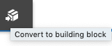

# Fragments d’expérience{#experience-fragments}

Un fragment d’expérience est un groupe d’un ou plusieurs composants comprenant un contenu et une disposition pouvant être référencés dans les pages. Il peut contenir n’importe quel composant.

Un fragment d’expérience :

* fait partie d’une expérience (page) ;
* peut être utilisé sur plusieurs pages ;
* est basé sur un modèle (uniquement modifiable) qui définit la structure et les composants ;
* comprend un ou plusieurs composants, avec mise en page, dans un système de paragraphes ;
* peut contenir d’autres fragments d’expérience ;
* peut être combiné à d’autres composants (y compris d’autres fragments d’expérience) pour former une page entière (expérience) ;
* peut avoir différentes variations et partager du contenu et/ou des composants ;
* peut être scindé en blocs de création utilisables dans plusieurs variations du fragment.

Vous pouvez utiliser des fragments d’expérience :

* Si un auteur souhaite réutiliser des parties (un fragment d’une expérience) d’une page, il doit copier et coller ce fragment. La création et la gestion de ces expériences de copier/coller sont chronophages et sources d’erreurs pour l’utilisateur. Les fragments d’expérience rendent inutiles les opérations de copier/coller.
* Pour gérer le scénario d’utilisation CMS sans interface. Les auteurs souhaitent utiliser AEM uniquement dans une optique de création, mais pas pour diffuser du contenu au client. Un système/point de contact tiers utilise cette expérience, puis la diffuse à l’utilisateur final.

>[!NOTE]
>
>Dans le cas des fragments d’expérience, l’accès en écriture exige que le compte utilisateur soit enregistré dans le groupe :
>
>`experience-fragments-editors`
>
>Si vous rencontrez des problèmes, contactez votre administrateur système.

## Quand utiliser les fragments d’expérience ?    {#when-should-you-use-experience-fragments}

Les fragments d’expérience doivent être utilisés dans les cas suivants :

* Chaque fois que vous souhaitez réutiliser des expériences.

   * Expériences qui seront réutilisées avec un contenu identique ou similaire

* Lorsque vous utilisez AEM en tant que plate-forme de diffusion de contenu à des tiers.

   * Toute solution qui souhaite utiliser AEM comme plate-forme de diffusion de contenu
   * Intégration de contenu dans des points de contact tiers

* Si l’une de vos expériences se décline en plusieurs variations ou rendus.

   * Variations spécifiques à un canal ou contexte particulier
   * Expériences qu’il y a lieu de regrouper (par exemple, une campagne avec des expériences différentes en fonction des canaux)

* Lorsque vous avez recours au commerce omnicanal.

   * Partage de contenu commercial sur les canaux des réseaux sociaux à grande échelle
   * Conversion des points de contact en points de transaction

## Organisation des fragments d’expérience {#organizing-your-experience-fragments}

Nous vous encourageons à :
* utiliser des dossiers pour organiser vos fragments d’expérience ;

* [configurer les modèles autorisés sur ces dossiers](#configure-allowed-templates-folder).

La création de dossiers vous permet d’effectuer les opérations suivantes :

* Créer une structure significative pour vos fragments d’expérience ; en fonction de la classification, par exemple

   >[!NOTE]
   >
   >Il n’est pas nécessaire d’aligner la structure de vos fragments d’expérience sur la structure de page de votre site.

* [Allouer les modèles autorisés au niveau du dossier](#configure-allowed-templates-folder)

   >[!NOTE]
   >
   >Vous pouvez utiliser l’[éditeur de modèles](/help/sites-authoring/templates.md) pour créer votre propre modèle.

L’exemple suivant montre les fragments d’expérience structurés selon `Contributors`. La structure utilisée illustre également l’utilisation d’autres fonctionnalités, telles que la gestion multisite (y compris des copies de langue).

>[!CAUTION]
>
>La capture d&#39;écran suivante a été tirée du site WKND en utilisant Adobe Experience Manager comme Cloud Service.

## Création et configuration d’un dossier pour vos fragments d’expérience {#creating-and-configuring-a-folder-for-your-experience-fragments}

Pour créer et configurer un dossier pour vos fragments d’expérience, il est recommandé de :

1. [Créer un dossier](/help/sites-authoring/managing-pages.md#creating-a-new-folder)

1. [Configurer les modèles de fragments d’expérience autorisés pour ce dossier](#configure-allowed-templates-folder)

>[!NOTE]
>
>Il est également possible de configurer les [modèles autorisés pour votre instance](#configure-allowed-templates-instance), mais cette méthode est **non** recommandée car les valeurs peuvent être remplacées lors de la mise à niveau.

### Configuration des modèles autorisés pour votre dossier {#configure-allowed-templates-folder}

>[!NOTE]
>
>Il s’agit de la méthode recommandée pour spécifier les **[!UICONTROL Modèles autorisés]**, car les valeurs ne sont pas remplacées lors de la mise à niveau.

1. Accédez au dossier **[!UICONTROL Fragments d’expérience]** concerné.

1. Sélectionnez le dossier, puis **[!UICONTROL Propriétés]**.

1. Spécifiez l’expression régulière pour récupérer les modèles requis dans le champ **[!UICONTROL Modèles autorisés]**.

   Par exemple :
   `/conf/(.*)/settings/wcm/templates/experience-fragment(.*)?`

   

1. Sélectionnez **[!UICONTROL Enregistrer et fermer]**.

### Configuration des modèles autorisés pour votre instance {#configure-allowed-templates-instance}

>[!CAUTION]
>
>Il n&#39;est pas recommandé de modifier les **[!UICONTROL modèles autorisés]** par cette méthode, car les modèles spécifiés peuvent être remplacés lors de la mise à niveau.
>
>Veuillez utiliser cette boîte de dialogue uniquement à titre d’information.

1. Accédez à la console **[!UICONTROL Fragments d’expérience]** concernée.

1. Sélectionnez **[!UICONTROL Options de configuration]** :

   

1. Spécifiez les modèles requis dans la boîte de dialogue **[!UICONTROL Configurer des Fragments d’expérience]** :

   

1. Sélectionnez **[!UICONTROL Enregistrer]**.

## Création d’un fragment d’expérience {#creating-an-experience-fragment}

Pour créer un fragment d’expérience :

1. Sélectionnez **[!UICONTROL Fragments d’expérience]** dans la navigation globale.

   

1. Accédez au dossier requis et sélectionnez **[!UICONTROL Créer]**.

1. Sélectionnez **[!UICONTROL Fragment d’expérience]** pour ouvrir l’assistant **[!UICONTROL Créer un fragment d’expérience]**.

   Sélectionnez le **[!UICONTROL Modèle]** requis, puis **[!UICONTROL Suivant]** :

   

1. Renseignez les **[!UICONTROL Propriétés]** de votre Fragment d’expérience.

   Un **[!UICONTROL Titre]** est obligatoire. Si le **[!UICONTROL Nom]** n’est pas spécifié, il est dérivé du **[!UICONTROL Titre]**.

   

1. Cliquez sur **[!UICONTROL Créer]**.

   Un message s’affiche. Sélectionnez :

   * **[!UICONTROL Terminé]** pour revenir à la console
   * **[!UICONTROL Ouvrir]** pour ouvrir l’éditeur de fragments

## Modification d’un fragment d’expérience {#editing-your-experience-fragment}

L’éditeur de fragment d’expérience offre des fonctionnalités similaires à l’éditeur de page normal. Voir [Modification du contenu de la page](/help/sites-authoring/editing-content.md) pour plus d&#39;informations sur la manière de l&#39;utiliser.

La procédure suivante explique comment créer un teaser pour un produit :

1. Faites glisser un **[!UICONTROL Teaser de catégorie]** à partir de l’[Explorateur de composants](/help/sites-authoring/author-environment-tools.md#components-browser).

   

1. Sélectionnez **[[!UICONTROL Configurer]](/help/sites-authoring/editing-content.md#edit-configure-copy-cut-delete-paste)** dans la barre d’outils du composant.
1. Ajoutez la **[!UICONTROL ressource]** et définissez les **[!UICONTROL propriétés]** selon vos besoins.
1. Confirmez les définitions en cliquant sur **[!UICONTROL Terminé]** (icône représentant une coche).
1. Ajoutez d’autres composants, en fonction de vos besoins.

## Création d’une variation de fragment d’expérience {#creating-an-experience-fragment-variation}

Vous pouvez créer des variations du fragment d’expérience, selon vos besoins :

1. Ouvrez le fragment à des fins de [modification](/help/sites-authoring/experience-fragments.md#editing-your-experience-fragment).
1. Ouvrez l’onglet **[!UICONTROL Variations]**.

   

1. L’option **Créer** permet de créer les éléments suivants :

   * **[!UICONTROL Variation]**
   * **[!UICONTROL Variation comme Live Copy]**.

1. Définissez les propriétés requises :

   * **[!UICONTROL Template]**
   * **[!UICONTROL Titre]**
   * **[!UICONTROL Nom]** ; si rien n’est indiqué dans ce champ, le nom est déduit du titre
   * **[!UICONTROL Description]**
   * **[!UICONTROL Balises de variation]**

   

1. Confirmez en cliquant sur **[!UICONTROL Terminé]** (icône représentant une coche). La nouvelle variation est alors affichée dans le panneau :

   

## Utilisation du fragment d’expérience {#using-your-experience-fragment}

Vous pouvez désormais utiliser le fragment d’expérience lors de la création de vos pages :

1. Ouvrez une page à modifier.

   Par exemple : [http://localhost:4502/editor.html/content/we-retail/language-masters/en/products/men.html](http://localhost:4502/editor.html/content/we-retail/language-masters/en/products/men.html)

1. Créez une instance du composant Fragment d’expérience. Pour ce faire, faites glisser le composant sur le système de paragraphes de la page depuis l’explorateur de composants :

   

1. Ajoutez le fragment d’expérience proprement dit à l’instance de composant. Pour ce faire, vous pouvez effectuer l’une des opérations suivantes :

   * Faites glisser le fragment requis sur le composant depuis l’Explorateur de ressources
   * Sélectionnez **[!UICONTROL Configurer]** dans la barre d’outils du composant et indiquez le fragment à utiliser. Confirmez en cliquant sur **Terminé** (icône représentant une coche).

   

   >[!NOTE]
   >
   >L’option Modifier disponible dans la barre d’outils du composant sert de raccourci pour ouvrir le fragment dans l’éditeur de fragments.

## Blocs de création {#building-blocks}

Vous pouvez sélectionner un ou plusieurs composants pour créer un bloc de création à recycler dans votre fragment :

### Création d’un bloc {#creating-a-building-block}

Pour créer un bloc de ce type, procédez comme suit :

1. Dans l’éditeur de fragments d’expérience, sélectionnez les composants que vous souhaitez réutiliser :

   

1. Dans la barre d’outils des composants, sélectionnez **[!UICONTROL Convertir en bloc de création]** :

   

   Par exemple :

   

1. Saisissez le nom du **[!UICONTROL Bloc de création]** et confirmez en cliquant sur **[!UICONTROL Convertir]** :

   

1. Le **bloc de création** s’affiche dans l’onglet et peut être sélectionné dans le système de paragraphe :

   

### Gestion d’un bloc de création {#managing-a-building-block}

Le bloc de création est visible dans l’onglet **[!UICONTROL Blocs de création]**. Pour chaque bloc, les actions suivantes peuvent être effectuées :

* Atteindre l’élément principal : ouvre la variation principale dans un nouvel onglet
* Renommer
* Supprimer

### Utilisation d’un bloc de création {#using-a-building-block}

Vous pouvez faire glisser votre bloc de création vers le système de paragraphes de n’importe quel fragment, comme avec n’importe quel composant.

## Rendu HTML brut {#the-plain-html-rendition}

Le sélecteur `.plain.` de l’URL permet d’accéder au rendu HTML brut.

Cela est possible à partir du navigateur. Cependant, le principal objectif consiste à autoriser d’autres applications (des applications web tierces et des implémentations mobiles personnalisées, par exemple) à accéder directement au contenu du fragment d’expérience en utilisant uniquement l’URL.

Le rendu HTML brut ajoute le protocole, l’hôte et le chemin d’accès au contexte à des chemins qui :

* sont du type `src`, `href` ou `action` ;

* se terminent par `-src` ou `-href`.

Par exemple :

`.../brooklyn-coat/master.plain.html`

>[!NOTE]
>
>Les liens font toujours référence à l’instance de publication. Ils sont destinés à être utilisés par des tiers, de sorte qu’ils soient toujours appelés à partir de l’instance de publication, et non de l’auteur.

## Exportation de fragments d’expérience    {#exporting-experience-fragments}

Par défaut, les fragments d’expérience sont fournis au format HTML. Ils peuvent être utilisés à la fois par AEM et les canaux tiers.

Pour l’exportation vers Adobe Target, le code HTML est utilisé. Pour obtenir des informations complètes, voir [Intégration de Target aux ](/help/sites-administering/experience-fragments-target.md)Fragments d’expérience.

