# Votre boîte de réception{#your-inbox}

>[!CAUTION]
>
>AEM 6.4 a atteint la fin de la prise en charge étendue et cette documentation n’est plus mise à jour. Pour plus d’informations, voir notre [période de support technique](https://helpx.adobe.com/fr/support/programs/eol-matrix.html). Rechercher les versions prises en charge [here](https://experienceleague.adobe.com/docs/?lang=fr).

Vous pouvez recevoir des notifications de différentes zones d’AEM, y compris des workflows et des projets ; par exemple, à propos de :

* Tâches :

   * elles peuvent également être créées à différents endroits de l’interface utilisateur d’AEM, par exemple, sous **Projets**,
   * ils peuvent être le produit d’un workflow **Créer une tâche** ou **Créer une tâche de projet** étape .

* Workflows :

   * les tâches qui représentent les actions que vous devez effectuer sur le contenu de la page ;

      * ils sont le produit du workflow **Participant** étapes
   * éléments d’échec, pour permettre aux administrateurs de relancer l’étape ayant échoué.

Vous recevez ces notifications dans votre propre boîte de réception où vous pouvez les afficher et agir.

>[!NOTE]
>
>L’AEM d’usine est préchargée avec des tâches administratives affectées au groupe d’utilisateurs administrateurs. Voir [Tâches administratives prêtes à l’emploi](#out-of-the-box-administrative-tasks) pour plus d’informations.

>[!NOTE]
>
>Pour plus d’informations sur les types d’éléments, voir aussi :
>
>* [Projets](/help/sites-authoring/touch-ui-managing-projects.md)
>* [Projets – Utilisation des Tâches](/help/sites-authoring/task-content.md)
>* [Workflows](/help/sites-authoring/workflows.md)
>* [Formulaires](/help/forms/home.md)
>

## Boîte de réception dans l’en-tête {#inbox-in-the-header}

Dans les deux consoles, le nombre actuel d’éléments présents dans votre boîte de réception est indiqué dans l’en-tête. L’indicateur peut également être ouvert pour permettre un accès rapide à la ou aux pages nécessitant une ou plusieurs actions ou un accès à la boîte de réception :

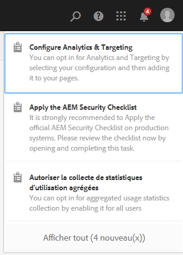

>[!NOTE]
>
>Certaines opérations sont également répertoriées dans le [mode Carte de la ressource appropriée](/help/sites-authoring/basic-handling.md#card-view).

## Tâches administratives prêtes à l’emploi  {#out-of-the-box-administrative-tasks}

L’AEM d’usine est préchargée avec quatre tâches affectées au groupe d’utilisateurs administrateurs.

* [Configurer Analytics et Targeting](/help/sites-administering/opt-in.md)
* [Appliquer la liste de contrôle de sécurité AEM](/help/sites-administering/security-checklist.md)
* Autoriser la collecte de statistiques d’utilisation agrégées
* [Configurer le HTTPS](/help/sites-administering/ssl-by-default.md)

## Ouverture de la boîte de réception {#opening-the-inbox}

Pour ouvrir la boîte de réception des notifications AEM :

1. Cliquez/appuyez sur l’indicateur dans la barre d’outils.

1. Sélectionnez **Afficher tout**. La **boîte de réception AEM** s’ouvre. La boîte de réception affiche les éléments des workflows, des projets et des tâches.
1. La vue par défaut est [Liste](#inbox-list-view), mais vous pouvez également passer à la vue [Calendrier](#inbox-calendar-view). Pour ce faire, utilisez le sélecteur de vue (barre d’outils, en haut à droite).

   Pour les deux vues, vous pouvez également définir [Paramètres d’affichage](#inbox-view-settings); les options disponibles dépendent de la vue actuelle.

   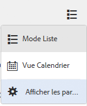

>[!NOTE]
>
>La boîte de réception fonctionne comme une console. Vous pouvez ainsi utiliser la [navigation globale](/help/sites-authoring/basic-handling.md#global-navigation) ou la fonction de [recherche](/help/sites-authoring/search.md) pour accéder à un autre emplacement lorsque vous avez terminé.

### Boîte de réception – Vue Liste {#inbox-list-view}

Cette vue répertorie tous les éléments, ainsi que les principales informations pertinentes :

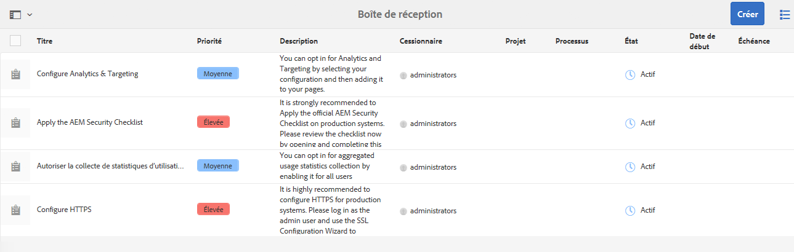

### Boîte de réception – Mode Calendrier {#inbox-calendar-view}

Ce mode présente les éléments en fonction de leur position dans le calendrier et de la vue précise que vous avez sélectionnée :

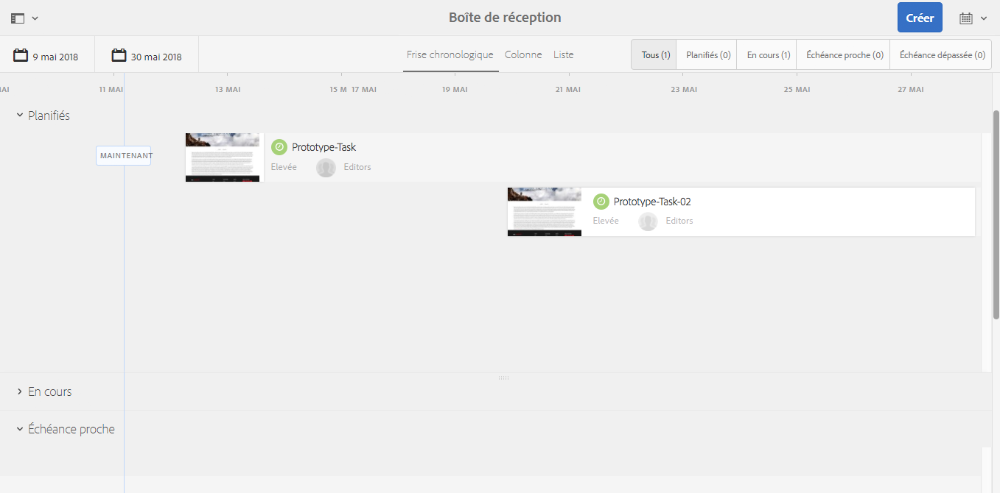

Vous pouvez :

* sélectionner une vue spécifique ; **Chronologie**, **Colonne**, **Liste**

* spécifier les tâches à afficher en fonction de **Planification**; **Tous**, **Planifié**, **En cours**, **Échéance proche**, **Échéance passée**

* descendre dans la hiérarchie pour obtenir des informations plus détaillées sur un élément ;
* sélectionnez une période pour cibler la vue :

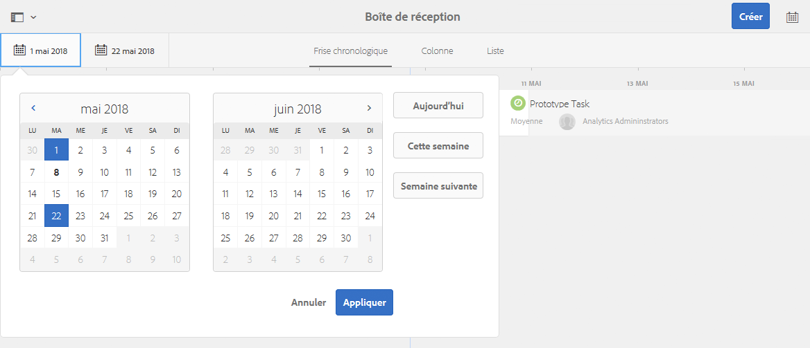

### Boîte de réception – Paramètres d’affichage {#inbox-view-settings}

Pour les deux modes (Liste et Calendrier), vous pouvez définir des paramètres :

* **Vue Calendrier**

   Pour **Vue Calendrier** vous pouvez configurer les éléments suivants :

   * **Group by**
   * **Planification** ou **Aucun**
   * **Taille des cartes**

   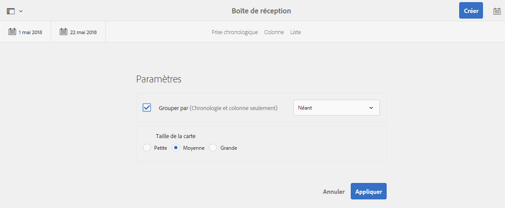

* **Vue Liste**

   Pour **Mode Liste** vous pouvez configurer le mécanisme de tri :

   * **Tri**
   * **Ordre de tri**

   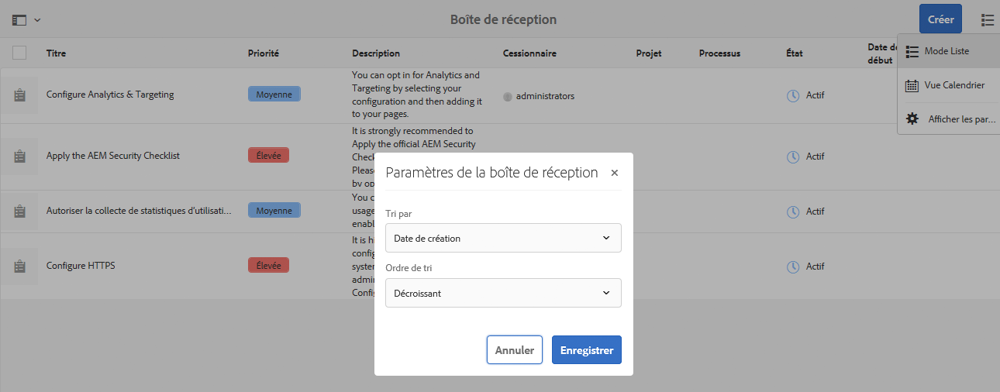

## Action sur un élément {#taking-action-on-an-item}

1. Pour agir sur un élément, sélectionnez la miniature de l’élément approprié. Les icônes des actions applicables à cet élément s’affichent dans la barre d’outils :

   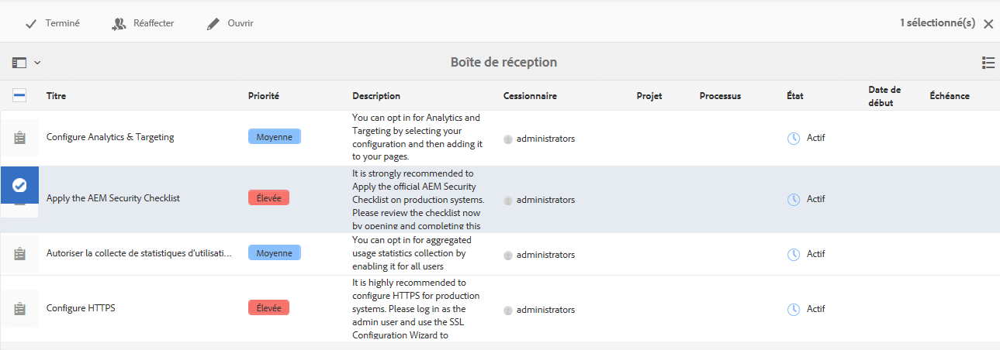

   Les actions disponibles varient selon l’élément et incluent les opérations suivantes :

   * **Terminer** l’action ; par exemple une tâche ou un élément de workflow.
   * **Réaffecter**/**Déléguer** un élément .
   * **Ouvrir** un article ; selon le type d’élément , cette action peut :

      * afficher les propriétés de l’élément ;
      * ouvrir un tableau de bord ou un assistant approprié pour effectuer d’autres actions ;
      * Ouvrir la documentation associée
   * **Revenir** à une étape précédente.
   * Afficher le payload pour un workflow.
   * Créer un projet à partir de l’élément.

   >[!NOTE]
   >
   >Pour plus d’informations, voir :
   >
   >* Éléments de workflow – [Participation aux workflows](/help/sites-authoring/workflows-participating.md)

1. En fonction de l’élément sélectionné, une action est lancée. par exemple :

   * une boîte de dialogue correspondant à l’action s’ouvre.
   * un assistant d&#39;action démarre.
   * une page de documentation s’ouvre.

   Par exemple : **Réaffecter** ouvre une boîte de dialogue :

   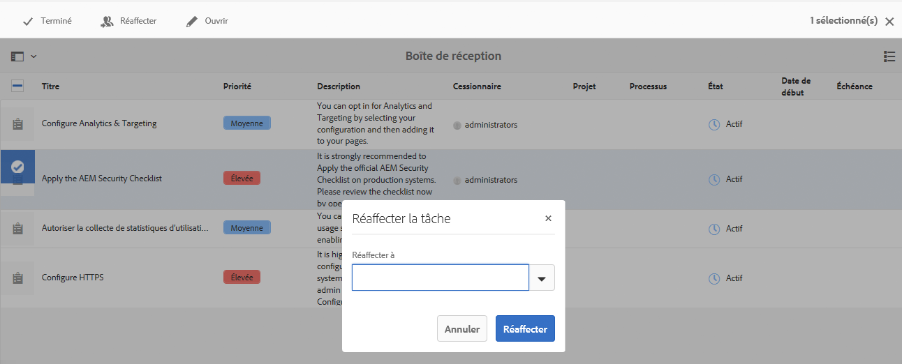

   Selon qu’une boîte de dialogue, une page de documentation ou un assistant a été ouvert, vous pouvez :

   * confirmer l’action appropriée ; Par exemple, Réaffecter.
   * Annuler l’action.
   * Flèche vers l’arrière ; par exemple, si une page de documentation ou un assistant d’action a été ouvert, vous pouvez revenir à la boîte de réception.

## Création d’une tâche {#creating-a-task}

Vous pouvez créer des tâches à partir de la boîte de réception :

1. Sélectionner **Créer**, puis **Tâche**.
1. Renseignez les champs nécessaires de la section **De base** et **Avancé** onglets ; uniquement **Titre** est obligatoire, tous les autres sont facultatifs :

   * **De base** :

      * **Titre**
      * **Projet**
      * **Cessionnaire**
      * **Contenu**; similaire à Payload, il s’agit d’une référence de la tâche à un emplacement dans le référentiel.
      * **Description**
      * **Priorité de la tâche**
      * **Date de début**
      * **Date d’échéance**

   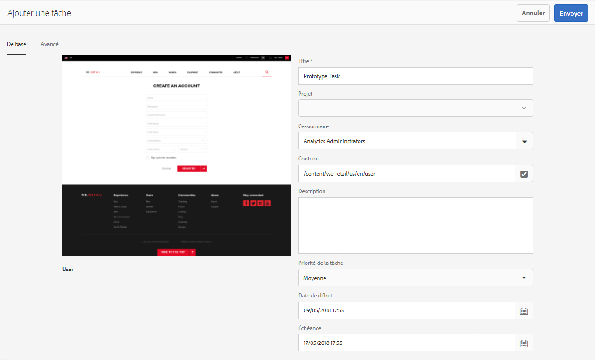

   * **Avancé**

      * **Nom**: il sera utilisé pour former l’URL ; Si ce champ est vide, il est basé sur la variable **Titre**.

   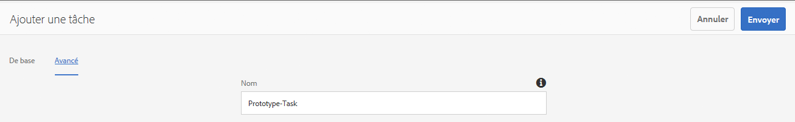

1. Sélectionnez **Envoyer**.

## Création d’un projet {#creating-a-project}

Pour certaines tâches, vous pouvez créer une [Projet](/help/sites-authoring/projects.md) en fonction de cette tâche :

1. Sélectionnez la tâche appropriée en appuyant/cliquant sur la miniature.

   >[!NOTE]
   >
   >Seules les tâches créées à l’aide de l’option **Créer** de la **boîte de réception** peuvent être utilisées pour créer un projet.
   >
   >Les éléments de travail (d’un workflow) ne peuvent pas être utilisés pour créer un projet.

1. Sélectionnez **Créer un projet** depuis la barre d’outils pour ouvrir l’assistant.
1. Sélectionnez le modèle approprié, puis **Suivant**.
1. Spécifiez les propriétés requises :

   * **De base**

      * **Titre**
      * **Description**
      * **Date de début**
      * **Date d’échéance**
      * **Utilisateur** et rôle
   * **Avancé**

      * **Nom**
   >[!NOTE]
   >
   >Voir [Création d’un projet](/help/sites-authoring/touch-ui-managing-projects.md#creating-a-project) pour obtenir des informations complètes.

1. Sélectionner **Créer** pour confirmer l’action.

## Filtrage des éléments dans la boîte de réception AEM {#filtering-items-in-the-aem-inbox}

Vous pouvez filtrer les éléments répertoriés :

1. Ouvrez la **boîte de réception AEM**.

1. Ouvrez le sélecteur de filtre :

   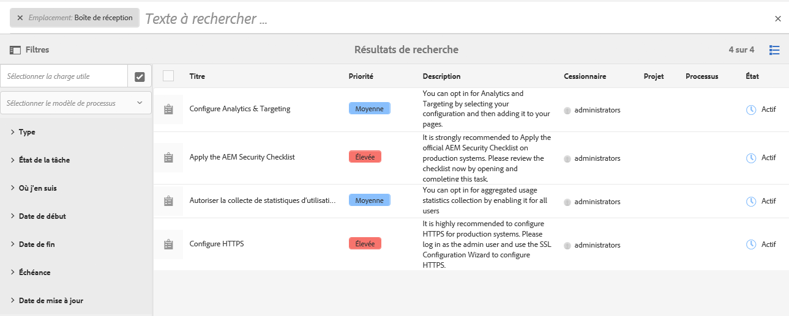

1. Vous pouvez filtrer les éléments répertoriés en fonction d’une série de critères qui peuvent pour la plupart être affinés, par exemple :

   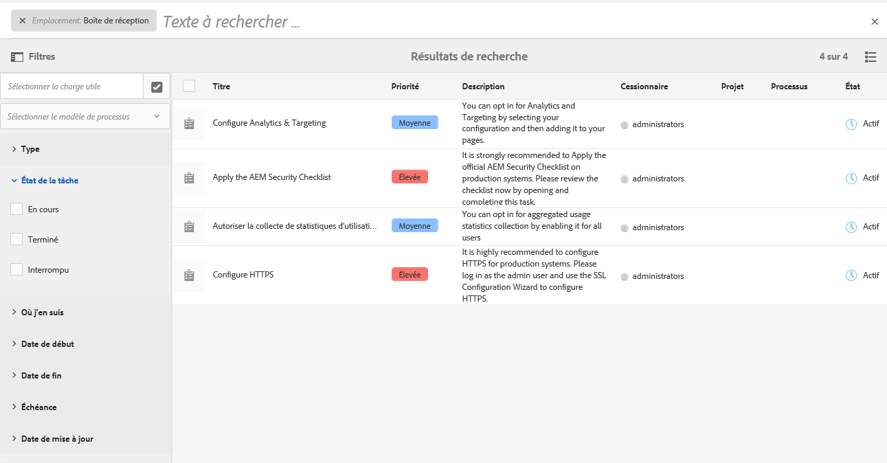

   >[!NOTE]
   >
   >Dans la vue [Liste](#inbox-view-settings), vous pouvez également configurer l’ordre de tri dans les [paramètres d’affichage](#inbox-list-view).
