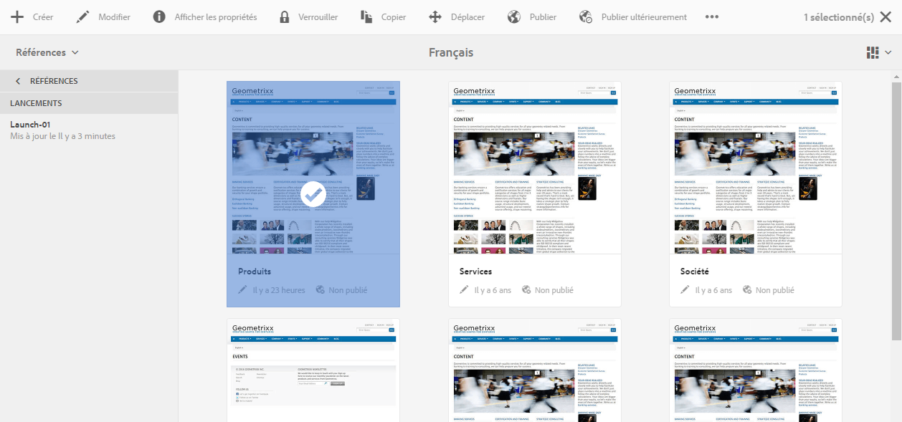

# Modification de lancements{#editing-launches}

## Modification de pages de lancement {#editing-launch-pages}

Après avoir créé un lancement pour une page (ou un jeu de pages), vous pouvez modifier le contenu dans la copie de lancement correspondante.

1. Accédez à [Lancement à partir des références (console Sites)](/help/sites-authoring/launches.md#launches-in-references-sites-console) pour afficher les actions disponibles.
1. Sélectionnez **Aller à la page** pour ouvrir la page d’édition.

### Modification de l’objet des pages de lancement en Live Copy   {#editing-launch-pages-subject-to-a-live-copy}

Si votre lancement est basé sur une [Live Copy](/help/sites-administering/msm.md), vous :

* verrez des symboles de verrouillage (petits verrous) lors de la modification d’un composant (de son contenu et/ou de ses propriétés).
* verrez l’onglet **Live Copy** dans **Propriétés de la page**.

Une Live Copy est utilisée pour synchroniser le contenu *depuis* la branche source *vers* votre branche de lancement (afin que votre lancement soit à jour avec les modifications apportées à la source).

Vous pouvez apporter des modifications de la même manière que vous pouvez modifier une Live Copy standard, par exemple :

* Cliquer sur un cadenas fermé interrompt cette synchronisation et vous permet d’apporter de nouvelles mises à jour au contenu de votre lancement. Une fois le cadenas déverrouillé (ouvert), vos modifications ne seront remplacées par aucune modification effectuée au même emplacement dans la branche de source.
* **Suspendre** (et **Reprendre**) l’héritage pour une page spécifique.

Pour plus d’informations, voir [Modification du contenu d’une Live Copy](/help/sites-administering/msm-livecopy.md#changing-live-copy-content).

## Comparaison d’une page de lancement avec sa page source {#comparing-a-launch-page-to-its-source-page}

Pour suivre les modifications que vous avez apportées, vous pouvez afficher le lancement dans **Références** et comparer la page de lancement à sa page source :

1. Dans la console **Sites**, [accédez à la page source de votre lancement et sélectionnez-la](/help/sites-authoring/basic-handling.md#viewing-and-selecting-resources).
1. Ouvrez le panneau **[Références](/help/sites-authoring/basic-handling.md#references)**et sélectionnez **Lancements**.
1. Sélectionnez votre lancement spécifique, puis **Comparer à la source** :

   

1. Les deux pages (de lancement et source) s’ouvrent côte à côte.

   Pour des informations complètes sur l’utilisation de cette fonction, consultez [Différence entre les pages](/help/sites-authoring/page-diff.md).

## Modification des pages source utilisées {#changing-the-source-pages-used}

Vous pouvez à tout moment ajouter ou supprimer des pages vers/depuis la plage de pages source pour un lancement : 

1. Accédez au lancement et sélectionnez-le depuis, au choix :

   * la [console Lancements](/help/sites-authoring/launches.md#the-launches-console) :

      * Sélectionnez **Modifier**.
   * [Références (console Sites)](/help/sites-authoring/launches.md#launches-in-references-sites-console) pour afficher les actions disponibles :

      * Sélectionnez **Modifier le lancement**. 

   Les pages source s’affichent.

1. Effectuez les modifications requises, puis confirmez avec **Enregistrer**.

   >[!NOTE]
   >
   >Pour ajouter des pages à un lancement, celles-ci doivent se trouver sous une racine de langue commune (c’est-à-dire, sur un seul site).

## Modification d’une configuration de lancement   {#editing-a-launch-configuration}

Vous pouvez à tout moment modifier les propriétés d’un lancement : 

1. Accédez au lancement et sélectionnez-le depuis, au choix :

   * la [console Lancements](/help/sites-authoring/launches.md#the-launches-console) :

      * Sélectionnez **Propriétés**.
   * [Références (console Sites)](/help/sites-authoring/launches.md#launches-in-references-sites-console) pour afficher les actions disponibles :

      * Sélectionnez **Modifier les propriétés**. 

   Les détails s’affichent.

1. Effectuez les modifications requises, puis confirmez avec **Enregistrer**.

   Consultez [Lancements - Ordre des événements](/help/sites-authoring/launches.md#launches-the-order-of-events) pour plus d’informations sur l’objectif et l’interaction des champs **Date de lancement** et **Prêt pour la production**.

## Identification de l’état de lancement d’une page   {#discovering-the-launch-status-of-a-page}

L’état s’affiche lorsque vous sélectionnez un lancement spécifique dans l’onglet Références (voir [Lancements dans les références (console Sites)](/help/sites-authoring/launches.md#launches-in-references-sites-console)).

