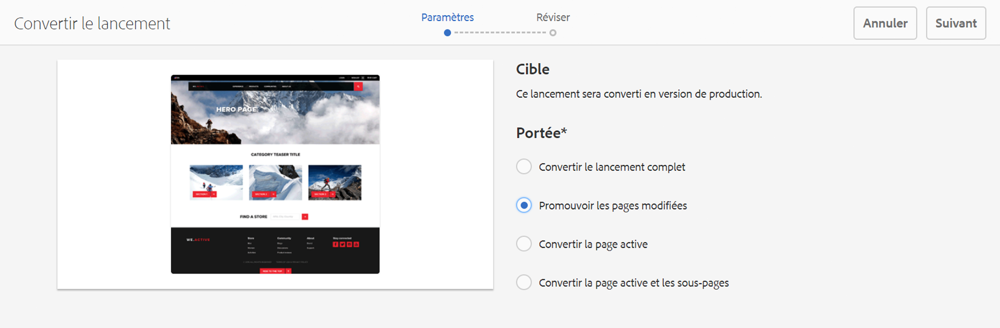
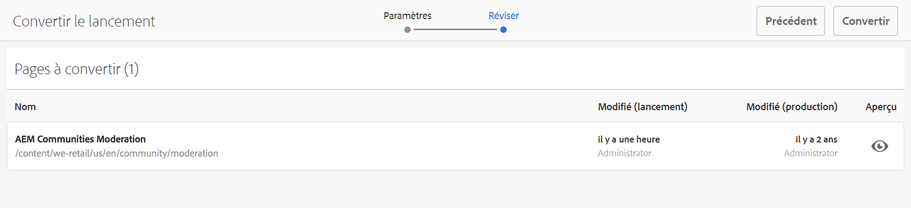
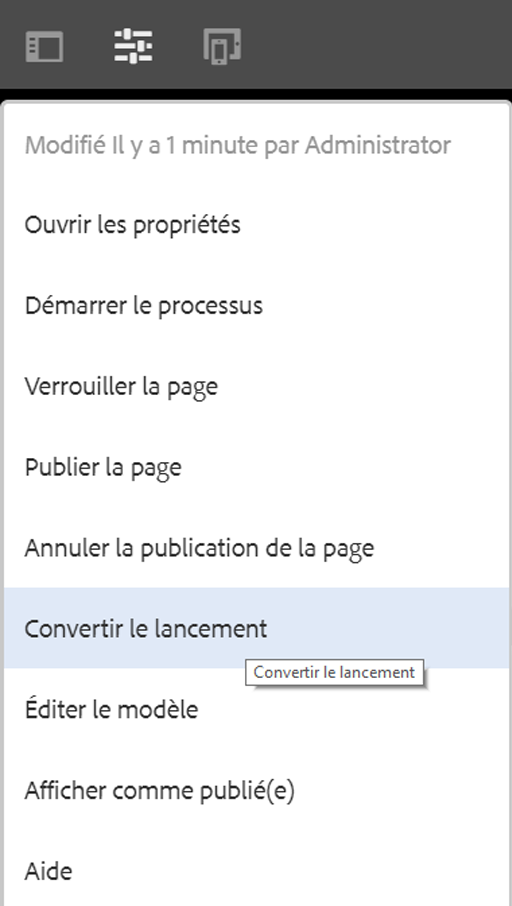
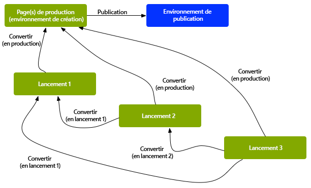
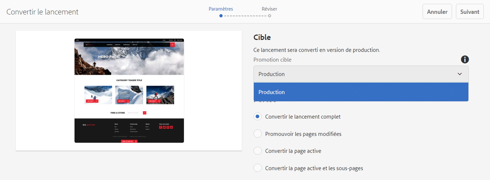
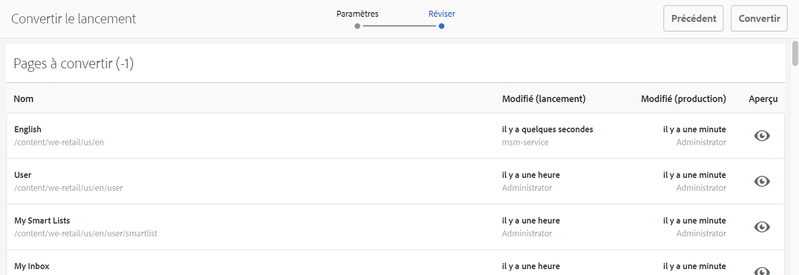
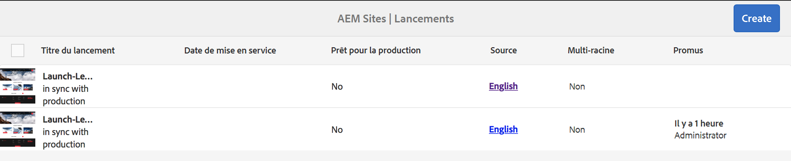
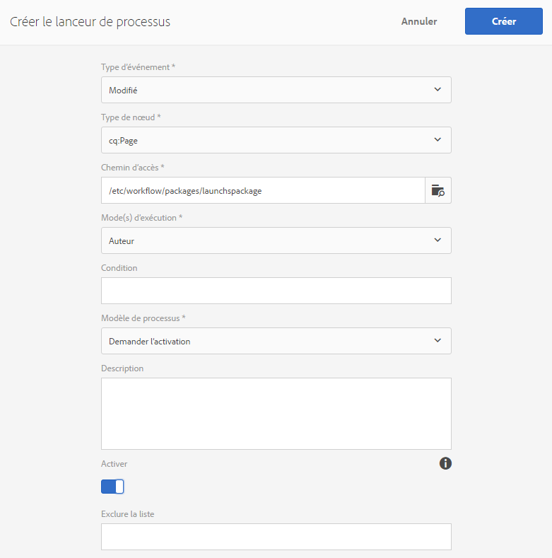

# Conversion de lancements{#promoting-launches}

Vous devez convertir les pages de lancement pour redéplacer le contenu vers la source (production) avant de le publier. Lorsqu’une page de lancement est convertie, la page correspondante des pages sources est remplacée par la page convertie. Les options suivantes sont disponibles lors de la conversion d’une page de lancement :

* Faut-il convertir l’intégralité du lancement ou uniquement la page en cours ?
* Faut-il convertir les pages enfants de la page en cours ?
* Conversion de l’intégralité du lancement ou uniquement des pages qui ont été modifiées.

>[!NOTE]
>
>Après avoir converti les pages de lancement en pages cibles (de **production**), vous pouvez activer les pages de **production** sous la forme d’une entité (pour accélérer le processus de rendu). Ajoutez les pages à un module de workflow et utilisez ce dernier comme charge utile pour un workflow qui active un module de pages. Vous devez créer le module de workflow avant la conversion du lancement Voir [Traitement de pages converties à l’aide du worfklow AEM](#processing-promoted-pages-using-aem-workflow).

>[!CAUTION]
>
>Un lancement simple ne peut pas être converti simultanément. Cela signifie que deux actions simultanées de conversion à partir du même lancement peuvent entraîner une erreur : `Launch could not be promoted` (ainsi que des erreurs de conflit dans le journal).

>[!CAUTION]
>
>Lors de la promotion du lancement des pages *modifiées*, les modifications des branches source et de lancement sont prises en compte.

## Conversion de pages de lancement {#promoting-launch-pages}

>[!NOTE]
>
>Il s’agit de l’action manuelle consistant à convertir les pages de lancement lorsqu’il existe un seul niveau de lancement. Voir :
>
>* [Conversion d’un lancement imbriqué](#promoting-a-nested-launch) lorsqu’il existe plusieurs lancements dans la structure.
>* [Lancements - Ordre des événements](/help/sites-authoring/launches.md#launches-the-order-of-events) pour en savoir plus sur la conversion et la publication automatiques.

>

Vous pouvez convertir des lancements à partir de la console de **sites** ou de la console de **lancements** :

1. Ouvrez :

   * la console **Sites** :

      1. Ouvrez le [rail de références](/help/sites-authoring/author-environment-tools.md#references) et sélectionnez la page source souhaitée à l’aide du [mode de sélection](/help/sites-authoring/basic-handling.md) (ou sélectionnez et ouvrez le rail de références, l’ordre n’a pas d’importance). Toutes les références seront affichées.

      1. Sélectionnez **Lancements** (par exemple Lancements (1)) pour afficher une liste de lancements particuliers.
      1. Sélectionnez le lancement en question pour afficher les actions disponibles.
      1. Sélectionnez **Convertir le lancement** pour ouvrir l’assistant.
   * la console de **lancements** :

      1. Sélectionnez votre lancement (appuyez/cliquez sur la miniature).
      1. Sélectionnez **Convertir**.

1. Dans la première étape, vous pouvez spécifier :

   * **Convertir le lancement complet**
   * **Promouvoir les pages modifiées**
   * **Convertir la page active**
   * **Convertir la page active et les sous-pages**

   Par exemple, lorsque vous sélectionnez l’option visant à convertir uniquement les pages modifiées :

   

   >[!NOTE]
   >
   >Cette procédure porte sur la conversion d’un lancement simple. Si vous avez imbriqué des lancements, reportez-vous à la section [Conversion d’un lancement imbriqué](#promoting-a-nested-launch).

1. Cliquez sur **Suivant** pour continuer.
1. Vous pouvez passer en revue les pages à convertir. Elles dépendent de la plage de pages sélectionnée :

   

1. Sélectionnez **Convertir**.

## Conversion de pages de lancement lors de leur modification   {#promoting-launch-pages-when-editing}

Lorsque vous modifiez une page de lancement, l’action **Convertir le lancement** est également disponible dans les **informations sur la page**. Cette action ouvre l’assistant pour collecter les informations nécessaires.

>[!NOTE]
>
>Cette option est disponible pour les lancements simples et [imbriqués](#promoting-a-nested-launch).

## Promotion d’un lancement imbriqué   {#promoting-a-nested-launch}

Après avoir créé un lancement imbriqué, vous pouvez le convertir en pages source, y compris la source racine (production).

1. Comme avec la [création d’un lancement imbriqué](/help/sites-authoring/launches-creating.md#creating-a-nested-launch), recherchez et sélectionnez le lancement en question dans la console de **lancements** ou le rail de **références**.
1. Sélectionnez **Convertir le lancement** pour ouvrir l’assistant.

1. Saisissez les informations demandées :

   * **Promotion cible**

      Vous pouvez faire la promotion auprès de n’importe quelle source.

   * **Domaine** Ici, vous pouvez indiquer s’il faut convertir l’intégralité du lancement ou uniquement les pages qui ont été modifiées. Dans le second cas, vous pouvez choisir d’inclure/exclure des sous-pages. La configuration par défaut consiste à convertir uniquement les changements de page pour la page active :

      * **Convertir le lancement complet**
      * **Promouvoir les pages modifiées**
      * **Convertir la page active**
      * **Convertir la page active et les sous-pages**

   

1. Sélectionnez **Suivant**.
1. Vérifiez les détails de la conversion avant de sélectionner **Convertir** :

   

   >[!NOTE]
   >
   >Les pages répertoriées dépendent de la **portée** que vous avez définie et éventuellement des pages qui ont été modifiées.

1. Les modifications sont converties et répercutées dans la console de **lancements** :

   

## Traitement de pages converties à l’aide du workflow AEM {#processing-promoted-pages-using-aem-workflow}

Utilisez des modèles de workflow pour effectuer un traitement en bloc des pages Lancements converties :

1. Créez un module de workflow.
1. Lorsque les auteurs convertissent des pages de lancement, ils les stockent dans le module de workflow.
1. Commencez un modèle de workflow en utilisant le module comme charge utile.

Pour lancer automatiquement un workflow lors de la conversion de pages, [configurez un lanceur de workflow](/help/sites-administering/workflows-starting.md#workflows-launchers) pour le nœud du module.

Vous pouvez, par exemple, générer automatiquement des demandes d’activation de page lorsque les auteurs convertissent des pages Lancements. Configurez un lanceur de workflow pour démarrer le workflow « Demander l’activation » lors de la modification du nœud de module.

