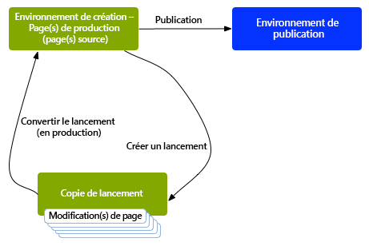

# Lancements du commerce électronique{#launches}

>[!CAUTION]
>
>AEM 6.4 a atteint la fin de la prise en charge étendue et cette documentation n’est plus mise à jour. Pour plus d’informations, voir notre [période de support technique](https://helpx.adobe.com/fr/support/programs/eol-matrix.html). Rechercher les versions prises en charge [here](https://experienceleague.adobe.com/docs/?lang=fr).

Les lancements vous permettent de développer efficacement du contenu pour une version ultérieure.

Un lancement est créé pour vous permettre de préparer les modifications pour une publication ultérieure (tout en conservant vos pages actives). Après avoir modifié et mis à jour vos pages de lancement, vous les reconvertissez à la source, puis activez les pages source (de niveau supérieur). La promotion duplique le contenu du lancement sur les pages source et peut être effectué manuellement ou automatiquement (en fonction des champs définis lors de la création et de la modification du lancement).

Par exemple, les pages de produits saisonniers de votre boutique en ligne sont mises à jour chaque trimestre afin que les produits présentés correspondent à la saison en cours. Pour préparer la prochaine mise à jour trimestrielle, vous pouvez créer un lancement des pages web appropriées. Tout au long du trimestre, les modifications suivantes sont cumulées dans la copie de lancement :

* Modifications apportées aux pages source suite à des tâches de maintenance normales. Ces modifications sont automatiquement dupliquées dans les pages de lancement.
* Modifications effectuées directement sur les pages de lancement en vue du trimestre suivant.

À l’approche du trimestre suivant, vous convertissez les pages de lancement pour pouvoir modifier les pages source (contenant le contenu mis à jour). Vous pouvez convertir toutes les pages ou uniquement celles que vous avez modifiées.

Les lancements peuvent également être :

* Créé pour plusieurs branches racine. Bien que vous puissiez créer le lancement pour l’ensemble du site (et y apporter les modifications), cela peut s’avérer impossible, car l’ensemble du site doit être copié. Lorsque des centaines, voire des milliers de pages sont utilisées, les configurations et les performances du système dépendent de l’action de copie et ultérieurement des comparaisons nécessaires pour les tâches de conversion.
* Imbriqué (un lancement dans un lancement) pour vous permettre de créer un lancement à partir d’un lancement existant afin que les auteurs puissent tirer parti des modifications déjà apportées, plutôt que d’avoir à apporter les mêmes modifications plusieurs fois pour chaque lancement.

Cette section décrit comment créer, modifier et promouvoir (et si nécessaire [delete](/help/sites-authoring/launches-creating.md#deleting-a-launch)) lancer des pages à partir de la console Sites ou [la console Lancements](#the-launches-console):

* [Création de lancements](/help/sites-authoring/launches-creating.md)
* [Modification de lancements](/help/sites-authoring/launches-editing.md)
* [Conversion de lancements](/help/sites-authoring/launches-promoting.md)

## Lancements – Ordre des événements {#launches-the-order-of-events}

Les lancements vous permettent de développer efficacement du contenu pour une prochaine version d’une ou de plusieurs pages web activées.

Les lancements vous permettent d’effectuer les opérations suivantes :

* Créez une copie de vos pages source :

   * La copie est votre lancement.
   * Les pages source de niveau supérieur sont connues sous le nom de **Production**.

      * Les pages source peuvent provenir de plusieurs branches (distinctes).
   >[!CAUTION]
   >
   >Dans l’interface utilisateur classique, il n’est pas possible d’utiliser plusieurs branches sources pour un lancement.

   

* Modifier la configuration de lancement :

   * Ajoutez ou supprimez des pages et/ou des branches au lancement.
   * Modifiez des propriétés de lancement, comme le **titre**, la **date de lancement** et l’indicateur **Prêt pour la production**.

* Vous pouvez convertir et publier le contenu manuellement ou automatiquement :

   * Manuellement :

      * Convertissez votre contenu de lancement en **Cible** (pages source) lorsqu’elles sont prêtes à être publiées.
      * Publiez le contenu à partir des pages source (après promotion).
      * Convertissez toutes les pages ou uniquement les pages modifiées.
   * Automatiquement, ce qui implique les étapes suivantes :

      * Le champ **Date de** **lancement** (**En direct**) : ce paramètre peut être défini lors de la création ou de la modification du lancement.
      * Le **Prêt pour la production** Indicateur : cette option ne peut être définie que lors de la modification d’un lancement.
      * Si l’indicateur **Prêt pour la production** est défini, le lancement sera automatiquement converti en pages de production à la **date** de **lancement** (**En direct**) spécifiée. Après la promotion, les pages de production sont automatiquement publiées.

         Si aucune date n’a été définie, l’indicateur n’a aucun effet.

* Mettez à jour vos pages source et de lancement en parallèle :

   * Les modifications apportées aux pages source sont automatiquement appliquées à la copie de lancement (si elle a été configurée avec un héritage, c’est-à-dire comme Live Copy).
   * Les modifications apportées à la copie de lancement peuvent l’être sans interrompre les mises à jour automatiques ou modifier les pages source.

   

* [Création d’un lancement imbriqué](/help/sites-authoring/launches-creating.md#creating-a-nested-launch) - un lancement dans un lancement :

   * La source est un lancement existant.
   * Vous pouvez [promouvoir un lancement imbriqué](/help/sites-authoring/launches-promoting.md#promoting-a-nested-launch) à toute cible; il peut s’agir d’un lancement parent ou des pages source de niveau supérieur (production).

   

   >[!CAUTION]
   >
   >La suppression d’un lancement supprime le lancement lui-même et tous les lancements imbriqués qui en sont des descendants.

>[!NOTE]
>
>La création et la modification de lancements exigent des droits d’accès à `/content/launches`, comme avec le groupe par défaut `content-authors`.
>
>Si vous rencontrez des difficultés, contactez votre administrateur système.

### Console Lancements {#the-launches-console}

La console Lancements fournit un aperçu de vos lancements et permet d’appliquer des actions sur les lancements répertoriés. Vous pouvez accéder à la console via :

* La console **Outils** : **Outils**, **Sites**, **Lancements**.

* Ou directement avec [.http://localhost:4502/libs/launches/content/launches.html](http://localhost:4502/libs/launches/content/launches.html)

## Lancements dans les références (console Sites) {#launches-in-references-sites-console}

1. Dans le **Sites** , accédez à la source du ou des lancements.
1. Ouvrez le **Références** et sélectionnez la page source.
1. Sélectionner **Lancements**, le ou les lancements existants seront répertoriés :

   

1. Appuyez/cliquez sur le lancement qui vous intéresse. La liste des actions possibles s’affiche :

   
