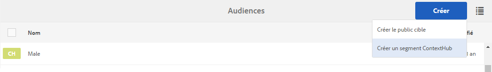
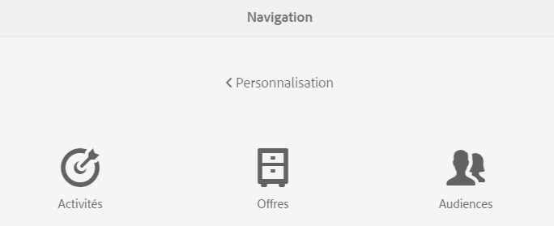

# Gestion des audiences{#managing-audiences}

>[!CAUTION]
>
>AEM 6.4 a atteint la fin de la prise en charge étendue et cette documentation n’est plus mise à jour. Pour plus d’informations, voir notre [période de support technique](https://helpx.adobe.com/fr/support/programs/eol-matrix.html). Rechercher les versions prises en charge [here](https://experienceleague.adobe.com/docs/?lang=fr).

La console Audiences vous permet de créer, d’organiser et de gérer les audiences associées à votre compte Adobe Target ou de gérer des segments pour ContextHub.   ou le contexte client :

* Ajout d’audiences : audiences Adobe Target ou segments ContextHub.
* Gestion des audiences.

Une audience, appelée *segment* dans ContextHub et ClientContext, est une classe de visiteurs définie selon des critères spécifiques, qui détermine qui voit une activité ciblée. Lorsque vous ciblez une activité, vous pouvez sélectionner des audiences directement dans le processus de ciblage ou en créer de nouvelles dans la console Audiences.

Dans la console Audiences , les audiences sont organisées par marque.

Les audiences sont disponibles en mode Ciblage pour [créer du contenu ciblé](/help/sites-authoring/content-targeting-touch.md) ou pour créer des audiences (mais vous devez créer des audiences Adobe Target dans la console Audiences). Les audiences que vous créez en mode Ciblage apparaissent dans la console Audiences.

Les audiences s’affichent avec un libellé décrivant le type d’audience défini :

* CH - segment ContextHub
* CC - Segment ClientContext
* AT - audience Adobe Target

## Création d’un segment ContextHub dans la console Audiences {#creating-a-contexthub-segment-in-the-audiences-console}

Vous pouvez créer un segment ContextHub dans la console Audiences ou durant le processus de ciblage.

Pour créer un segment ContextHub dans la console Audiences :

1. Dans la console Navigation, cliquez ou appuyez sur **Personnalisation**. Cliquez ou appuyez sur **Audiences**.
1. Cliquez ou appuyez sur **Créer un segment ContextHub**.

   

1. Dans la boîte de dialogue **Nouveau segment ContextHub**, saisissez un titre, ajustez l’amplification et cliquez sur **Créer**. Votre nouveau segment ContextHub apparaît dans la liste des audiences.

   >[!NOTE]
   >
   >Vous pouvez trier la liste modifiée en appuyant ou en cliquant sur **Modifié** pour la trier par ordre décroissant afin de voir toutes les audiences nouvellement créées.

Pour plus d’informations sur la création de segments à l’aide de ContextHub, reportez-vous à la section [Configuration de la segmentation avec ContextHub](/help/sites-administering/segmentation.md) documentation.

## Création d’une audience Adobe Target dans la console Audiences {#creating-an-adobe-target-audience-using-the-audience-console}

Vous pouvez créer des audiences Adobe Target directement dans AEM à l’aide de la console Audiences .

Les audiences sont définies par des règles qui déterminent qui est inclus dans une activité cible. Une définition d’audience peut inclure plusieurs règles et chaque règle peut inclure plusieurs paramètres.

Lorsque vous utilisez plusieurs règles, celles-ci sont combinées par l’opérateur booléen ET, ce qui signifie que tout membre potentiel de l’audience doit remplir toutes les conditions définies pour être inclus dans l’activité. Par exemple, si vous définissez une règle de système d’exploitation ET une règle de navigateur, seuls les visiteurs utilisant le système d’exploitation défini ET le navigateur défini sont inclus dans l’activité.

>[!NOTE]
>
>Si vous ne voyez pas l’option **Créer le public cible** dans le menu **Créer**, cela signifie que vous ne disposez pas des autorisations nécessaires pour créer une audience. Vous avez besoin de droits d’accès en écriture sous **/etc/segmentation** pour pouvoir créer des audiences. Le groupe content-authors dispose par défaut d’autorisations d’écriture.

Pour créer une audience Adobe Target :

1. Dans la console Navigation, cliquez ou appuyez sur **Personnalisation**. Cliquez ou appuyez sur **Audiences**.

   

1. Dans la console Audiences, cliquez ou appuyez sur **Créer**, puis sur **Créer le public cible**.

   

1. Dans la boîte de dialogue **Configuration d’Adobe Target**, choisissez la configuration cible et cliquez ou appuyez sur **OK**.
1. Dans la zone Règle#1, appuyez ou cliquez sur le type d’attribut et saisissez toutes les informations d’attribut dans les champs disponibles. Lorsque vous avez terminé, cochez la case située à droite de l’attribut pour l’enregistrer. Voir [Attributs et leurs options](#attributes-and-their-options) pour plus d’informations sur tous les attributs.
1. Cliquez sur **Ajouter une règle** pour ajouter une autre règle. Entrez autant de règles que nécessaire. Les règles sont combinées avec l’opérateur booléen ET, ce qui signifie que l’audience doit répondre à toutes les exigences de chaque règle pour être éligible à une activité.
1. Cliquez ou appuyez sur **Suivant**.
1. Saisissez le nom de l’audience et appuyez ou cliquez dessus. **Enregistrer**.
1. Cliquez ou appuyez sur **Enregistrer**. Votre audience est répertoriée dans la liste des audiences.

### Attributs et leurs options {#attributes-and-their-options}

Vous pouvez créer des règles de ciblage pour chacun des attributs suivants :

| **Attribut** | **Description** | **Pour plus d’informations** |
|---|---|---|
| **Mobile** | Appareils mobiles Target basés sur des paramètres tels que l’appareil mobile, le type d’appareil, le fabricant de l’appareil, les dimensions de l’écran (en pixels), etc. | Voir [Documentation mobile](https://experienceleague.adobe.com/docs/target/using/audiences/create-audiences/categories-audiences/mobile.html?lang=fr) dans Adobe Target. |
| **Personnalisé** | Les paramètres personnalisés sont des paramètres mbox. Si vous transférez des paramètres mbox à des mbox ou utilisez la fonction targetPageParams, ces paramètres apparaissent ici pour utilisation dans les audiences. | Voir [Documentation sur les paramètres personnalisés](https://experienceleague.adobe.com/docs/target/using/audiences/create-audiences/categories-audiences/custom-parameters.html?lang=fr) dans Adobe Target. |
| **Système d’exploitation** | Vous pouvez cibler les visiteurs qui utilisent un certain système d’exploitation. | Ciblez les utilisateurs qui utilisent Linux, Macintosh ou Windows. |
| **Pages du site** | Ciblez les visiteurs qui se trouvent sur une page spécifique ou qui possèdent un paramètre de mbox spécifique. | Reportez-vous à la [documentation relative aux pages de site](https://experienceleague.adobe.com/docs/target/using/audiences/create-audiences/categories-audiences/site-pages.html?lang=fr) dans Adobe Target. |
| **Navigateur** | Vous pouvez cibler les utilisateurs qui utilisent un navigateur spécifique ou des options de navigateur spécifiques lorsqu’ils visitent votre page. | Reportez-vous à la [documentation relative aux options de navigateur](https://experienceleague.adobe.com/docs/target/using/audiences/create-audiences/categories-audiences/browser.html?lang=fr) dans Adobe Target. |
| **Profil du visiteur** | Visiteurs Target qui respectent des paramètres de profil spécifiques. | Reportez-vous à la [documentation relative aux profils de visiteur](https://experienceleague.adobe.com/docs/target/using/audiences/visitor-profiles/visitor-profile.html?lang=fr) dans Adobe Target. |
| **Sources de trafic** | Ciblez les visiteurs en fonction du moteur de recherche ou de la page d’entrée qui les renvoie à votre site. | Reportez-vous à la [documentation relative aux sources de trafic](https://experienceleague.adobe.com/docs/target/using/audiences/create-audiences/categories-audiences/traffic-sources.html?lang=fr) dans Adobe Target. |

## Modification d’une audience dans la console Audiences {#modifying-an-audience-in-the-audiences-console}

>[!NOTE]
>
>Vous ne pouvez modifier que les audiences Adobe Target créées dans la même instance AEM que celle où vous effectuez des modifications. Les audiences Target créées dans différents environnements AEM ne peuvent pas être modifiées.

Vous pouvez modifier n’importe quelle audience ContextHub ou ClientContext à partir de la console Audiences. Vous pouvez également modifier les audiences Adobe Target, mais uniquement celles qui ont été créées dans AEM :

1. Dans la console Navigation, cliquez ou appuyez sur **Personnalisation**. Cliquez ou appuyez sur **Audiences**.
1. Cliquez ou appuyez sur l’icône en regard du segment ContextHub ou de contexte client à modifier, puis cliquez ou appuyez sur **Modifier**.
1. Apportez toutes les modifications dans l’éditeur de segment. Voir [ClientContext](/help/sites-administering/campaign-segmentation.md) ou [ContextHub](/help/sites-administering/contexthub-config.md) documentation.
