# Création et organisation des pages{#creating-and-organizing-pages}

>[!CAUTION]
>
>AEM 6.4 a atteint la fin de la prise en charge étendue et cette documentation n’est plus mise à jour. Pour plus d’informations, voir notre [période de support technique](https://helpx.adobe.com/fr/support/programs/eol-matrix.html). Rechercher les versions prises en charge [here](https://experienceleague.adobe.com/docs/?lang=fr).

Cette section décrit comment créer et gérer des pages avec Adobe Experience Manager (AEM) afin que vous puissiez ensuite [créer du contenu](/help/sites-authoring/editing-content.md) sur ces pages.

>[!NOTE]
>
>Votre compte a besoin de la fonction [droits d’accès appropriés](/help/sites-administering/security.md) et [permissions](/help/sites-administering/security.md#permissions) pour agir sur les pages, par exemple créer, copier, déplacer, modifier et supprimer.
>
>En cas de problème, contactez votre administrateur système.

>[!NOTE]
>
>Il existe un certain nombre de [raccourcis clavier](/help/sites-authoring/keyboard-shortcuts.md) à utiliser à partir de la console Sites web qui facilitent l’organisation des pages.

## Organisation du site web {#organizing-your-website}

En tant qu’auteur, vous devez organiser votre site web dans AEM. Cela implique de créer et de nommer vos pages de contenu de façon à ce que :

* vous puissiez les trouver facilement dans l’environnement de création ;
* les visiteurs sur votre site puissent facilement les parcourir dans l’environnement de publication.

Vous pouvez également vous aider de [dossiers](#creating-a-new-folder) pour organiser votre contenu.

La structure d’un site web peut être comparée à celle d’un arbre qui soutient vos pages de contenu. Les noms de ces pages de contenu sont utilisés pour former des URL qui indiquent les titres lorsque le contenu des pages est affiché.

Vous trouverez ci-dessous un exemple provenant du site We.Retail, qui permet d’accéder à une page de shorts de randonnée (`desert-sky-shorts`) :

* Environnement de création : `http://localhost:4502/editor.html/content/we-retail/us/en/products/equipment/hiking/desert-sky-shorts.html`

* Environnement de publication: `http://localhost:4503/content/we-retail/us/en/products/equipment/hiking/desert-sky-shorts.html`

Selon la configuration de votre instance, le segment `/content` peut être facultatif dans l’environnement de publication.

```xml
 /content
 /we-retail
  /us
   /en
    /products
     /equipment
      /hiking
       /desert-sky-shorts
       /hiking-poles
       /... 
      /running...
      /surfing...
      /...
     /seasonal...
     /...
    /about-us
    /experience
    /...
   /es...
  /de...
  /fr...
  /...
 /...
```

Cette structure peut être visualisée à partir de la console **Sites**, dans laquelle vous pouvez [accéder aux pages de votre site web](/help/sites-authoring/basic-handling.md#product-navigation) et y effectuer des opérations. Vous pouvez également créer des sites et des [pages](#creating-a-new-page).

À n’importe quel point, la branche ascendante est visible à partir du chemin de navigation dans la barre d’en-tête :

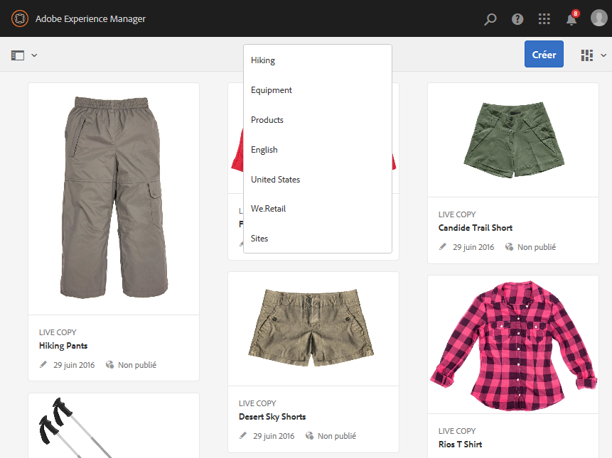

### Conventions de dénomination des pages {#page-naming-conventions}

Lors de la création d’une page, il y a deux champs clés :

* **[Titre](#title)** :

   * Il s’affiche pour l’utilisateur dans la console et dans la partie supérieure du contenu de la page lors de la modification.
   * Ce champ est obligatoire.

* **[Nom](#name)** :

   * Il est utilisé pour générer l’URI.
   * L’entrée utilisateur pour ce champ est facultative. S’il n’est pas spécifié, le nom est dérivé du titre. Consultez la section [Restrictions de nom de page et bonnes pratiques](/help/sites-authoring/managing-pages.md#page-name-restrictions-and-best-practices) pour plus d’informations.

#### Restrictions de nom de page et bonnes pratiques {#page-name-restrictions-and-best-practices}

Le **Titre** et le **Nom** de la page peuvent être créés séparément, mais ils sont associés :

* lors de la création d’une page, seul le champ **Titre** est requis. Si aucun **nom** n’est indiqué lors de la création de la page, AEM génère un nom à partir des 64 premiers caractères du titre (examinez la validation présentée ci-dessous). Seuls les 64 premiers caractères sont utilisés dans le cadre de la bonne pratique définie pour les noms de pages courts.

* Si un nom de page est spécifié manuellement par l’auteur, la limite de 64 caractères ne s’applique pas, mais d’autres limitations techniques sur la longueur du nom de la page peuvent s’appliquer.

>[!NOTE]
>
>Lorsque vous définissez un nom de page, une règle de base à respecter consiste à faire en sorte que le nom de la page reste court, mais aussi significatif que possible pour faciliter la compréhension du lecteur. Consultez le [Guide de style W3C](https://www.w3.org/Provider/Style/TITLE.html) sur l’élément `title` pour obtenir des informations supplémentaires.
>
>N’oubliez pas que certains navigateurs (par exemple, les anciennes versions d’IE) n’acceptent que les URL n’excédant pas une certaine longueur. C’est pourquoi il existe également une raison technique de garder les noms de pages courts.

Lors de la création d’une page, AEM [valide son nom en fonction des conventions](/help/sites-developing/naming-conventions.md) imposées par AEM et JCR.

Les caractères minimum autorisés sont :

* &quot;a&quot; à &quot;z&quot;
* &quot;A&quot; à &quot;Z&quot;
* &#39;0&#39; à &#39;9&#39;
* _ (trait de soulignement)
* `-` (tiret/signe moins)

Vous trouverez la liste complète et détaillée des caractères autorisés dans les [conventions de dénomination](/help/sites-developing/naming-conventions.md).

>[!NOTE]
>
>Si AEM est exécuté sur un [déploiement de gestionnaire de persistance MongoMK](/help/sites-deploying/recommended-deploys.md), les noms de page sont limités à 150 caractères.

#### Titre {#title}

Si vous n’indiquez qu’un **titre** de page lors de la création d’une page, AEM utilise le **nom** de la page de cette chaîne et [valide le nom en fonction des conventions](/help/sites-developing/naming-conventions.md) imposées par AEM et JCR. Un champ **Titre** contenant des caractères non valides sera accepté, mais les caractères non valides seront remplacés pour le nom dérivé. Par exemple :

| Titre | Nom dérivé |
|---|---|
| Schön | schoen.html |
| SC%&amp;&amp;ast;ç+ | sc---c-.html |

#### Nom {#name}

Si vous indiquez un **nom** de page lors de la création d’une page, AEM [valide le nom en fonction des conventions](/help/sites-developing/naming-conventions.md) imposées par AEM et JCR. Vous ne pouvez pas utiliser de caractères non valides dans le champ **Nom**. Lorsque AEM détecte des caractères non valides, le champ est mis en surbrillance avec un message d’explication.

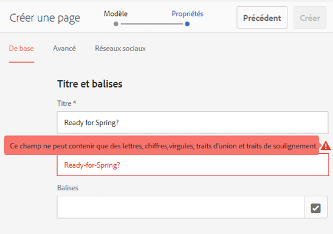

>[!NOTE]
>
>Vous devez éviter d’utiliser un code à deux lettres tel que défini par la norme ISO-639-1 comme nom de page, sauf s’il s’agit d’une racine de langue.
>
>Voir [Préparation du contenu à traduire](/help/sites-administering/tc-prep.md) pour plus d’informations.

### Modèles {#templates}

Dans AEM, un modèle spécifie un type de page spécialisé. Un modèle sera utilisé comme base pour toute nouvelle page en cours de création.

Le modèle définit la structure d’une page, y compris une miniature et d’autres propriétés. Par exemple, vous pouvez avoir des modèles distincts pour les pages de produits, les plans de site et les informations de contact. Les modèles se composent de [components](#components).

AEM comporte plusieurs modèles prêts à l’emploi. Les modèles disponibles dépendent du site web individuel. Les champs clés sont les suivants :

* **Titre**
Titre affiché sur la page web obtenue.

* **Nom**
Utilisé lors de l’attribution du nom de la page.

* **Modèle**
Liste des modèles utilisables lors de la génération de la nouvelle page.

>[!NOTE]
>
>Si cette option est configurée sur votre instance, [les auteurs de modèles peuvent créer des modèles avec l’éditeur de modèles](/help/sites-authoring/templates.md).

### Composants {#components}

Les composants sont des éléments fournis par AEM pour vous permettre d’ajouter des types spécifiques de contenu. Des [composants « prêts à l’emploi »](/help/sites-authoring/default-components-console.md) sont fournis avec AEM pour procurer une fonctionnalité complète. Il s’agit des composants suivants :

* Texte
* Image
* Slideshow
* Vidéo
* Et bien plus encore

Une fois que vous avez créé et ouvert une page, vous pouvez [ajouter du contenu à l’aide des composants ;](/help/sites-authoring/editing-content.md#inserting-a-component), qui sont disponibles à partir de l’ [explorateur de composants](/help/sites-authoring/author-environment-tools.md#components-browser).

>[!NOTE]
>
>La [console Composants](/help/sites-authoring/default-components-console.md) affiche un aperçu des composants sur votre instance.

## Gestion des pages {#managing-pages}

### Création d’une page {#creating-a-new-page}

Avant de pouvoir commencer à créer du contenu, vous devez créer une page, à moins que toutes les pages n’aient été créées pour vous à l’avance :

1. Ouvrez la console Sites (par exemple, [http://localhost:4502/sites.html/content](http://localhost:4502/sites.html/content)).
1. Accédez à l’emplacement où créer la page.
1. Ouvrez le sélecteur de liste déroulante avec l’option **Créer** de la barre d’outils, puis sélectionnez **Page** dans la liste :

   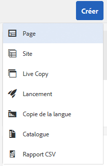

1. À la première étape de l’assistant, vous pouvez effectuer l’une des opérations suivantes :

   * Sélectionnez le modèle à utiliser pour créer la page, puis cliquez ou appuyez sur **Suivant** pour poursuivre.
   * Cliquez/appuyez sur **Annuler** pour interrompre le processus.

   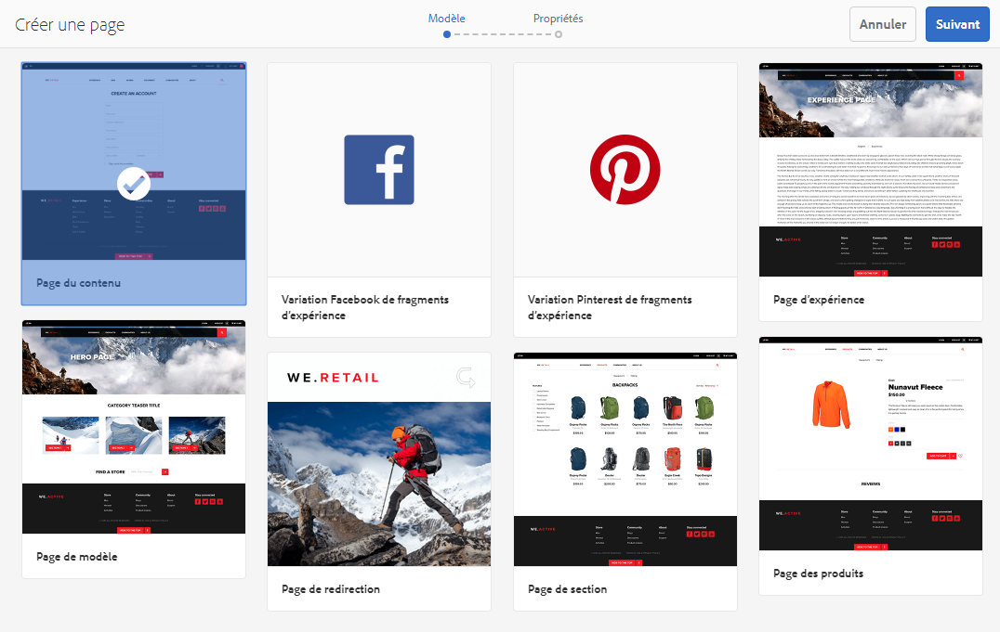

1. À l’étape finale de l’assistant, vous pouvez effectuer l’une des opérations suivantes :

   * Utilisez les trois onglets pour accéder aux [propriétés de la page](/help/sites-authoring/editing-page-properties.md) à attribuer à la nouvelle page, puis cliquez ou appuyez sur **Créer** pour réellement créer la page.
   * Utilisation **Précédent** pour revenir à la sélection de modèle.

   Les champs clés sont les suivants :

   * **Titre** :

      * Celui-ci s’affiche pour l’utilisateur et est obligatoire.
   * **Nom** :

      * Il est utilisé pour générer l’URI. S’il n’est pas spécifié, le nom est dérivé du titre.
      * Si vous indiquez le **nom** d’une page lors de la création d’une page, AEM [valide le nom en fonction des conventions](/help/sites-developing/naming-conventions.md) imposées par AEM et JCR.
      * Vous **ne pouvez pas utiliser de caractères non valides** dans le champ **Nom**. Lorsqu’AEM détecte des caractères non valides, le champ est mis en surbrillance et un message d’explication s’affiche et indique les caractères à supprimer/remplacer.

   >[!NOTE]
   >
   >Voir [Conventions de dénomination des pages](#page-naming-conventions).

   Les informations minimales requises pour créer une page sont les suivantes : **Titre**.

   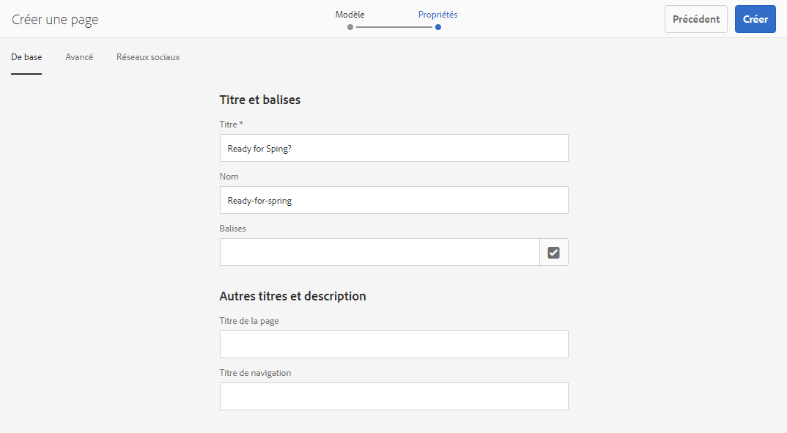

1. Cliquez ou appuyez sur **Créer** pour terminer le processus et créer la page. La boîte de dialogue de confirmation vous demande si vous souhaitez **ouvrir** immédiatement la page ou revenir à la console (**Terminé**) :

   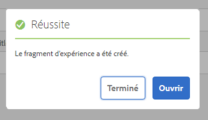

   >[!NOTE]
   >
   >Si vous créez une page en utilisant un nom qui existe déjà à cet emplacement, le système génère automatiquement une variante du nom en y ajoutant un numéro. Par exemple, si `winter` existe déjà, le nom de la nouvelle page sera `winter0`.

1. Si vous revenez à la console, la nouvelle page est présentée :

   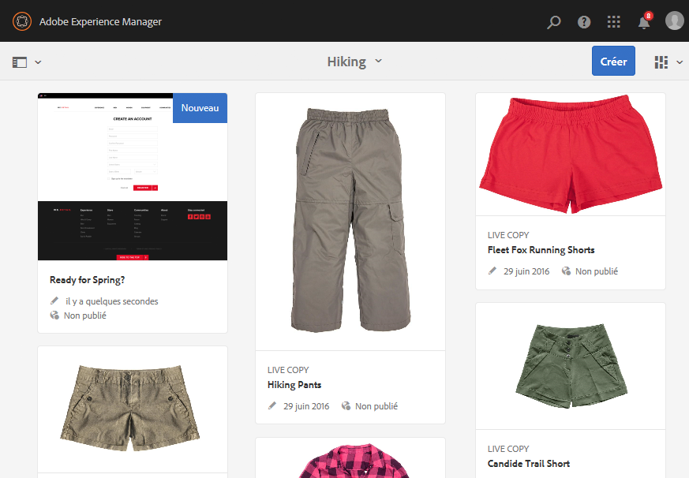

>[!CAUTION]
>
>Une fois qu’une page a été créée, son modèle ne peut plus être modifié, à moins de [créer un lancement avec un nouveau modèle](/help/sites-authoring/launches-creating.md#create-launch-with-new-template) ; vous perdrez alors tout contenu déjà existant.

### Ouverture d’une page pour la modifier {#opening-a-page-for-editing}

Après avoir créé une page ou accédé à une page existante (dans la console), vous pouvez l’ouvrir pour la modifier :

1. Ouvrez le **Sites** console.
1. Accédez à la page à modifier.
1. Sélectionnez votre page à l’aide de l’une des options suivantes :

   * [Actions rapides](/help/sites-authoring/basic-handling.md#quick-actions)
   * Le [mode de sélection](/help/sites-authoring/basic-handling.md#product-navigation) et la barre d’outils

   Sélectionnez ensuite l’icône **Modifier** :

   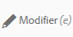

1. La page s’ouvre ; vous pouvez [la modifier](/help/sites-authoring/editing-content.md) selon vos besoins.

>[!NOTE]
>
>L’accès à d’autres pages à partir de l’Éditeur de page n’est possible qu’en mode Aperçu, car les liens ne sont pas actifs dans le mode d’édition.

### Copier et coller une page {#copying-and-pasting-a-page}

Vous pouvez copier une page et toutes ses sous-pages vers un nouvel emplacement :

1. Dans le **Sites** , accédez à la page à copier.
1. Sélectionnez votre page à l’aide de l’une des options suivantes :

   * [Actions rapides](/help/sites-authoring/basic-handling.md#quick-actions)
   * Le [mode de sélection](/help/sites-authoring/basic-handling.md#product-navigation) et la barre d’outils

   Et puis le **Copier** icône de page :

   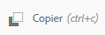

   >[!NOTE]
   >
   >Si vous êtes en mode de sélection, cette opération se déclenche automatiquement dès que la page est copiée.

1. Accédez à l’emplacement destiné à la nouvelle copie de la page.
1. Utilisez la variable **Coller** icône de page :

   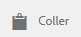

   Une copie de la page d’origine et de toutes les sous-pages sera créée à cet emplacement.

   >[!NOTE]
   >
   >Si vous copiez la page à un emplacement où il existe une page du même nom que l’original, le système génère automatiquement une variante du nom en y ajoutant un numéro. Par exemple, si `winter` existe déjà, `winter` deviendra `winter1`.

### Déplacement ou modification du nom d’une page {#moving-or-renaming-a-page}

>[!NOTE]
>
>Le changement de nom d’une page est également soumis au [Conventions de dénomination des pages](#page-naming-conventions) lors de la spécification du nouveau nom de page.

>[!NOTE]
>
>Une page ne peut être déplacée qu’à un emplacement où le modèle sur lequel la page est basée est autorisé. Pour plus d’informations, voir [Disponibilité des modèles](/help/sites-developing/templates.md#template-availability).

La procédure pour déplacer ou renommer une page est plus ou moins la même et est gérée par le même assistant. Cet assistant permet d’effectuer les opérations suivantes :

* Renommer une page sans la déplacer
* Déplacer la page sans la renommer
* Déplacer et renommer une page simultanément.

AEM vous offre la possibilité de mettre à jour les liens internes qui font référence à la page en cours de changement de nom. Cette opération peut être effectuée page par page afin d’offrir une flexibilité totale.

1. Accédez à la page à déplacer.
1. Sélectionnez votre page à l’aide de l’une des options suivantes :

   * [Actions rapides](/help/sites-authoring/basic-handling.md#quick-actions)
   * Le [mode de sélection](/help/sites-authoring/basic-handling.md#product-navigation) et la barre d’outils

   Sélectionnez ensuite le **Déplacer** icône de page :

   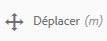

   L’assistant de déplacement de page s’ouvre alors.

1. Dans la **Renommer** à l’étape de l’assistant, vous pouvez effectuer l’une des opérations suivantes :

   * Spécifiez le nom à attribuer à la page après son déplacement et cliquez/appuyez sur **Suivant** pour poursuivre.
   * Cliquez/appuyez sur **Annuler** pour interrompre le processus.

   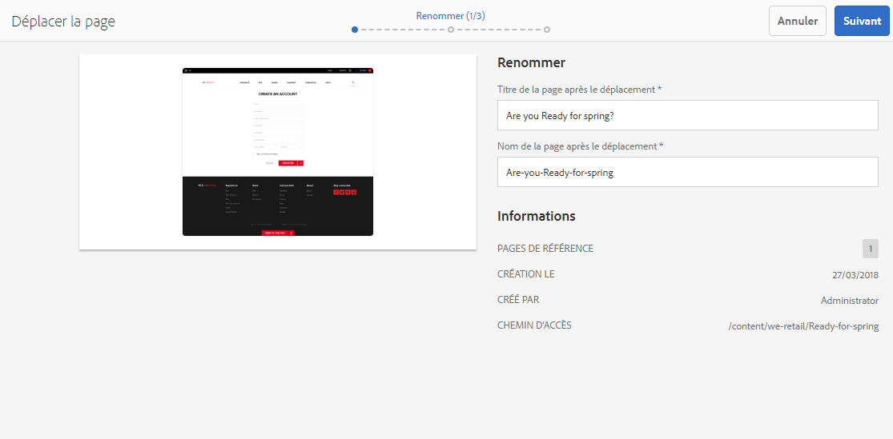

   Le nom de la page peut rester identique si vous déplacez uniquement la page.

   >[!NOTE]
   >
   >Si vous déplacez la page à un emplacement où il existe une page du même nom, le système génère automatiquement une variante du nom en y ajoutant un numéro. Par exemple, si `winter` existe déjà, `winter` deviendra `winter1`.

1. Dans la **Sélectionner la destination** à l’étape de l’assistant, vous pouvez effectuer l’une des opérations suivantes :

   * Utilisez la variable [mode colonne](/help/sites-authoring/basic-handling.md#column-view) pour accéder au nouvel emplacement de la page :

      * Sélectionnez la destination en cliquant sur sa miniature.
      * Cliquez sur **Suivant** pour continuer.
   * Utilisation **Précédent** pour revenir à la spécification du nom de page.

   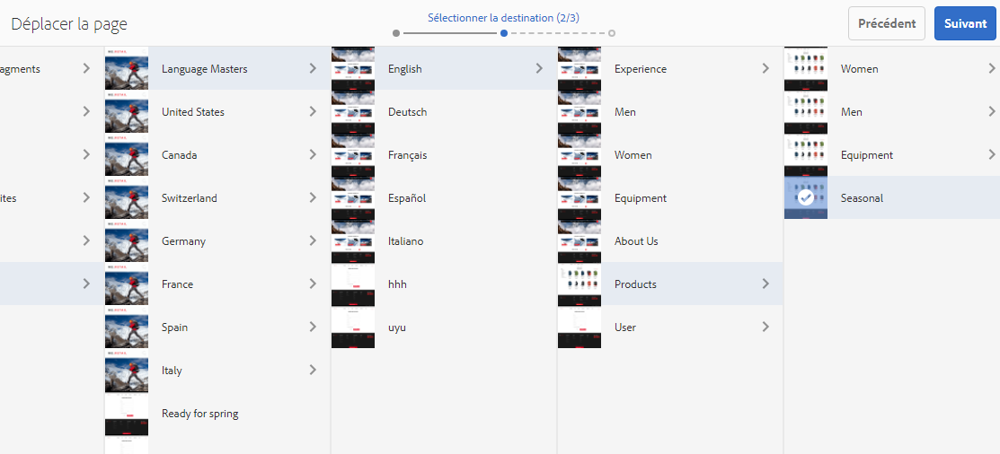

   >[!NOTE]
   >
   >Si vous déplacez la page à un emplacement où il existe une page du même nom, le système génère automatiquement une variante du nom en y ajoutant un numéro. Par exemple, si `winter` existe déjà, `winter` deviendra `winter1`.

1. Si la page est liée ou référencée, ces références sont répertoriées dans la variable **Ajuster/republier** étape . Vous pouvez indiquer quelles pages adapter et republier, le cas échéant.

   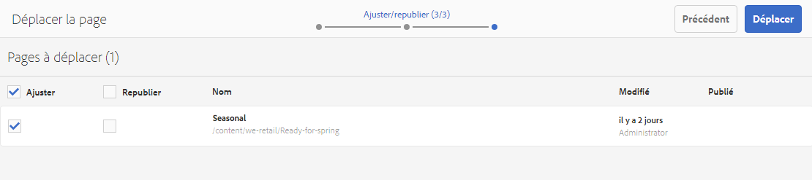

1. Sélection **Déplacer** terminera le processus et déplacera/renommera votre page selon les besoins.

>[!NOTE]
>
>Si la page a déjà été publiée, son déplacement la dépublie automatiquement. Par défaut, il sera republié une fois le déplacement terminé, mais ce paramètre peut être modifié en décochant la case **Republier** dans le champ **Ajuster/republier** étape .

>[!NOTE]
>
>Si la page n’est pas référencée, les étapes **Ajuster/republier** sont ignorées.

### Suppression d’une page {#deleting-a-page}

1. Accédez à la page que vous souhaitez supprimer.
1. En [mode de sélection](/help/sites-authoring/basic-handling.md#viewing-and-selecting-resources), sélectionnez la page requise, puis utilisez la commande **Supprimer** de la barre d’outils :

   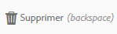

   >[!NOTE]
   >
   >Par mesure de sécurité, l’icône **Supprimer la page** n’est pas disponible en tant qu’action rapide.

1. Une boîte de dialogue de confirmation s’affiche.

   * **Voulez-vous archiver les pages avant la suppression ?** – Si cette case est cochée, les versions des pages sélectionnées pour suppression seront créées lors de la suppression.
      * [Il est possible de restaurer les versions ultérieurement.](/help/sites-authoring/working-with-page-versions.md)
      * Les pages supprimées sans les versions précédentes ne peuvent pas être restaurées.
      * Cette option est disponible uniquement depuis AEM version 6.4.7.0.
   * **Annuler** pour abandonner l’action
   * **Supprimer** pour confirmer l’action :

      * Si la page ne comporte aucune référence, elle est supprimée.
      * Si la page comporte des références, un message vous informe qu’**une ou plusieurs pages sont référencées.** Vous pouvez sélectionner **Forcer la suppression** ou **Annuler**.

>[!NOTE]
>
>Si une page est déjà publiée, elle est automatiquement dépubliée avant suppression.

### Verrouillage d’une page    {#locking-a-page}

Vous pouvez [verrouiller ou déverrouiller une page](/help/sites-authoring/editing-content.md#locking-a-page) à partir d’une console ou lorsque vous modifiez une page. Les deux environnements indiquent également si une page est verrouillée ou non.

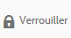 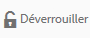

### Création d’un dossier {#creating-a-new-folder}

Vous pouvez créer des dossiers pour classer vos fichiers et vos pages.

>[!NOTE]
>
>Les dossiers sont également soumis aux [Conventions de dénomination des pages](#page-naming-conventions) lors de la spécification du nouveau nom de dossier.

>[!CAUTION]
>
>* Les dossiers ne peuvent être créés que directement sous **Sites** ou sous d’autres dossiers. Ils ne peuvent pas être créés sous une page.
>* Les opérations standard (déplacer, copier, coller, supprimer, publier, dépublier et afficher/modifier les propriétés) peuvent être effectuées sur un dossier.
>* Dans une Live Copy, les dossiers ne peuvent pas être sélectionnés.
>


1. Ouvrez le **Sites** et accédez à l’emplacement requis.
1. Pour ouvrir la liste des options, sélectionnez **Créer** de la barre d’outils ;
1. Sélectionner **Dossier** pour ouvrir la boîte de dialogue. Vous pouvez y entrer le **nom** et le **titre** :

   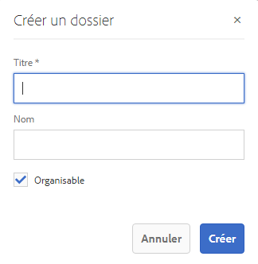

1. Pour créer le dossier, sélectionnez **Créer**.
