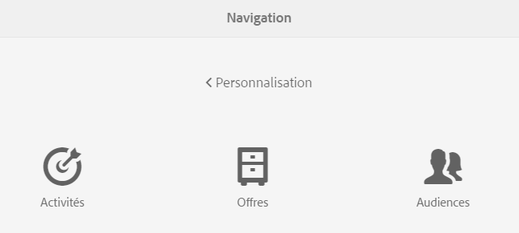
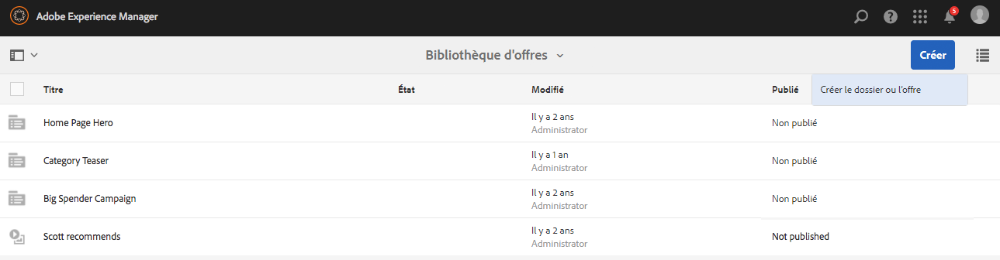
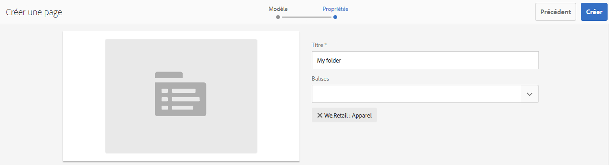
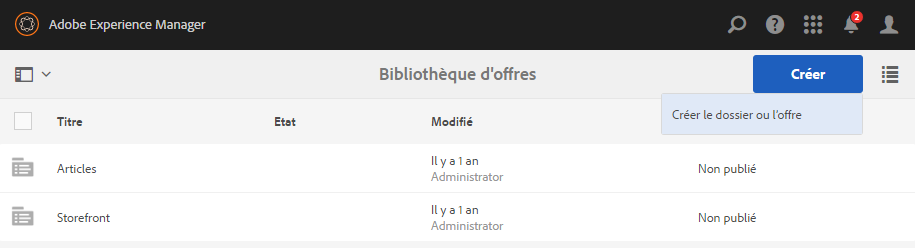
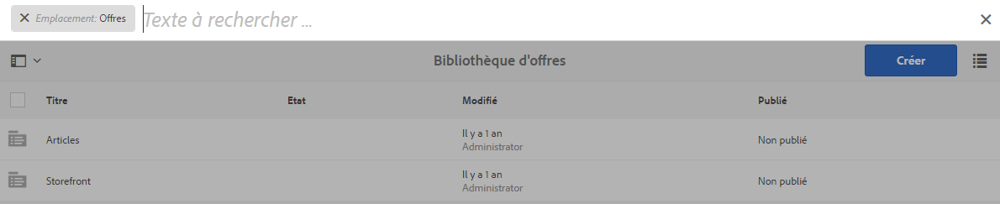

# Création et gestion d’offres{#creating-and-managing-offers}

>[!CAUTION]
>
>AEM 6.4 a atteint la fin de la prise en charge étendue et cette documentation n’est plus mise à jour. Pour plus d’informations, voir notre [période de support technique](https://helpx.adobe.com/fr/support/programs/eol-matrix.html). Rechercher les versions prises en charge [here](https://experienceleague.adobe.com/docs/?lang=fr).

Utilisez la console Offres pour créer des offres que vous pouvez [utilisation dans les expériences d’activité](/help/sites-authoring/content-targeting-touch.md). La création d’offres dans la console Offres permet de gagner du temps lorsque plusieurs expériences nécessitent la même offre :

* Créez l’offre une fois dans la bibliothèque et utilisez-la dans plusieurs expériences des activités de votre marque.
* La modification de l’offre dans la bibliothèque affecte toutes les expériences qui l’utilisent.

La console Offres classe les offres par marque. Chaque marque contient une bibliothèque d’offres qui peut être utilisée dans les expériences d’une marque. Utilisez des dossiers pour définir une structure hiérarchique pour organiser les offres dans chaque bibliothèque. Une structure de dossiers logique permet aux auteurs de trouver facilement des offres en naviguant. Les outils de balisage et de recherche permettent également aux auteurs de trouver des offres.

## Ajout d’une marque dans la console Offres {#add-a-brand-using-the-offers-console}

Créez une marque à laquelle vos offres sont associées. Ouvrez une marque dans la console Offres pour accéder à la bibliothèque d’offres dans laquelle vous pouvez créer des dossiers et des offres.

Lorsque vous créez une marque à l’aide de la console Offres, elle apparaît également dans la [Console Activités](/help/sites-authoring/activitylib.md) où vous pouvez ajouter et administrer des activités pour la marque.

1. Dans la console de navigation, cliquez ou appuyez sur **Personnalisation** > **Offres**.

   

1. Cliquez ou appuyez sur **Créer**, puis sur **Créer une marque**.
1. Sélectionnez le modèle de marque et cliquez ou appuyez sur **Suivant**.
1. Saisissez le titre de la marque tel que vous souhaitez le voir apparaître dans les consoles Offres et Activités . Vous pouvez éventuellement saisir ou sélectionner une ou plusieurs balises à associer à la marque.
1. Cliquez ou appuyez sur **Créer**.

## Ajout d’un fichier à une bibliothèque d’offres {#add-a-folder-to-an-offer-library}

Ajoutez un dossier à la bibliothèque d’offres d’une marque pour organiser et stocker les offres. Vous pouvez créer un dossier sous la marque ou sous d’autres dossiers.

1. Dans la console Offres, ouvrez l’emplacement où vous souhaitez créer le dossier. Par exemple, ouvrez la marque pour créer un dossier de niveau supérieur ou ouvrez un autre dossier dans la bibliothèque.
1. Cliquez ou appuyez sur **Créer** > **Créer un dossier ou une offre**.

   

1. Sélectionnez **Dossier**, puis cliquez sur **Suivant**.
1. Entrez un titre pour le dossier tel qu’il doit apparaître dans la bibliothèque d’offres et saisissez ou sélectionnez des balises.

   

1. Cliquez ou appuyez sur **Créer**.

## Ajout d’une offre à une bibliothèque d’offres {#add-an-offer-to-an-offer-library}

Ajoutez une offre à la bibliothèque d’offres d’une marque afin qu’elle puisse être ajoutée aux expériences de la marque. Lorsque vous ajoutez une offre, vous fournissez un titre. Vous pouvez également associer l’offre à une ou plusieurs balises pour améliorer la recherche.

Après avoir créé l’offre, vous pouvez l’ouvrir pour créer le contenu.

1. Dans la console Offres, ouvrez l’emplacement où vous souhaitez créer l’offre. Par exemple, ouvrez la marque pour créer une offre de niveau supérieur ou ouvrez un dossier dans la bibliothèque.
1. Cliquez ou appuyez sur **Créer** > **Créer un dossier ou une offre**.

   

1. Sélectionnez la **Page d’offres** modèle , puis cliquez ou appuyez sur **Suivant**.
1. Saisissez un titre pour l’offre et éventuellement sélectionnez ou saisissez une ou plusieurs balises à associer à l’offre, puis cliquez ou appuyez sur . **Créer**.
1. Dans la boîte de dialogue de confirmation, pour ouvrir l’offre à modifier, cliquez ou appuyez sur **Ouvrir la page**.

## Modification d’une offre {#editing-an-offer}

Ouvrez une offre et modifiez le contenu tel que vous souhaitez le voir apparaître dans les expériences qui l’utilisent. Lorsque vous modifiez une offre qui est utilisée dans n’importe quelle expérience, vos modifications apparaissent dans les expériences.

Vous pouvez ouvrir une offre à partir d’un dossier dans une bibliothèque d’offres ou à partir des résultats de recherche. Vous pouvez également ouvrir une offre à partir d’une expérience qui utilise l’offre.

1. Dans la console Offres, appuyez ou cliquez sur l’icône en regard de l’offre, puis cliquez ou appuyez sur **Modifier**.
1. Ajoutez des composants à l’offre et modifiez le contenu du composant comme vous le faites habituellement.

## Suppression d’une offre {#deleting-an-offer}

Supprimez une offre lorsqu’elle n’est plus nécessaire. Lorsque vous tentez de supprimer une offre utilisée dans une expérience, vous êtes invité à confirmer la suppression. Confirmer supprime l’offre et la supprime des expériences.

Vous pouvez supprimer une offre tout en affichant le contenu d’un dossier dans une bibliothèque d’offres ou les résultats de la recherche.

1. Dans la console Offres, appuyez ou cliquez sur l’icône en regard de l’offre, puis cliquez ou appuyez sur **Supprimer**.

   Sélectionnez l’offre et cliquez ou appuyez sur **Supprimer**.

1. Dans la boîte de dialogue qui s’affiche, cliquez ou appuyez sur **Supprimer** pour confirmer la suppression.
1. Si l’offre est utilisée dans une ou plusieurs expériences, une boîte de dialogue s’affiche pour indiquer que l’offre est référencée :

   * Pour supprimer l’offre et la supprimer des expériences, cliquez ou appuyez sur **Forcer la suppression**.
   * Pour conserver l’offre, cliquez ou appuyez sur **Annuler**.

## Recherche d’offres {#searching-for-offers}

Recherchez les offres d’une marque quelconque à l’aide de mots-clés correspondant à leur titre.

Les critères de recherche actuels s’affichent en regard des résultats de recherche. Vous pouvez également trier les résultats par colonne dans l’ordre croissant ou décroissant. Vous pouvez effectuer une recherche à partir de n’importe quel dossier de n’importe quelle bibliothèque d’offres. Les résultats de la recherche sont les mêmes, quel que soit le dossier actif.

Pour rechercher des offres :

1. En haut de la console Offres, cliquez ou appuyez sur l’icône en forme de loupe. Par défaut, la recherche se limite aux offres.
1. Saisissez votre mot-clé pour rechercher des offres. Sélectionnez dans les résultats.
