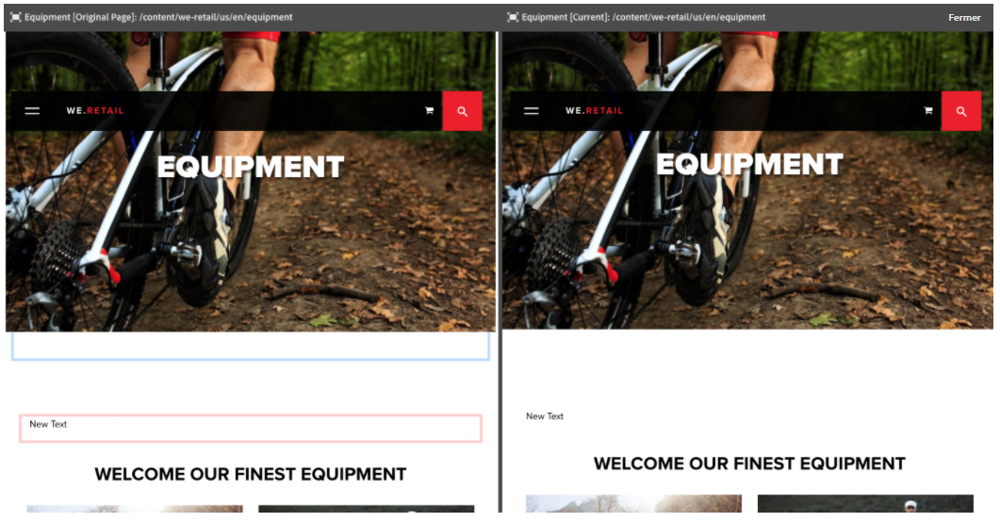
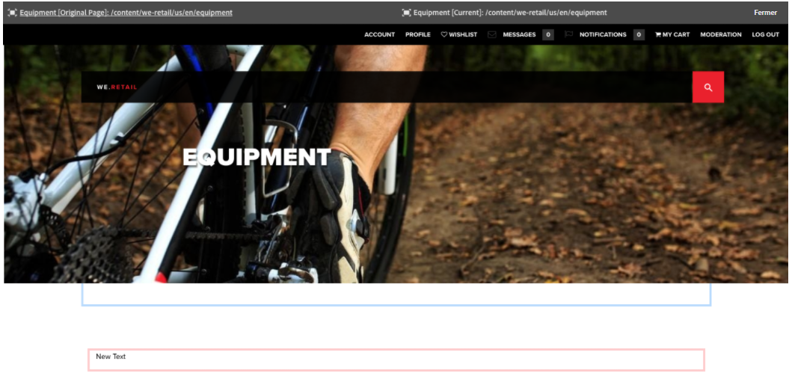

# Outil de comparaison des pages{#page-diff}

>[!CAUTION]
>
>AEM 6.4 a atteint la fin de la prise en charge étendue et cette documentation n’est plus mise à jour. Pour plus d’informations, voir notre [période de support technique](https://helpx.adobe.com/fr/support/programs/eol-matrix.html). Rechercher les versions prises en charge [here](https://experienceleague.adobe.com/docs/?lang=fr).

## Présentation {#introduction}

La création de contenu est un processus itératif. Pour être efficace lorsque vous créez du contenu, vous devez pouvoir voir ce qui a changé d’une version à l’autre. L’affichage d’une version de page, puis de l’autre, est inefficace et susceptible d’erreur. Un auteur souhaite pouvoir facilement comparer la page actuelle côte à côte à une autre version.

De fait, l’outil de comparaison des pages permet d’afficher côte à côte deux pages pour les comparer en mettant en évidence leurs différences.

>[!CAUTION]
>
>Si vous exécutez une version antérieure à AEM 6.4.3, l’utilisateur doit disposer de la variable **Modifier/Créer/Supprimer** autorisation sur le noeud `/content/versionhistory` pour utiliser la fonctionnalité.
>
>Consultez la section consacrée à l’[outil de comparaison des pages](/help/sites-developing/pagediff.md#operation-details) pour plus d’informations sur cette fonction.

## Utilisez {#use}

L’outil de comparaison côte à côte permet de comparer les éléments suivants :

* [Versions](/help/sites-authoring/working-with-page-versions.md#comparing-a-version-with-current-page) : la version actuelle d’une page et sa version antérieure.
* [Live Copies](/help/sites-administering/msm-livecopy.md#comparing-a-live-copy-page-with-a-blueprint-page) : une Live Copy et son plan directeur
* [Lancements](/help/sites-authoring/launches-editing.md#comparing-a-launch-page-to-its-source-page) : un lancement et sa source
* [Copies de langue](/help/sites-administering/tc-manage.md#comparing-language-copies) : une page avant et après (re)traduction

Reportez-vous aux rubriques correspondantes afin de connaître la procédure de comparaison pour ces différents éléments.

### Présentation des différences {#presentation-of-differences}

Quel que soit le contenu comparé, la présentation de l’outil de comparaison reste la même.

* Le contenu sélectionné au démarrage de l’outil de comparaison s’affiche à gauche (le point d’entrée de l’outil de comparaison).
* Le contenu de la comparaison est affiché à droite (par rapport au contenu sélectionné).

Par exemple, si vous comparez des versions, la version actuelle est affichée à gauche et la version précédente à droite.

La source des deux pages s’affiche clairement dans la barre d’en-tête située en haut de la fenêtre du navigateur.

L’outil de comparaison détecte les modifications effectuées sur les composants et le code HTML. Les éléments qui ont été modifiés sont mis en surbrillance avec des couleurs différentes.

**Modifications des composants**

* Vert clair : composant ajouté
* Rose : composant supprimé
* Bleu - Composant modifié
* Bleu - Composant déplacé

Notez que les couleurs modifiées et déplacées sont les mêmes.

**Modifications du HTML**

* Vert foncé - HTML ajouté
* Rouge : HTML supprimé

>[!NOTE]
>
>Lorsque vous comparez des copies de langue, la mise en surbrillance est désactivée. En effet, dans la mesure où la traduction modifie tout le contenu, la mise en surbrillance ne présente aucun intérêt.

### Affichage en mode plein écran {#fullscreen-and-exiting}

Si vous souhaitez vous concentrer sur un contenu spécifique, vous pouvez cliquer sur l’icône du mode plein écran pour l’un ou l’autre des deux « côtés » de votre comparaison. Cela vous permet d’afficher la version en plein écran dans la fenêtre du navigateur.

Le côté sélectionné s’affiche dans la totalité de la fenêtre, mais la barre d’en-tête reste disponible en haut de la fenêtre pour vous permettre de basculer d’une page à l’autre si vous le souhaitez.

Vous pouvez également quitter le mode plein écran en cliquant sur l’icône de fermeture du mode plein écran.

Vous pouvez quitter le mode de comparaison côte à côte à tout moment en cliquant sur le bouton Fermer dans l’en-tête.

## Restrictions {#limitations}

Dans certains cas, l’outil de comparaison des pages peut ne pas détecter une différence comme prévu.

* Lors de la comparaison des versions et lancements, la comparaison ne prend pas en compte les composants dynamiques tels que les chemins de navigation, les menus, les listes de produits ou les logos (composants qui dépendent de la structure du site pour effectuer le rendu de leur contenu).
* Pour les versions, la comparaison ne recrée pas la stratégie de contrôle d’accès et les relations Live Copy.
* Ainsi, les modifications effectuées sur une image, comme la modification des attributs alt, title ou src, sont indiquées en bleu. Cependant, dans certains cas, l’image a une représentation Base64 de l’attribut src et même si les deux images semblent identiques, elles sont indiquées comme différentes en raison de leur attribut src.
* L’outil de comparaison ne peut pas détecter la rotation de l’image.
* Si une page est déplacée, vous ne pouvez plus effectuer de comparaison avec les versions antérieures au déplacement.

   * Si vous rencontrez des problèmes avec une comparaison, vérifiez la variable [Chronologie](/help/sites-authoring/basic-handling.md#timeline) pour la page afin de voir si la page a été déplacée.

>[!NOTE]
>
>Les versions ne peuvent pas être comparées entre elles. Seule la version en cours peut être comparée aux autres versions de la page. La version dont les modifications sont mises en surbrillance est toujours la version en cours.

>[!NOTE]
>
>Pour plus d’informations sur le fonctionnement de l’outil de comparaison des pages, ainsi que sur les limites qui peuvent affecter cette comparaison, reportez-vous à la section [documentation destinée aux développeurs](/help/sites-developing/pagediff.md) de cette fonctionnalité.
