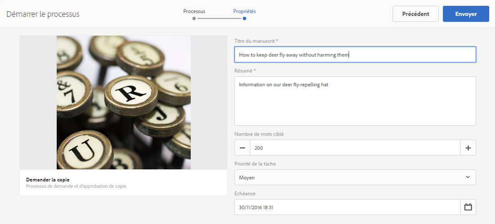
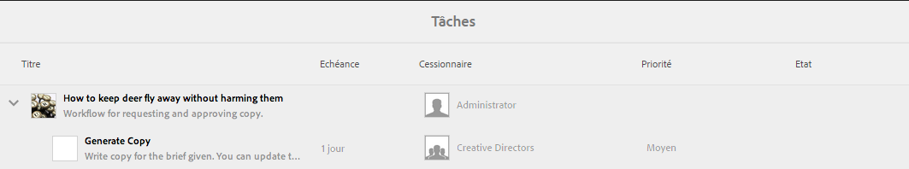
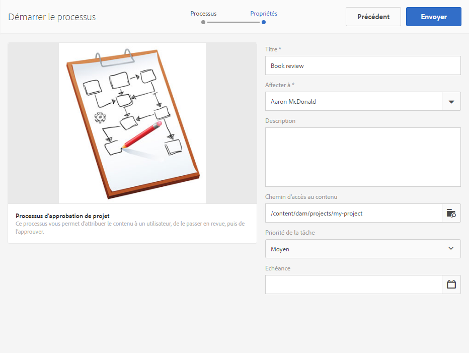
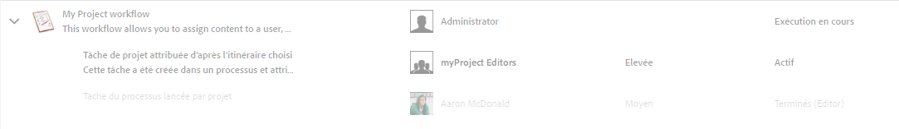
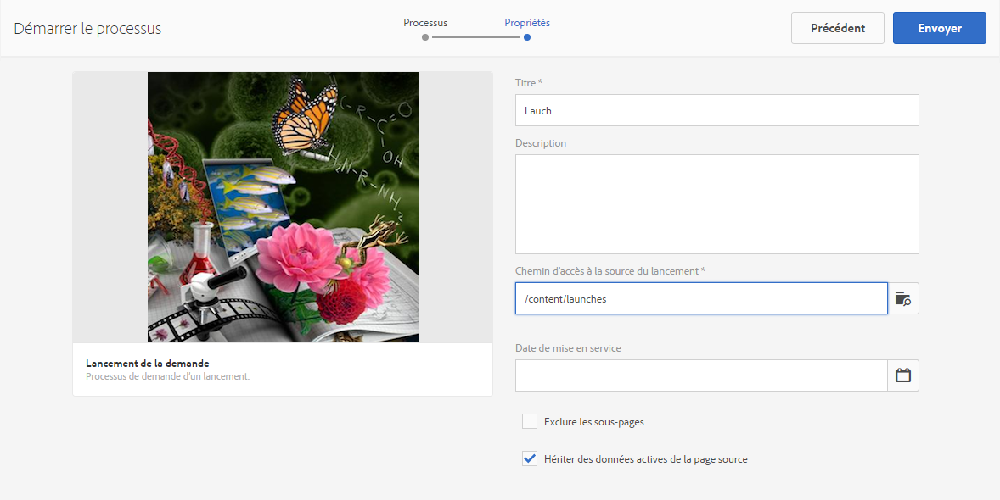
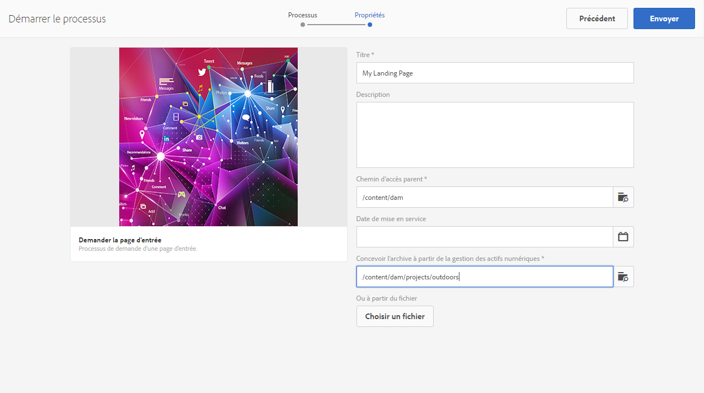
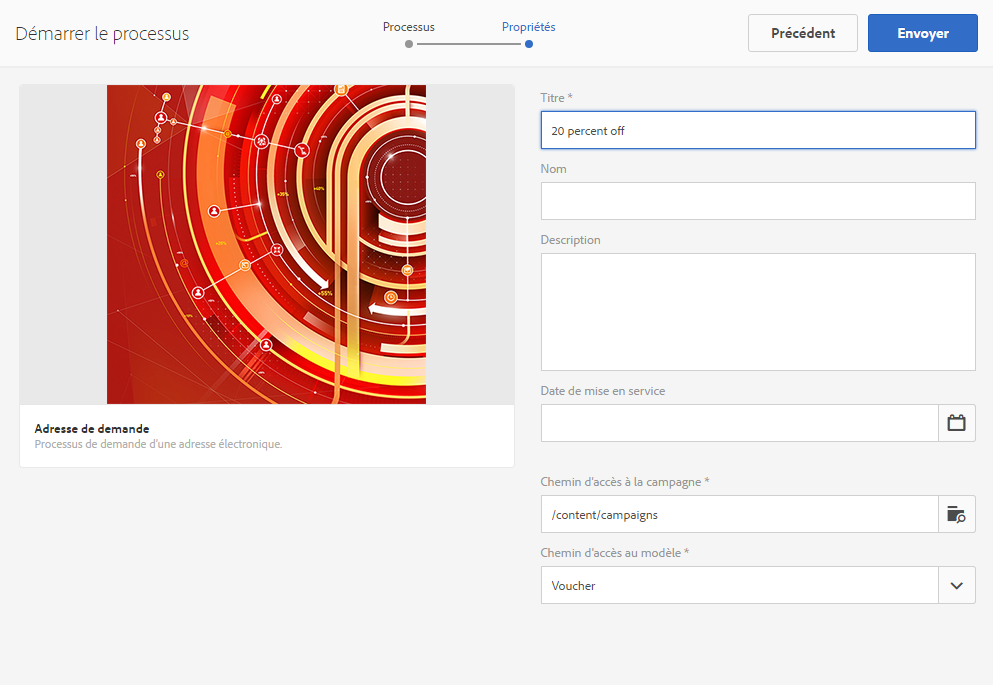
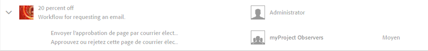

# Utilisation des workflows de projet{#working-with-project-workflows}

>[!CAUTION]
>
>AEM 6.4 a atteint la fin de la prise en charge étendue et cette documentation n’est plus mise à jour. Pour plus d’informations, voir notre [période de support technique](https://helpx.adobe.com/fr/support/programs/eol-matrix.html). Rechercher les versions prises en charge [here](https://experienceleague.adobe.com/docs/?lang=fr).

Les workflows de projet disponibles et prêts à l’emploi sont les suivants :

* **Workflow d’approbation de projet** : Ce workflow vous permet d’attribuer le contenu à un utilisateur, de le passer en revue, puis de l’approuver.
* **Demander le lancement** : ce workflow demande un lancement.
* **Demander la page d’entrée** : ce workflow demande une page d’entrée.
* **Demander l’adresse électronique** : ce workflow demande une adresse électronique.
* **Séance photo du produit et séance photo du produit (Commerce)** - Associe les ressources aux produits.
* **Gestion des actifs numériques (DAM) – Créer et traduire la copie et Gestion des actifs numériques (DAM) – Créer une copie de langue** : crée des fichiers binaires, des métadonnées et des balises traduits pour les ressources et les dossiers.

Selon le modèle de projet que vous sélectionnez, certains workflows sont disponibles :

|  | **Projet simple** | **Projet de média** | **Projet de séance photo du produit** | **Projet de traduction** |
|---|:-:|:-:|:-:|:-:|
| Demander la copie |  | x |  |  |
| Séance photo du produit |  | x | x |  |
| Séance photo du produit  (Commerce) |  |  | x |  |
| Approbation du projet | x |  |  |  |
| Demander le lancement | x |  |  |  |
| Demander la page d’entrée | x |  |  |  |
| Demander une adresse | x |  |  |  |
| DAM Créer copie de langue&amp;ast; |  |  |  | x |
| DAM Créer et traduire copie de langue&amp;ast; |  |  |  | x |

>[!NOTE]
>
>&amp;ast; Ces workflows ne sont pas lancés via la mosaïque **Workflow** dans les projets. Reportez-vous à la section [Création de copies de langue pour les ressources](/help/sites-administering/tc-manage.md).

Les étapes de démarrage et d’achèvement des workflows sont les mêmes, quel que soit le workflow choisi. Seules les étapes changent.

Vous commencez un workflow directement dans les projets (à l’exception de Gestion des actifs numériques (DAM) – Créer une copie de langue ou Gestion des actifs numériques (DAM) – Créer et traduire la copie de langue). Les informations sur les tâches en attente d’un projet sont répertoriées dans la section **Tâches** mosaïque. Les notifications relatives aux tâches à effectuer s’affichent en regard de l’icône utilisateur.

Pour plus d’informations sur l’utilisation des workflows dans AEM, voir :

* [Participation aux workflows](/help/sites-authoring/workflows-participating.md)
* [Application de workflows aux pages](/help/sites-authoring/workflows-applying.md)
* [Configuration de workflow](/help/sites-administering/workflows.md)

Cette section décrit les workflows disponibles pour les projets.

## Workflow de demande de copie {#request-copy-workflow}

Ce workflow permet de demander un manuscrit à un utilisateur, puis de le valider. Pour démarrer le workflow de copie de requête :

1. Dans votre projet de média, sélectionnez l’option de connexion **+** dans la mosaïque **Workflows**, puis sélectionnez le workflow **Demander la copie**.
1. Saisissez un titre de manuscrit et un bref résumé de ce que vous demandez. Le cas échéant, saisissez un nombre de mots cible, une priorité de tâche et une date d’échéance.

   

1. Cliquez sur **Créer**. Le workflow commence. La tâche apparaît dans la **Tâches** mosaïque.

   

## Workflow Séance photo du produit {#product-photo-shoot-workflow}

Les workflows Séance photo du produit (commerce et sans commerce) sont présentés en détail dans la section [Projet créatif](/help/sites-authoring/managing-product-information.md).

## Workflow d’approbation de projet {#project-approval-workflow}

Dans le workflow d’approbation de projet, vous attribuez du contenu à un utilisateur et passez en revue ce contenu, puis vous l’approuvez.

1. Dans votre projet simple, sélectionnez la ****+** se connecter à **Workflows** et sélectionnez **Workflow d’approbation de projet**.
1. Saisissez un titre et sélectionnez à qui l’affecter dans la liste Équipe. Le cas échéant, entrez une description, le chemin d’accès au contenu, la priorité de tâche et la date d’échéance.

   

1. Cliquez sur **Créer**. Le workflow commence. La tâche apparaît dans la **Tâches** mosaïque.

   

## Workflow Demander le lancement {#request-launch-workflow}

Ce workflow vous permet de demander un lancement.

1. Dans votre projet simple, sélectionnez l’option de connexion **+** dans la mosaïque **Workflows**, puis sélectionnez **Workflow Demander le lancement**.
1. Saisissez un titre pour le lancement et indiquez le chemin d’accès source du lancement. Vous pouvez également ajouter une description et une date d’activation, le cas échéant. Sélectionnez Hériter des données actives de la page source ou excluez des sous-pages selon le comportement souhaité du lancement.

   

1. Cliquez sur **Créer**. Le workflow commence. Le workflow apparaît dans la liste **Workflows** (cliquez sur les points de suspension **...** de la mosaïque **Workflows** pour accéder à cette liste).

## Workflow Demander la page d’entrée {#request-landing-page-workflow}

Ce workflow vous permet de demander une page de destination.

1. Dans votre projet simple, sélectionnez l’option **+** se connecter à **Workflows** et sélectionnez Worfklow Demander la page d’entrée .
1. Saisissez un titre pour votre landing page et le chemin parent. Le cas échéant, saisissez une date d’activation ou choisissez un fichier pour votre landing page.

   

1. Cliquez sur **Créer**. Le workflow commence. La tâche apparaît dans la **Tâches** mosaïque.

## Workflow de demande de courrier électronique {#request-email-workflow}

Ce workflow permet de demander un email. Il s’agit du même workflow qui s’affiche dans la variable **Emails** mosaïque.

1. Dans votre projet Media ou Simple, sélectionnez la méthode **+** se connecter à **Workflows** et sélectionnez **Processus de demande de courrier électronique**.
1. Saisissez un titre d’email, ainsi que les chemins d’accès aux campagnes et aux modèles. En outre, vous pouvez fournir un nom, une description et une date d’activation.

   

1. Cliquez sur **Créer**. Le workflow commence. La tâche apparaît dans la **Tâches** mosaïque.

   

## Workflow Créer (et traduire) la copie de la langue pour les ressources {#create-and-translate-language-copy-workflow-for-assets}

Le **Créer une copie de langue** et le **Créer et traduire une copie de langue** les workflows sont présentés en détail dans la section [Création de copies de langue pour les ressources.](/help/assets/translation-projects.md)
