# Projets{#projects}

>[!CAUTION]
>
>AEM 6.4 a atteint la fin de la prise en charge étendue et cette documentation n’est plus mise à jour. Pour plus d’informations, voir notre [période de support technique](https://helpx.adobe.com/fr/support/programs/eol-matrix.html). Rechercher les versions prises en charge [here](https://experienceleague.adobe.com/docs/?lang=fr).

Les projets vous permettent de regrouper des ressources dans une seule entité. Un environnement commun et partagé facilite la gestion de vos projets. Les types de ressources que vous pouvez associer à un projet sont appelés mosaïques dans AEM. Les mosaïques peuvent inclure des informations de projet et d’équipe, des ressources numériques, des workflows et d’autres types d’informations, comme le précise en détail la section [Mosaïques de projet](#project-tiles).

>[!CAUTION]
>
>Pour que les utilisateurs participant à des projets voient d’autres utilisateurs/groupes lorsqu’ils utilisent des fonctionnalités de la console Projets comme créer des projets, créer des tâches/workflows, afficher et gérer l’équipe, ils doivent disposer d’un accès en lecture à **/home/users** et **/home/groups**. Le moyen le plus simple de mettre en oeuvre cette méthode consiste à attribuer la variable **projects-users** accès en lecture au groupe **/home/users** et **/home/groups**.

En tant qu’utilisateur, vous pouvez effectuer les opérations suivantes :

* Création de projets
* Associer du contenu et des dossiers de ressources à un projet
* Suppression de projets
* Supprimer les liens de contenu d’un projet

Reportez-vous aux rubriques supplémentaires suivantes :

* [Gestion de projets](/help/sites-authoring/touch-ui-managing-projects.md)
* [Utilisation de tâches](/help/sites-authoring/task-content.md)
* [Utilisation des workflows de projet](/help/sites-authoring/projects-with-workflows.md)
* [Projet de création et intégration à PIM](/help/sites-authoring/managing-product-information.md)

## Console Projets {#projects-console}

Dans AEM, la console Projets permet d’accéder à vos projets et de les gérer.

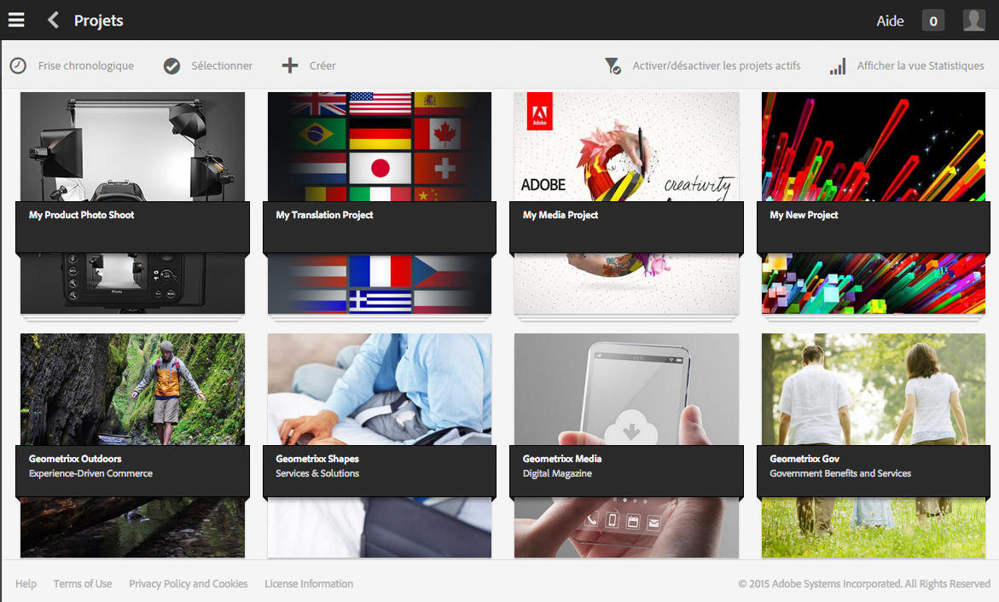

* Sélectionner **Chronologie** puis un projet pour afficher sa chronologie.
* Cliquez/appuyez sur **Sélectionner** pour passer en mode de sélection.
* Cliquez sur **Créer** pour ajouter des projets.
* **Activation/désactivation de projets Principaux** permet de basculer entre tous les projets et uniquement ceux qui sont principaux.
* **Afficher la vue Statistiques** vous permet d’afficher les statistiques de projet concernant les tâches terminées.

## Mosaïques de projet {#project-tiles}

Avec les projets, vous associez différents types d’informations à vos projets. Elles sont appelées **Mosaïques**. Chacune des mosaïques et le type d’informations qu’elles contiennent sont décrits dans cette section.

Vous pouvez associer les mosaïques suivantes à votre projet. Chacune d’elles est décrite dans les sections suivantes :

* Ressources et collections de ressources
* Expériences
* Liens
* Informations sur le projet
* Équipe
* Pages d’entrée
* E-mails
* Workflows
* Lancements
* Tâches

### Ressources {#assets}

Dans la mosaïque **Ressources**, vous pouvez regrouper tous les éléments dont vous avez besoin pour un projet particulier.

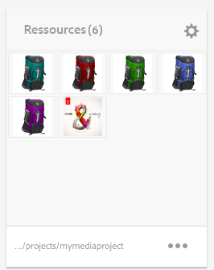

Vous chargez des ressources directement dans la mosaïque. En outre, vous pouvez créer des visionneuses d’images, des visionneuses à 360° ou des visionneuses de médias mixtes si vous avez installé le complément Dynamic Media.

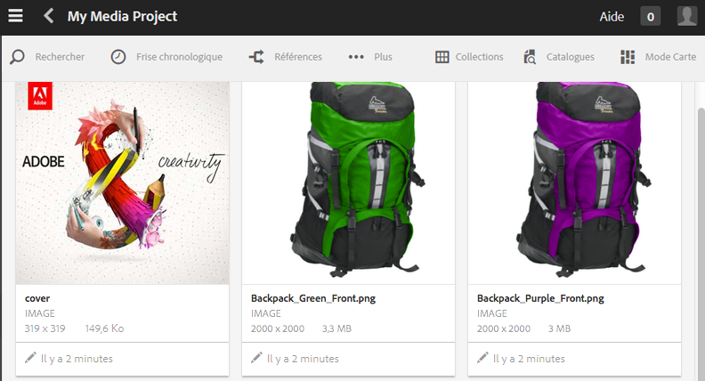

### Collections de ressources {#asset-collections}

Comme pour les ressources, vous pouvez ajouter des [collections de ressources](/help/assets/managing-collections-touch-ui.md) directement à votre projet. Vous définissez les collections dans Assets.

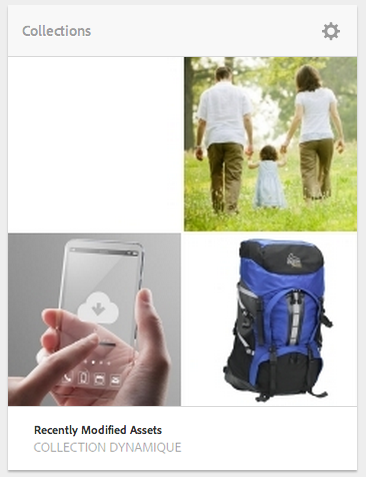

Ajoutez une collection en cliquant sur **Ajouter une collection** et en sélectionnant la collection appropriée dans la liste.

### Expériences {#experiences}

La mosaïque **Expériences** permet d’ajouter au projet une application mobile, un site web ou une publication.

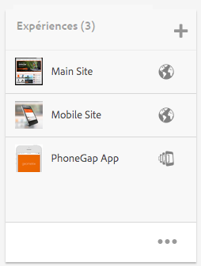

Les icônes indiquent le type d’expérience représenté : site web, application mobile ou publication. Ajoutez des expériences en cliquant sur le signe + ou en cliquant sur **Ajouter une expérience** et en sélectionnant le type d’expérience.

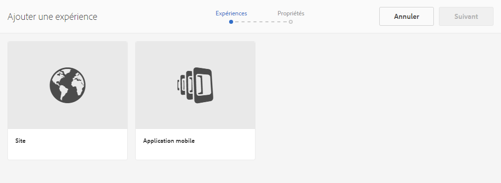

Sélectionnez le chemin des miniatures, et le cas échéant, modifiez la miniature de l’expérience. Les expériences sont regroupées dans la mosaïque **Expériences**.

### Liens {#links}

La mosaïque Liens permet d’associer des liens externes à votre projet.

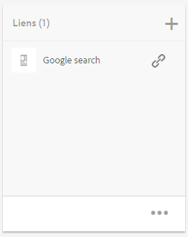

Vous pouvez donner au lien un nom facile à reconnaître et changer de miniature.

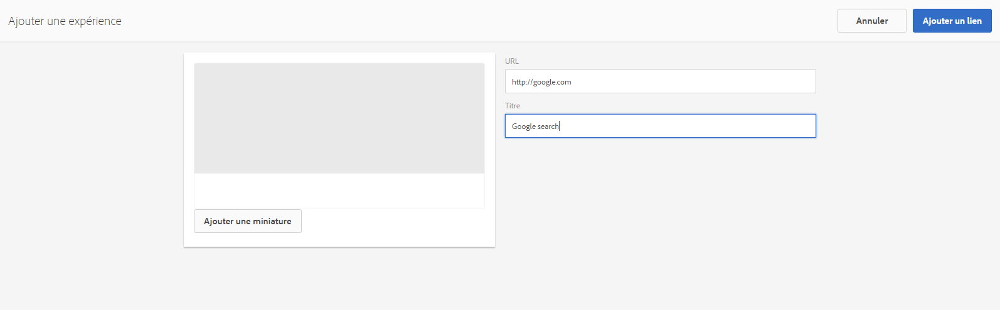

### Informations sur le projet {#project-info}

La mosaïque Informations sur le projet fournit des informations générales sur le projet, notamment sa description, son statut (actif ou inactif), son échéance et ses membres. En outre, vous pouvez ajouter une miniature de projet qui sera visible dans la page principale Projets.

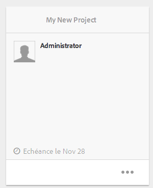

Des membres d’équipe peuvent être attribués et supprimés de cette mosaïque (ou leurs rôles peuvent être modifiés) et de la mosaïque Équipe.

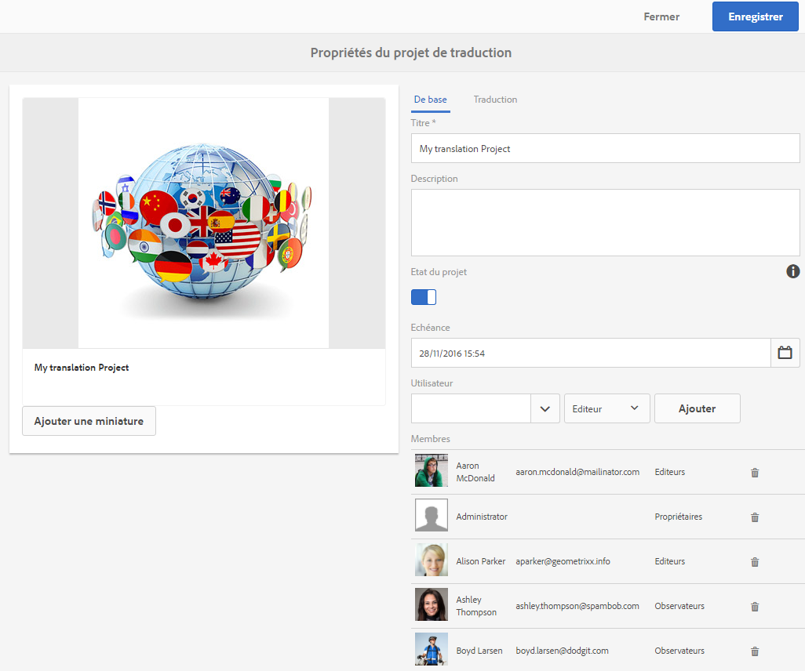

### Tâche de traduction {#translation-job}

La mosaïque Tâche de traduction est l’endroit où vous commencez une traduction et où vous pouvez voir le statut de toutes vos traductions. Pour configurer votre traduction, voir [Création de projets de traduction](/help/assets/translation-projects.md).

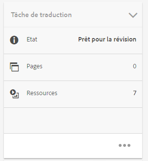

Cliquez sur les points de suspension en bas de la carte **Tâche de traduction** pour afficher les ressources du workflow de traduction. La liste des tâches de traduction affiche également les entrées des métadonnées et des balises de ressources. Ces entrées indiquent que les métadonnées et les balises des ressources sont également traduites.

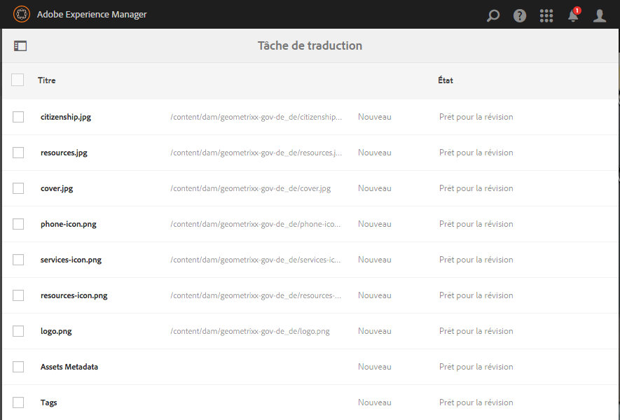

### Équipe {#team}

Dans cette mosaïque, vous pouvez définir les membres de l’équipe de projet. Lors de la modification, vous pouvez saisir le nom du membre de l’équipe et attribuer le rôle d’utilisateur.

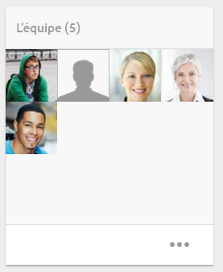

Vous pouvez ajouter et supprimer des membres de l’équipe. De plus, vous pouvez modifier le [rôle utilisateur](#user-roles-in-a-project) attribué à chaque membre de l’équipe.

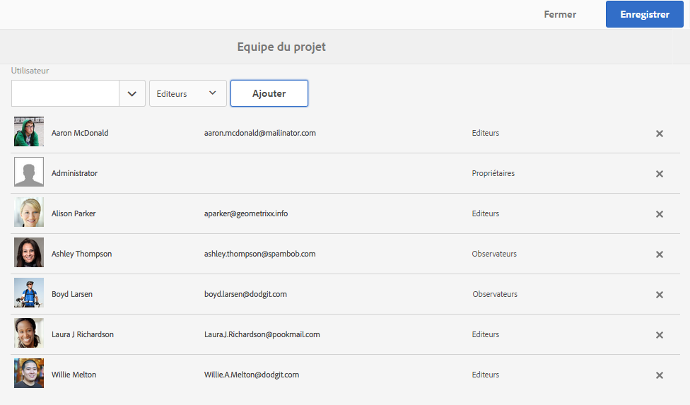

### Pages d’entrée {#landing-pages}

Le **Landing** La mosaïque Pages vous permet de demander une nouvelle page d’entrée.

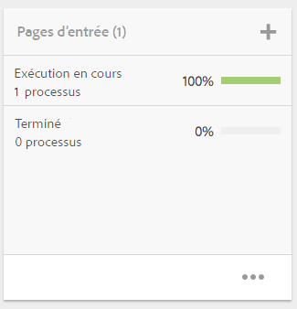

Ce workflow est décrit dans la section [Créer un workflow de page d’entrée](/help/sites-authoring/projects-with-workflows.md#request-landing-page-workflow).

### E-mails {#emails}

Le **Emails** vous aide à gérer les requêtes de courrier électronique. Elle lance le workflow de demande d’e-mail.

Pour plus d’informations, reportez-vous à la section [Workflow de demande d’e-mail.](/help/sites-authoring/projects-with-workflows.md#request-email-workflow)

### Workflows {#workflows}

Vous pouvez configurer votre projet pour qu’il suive certains workflows. Si des workflows sont actifs, leur statut s’affiche dans la mosaïque **Workflows** de la console Projets.

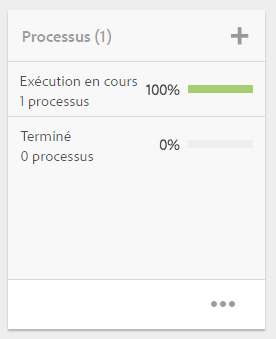

Vous pouvez configurer votre projet pour qu’il suive certains workflows. Selon le projet que vous choisissez, différents workflows sont disponibles.

Ils sont décrits à la section [Utilisation des workflows de projet](/help/sites-authoring/projects-with-workflows.md).

### Lancements {#launches}

La mosaïque Lancements présente tous les programmes qui ont été demandés avec un [workflow de demande de lancement](/help/sites-authoring/projects-with-workflows.md).

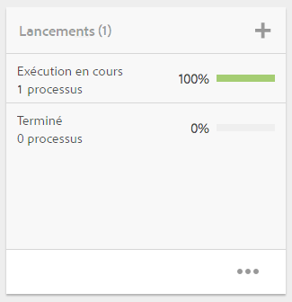

### Tâches {#tasks}

Les tâches vous permettent de surveiller le statut de toutes les activités associées à un projet, y compris des workflows. Les tâches sont décrites en détail à la section [Utilisation des tâches](/help/sites-authoring/task-content.md).

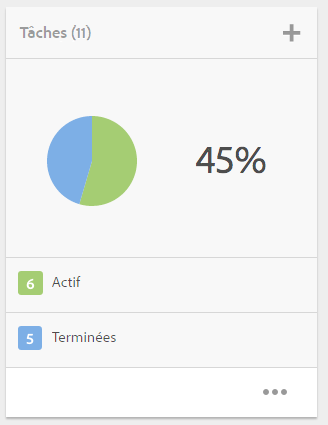

## Modèles de projet {#project-templates}

AEM est fourni avec trois modèles prêts à l’emploi :

* Un projet simple : un modèle de référence pour tous les projets auxquels les autres catégories ne sont pas adaptées. Il comprend trois rôles de base (propriétaires, éditeurs et observateurs) et quatre workflows (Approbation de projet, Demander un lancement, Demander la page d’entrée et Demander un courrier électronique).
* Un projet de média : un modèle de référence pour des activités multimédias. Il comprend plusieurs rôles de projet relatifs aux médias (photographes, éditeurs, rédacteurs, concepteurs, propriétaires et observateurs). Il comprend également deux workflows liés au contenu multimédia : Demander la copie (pour demander et réviser du texte) et Projet de séance photo du produit (pour gérer des photos relatives à des produits).
* [Projet de séance photo du produit](/help/sites-authoring/managing-product-information.md) - Exemple de référence pour la gestion de la photographie de produit liée au commerce électronique. Il comprend des rôles pour les photographes, les éditeurs, les redécolleurs de photos, les propriétaires, les directeurs créatifs, les marketeurs de médias sociaux, les responsables marketing, les réviseurs et les observateurs.
* [Un projet de traduction](/help/sites-administering/translation.md) : modèle de référence pour gérer des activités liées à la traduction. Il prévoit trois rôles de base (propriétaires, éditeurs et observateurs). Il comprend deux workflows accessibles dans l’interface utilisateur Workflows.

En fonction du modèle sélectionné, plusieurs options s’offrent à vous, notamment en termes de rôles utilisateur et de workflows.

## Rôles utilisateur dans un projet {#user-roles-in-a-project}

Les différents rôles utilisateur sont définis dans un modèle de projet et sont utilisés pour deux Principales raisons :

1. Autorisations. Les rôles utilisateur peuvent faire partie de l’une des trois catégories répertoriées : Observateur, Éditeur, Propriétaire. Par exemple, un photographe ou un rédacteur aura les mêmes privilèges qu’un éditeur. Les autorisations déterminent ce que les utilisateurs peuvent faire avec le contenu d’un projet.
1. Workflows. Les workflows déterminent les tâches affectées à un projet. Les tâches peuvent être associées à un rôle de projet. Par exemple, une tâche peut être affectée aux photographes afin que tous les membres de l’équipe qui détiennent le rôle Photographe obtiennent la tâche.

Pour vous permettre de gérer les autorisations de sécurité et de contrôle, tous les projets prennent en charge les rôles par défaut suivants:

<table> 
 <tbody> 
  <tr> 
   <td>
<strong>Rôle</strong>
 </td> 
   <td>
<strong>Description</strong>
 </td> 
   <td>
<strong>Autorisations</strong>
 </td> 
   <td>
<strong>Appartenance à un groupe</strong>
 </td> 
  </tr> 
  <tr> 
   <td>
Observateur
 </td> 
   <td>
Un utilisateur disposant de ce rôle peut afficher les détails du projet, y compris son statut.
 </td> 
   <td>
Autorisations en lecture seule sur un projet
 </td> 
   <td>
Groupe workflow-users
 </td> 
  </tr> 
  <tr> 
   <td>
Éditeur
 </td> 
   <td>
Un utilisateur disposant de ce rôle peut charger et modifier le contenu d’un projet.
 
 
 </td> 
   <td> 
    <ul> 
     <li>Accès en lecture et en écriture sur un projet, les métadonnées associées et les ressources associées.</li> 
     <li>Privilèges pour télécharger une liste de plans, une séance photo et revoir et approuver des ressources</li> 
     <li>Autorisation d’écriture sur /etc/commerce</li> 
     <li>Posséder les autorisations de modification sur un projet spécifique</li> 
    </ul> </td> 
   <td>
Groupe workflow-users
 </td> 
  </tr> 
  <tr> 
   <td>
Propriétaire
 </td> 
   <td>
Un utilisateur disposant de ce rôle peut lancer un projet. Un propriétaire peut créer un projet, lancer le travail dans un projet et déplacer les ressources approuvées dans le dossier Production. Toutes les autres tâches de projet peuvent également être visualisées et implémentées par le propriétaire.
 </td> 
   <td> 
    <ul> 
     <li>Autorisation d’écriture sur /etc/commerce</li> 
    </ul> </td> 
   <td> 
    <ul> 
     <li>Groupe DAM-users (pour pouvoir créer un projet)</li> 
     <li>groupe project-administrators (pour pouvoir déplacer des ressources)</li> 
    </ul> </td> 
  </tr> 
 </tbody> 
</table>

Des rôles supplémentaires sont également fournis pour les projets créatifs, par exemple les photographes. Vous pouvez utiliser ces rôles pour créer des rôles personnalisés liés à un projet spécifique.

>[!NOTE]
>
>Lorsque vous créez le projet et ajoutez des utilisateurs aux différents rôles, les groupes associés au projet sont automatiquement créés pour gérer les autorisations associées. Par exemple, un projet appelé Myproject aurait trois groupes **Myproject Owners**, **Myproject Editors**, **Myproject Observators**. Toutefois, si le projet est supprimé, ces groupes ne sont pas automatiquement supprimés. Un administrateur doit supprimer manuellement les groupes dans **Outils** > **Sécurité** > **Groupes**.
