# Publication de pages{#publishing-pages}

>[!CAUTION]
>
>AEM 6.4 a atteint la fin de la prise en charge étendue et cette documentation n’est plus mise à jour. Pour plus d’informations, voir notre [période de support technique](https://helpx.adobe.com/fr/support/programs/eol-matrix.html). Rechercher les versions prises en charge [here](https://experienceleague.adobe.com/docs/?lang=fr).

Une fois que vous avez créé et révisé votre contenu dans l’environnement de création, l’objectif est de [le rendre disponible sur votre site web public ;](/help/sites-authoring/author.md#concept-of-authoring-and-publishing) (votre environnement de publication).

On parle alors de publication d’une page. Lorsque vous souhaitez supprimer une page de l’environnement de publication, on parle d’annulation de publication. Lorsque vous publiez et annulez la publication, la page reste disponible dans l’environnement de création pour d’autres modifications jusqu’à ce que vous la supprimiez.

Vous pouvez également publier/annuler la publication d’une page immédiatement ou à une date/heure prédéfinies.

>[!NOTE]
>
>Certains termes liés à la publication peuvent être déroutés :
>
>* **Publier/dépublier**
   >  Termes principalement utilisés pour évoquer les opérations qui rendent votre contenu publiquement accessible dans votre environnement de publication (ou non).
>
>* **Activer/Désactiver**
   >  Ces termes sont synonymes de publication/dépublication.
>
>* **Répliquer/Réplication**
   >  Termes techniques indiquant le déplacement des données (contenu de la page, fichiers, code et commentaires de l’utilisateur, par exemple) d’un environnement à un autre ; lors de la publication ou de la réplication inverse des commentaires utilisateur, par exemple.
>

>[!NOTE]
>
>Si vous ne disposez pas des privilèges requis pour publier une page spécifique :
>
>* Un workflow sera déclenché pour informer la personne appropriée de votre demande de publication.
>* Ceci [workflow peut avoir été personnalisé](/help/sites-developing/workflows-models.md) par votre équipe de développement.
>* Un message s’affiche brièvement pour vous informer que le workflow a été déclenché.
>

## Publication de pages {#publishing-pages-2}

Selon votre emplacement, vous pouvez effectuer la publication :

* [À partir de l’éditeur de page](/help/sites-authoring/publishing-pages.md#publishing-from-the-editor)
* [À partir de la console Sites](/help/sites-authoring/publishing-pages.md#publishing-from-the-console)

### Publication à partir de l’éditeur {#publishing-from-the-editor}

Si vous modifiez une page, vous pouvez la publier directement à partir de l’éditeur.

1. Sélectionnez l’icône **Informations sur la page** pour ouvrir le menu, puis sélectionnez l’option **Publier la page**.

   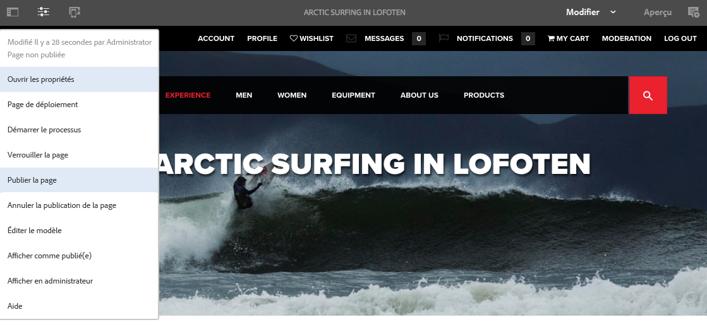

1. Selon que la page comporte des références qui doivent être publiées :

   * La page sera publiée directement, s’il n’y a aucune référence à publier.
   * Si la page comporte des références à publier, celles-ci seront répertoriées dans l’assistant **Publier**, où vous pourrez accomplir ce qui suit :

      * Spécifier les ressources, balises et autres éléments à publier conjointement avec la page, puis cliquer sur **Publier** pour terminer l’opération.
      * Sélectionner **Annuler** pour abandonner l’opération.

   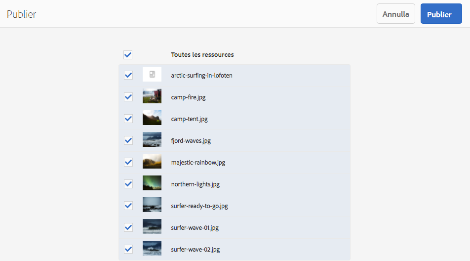

1. L’option **Publier** réplique la page dans l’environnement de publication. Une bannière d’informations est affichée dans l’éditeur de page pour confirmer l’opération de publication.

   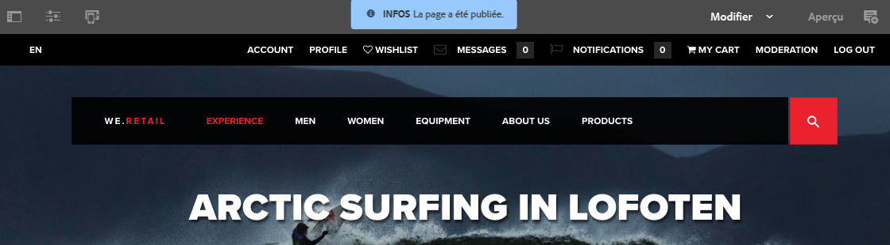

   Lorsque vous affichez la même page dans la console, le statut de publication mis à jour est visible.

   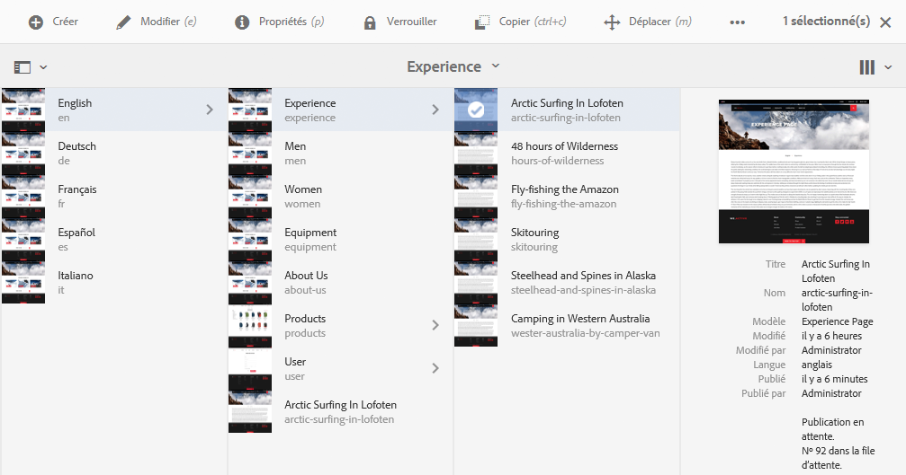

>[!NOTE]
>
>Une publication à partir de l’éditeur est dite superficielle ; en d’autres termes, seules la ou les pages sélectionnées sont publiées (les éventuelles pages enfants ne le sont pas).

>[!NOTE]
>
>Les pages accessibles par [alias](/help/sites-authoring/editing-page-properties.md#advanced) dans l’éditeur ne peuvent pas être publiées. Les options de publication dans l’éditeur ne sont disponibles que pour les pages auxquelles vous pouvez accéder à partir de leur chemin d’accès réel.

### Publication à partir de la console {#publishing-from-the-console}

La console Sites propose deux options de publication :

* [Publication rapide](/help/sites-authoring/publishing-pages.md#quick-publish)
* [Gérer la publication](/help/sites-authoring/publishing-pages.md#manage-publication)

#### Publication rapide {#quick-publish}

L’option **Publication rapide** concerne les cas simples. Elle publie immédiatement la ou les pages sélectionnées sans aucune autre interaction. Pour cette raison, toute référence non publiée sera également publiée automatiquement.

Pour publier une page avec publication rapide :

1. Sélectionnez la ou les pages dans la console Sites et cliquez ensuite sur le bouton **Publication rapide**.

   

1. Dans la boîte de dialogue Publication rapide, confirmez la publication en cliquant sur **Publier** ou annulez-la en cliquant sur **Annuler**. Pour rappel, toute référence dépubliée sera également publiée automatiquement.

   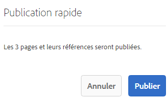

1. Une fois la page publiée, une alerte s’affiche pour confirmer la publication.

>[!NOTE]
>
>La publication rapide est une publication superficielle, c’est-à-dire que seule la ou les pages sélectionnées sont publiées et que les pages enfants ne le sont pas.

#### Gérer la publication {#manage-publication}

La méthode **Gérer la publication** propose plus d’options que Publication rapide, dont la possibilité d’inclure des pages enfants, de personnaliser les références ou encore de lancer n’importe quel workflow applicable. Elle offre également la possibilité de publier la page à une date ultérieure.

Pour publier ou dépublier une page à l’aide de l’option Gérer la publication :

1. Sélectionnez la ou les pages dans la console Sites et cliquez ensuite sur le bouton **Gérer la publication**.

   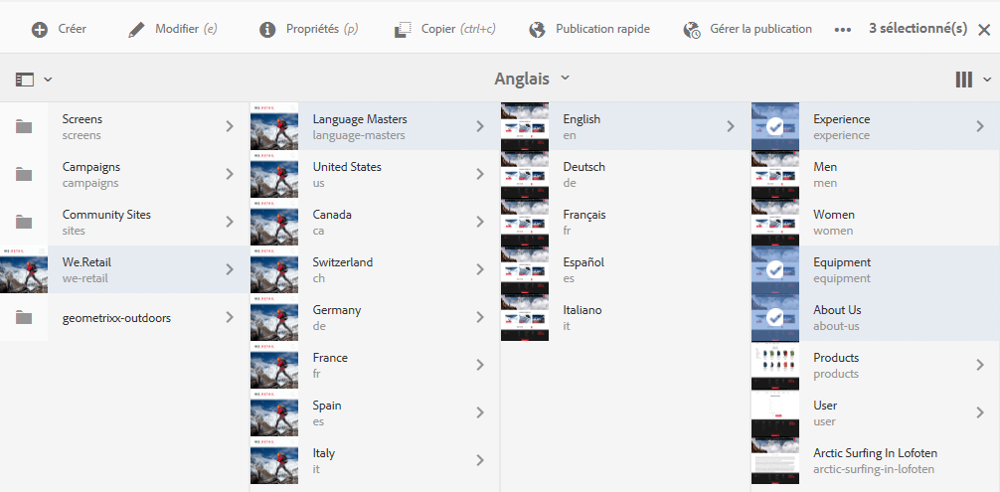

1. L’assistant **Gérer la publication** démarre. La première étape, **Options**, vous permet d’effectuer les opérations suivantes :

   * Publier ou dépublier des pages sélectionnées.
   * Choisissez d’effectuer cette action maintenant ou ultérieurement.

   La publication différée lance un workflow pour publier la ou les pages sélectionnées à l’heure indiquée. A l’inverse, l’annulation de la publication différée lance un workflow pour annuler la publication de la ou des pages sélectionnées à un moment précis.

   Pour annuler une publication/dépublier ultérieurement, rendez-vous dans la [console Workflow](/help/sites-administering/workflows.md) pour mettre un terme au workflow correspondant.

   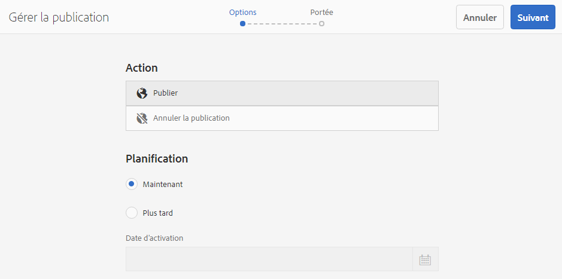

   Cliquez sur **Suivant** pour continuer.

1. Au cours de l’étape suivante de l’assistant Gérer la publication, **Portée**, vous pouvez définir la portée de la publication ou de l’annulation de la publication ; par exemple, inclure des pages enfants et des références.

   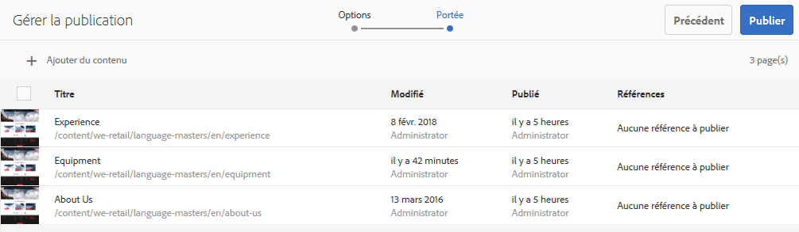

   Vous pouvez sélectionner le bouton **Ajouter du contenu** pour ajouter des pages à la liste des pages à publier, au cas où vous auriez omis d’en sélectionner une avant de lancer l’assistant Gérer la publication.

   Le bouton Ajouter du contenu lance l’[explorateur de chemins d’accès](/help/sites-authoring/author-environment-tools.md#path-browser), qui vous permet de sélectionner du contenu.

   Sélectionnez les pages souhaitées, puis cliquez sur **Sélectionner** pour ajouter du contenu à l’assistant ou sur **Annuler** pour annuler la sélection et revenir à l’assistant.

   De retour dans l’assistant, vous pouvez sélectionner un élément de la liste pour configurer ses autres options, telles que :

   * Inclure ses enfants.
   * Supprimez-le de la sélection.
   * Gestion des références publiées.

   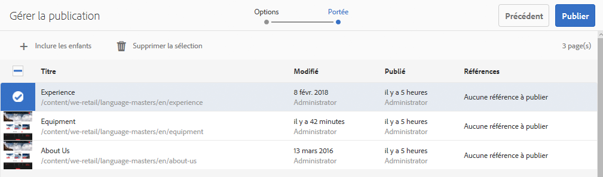

   La boîte de dialogue qui s’ouvre lorsque vous cliquez sur **Inclure les enfants** vous permet d’effectuer les opérations suivantes :

   * Inclure seulement les enfants immédiats
   * Inclure seulement les pages modifiées
   * Inclure seulement les pages déjà publiées

   Cliquez sur **Ajouter** pour ajouter les pages enfants à la liste des pages à publier ou dépublier sur la base des options sélectionnées. Cliquez sur **Annuler** pour annuler la sélection et revenir à l’assistant.

   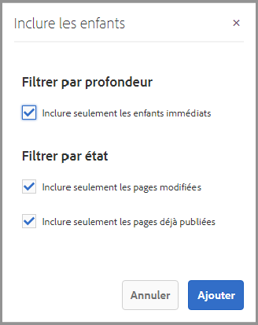

   De retour dans l’assistant, les pages ajoutées sont affichées en fonction des options que vous avez sélectionnées dans la boîte de dialogue Inclure les enfants.

   Vous pouvez afficher et modifier les références à publier ou dépublier pour une page. Pour ce faire, sélectionnez la page, puis cliquez sur le bouton **Références publiées**.

   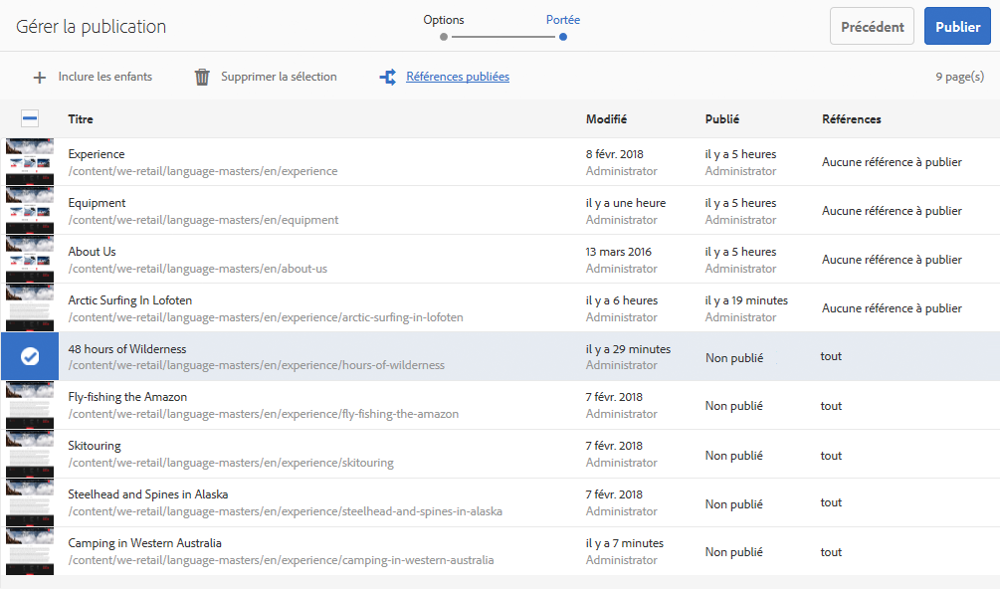

   La boîte de dialogue **Références publiées** affiche alors les références du contenu sélectionné. Par défaut, elles sont toutes sélectionnées. Dès lors, elles seront toutes publiées ou dépubliées. Vous pouvez toutefois les désélectionner pour qu’elles ne soient pas incluses dans l’opération.

   Cliquez sur **Terminé** pour enregistrer vos modifications ou sur **Annuler** pour annuler la sélection et revenir à l’assistant.

   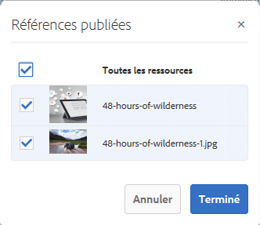

   De retour dans l’assistant, la colonne **Références** est mise à jour afin de tenir compte des références que vous avez choisi de publier ou de dépublier.

   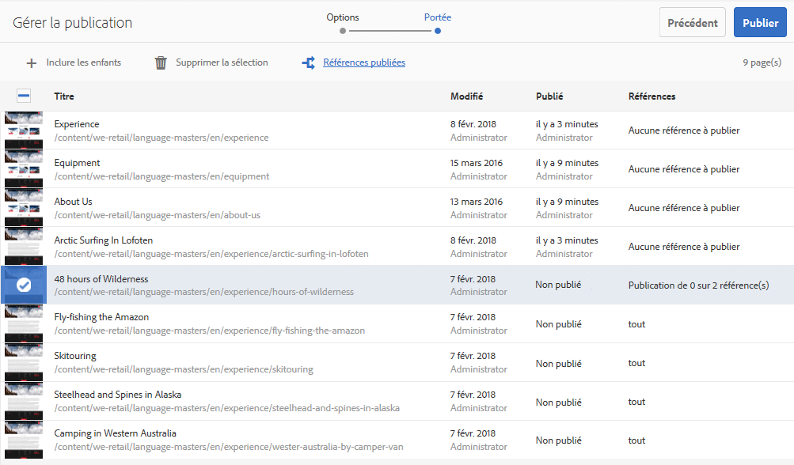

1. Pour terminer, cliquez sur **Publier**.

   De retour dans la console Sites, un message de notification s’affiche pour confirmer la publication.

   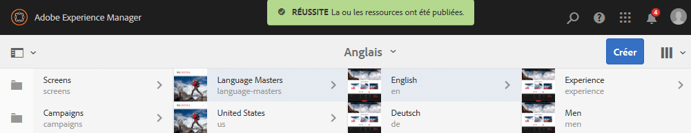

1. Si les pages publiées sont associées à des workflows, elles peuvent être affichées dans une dernière étape de l’assistant de publication intitulée **Workflows**.

   >[!NOTE]
   >
   >L’étape **Workflows** est affichée en fonction des droits dont dispose ou non votre utilisateur. Pour plus d’informations, reportez-vous à la [remarque précédente sur cette page](/help/sites-authoring/publishing-pages.md) concernant les privilèges de publication, ainsi qu’aux sections [Gestion de l’accès aux workflows](/help/sites-administering/workflows-managing.md) et [Application de workflows aux pages](/help/sites-authoring/workflows-applying.md).

   Les ressources sont regroupées selon les workflows déclenchés et chaque option donnée pour :

   * Définissez le titre du workflow.
   * Conserver le module de workflow, à condition que le workflow dispose [prise en charge multi-ressource](/help/sites-developing/workflows-models.md#configuring-a-workflow-for-multi-resource-support).
   * définir le titre du package de workflow, si l’option de conservation du package de workflow a été sélectionnée.

   Cliquez sur **Publier** ou **Publier ultérieurement **pour terminer la publication.

   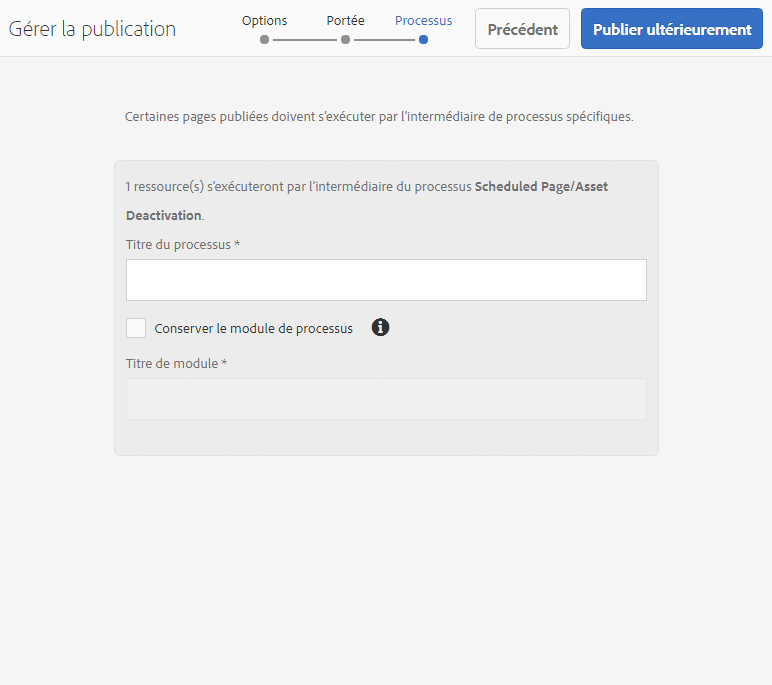

## Dépublication de pages {#unpublishing-pages}

La dépublication d’une page supprime cette page de votre environnement de publication, de sorte que vos lecteurs ne puissent plus y accéder.

Vous pouvez dépublier une ou de plusieurs pages [en procédant de la même manière que pour leur publication](/help/sites-authoring/publishing-pages.md#publishing-pages) :

* [À partir de l’éditeur de page](/help/sites-authoring/publishing-pages.md#unpublishing-from-the-editor)
* [À partir de la console Sites](/help/sites-authoring/publishing-pages.md#unpublishing-from-the-console)

### Dépublication à partir de l’éditeur {#unpublishing-from-the-editor}

Lors de la modification d’une page, si vous la dépubliez, sélectionnez **Dépublier la page** dans le menu **Informations sur la page**, comme vous le feriez pour [publier la page](/help/sites-authoring/publishing-pages.md#publishing-from-the-editor).

>[!NOTE]
>
>Les pages accessibles par [alias](/help/sites-authoring/editing-page-properties.md#advanced) dans l’éditeur ne peuvent pas être dépubliées. Les options de publication dans l’éditeur ne sont disponibles que pour les pages auxquelles vous pouvez accéder à partir de leur chemin d’accès réel.

### Dépublication à partir de la console {#unpublishing-from-the-console}

De la même façon que vous [utilisez l’option Gérer la publication pour publier une page](/help/sites-authoring/publishing-pages.md#manage-publication), vous pouvez l’utiliser pour la dépublication.

1. Sélectionnez la ou les pages dans la console Sites et cliquez ensuite sur le bouton **Gérer la publication**.
1. L’assistant **Gérer la publication** démarre. Dans la première étape, **Options**, sélectionnez **Dépublier** au lieu de l’option par défaut, à savoir **Publier**.

   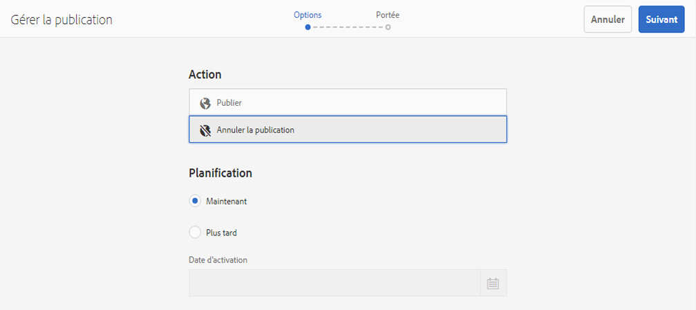

   À l’instar de l’option de publication différée, qui lance un workflow permettant de publier cette version de la page à l’heure indiquée, la désactivation différée lance un workflow pour dépublier la ou les pages sélectionnées à une heure spécifique.

   Pour annuler une publication/dépublier ultérieurement, rendez-vous dans la [console Workflow](/help/sites-administering/workflows.md) pour mettre un terme au workflow correspondant.

1. Pour terminer l’annulation de la publication, passez par l’assistant comme vous le feriez pour : [publier la page ;](/help/sites-authoring/publishing-pages.md#manage-publication).

## Publication et dépublication d’une arborescence {#publishing-and-unpublishing-a-tree}

Lorsque vous avez saisi ou mis à jour un nombre considérable de pages de contenu (toutes résidant sous la même page racine), il peut s’avérer plus facile de publier l’arborescence entière en une seule action.

Vous pouvez utiliser la variable [Gérer la publication](/help/sites-authoring/publishing-pages.md#manage-publication) sur la console sites.

1. Dans la console Sites, sélectionnez la page racine de l’arborescence que vous souhaitez publier ou dépublier, puis sélectionnez **Gérer la publication**.
1. L’assistant **Gérer la publication** démarre. Choisissez la publication ou l’annulation de la publication, puis sélectionnez **Suivant** pour continuer.
1. Dans le **Portée** , sélectionnez la page racine et sélectionnez **Inclure les enfants**.

   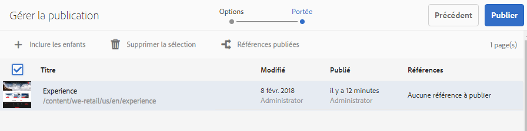

1. Dans le **Inclure les enfants** , désélectionnez les options suivantes :

   * Inclure seulement les enfants immédiats
   * Inclure seulement les pages déjà publiées

   Ces options sont sélectionnées par défaut. N’oubliez pas de les désélectionner. Cliquez sur **Ajouter** pour confirmer et ajouter le contenu à la publication/annulation de la publication.

   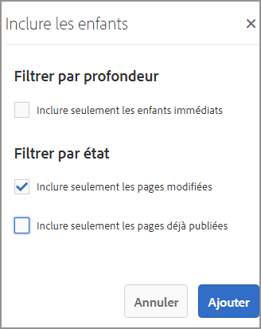

1. Le **Gérer la publication** L’assistant répertorie le contenu de l’arborescence à réviser. Vous pouvez personnaliser davantage la sélection en ajoutant des pages supplémentaires ou en supprimant celles sélectionnées.

   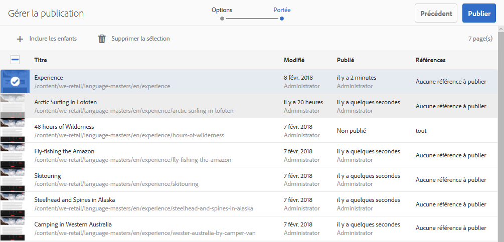

   N’oubliez pas que vous pouvez également passer en revue les références à publier au moyen de l’option **Références publiées**.

1. [Poursuivez normalement les étapes de l’assistant Gérer la publication](#manage-publication) pour terminer la publication ou l’annulation de la publication de l’arborescence.

## Définition du statut de publication {#determining-publication-status}

Vous pouvez déterminer l’état de publication d’une page :

* dans les [informations d’aperçu des ressources de la console Sites](/help/sites-authoring/basic-handling.md#viewing-and-selecting-resources) ;

   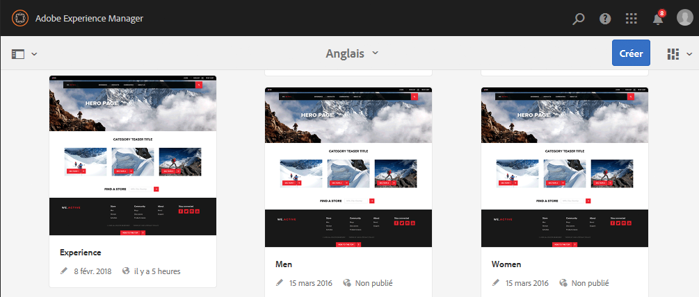

   L’état de publication est indiqué dans les modes d’affichage [Carte](/help/sites-authoring/basic-handling.md#card-view), [Colonnes](/help/sites-authoring/basic-handling.md#column-view) et [Liste](/help/sites-authoring/basic-handling.md#list-view) de la console Sites.

* Dans la [chronologie](/help/sites-authoring/basic-handling.md#timeline)

   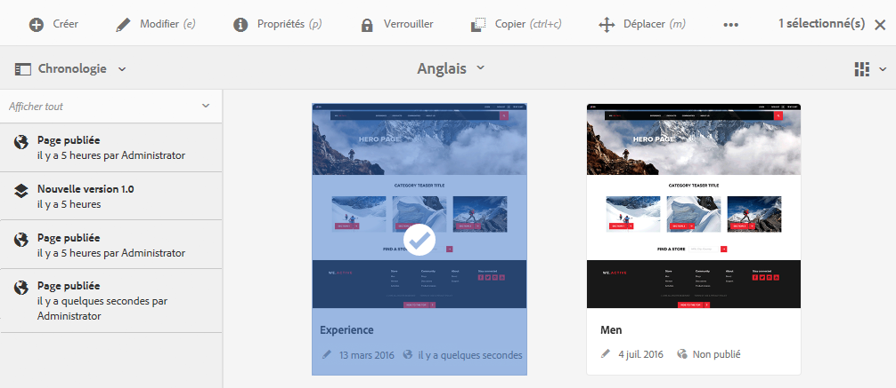

* dans le menu [Informations sur la page](/help/sites-authoring/author-environment-tools.md#page-information) lors de la modification d’une page.

   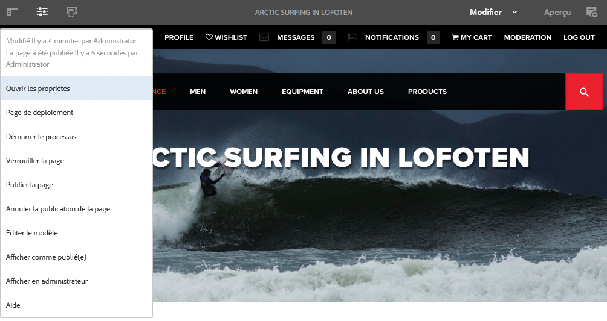
