# Guide rapide pour la création de pages{#quick-guide-to-authoring-pages}

>[!CAUTION]
>
>AEM 6.4 a atteint la fin de la prise en charge étendue et cette documentation n’est plus mise à jour. Pour plus d’informations, voir notre [période de support technique](https://helpx.adobe.com/fr/support/programs/eol-matrix.html). Rechercher les versions prises en charge [here](https://experienceleague.adobe.com/docs/?lang=fr).

Ces procédures sont conçues comme un guide rapide (de haut niveau) des principales actions de création de contenu de page dans AEM.

Ils :

* ne sont pas destinées à assurer une couverture exhaustive ;
* Fournissez des liens vers la documentation détaillée.

Pour obtenir des détails complets sur la création dans AEM, consultez :

* [Premières étapes pour les auteurs et autrices](/help/sites-authoring/first-steps.md)
* [Utiliser l’environnement de création](/help/sites-authoring/author-environment-tools.md)

## Quelques conseils rapides {#a-few-quick-hints}

Avant de donner un aperçu des détails, voici une petite collection de conseils et d’astuces généraux qui méritent d’être pris en compte, en particulier si vous êtes habitué à la fonction [Environnement de création d’IU classique](/help/sites-classic-ui-authoring/classicui.md).

### La console Sites {#sites-console}

* **Créer**

   * Ce bouton est disponible dans de nombreuses consoles ; les options présentées sont contextuelles et peuvent varier en fonction du scénario.

* Réorganisation des pages dans un dossier

   * Cette opération peut être effectuée dans la vue [Liste](/help/sites-authoring/basic-handling.md#list-view). Les changements seront appliqués et visibles dans d’autres vues.

* Modification de l’interface utilisateur

   * Vous pouvez le faire à partir de divers emplacements. Voir [Sélection de l’interface utilisateur](/help/sites-authoring/select-ui.md).

### Création de pages {#page-authoring}

* Liens de navigation

   * ***Les liens ne sont pas disponibles pour la navigation*** lorsque vous êtes en mode d’**édition**. Pour naviguer avec des liens, vous devez [prévisualiser la page ;](/help/sites-authoring/editing-content.md#previewing-pages) en utilisant :

      * [Mode Aperçu](/help/sites-authoring/editing-content.md#preview-mode)
      * [Afficher comme publié(e)](/help/sites-authoring/editing-content.md#view-as-published)

* Les workflows et les versions ne sont plus démarrés/créés à partir de l’éditeur de page ; cela est maintenant fait à partir de [Chronologie](/help/sites-authoring/basic-handling.md#timeline) (accessible à partir de la console).

>[!NOTE]
>
>Il existe plusieurs raccourcis clavier qui peuvent faciliter l’expérience de création.
>
>* [Raccourcis clavier lors de la modification de pages](/help/sites-authoring/page-authoring-keyboard-shortcuts.md)
>* [Raccourcis clavier pour les consoles](/help/sites-authoring/keyboard-shortcuts.md)

## Recherche de votre page {#finding-your-page}

1. Ouvrez la console **Sites** (à l’aide de l’option **Sites** dans [Navigation globale](/help/sites-authoring/basic-handling.md#global-navigation), déclenchée (dans une liste déroulante) lorsque vous sélectionnez le lien Adobe Experience Manager (en haut à gauche)).

1. Naviguez dans l’arborescence en appuyant/cliquant sur la page appropriée. La représentation des ressources de page dépend du mode d’affichage activé : [Carte, Liste ou Colonnes](/help/sites-authoring/basic-handling.md#viewing-and-selecting-resources) :

   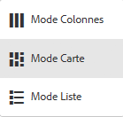

1. Remontez dans l’arborescence à l’aide du [chemin de navigation de l’en-tête](/help/sites-authoring/basic-handling.md#the-header) pour revenir à l’emplacement sélectionné :

   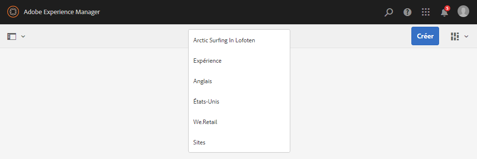

### Création d’une page {#creating-a-new-page}

1. [Accédez à l’emplacement](#finding-your-page) où créer la page.
1. Utilisez la variable **Créer** puis sélectionnez **Page** dans la liste :

   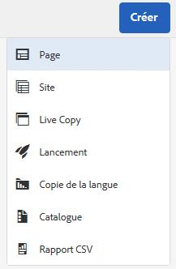

1. Un assistant s’ouvre, qui vous aidera à collecter les informations nécessaires lors de la [création de votre page](/help/sites-authoring/managing-pages.md#creating-a-new-page). Suivez les instructions à l’écran.

## Sélection de la page pour d’autres actions {#selecting-your-page-for-further-action}

Vous pouvez sélectionner une page afin d’agir sur celle-ci. La sélection d’une page met automatiquement à jour la barre d’outils afin que les actions relatives à cette ressource s’affichent.

La sélection d’une page dépend du mode utilisé dans la console :

1. Mode Carte :

   * Activez le mode de sélection en [sélection de la ressource requise](/help/sites-authoring/basic-handling.md#viewing-and-selecting-resources) par :

      * Appareil mobile : appuyez et maintenez appuyé
      * Ordinateur de bureau : en cliquant sur l’icône d’[action rapide](/help/sites-authoring/basic-handling.md#quick-actions) en forme de coche (illustrée ci-dessous).

         

      * Une coche apparaît sur la carte afin d’indiquer que la page a été sélectionnée.
   >[!NOTE]
   >
   >En mode de sélection, l’icône **Sélectionner** (coche) est transformée en icône **Désélectionner** (croix).

1. Vue Liste :

   * Appuyez/cliquez sur la miniature de la ressource requise ; une coche apparaît sur la miniature afin d’indiquer que la page a été sélectionnée.

1. Mode Colonnes :

   * Appuyez/cliquez sur la miniature de la ressource requise ; une coche apparaît sur la miniature afin d’indiquer que la page a été sélectionnée.

## Actions rapides (mode Carte/Bureau seulement) {#quick-actions-card-view-desktop-only}

1. [Accédez à la page](#finding-your-page) sur laquelle vous souhaitez effectuer une action.
1. Placez le pointeur de la souris sur la carte qui représente la ressource requise. Les actions rapides s’affichent ensuite : 

   

## Modification du contenu de votre page {#editing-your-page-content}

1. [Accédez à la page](#finding-your-page) que vous souhaitez modifier.
1. [Ouvrez la page pour modification](/help/sites-authoring/managing-pages.md#opening-a-page-for-editing) à l’aide de l’icône Modifier (crayon) :

   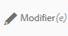

   Vous pouvez y accéder comme suit :

   * [Actions rapides (mode Carte/Bureau uniquement)](#quick-actions-card-view-desktop-only) pour la ressource appropriée.
   * La barre d’outils [une fois la page sélectionnée](#selecting-your-page-for-further-action).

1. Lorsque l’éditeur s’ouvre, vous pouvez :

   * [Ajouter un nouveau composant à votre page](/help/sites-authoring/editing-content.md#inserting-a-component) par :

      * ouverture du panneau latéral
      * en sélectionnant l’onglet composants (l’onglet [navigateur de composants](/help/sites-authoring/author-environment-tools.md#components-browser))
      * faire glisser le composant requis sur votre page.

      Vous pouvez ouvrir (et fermer) le panneau latéral en cliquant sur l’icône suivante :

      

   * [Modifier le contenu d’un composant existant](/help/sites-authoring/editing-content.md#edit-configure-copy-cut-delete-paste) sur la page :

      * Ouvrez la barre d’outils du composant en appuyant ou en cliquant. Utilisez la variable **Modifier** (crayon) pour ouvrir la boîte de dialogue.
      * Ouvrez l’éditeur statique pour le composant en appuyant longuement ou en double-cliquant lentement. Les actions disponibles s’affichent (pour certains composants, il s’agit d’une sélection limitée).
      * Pour afficher toutes les actions disponibles, passez en mode plein écran à l’aide de :

      

   * [Configurez les propriétés d’un composant existant :](/help/sites-authoring/editing-content.md#component-edit-dialog)

      * Ouvrez la barre d’outils du composant en appuyant ou en cliquant. Utilisez la variable **Configurer** (clé à molette) pour ouvrir la boîte de dialogue.
   * [Déplacer un composant](/help/sites-authoring/editing-content.md#moving-a-component) soit :

      * Faites glisser le composant vers son nouvel emplacement.
      * Ouvrez la barre d’outils du composant en appuyant ou en cliquant. Cliquez sur les icônes **Couper** puis **Coller** suivant vos besoins.
   * [Copiez (et collez)](/help/sites-authoring/editing-content.md#edit-configure-copy-cut-delete-paste) un composant :

      * Ouvrez la barre d’outils du composant en appuyant ou en cliquant. Cliquez sur les icônes **Copier** puis **Coller** suivant vos besoins.
      >[!NOTE]
      >
      >Vous pouvez **coller** les composants sur la même page ou sur une autre. Si vous collez un composant sur une autre page qui était déjà ouverte avant l’opération de couper/copier, il vous faut actualiser la page en question.

   * [Supprimer](/help/sites-authoring/editing-content.md#edit-configure-copy-cut-delete-paste) un composant :

      * Ouvrez la barre d’outils du composant (en appuyant ou en cliquant), puis cliquez sur l’icône **Supprimer**.
   * [Ajouter des annotations](/help/sites-authoring/annotations.md#annotations) à la page :

      * En mode **Annotation** (icône de bulle), ajoutez des annotations à l’aide de l’icône **Ajouter une annotation** (plus). Quittez le mode Annotation en cliquant sur la croix (X) en haut à droite.

      

   * [Prévisualiser une page](/help/sites-authoring/editing-content.md#preview-mode) (pour vérifier comment elle apparaîtra dans l’environnement de publication) :

      * Sélectionner **Aperçu** dans la barre d’outils.
   * Revenez au mode d’édition (ou sélectionnez un autre mode) à l’aide de la fonction **Modifier** sélecteur déroulant.

   >[!NOTE]
   >
   >Pour naviguer en suivant les liens figurant dans le contenu, vous devez utiliser le [mode Aperçu](/help/sites-authoring/editing-content.md#preview-mode).

## Modification des propriétés de page {#editing-the-page-properties}

Il existe deux (principales) méthodes de [modification des propriétés de page](/help/sites-authoring/editing-page-properties.md):

* Dans la console **Sites** :

   1. [Accédez à la page](#finding-your-page) vous voulez publier.
   1. Sélectionnez la **Propriétés** à partir de :

      * [Actions rapides (mode Carte/Bureau uniquement)](#quick-actions-card-view-desktop-only) pour la ressource appropriée.
      * La barre d’outils [une fois la page sélectionnée](#selecting-your-page-for-further-action).

   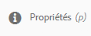

* Les propriétés de la page s’affichent. Vous pouvez effectuer des mises à jour selon les besoins, puis les enregistrer à l’aide de la fonction Enregistrer.

   * When [modification de votre page](#editing-your-page-content):

      1. Ouvrez le **Informations sur la page** .
      1. Sélectionner **Ouvrir les propriétés** pour ouvrir la boîte de dialogue de modification des propriétés.

         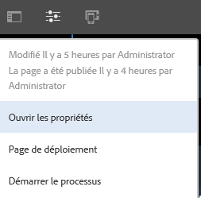

## Publication de la page (ou dépublication) {#publishing-your-page-or-unpublishing}

Il existe deux méthodes principales : [publication de votre page](/help/sites-authoring/publishing-pages.md) (ainsi que de l’annulation de la publication) :

* Dans la console **Sites** :

   1. [Accédez à la page](#finding-your-page) vous voulez publier.
   1. Cliquez sur l’icône **Publication rapide** dans :

      * [Actions rapides (mode Carte/Bureau uniquement)](#quick-actions-card-view-desktop-only) pour la ressource appropriée.
      * La barre d’outils, [une fois votre page sélectionnée](#selecting-your-page-for-further-action) (permet également d’accéder à l’option [Publier ultérieurement](/help/sites-authoring/publishing-pages.md#manage-publication)).

   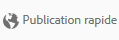

* When [modification de votre page](#editing-your-page-content):

   1. Ouvrez le **Informations sur la page** .
   1. Sélectionner **Publier la page**.

   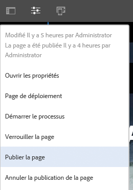

* La dépublication d’une page à partir de la console ne peut se faire que par l’intermédiaire de l’option **Gérer la publication**, disponible uniquement sur la barre d’outils (et non via les actions rapides).

   Le **Annuler la publication de la page** est toujours disponible via l&#39;option **Informations sur la page** dans l’éditeur.

   

   Voir [Publication de pages](/help/sites-authoring/publishing-pages.md#unpublishing-pages) pour plus d’informations.

## Déplacement, copier-coller ou suppression d’une page {#move-copy-and-paste-or-delete-your-page}

1. [Accédez à la page](#finding-your-page) vous souhaitez déplacer, copier-coller ou supprimer.
1. Sélectionnez l’icône de copie (puis de collage), de déplacement ou de suppression selon vos besoins à l’aide de l’une des méthodes suivantes :

   * [Actions rapides (mode Carte/Bureau uniquement)](#quick-actions-card-view-desktop-only) pour la ressource requise.
   * La barre d’outils [une fois la page sélectionnée](#selecting-your-page-for-further-action).

   * Copier :

      * Vous devez ensuite accéder au nouvel emplacement et coller la page.
   * Déplacer :

      * L’assistant s’ouvre pour collecter les informations nécessaires au déplacement de la page. Suivez les instructions à l’écran.
   * Supprimer :

      * Vous serez alors invité à confirmer l’opération.
   >[!NOTE]
   >
   >La suppression n’est pas proposée comme action rapide.

## Verrouillage d’une page (puis déverrouillage) {#locking-your-page-then-unlocking}

Le [verrouillage d’une page](/help/sites-authoring/editing-content.md#locking-a-page) empêche d’autres auteurs de travailler dessus en même temps que vous. L’icône/le bouton Verrouiller (et Déverrouiller) est accessible :

* La barre d’outils [une fois la page sélectionnée](#selecting-your-page-for-further-action).
* Dans le [menu déroulant Informations sur la page](#editing-the-page-properties) lors de la modification d’une page.
* Dans la barre d’outils de la page lors de la modification d’une page (si la page est verrouillée).

Par exemple, l’icône de verrouillage se présente comme suit :

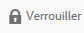

## Accès aux références de page {#accessing-page-references}

Un [accès rapide aux références](/help/sites-authoring/author-environment-tools.md#references) depuis et vers une page est possible dans le rail de références.

1. Sélectionnez les **Références** à l’aide de l’icône de la barre d’outils (avant ou après la [sélection d’une page](#selecting-your-page-for-further-action)) :

   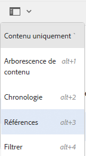

   Une liste des types de références s’affiche :

   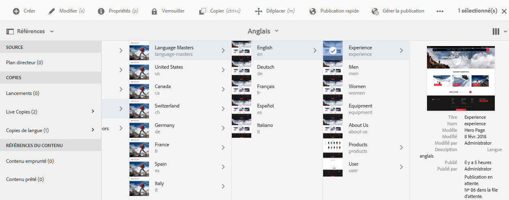

1. Appuyez ou cliquez sur le type de référence requis pour afficher d’autres détails et (le cas échéant) accomplir d’autres actions.

## Création d’une version d’une page {#creating-a-version-of-your-page}

1. Pour ouvrir le rail de la chronologie, sélectionnez la **[Chronologie](/help/sites-authoring/basic-handling.md#timeline)** à l’aide de l’icône de la barre d’outils (avant ou après la [sélection d’une page](#selecting-your-page-for-further-action)) :

   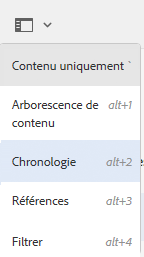

1. Appuyez ou cliquez sur la flèche Haut en bas à droite de la colonne Chronologie pour afficher d’autres boutons, y compris **Enregistrer comme version**.

   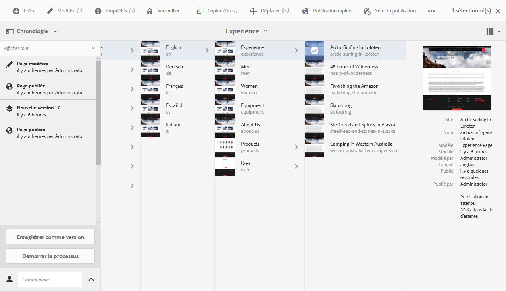

1. Sélectionnez **Enregistrer comme version**, puis **Créer**.

## Restauration/comparaison d’une version d’une page {#restoring-comparing-a-version-of-your-page}

Le même mécanisme de base est appliqué pour restaurer ou pour comparer des versions d’une page :

1. Sélectionnez la **[Chronologie](/help/sites-authoring/basic-handling.md#timeline)** à l’aide de l’icône de la barre d’outils (avant ou après la [sélection d’une page](#selecting-your-page-for-further-action)) :

   

   Si une version de votre page a déjà été enregistrée, elle sera répertoriée dans la chronologie.

1. Appuyez/cliquez sur la version à restaurer, ce qui permet d’afficher d’autres boutons d’action :

   * **Revenir à cette version**

      * La version est restaurée.
   * **Afficher les différences**

      * La page s’ouvre avec les différences (entre les deux versions) mises en surbrillance.
