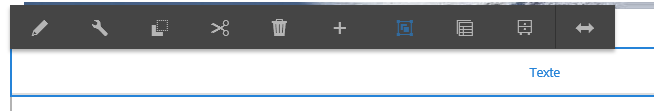
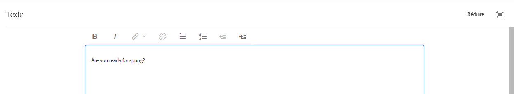

# Utilisation de l’éditeur de texte enrichi pour créer du contenu {#using-the-rich-text-editor-to-author-content}

>[!CAUTION]
>
>AEM 6.4 a atteint la fin de la prise en charge étendue et cette documentation n’est plus mise à jour. Pour plus d’informations, voir notre [période de support technique](https://helpx.adobe.com/fr/support/programs/eol-matrix.html). Rechercher les versions prises en charge [here](https://experienceleague.adobe.com/docs/?lang=fr).

L’éditeur de texte enrichi (RTE) est un élément de base de la création de texte dans AEM pages. De nombreux composants tels que Texte, Texte et Image et Tableau sont basés sur l’éditeur de texte enrichi.

>[!NOTE]
>
>La copie de listes imbriquées dans l’éditeur de texte enrichi ne fonctionne pas comme prévu. Lors de la copie de listes imbriquées à partir de Microsoft Word, vous devez nettoyer manuellement les listes après avoir collé le texte dans l’éditeur de texte enrichi.

## Modification statique {#in-place-editing}

Si vous sélectionnez un composant textuel en cliquant ou en appuyant une seule fois dessus, la fonction [barre d’outils du composant](../sites-authoring/editing-content.md#edit-configure-copy-cut-delete-paste).

Appuyez/cliquez de nouveau ou sélectionnez initialement le composant avec un double appui/clic lent pour ouvrir la modification statique, qui possède sa propre barre d’outils. Vous pouvez y modifier le contenu et apporter des modifications de base à la mise en forme.

Cette barre d’outils propose les options suivantes :

* **Format**: Définissez la mise en forme Gras, Italique et Souligné.

* **Listes**: Créez des listes à puces ou numérotées ou définissez le retrait.

* **Lien hypertexte**

* **Dissocier**

* **Plein écran**

* **Fermer**

* **Enregistrer**

## Modification en plein écran {#full-screen-editing}

Pour les composants basés sur du texte, si vous sélectionnez le mode Plein écran dans la barre d’outils, l’éditeur de texte enrichi s’ouvre et le reste du contenu de la page est masqué.

Le mode Plein écran affiche toutes les options de votre éditeur de texte enrichi, configurées par votre administrateur. Celles-ci peuvent varier d’une instance AEM à l’autre. [selon la configuration](../sites-administering/rich-text-editor.md) fournies par les administrateurs ou les développeurs AEM. Si une option est manquante, demandez à votre administrateur de la rendre disponible.

Les options supplémentaires de l’éditeur de texte enrichi sont les suivantes :

* **Ancre** : crée une ancre dans le texte grâce à laquelle vous pourrez ensuite établir un lien ou créer une référence.
* **Aligner le texte à gauche**
* **Texte centré**
* **Aligner le texte à droite**

Pour fermer le mode plein écran, cliquez sur l’icône Réduire .

