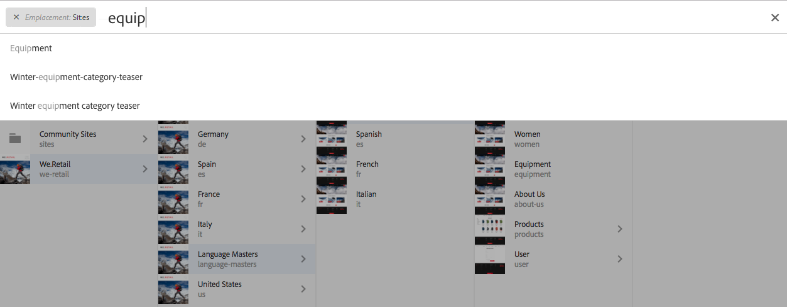
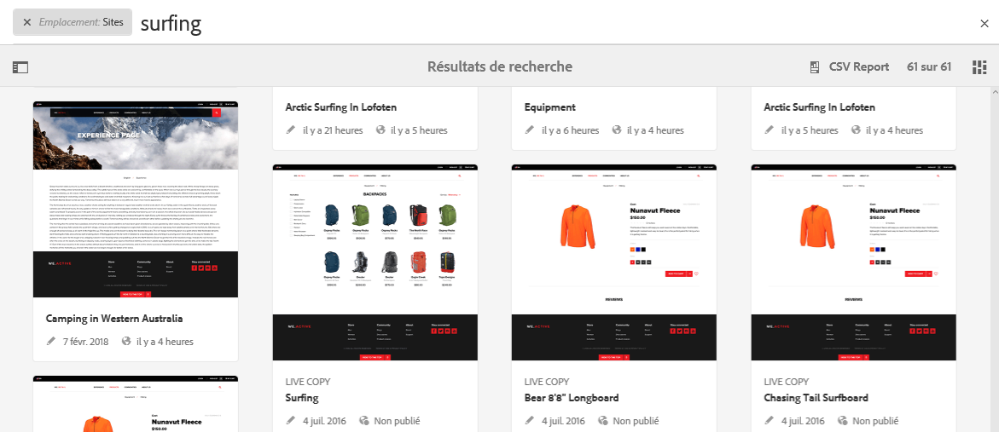
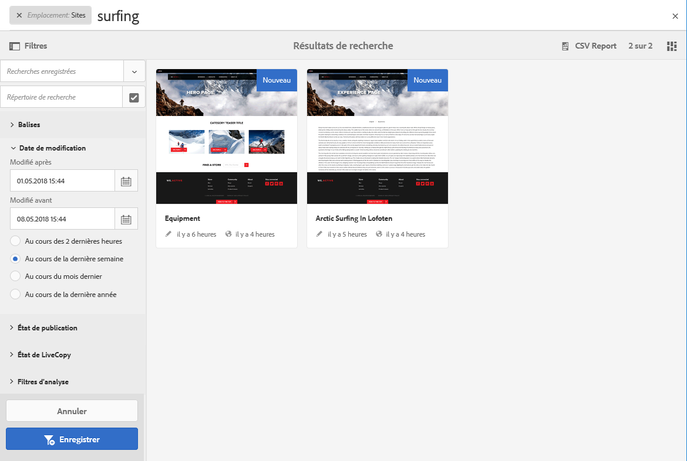
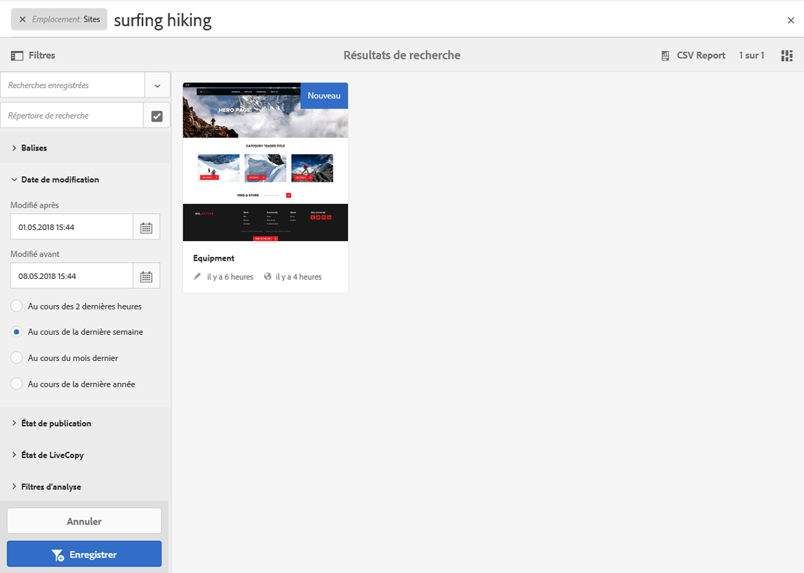
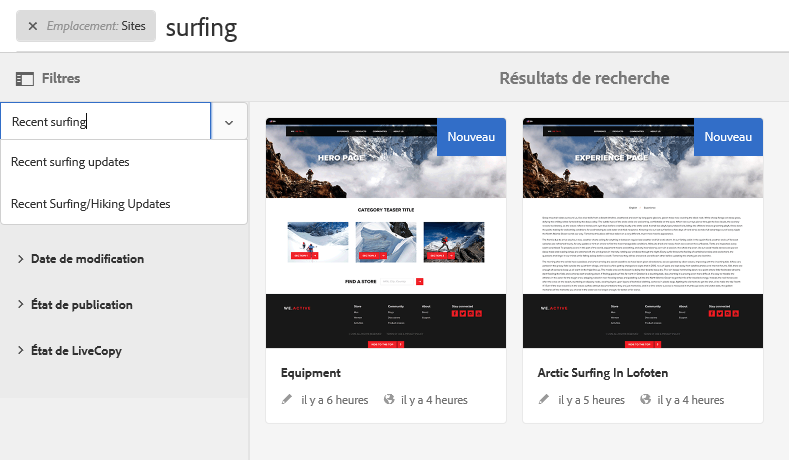
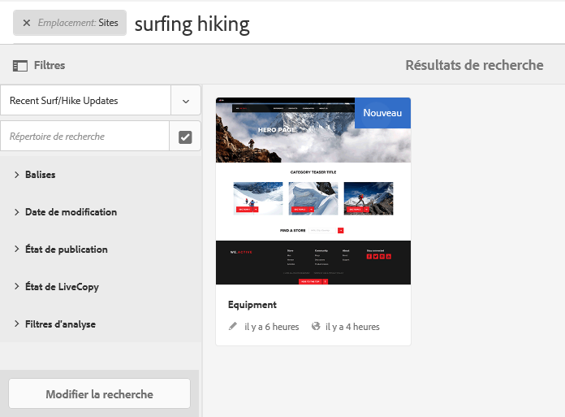

# Recherche{#search-features}

L’environnement de création d’AEM comporte divers mécanismes de recherche de contenu, selon le type de ressource que vous utilisez.

>[!NOTE]
>
>En dehors de l’environnement de création, il existe d’autres mécanismes de recherche, tels que [Query Builder](/help/sites-developing/querybuilder-api.md) et [CRXDE Lite](/help/sites-developing/developing-with-crxde-lite.md).

## Principes de base de la recherche {#search-basics}

La recherche est disponible dans la barre d’outils supérieure :

Avec le rail de recherche, vous pouvez accomplir ce qui suit :

* Rechercher un mot-clé, un chemin ou une balise.
* Filtrer selon des critères spécifiques aux ressources, dates de modification, état de la page, taille du fichier, etc.
* Définir et utiliser une [recherche enregistrée](#saved-searches) sur la base des critères ci-dessus.

>[!NOTE]
>
>Vous pouvez également accéder à la fonction de recherche en appuyant sur la touche `/` (barre oblique) lorsque le rail de recherche est visible.

## Rechercher et filtrer {#search-and-filter}

Pour rechercher et filtrer vos ressources :

1. Ouvrez la fonction de **recherche** (représentée par une loupe dans la barre d’outils) et entrez le terme recherché. Des suggestions s’affichent et peuvent être sélectionnées :

   

   Par défaut, les résultats de la recherche sont limités à votre emplacement actuel (c’est-à-dire la console et le type de ressource associé) :

   

1. Si nécessaire, vous pouvez supprimer le filtre d’emplacement (sélectionnez la **croix** sur le filtre à supprimer) afin d’effectuer des recherches pour l’ensemble des consoles et des types de ressource.
1. Les résultats s’affichent et sont regroupés selon la console et le type de ressource associé.

   Vous pouvez sélectionner une ressource spécifique (pour appliquer d’autres actions) ou accéder à d’autres actions en sélectionnant le type de ressource concerné, par exemple **Afficher tous les sites** :

   

1. Si vous souhaitez accéder à plus d’options, sélectionnez le symbole représentant un rail (en haut à gauche) pour ouvrir le panneau latéral **Filtres et options**.

   

   Selon le type de ressource, la fonction de recherche présente une sélection prédéfinie de critères de recherche et de filtrage.

   Dans le panneau latéral, vous pouvez sélectionner :

   * Recherches enregistrées
   * Répertoire de recherche
   * Balises
   * Critères de recherche, par exemple, les dates de modification, l’état de publication, l’état LiveCopy. 

   >[!NOTE]
   >
   >Les critères de recherche peuvent varier :
   >
   >* Selon le type de ressource sélectionné, les critères Assets et Communities sont spécialisés, ce qui est logique.
   >* Votre instance comme les [formulaires de recherche](/help/sites-administering/search-forms.md) peuvent être personnalisés (approprié selon l’emplacement dans AEM).

   

1. Vous pouvez également ajouter des termes de recherche:

   

1. Fermez **Rechercher** à l’aide du **X** (en haut à droite).

>[!NOTE]
>
>Les critères de recherche sont conservés lorsque vous sélectionnez un élément dans les résultats de recherche.
>
>Lorsque vous sélectionnez un élément sur la page de résultats de recherche et lorsque vous revenez à la page de recherche après avoir utilisé le bouton Précédent du navigateur, les critères de recherche restent inchangés.

## Recherches enregistrées {#saved-searches}

Outre la recherche selon diverses facettes, vous pouvez également enregistrer une configuration de recherche particulière pour la récupérer et la réutiliser ultérieurement :

1. Définissez vos critères de recherche, puis cliquez sur **Enregistrer**.

   

1. Attribuez-lui un nom, puis cliquez sur **Enregistrer** pour confirmer :

   

1. La recherche enregistrée sera disponible dans le sélecteur lors de votre prochain accès au panneau de recherche :

   

1. Une fois enregistrée, vous pouvez :

   * Cliquer sur la **croix** (à côté du nom de la recherche enregistrée) pour lancer une nouvelle requête (la recherche enregistrée elle-même ne sera pas supprimée).
   * **Modifier la recherche enregistrée**, modifier les critères de recherche, puis **enregistrer** la recherche une nouvelle fois.

Les recherches enregistrées peuvent être modifiées en sélectionnant la recherche enregistrée et en cliquant sur **Modifier la recherche enregistrée** au bas du panneau de recherche.

