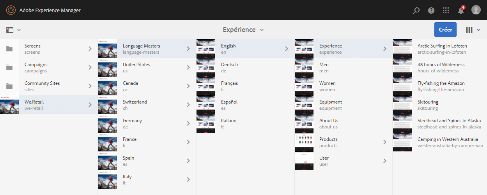
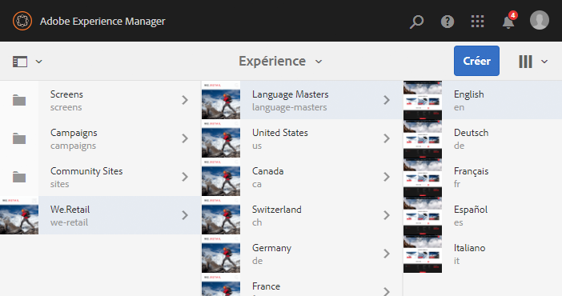
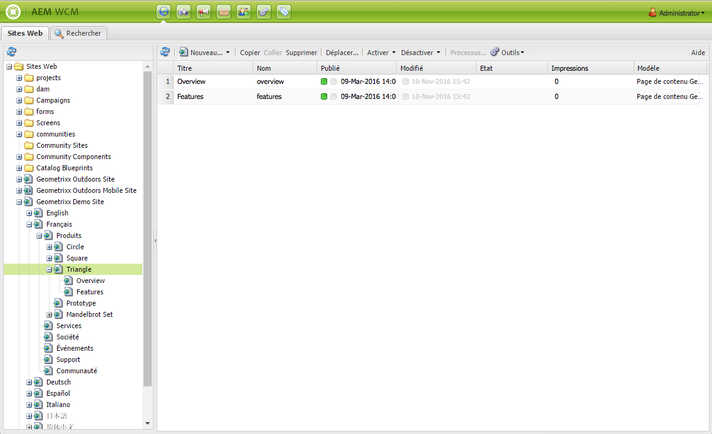
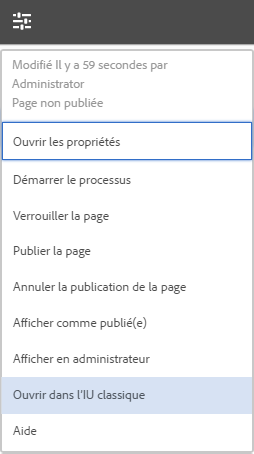

# Choix de l’interface utilisateur{#selecting-your-ui}

## Présentation des interfaces utilisateur

Dans l’environnement de création, vous pouvez effectuer les opérations suivantes :

* [Création](/help/sites-authoring/author.md) (y compris la [création de pages](/help/sites-authoring/author-environment-tools.md), la [gestion de ressources](/help/assets/home.md) et les [communautés](/help/communities/author-communities.md))

* [Administration](/help/sites-administering/home.md) des tâches nécessaires pour générer et gérer le contenu sur votre site web

Deux interfaces utilisateur graphiques sont à votre disposition, accessibles dans n’importe quel navigateur moderne :

1. Interface utilisateur optimisée pour les écrans tactiles

   * Il s’agit de l’interface utilisateur AEM moderne par défaut.
   * Particulièrement épurée, elle est principalement grise.
   * Elle est conçue à la fois pour les appareils à écran tactile les écrans tactiles et les ordinateurs de bureau. Son apparence est identique sur tous les appareils, bien que [l’affichage et la sélection des ressources](/help/sites-authoring/basic-handling.md#viewing-and-selecting-resources) diffèrent légèrement (pressions au lieu de clics).

      * Bureau :

   

   * Tablettes (ou bureau de moins de 1024 pixels de large) :

   

1. IU classique

   * Il s’agit de l’ancienne interface utilisateur, disponible dans AEM depuis de nombreuses années.
   * Elle est principalement verte.
   * Elle est conçue pour les appareils de bureau.
   * La documentation suivante concerne l’interface utilisateur moderne. Pour plus d’informations sur la création dans l’interface utilisateur classique, voir [Documentation sur la création dans l’interface utilisateur classique](/help/sites-classic-ui-authoring/classicui.md).

   

## Changement d’interface utilisateur

Bien que l’interface utilisateur tactile soit maintenant l’interface utilisateur standard et que la parité [fonctionnalité](../release-notes/touch-ui-features-status.md) ait presque été atteinte avec l’administration et la modification des sites, il peut arriver que l’utilisateur souhaite passer à l’[interface utilisateur classique](/help/sites-classic-ui-authoring/classicui.md). Pour ce faire, plusieurs possibilités s’offrent à lui.

>[!NOTE]
>
>Pour plus d’informations sur l’état de parité des fonctionnalités avec l’IU classique, voir le document [Parité des fonctionnalités de l’IU tactile](../release-notes/touch-ui-features-status.md).

Vous pouvez choisir quelle IU utiliser à divers emplacements :

* [Configuration de l&#39;interface utilisateur par défaut pour votre instance](#configuring-the-default-ui-for-your-instance)  : cette option définit l&#39;interface utilisateur par défaut à afficher lors de la connexion de l&#39;utilisateur, bien que l&#39;utilisateur puisse remplacer cette interface et sélectionner une autre interface pour son compte ou sa session en cours.

* [Définition de la création classique de l&#39;interface utilisateur pour votre compte](/help/sites-authoring/select-ui.md#setting-classic-ui-authoring-for-your-account)  : cette option définit l&#39;interface utilisateur à utiliser par défaut lors de la modification des pages, bien que l&#39;utilisateur puisse remplacer cette option et sélectionner une autre interface pour son compte ou sa session en cours.

* [Passage à l’interface utilisateur classique pour la session](#switching-to-classic-ui-for-the-current-session)  en cours : bascule vers l’interface utilisateur classique pour la session en cours.

* En cas de [création de pages, le système procède à certains remplacements dans la relation à l’interface utilisateur](#ui-overrides-for-the-editor).

>[!CAUTION]
>
>Plusieurs options de basculement vers l’interface utilisateur classique ne sont pas immédiatement disponibles. Elles doivent être configurées spécifiquement pour votre instance.
>
>Voir [Activation de l’accès à l’interface utilisateur classique](/help/sites-administering/enable-classic-ui.md) pour plus d’informations.

>[!NOTE]
>
>Les instances mises à niveau à partir d’une version précédente conservent l’IU classique pour la création de pages.
>
>Après la mise à niveau, la création de pages ne sera pas automatiquement basculée vers l’interface utilisateur tactile, mais vous pouvez la configurer à l’aide du [service de configuration OSGi](/help/sites-deploying/configuring-osgi.md) du **service de mode d’interface utilisateur de création WCM** (service `AuthoringUIMode`). Voir [IU par défaut en fonction de l’éditeur](#ui-overrides-for-the-editor).

## Configuration de l’IU par défaut pour votre instance {#configuring-the-default-ui-for-your-instance}

Un administrateur système peut configurer l’IU qui s’affiche au démarrage et lors de la connexion à l’aide du [mappage à la racine](/help/sites-deploying/osgi-configuration-settings.md).

Les paramètres par défaut de l’utilisateur ou les paramètres de la session peuvent remplacer ce comportement.

## Définition de l’IU de création classique pour votre compte  {#setting-classic-ui-authoring-for-your-account}

Chaque utilisateur peut accéder à ses [préférences utilisateur](/help/sites-authoring/user-properties.md) pour définir s’il souhaite utiliser l’IU classique pour la création de pages (au lieu de l’IU par défaut).

Les paramètres de la session peuvent remplacer ce comportement.

## Activation de l’IU classique pour la session en cours  {#switching-to-classic-ui-for-the-current-session}

Ainsi, si l’IU tactile est activée sur un ordinateur de bureau, les utilisateurs peuvent souhaiter revenir à l’IU classique (ordinateur de bureau uniquement). Plusieurs méthodes permettent de basculer vers l’IU classique pour la session en cours :

* **Liens de navigation**

   >[!CAUTION]
   >
   >Cette option de basculement vers l’interface utilisateur classique n’est pas immédiatement disponible. Elle doit être configurée spécifiquement pour votre instance.
   >
   >
   >Voir [Activation de l’accès à l’interface utilisateur classique](/help/sites-administering/enable-classic-ui.md) pour plus d’informations.

   Si cette option est activée, lorsque vous faites passer le pointeur de la souris sur une console appropriée, une icône s’affiche (symbole d’un moniteur). En appuyant/cliquant sur cette dernière, vous accédez à l’emplacement correspondant dans l’IU classique.

   Par exemple, les liens de **Sites** à **siteadmin** :

   

* **URL**

   L’interface utilisateur classique est accessible à l’aide de l’URL de l’écran de bienvenue à l’adresse `welcome.html`. Par exemple :

   `http://localhost:4502/welcome.html`

   >[!NOTE]
   >
   >L’IU tactile est accessible via `sites.html`. Par exemple :
   >
   >
   >`http://localhost:4502/sites.html`

### Activation de l’IU classique en cours de modification de page {#switching-to-classic-ui-when-editing-a-page}

>[!CAUTION]
>
>Cette option de basculement vers l’interface utilisateur classique n’est pas immédiatement disponible. Elle doit être configurée spécifiquement pour votre instance.
>
>Voir [Activation de l’accès à l’interface utilisateur classique](/help/sites-administering/enable-classic-ui.md) pour plus d’informations.

Si cette option est activée, l’option **Ouvrir l’IU classique** est disponible dans la boîte de dialogue **Informations sur la page** :

### UI Overrides for the Editor {#ui-overrides-for-the-editor}

Les paramètres définis par un utilisateur ou un administrateur du système peuvent être remplacés par les paramètres système en cas de création de page.

* Lors de la création de pages :

   * L’utilisation de l’éditeur classique est forcée lors de l’accès à la page à l’aide de `cf#` dans l’URL. Par exemple :

      `http://localhost:4502/cf#/content/geometrixx/en/products/triangle.html`

   * L’utilisation de l’éditeur tactile est forcée lors de l’utilisation de `/editor.html` dans l’URL ou lors de l’utilisation d’un périphérique tactile. Par exemple :

      `http://localhost:4502/editor.html/content/geometrixx/en/products/triangle.html`

* Tout recours forcé à un certain éditeur est temporaire et valide uniquement pour la session en cours.

   * Un jeu de cookies sera défini selon que l’option tactile ( `editor.html`) ou classique ( `cf#`) est utilisée ou non.

* Lors de l&#39;ouverture de pages par `siteadmin`, des vérifications seront effectuées pour vérifier l&#39;existence de :

   * présence du cookie ;
   * préférence utilisateur ;
   * en l’absence de tels paramètres, l’IU définie par défaut dans la [configuration OSGi](/help/sites-deploying/configuring-osgi.md) du service **WCM Authoring UI Mode** (service `AuthoringUIMode`) est utilisée.

>[!NOTE]
>
>Si [un utilisateur a déjà défini une préférence pour la création de pages](#setting-classic-ui-authoring-for-your-account), ce paramètre est conservé lors de la modification de la propriété OSGi.

>[!CAUTION]
>
>En raison de l’utilisation des cookies, comme indiqué ci-dessus, les opérations suivantes ne sont pas recommandées :
>
>* Modifier manuellement l’URL : une URL non standard risque de générer une situation inconnue et une absence de fonctionnalité.
>* Ouvrir les deux éditeurs en même temps ; dans des fenêtres distinctes, par exemple.

>

