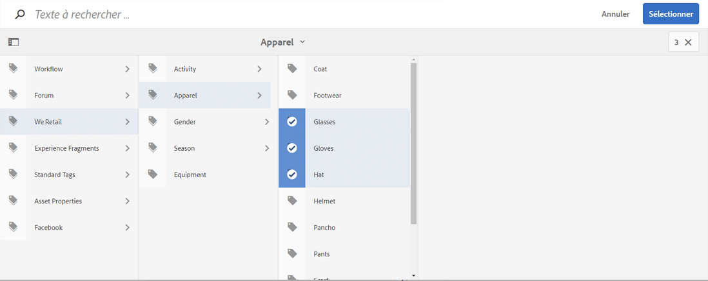
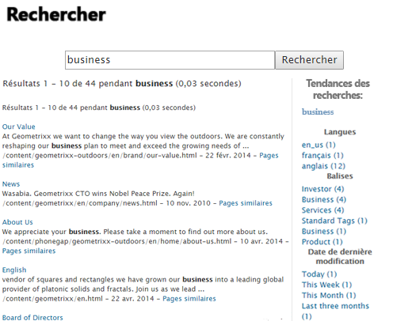

# Utilisation des balises {#using-tags}

>[!CAUTION]
>
>AEM 6.4 a atteint la fin de la prise en charge étendue et cette documentation n’est plus mise à jour. Pour plus d’informations, voir notre [période de support technique](https://helpx.adobe.com/fr/support/programs/eol-matrix.html). Rechercher les versions prises en charge [here](https://experienceleague.adobe.com/docs/?lang=fr).

Les balises sont une méthode rapide et facile de classer le contenu dans un site web. Les balises peuvent être considérées comme des mots-clés ou des étiquettes pouvant être jointes à une page, à une ressource ou à un autre contenu pour permettre aux recherches de trouver ce contenu et le contenu associé.

* Consultez la section [Administration des balises](/help/sites-administering/tags.md) pour savoir comment créer et gérer des balises et déterminer à quel contenu elles ont été appliquées.
* Consultez la section [Balisage pour l’équipe de développement](/help/sites-developing/tags.md) pour plus d’informations sur l’environnement de balisage et sur l’inclusion et l’extension de balises dans les applications personnalisées.

## Dix raisons d’utiliser les balises {#ten-reasons-to-use-tagging}

1. Organisation du contenu : le balisage simplifie la vie des auteurs, car ils peuvent rapidement organiser le contenu sans effort.

1. Organisation des balises : tandis que les balises organisent le contenu, les taxonomies/espaces de noms hiérarchiques organisent les balises.

1. Balises organisées en profondeur : avec la possibilité de créer des balises et des sous-balises, il devient possible d’exprimer des systèmes taxonomiques complets, couvrant des termes, des sous-termes et leurs relations. Cela vous permet de créer une deuxième (ou une troisième) hiérarchie de contenu, parallèlement à la hiérarchie officielle.

1. Balisage contrôlé : Le balisage peut être contrôlé en appliquant des autorisations aux balises et/ou aux espaces de noms pour contrôler la création et l’application de balises.

1. Balisage flexible : Les balises ont plusieurs noms et visages : balises, termes de taxonomie, catégories, libellés, etc. Ils se distinguent par une grande souplesse au niveau de leur modèle de contenu et de leur mode d’exploitation ; par exemple, lors de la description des données démographiques cibles, de la classification et de l’évaluation du contenu, ou encore de la création d’une hiérarchie de contenu secondaire.

1. Amélioration de la recherche : le composant de recherche par défaut d’AEM inclut globalement les balises créées et les balises appliquées auxquelles des filtres peuvent être appliqués pour limiter les résultats aux balises pertinentes.

1. Activation de l’optimisation pour les moteurs de recherche : les balises appliquées en tant que propriétés de page s’affichent automatiquement dans les métadonnées de la page, ce qui les rend visibles pour les moteurs de recherche.

1. Sophistication simple : les balises peuvent simplement être créées à partir d’un mot et en cliquant sur un bouton. Ensuite, un titre, une description et un nombre illimité de libellés peuvent être utilisés pour associer plus de termes à la balise.

1. Cohérence : le système de balisage est un composant principal de AEM et est utilisé par toutes les fonctionnalités d’AEM pour catégoriser le contenu. En outre, l’API de balisage est mise à la disposition des développeurs pour leur permettre de créer des applications prenant en charge le balisage avec un accès aux mêmes taxonomies.

1. Structuration et flexibilité : AEM est idéal pour travailler avec des informations structurées, en raison de l’imbrication de pages et de chemins d’accès. Il est tout aussi puissant lorsque vous utilisez des informations non structurées, en raison de la recherche de texte intégral intégrée. Le balisage combine les avantages de la structure et de la flexibilité.

Lors de la conception de la structure de contenu d’un site et du schéma de métadonnées des ressources, tenez compte de l’approche légère et accessible fournie par le balisage.

## Application de balises {#applying-tags}

Dans l’environnement de développement de contenu, les auteurs peuvent appliquer des balises en accédant aux propriétés de la page et en entrant une ou plusieurs balises dans le champ **Balises/Mots-clés**.

Pour appliquer les [balises prédéfinies](/help/sites-administering/tags.md), dans la fenêtre **Propriétés de la page**, utilisez le champ **Balises** et la fenêtre **Sélectionner les balises**. L’onglet **Balises standard** est l’espace de noms par défaut, ce qui signifie qu’il n’y a pas de `namespace-string:` préfixé à la taxonomie.

### Publication de balises {#publishing-tags}

Comme pour les pages, vous pouvez effectuer les opérations suivantes sur les balises et les espaces de noms :

**Activer**

* Activez individuellement des balises.

   A l’instar des pages, les nouvelles balises doivent être activées avant d’être disponibles dans l’environnement de publication.

>[!NOTE]
>
>Lorsque vous activez une page, une boîte de dialogue s’ouvre automatiquement pour vous permettre d’activer les balises inactivées qui en font partie.

**Désactiver**

* Désactivez les balises sélectionnées.

## Nuages de tags {#tag-clouds}

Les nuages de tags affichent un  nuage de tags pour la page en cours, pour l’intégralité du site web ou pour les éléments visités le plus souvent. Les nuages de tags permettent de mettre en évidence les points qui présentent (ou ont présenté) un intérêt pour l’utilisateur. La taille du texte utilisé pour afficher la balise varie en termes d’utilisation.

Le [Nuage de balises](/help/sites-authoring/default-components-foundation.md#tag-cloud) Le composant (groupe de composants Général) est utilisé pour ajouter un nuage de balises à une page.

## Recherche sur les balises {#searching-on-tags}

Vous pouvez rechercher des balises dans les environnements de création et de publication.

### Utilisation du composant Recherche {#using-search-component}

L’ajout d’un [composant de recherche](/help/sites-authoring/default-components-foundation.md#search) à une page fournit une fonctionnalité de recherche qui inclut des balises. Elle peut être utilisée dans les environnements de création et de publication.

