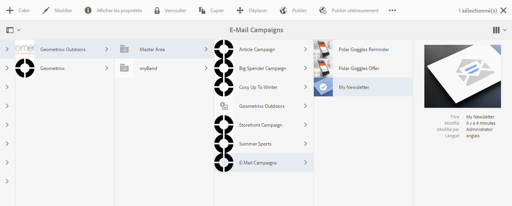

# Ciblage d’un élément de campagne Adobe Campaign{#targeting-your-adobe-campaign}

Pour cibler votre newsletter Adobe Campaign, vous devez d’abord configurer la segmentation, ce qui n’est possible que dans l’IU classique (pour ClientContext). Ensuite, vous pouvez créer des expériences ciblées pour Adobe Campaign. Les deux procédures sont décrites dans cette section.

## Configuration de la segmentation dans AEM {#setting-up-segmentation-in-aem}

Pour configurer la segmentation, vous devez utiliser l’IU classique afin de configurer les segments. Les étapes restantes peuvent être exécutées dans l’IU standard.

La configuration de la segmentation comprend la création de segments, d’une marque, d’une campagne et d’expériences.

>[!NOTE]
>
>L’ID de segment doit être mappé sur celui du côté Adobe Campaign.

### Création de segments {#creating-segments}

Pour créer des segments :

1. Open the [segmentation console](http://localhost:4502/miscadmin#/etc/segmentation) at **&lt;host>:&lt;port>/miscadmin#/etc/segmentation**.
1. Create a new page and enter a title - for example, **AC Segments**- and select the **Segment (Adobe Campaign)** template.
1. Sélectionnez la page créée dans l’arborescence située sur le côté gauche.
1. Créez un segment, par exemple en ciblant les utilisateurs hommes, en créant une nouvelle page sous le segment créé et intitulé Masculin, puis sélectionnez le modèle **Segment (Adobe Campaign)**.
1. Ouvrez la page du segment créé et faites glisser **ID de segment** à partir du sidekick jusque sur la page.
1. Double-click the trait, enter the ID representing in this case, the male segment defined in Adobe Campaign - for example, **MALE** - and click **OK**. Le message suivant doit s’afficher : *`targetData.segmentCode == "MALE"`*
1. Recommencez ces étapes pour un autre segment, par exemple, un segment ciblant les utilisateurs femmes.

### Création d’une marque {#creating-a-brand}

Pour créer une marque, procédez comme suit :

1. Dans **Sites**, accédez au dossier **Campagnes** (par exemple dans We.Retail).
1. Cliquez sur **Créer une page** et entrez le titre de la page, par exemple Marque We.Retail, puis sélectionnez le modèle **Marque**.

### Création d’une campagne {#creating-a-campaign}

Pour créer une campagne, procédez comme suit :

1. Ouvrez la page **Marque** que vous venez de créer. 
1. Cliquez sur **Créer une page** et saisissez le titre de la page, par exemple, Campagne We.Retail, puis sélectionnez le modèle **Campagne** et cliquez sur **Créer**.

### Création d’expériences {#creating-experiences}

Pour créer des expériences liées à des segments :

1. Open the **Campaign** page you just created.
1. Create experiences for your segments by clicking **Create Page** and entering a title for your page, for example, Male as you are creating an experience for the Male segment, and select the **Experience** template.
1. Ouvrez la page Expérience créée.
1. Cliquez sur **Modifier**, puis sous Segments, cliquez sur **Ajouter un élément**.
1. Enter the path to the male segment, for example **/etc/segmentation/ac-segments/male** and click **OK**. The following message should appear: *Experience is targeted at: Male*
1. Recommencez les étapes précédentes afin de créer une expérience pour tous les segments, par exemple la cible Féminin.

## Création d’une newsletter avec du contenu ciblé {#creating-a-newsletter-with-targeted-content}

Une fois que vous avez créé des segments, une marque, une campagne et une expérience, vous pouvez créer une newsletter avec du contenu ciblé. Après avoir créé l’expérience, vous l’associez à vos segments.

>[!NOTE]
>
>[Les exemples de messages électroniques ne sont disponibles que dans Geometrixx](/help/sites-developing/we-retail.md). Téléchargez un exemple de contenu Geometrixx à partir de Package Share.

Pour créer une newsletter avec du contenu ciblé :

1. Create a newsletter with targeted content: Below Email Campaigns in Geometrixx Outdoors, click or tap **Create** > **Page**, and select one of the Adobe Campaign Mail templates.

   

1. Dans la newsletter, ajoutez un composant Texte et personnalisation.
1. Ajoutez le texte dans le composant Texte et personnalisation, par exemple « Newsletter par défaut. »
1. Click the arrow next to **Edit** and select **Targeting**.
1. Sélectionnez votre marque dans le menu déroulant Marque, puis sélectionnez votre campagne. (Il s’agit de la marque et de la campagne que vous avez créées précédemment.)
1. Cliquez sur **Commencer le ciblage**. Vous voyez vos segments apparaître dans la zone Audiences. L’expérience par défaut est utilisée si aucun des segments définis ne correspond.

   >[!NOTE]
   >
   >Par défaut, les exemples de message électronique fournis dans AEM utilisent Adobe Campaign comme moteur de ciblage. Pour les newsletters personnalisées, il se peut que vous deviez sélectionner Adobe Campaign comme moteur de ciblage. Lors du ciblage, cliquez ou appuyez sur + dans la barre d’outils, entrez le titre de la nouvelle activité, puis sélectionnez **Adobe Campaign** comme moteur de ciblage.

1. Cliquez sur **Par défaut**, puis sur le composant Texte et personnalisation que vous avez ajouté. La cible s’affiche avec une flèche dessus. Cliquez sur l’icône pour cibler ce composant.

   

1. Accédez à un autre segment (Masculin), puis cliquez sur **Ajouter une offre** et sur l’icône +. Puis, modifiez l’offre.
1. Accédez à un autre segment (Féminin), puis cliquez sur **Ajouter une offre** et sur l’icône +. Modifiez ensuite cette offre. 
1. Click **Next** to see Mapping, then click **Next** to see Settings, which does not apply to Adobe Campaign, and click **Save**.

   AEM génère automatiquement le code de ciblage correct pour Adobe Campaign lorsque le contenu est utilisé dans une diffusion au sein d’Adobe Campaign.

1. Dans Adobe Campaign, créez la diffusion. Sélectionnez **Envoi de courriers électroniques avec le contenu AEM** et sélectionnez le compte AEM local selon les besoins. Confirmez vos modifications.

   En mode d’affichage HTML, les différentes expériences des composants ciblés sont incluses dans le code de ciblage d’Adobe Campaign.

   

   >[!NOTE]
   >
   >Si vous configurez également les segments dans Adobe Campaign, cliquez sur **Aperçu** pour voir les expériences de chaque segment.

