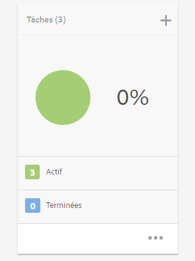
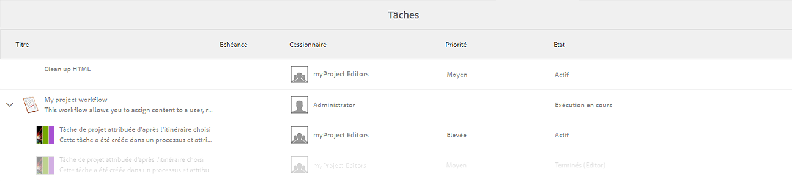
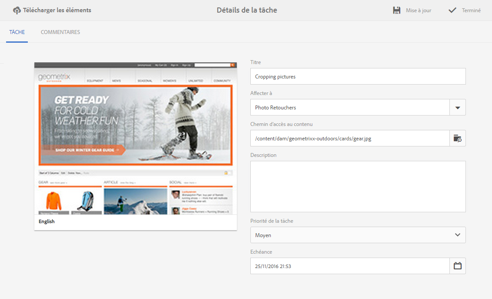
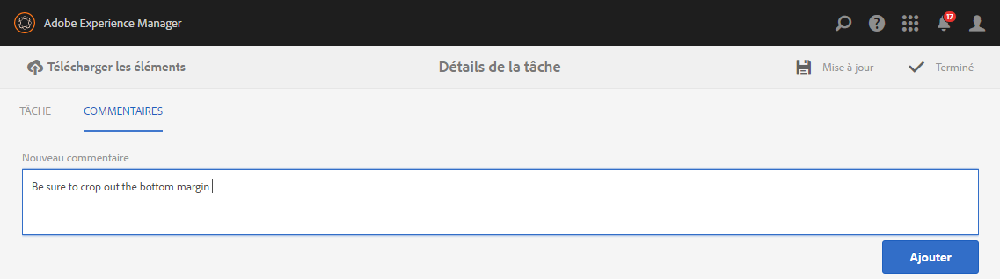
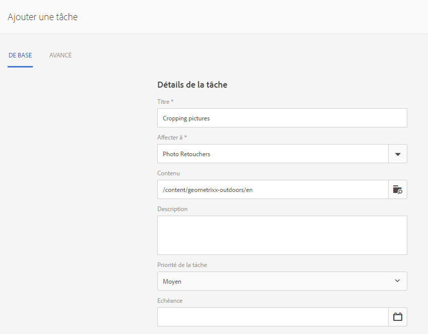
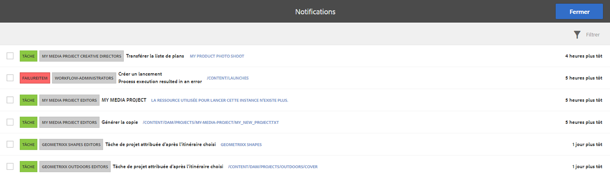
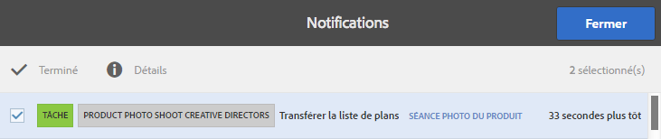

# Utilisation de tâches{#working-with-tasks}

>[!CAUTION]
>
>AEM 6.4 a atteint la fin de la prise en charge étendue et cette documentation n’est plus mise à jour. Pour plus d’informations, voir notre [période de support technique](https://helpx.adobe.com/fr/support/programs/eol-matrix.html). Rechercher les versions prises en charge [here](https://experienceleague.adobe.com/docs/?lang=fr).

Les tâches représentent des éléments de travail à effectuer sur le contenu. Lorsqu’une tâche vous est assignée, elle apparaît dans la Boîte de réception de Workflow. Les éléments de tâche ont une valeur de tâche dans la colonne Type .

Les tâches sont également utilisées dans les projets pour déterminer le niveau de réalisation des tâches en cours, y compris des tâches de workflow.

## Suivi de la progression du projet {#tracking-project-progress}

Vous pouvez suivre la progression du projet en examinant les tâches principales/terminées dans un projet représenté par le **Tâches** mosaïque. La progression du projet peut être déterminée par :

* **Mosaïque Tâches :** un état d’avancement global du projet est présenté dans la mosaïque Tâches disponible sur la page des détails du projet.

* **Liste Tâches :** lorsque vous cliquez sur la mosaïque Tâches, la liste des tâches s’affiche. Cette liste contient des informations détaillées sur toutes les tâches liées au projet.

Ces deux éléments répertorient les tâches de workflow, ainsi que les tâches que vous créez directement dans la mosaïque **Tâches**.

### Mosaïque Tâches {#task-tile}

Si un projet comporte des tâches associées, une mosaïque Tâche s’affiche dans le projet. La mosaïque Tâche affiche l’état actuel du projet. Cet état inclut les tâches existantes dans le workflow et ne contient aucune tâche générée ultérieurement à mesure que se déroule le workflow. Les informations suivantes sont visibles dans la mosaïque de la tâche :

* Pourcentage de tâches terminées
* Pourcentage de tâches principales
* Pourcentage de tâches en retard

### Affichage ou modification des tâches dans un projet {#viewing-or-modifying-the-tasks-in-a-project}

Outre le suivi de l’avancée du projet, vous pouvez également afficher plus d’informations sur le projet ou le modifier.

#### Liste de tâches {#task-list}

Cliquez sur les points de suspension (...) dans la mosaïque Tâche pour afficher la liste des tâches liées au projet. Les tâches sont divisées par workflow parent. Les détails de la tâche s’affichent avec les métadonnées, comme la date d’échéance, la personne désignée, la priorité et le statut.

#### Détails de la tâche {#task-details}

Pour plus d’informations sur une tâche particulière, dans la liste Tâches, cliquez/appuyez sur la tâche pour ouvrir la fenêtre **Détails de la tâche**.

### Affichage et modification des commentaires de tâche {#viewing-and-modifying-task-comments}

Dans Détails de la tâche, vous pouvez modifier ou ajouter des commentaires. En outre, tous les commentaires d’un projet sont visibles dans la zone Commentaires .

### Ajout de tâches {#adding-tasks}

Vous pouvez ajouter de nouvelles tâches aux projets. Ces tâches apparaissent ensuite dans la mosaïque Tâches et sont disponibles dans la boîte de réception Notifications pour effectuer des actions.

Pour ajouter une tâche, procédez comme suit :

1. Dans le projet, accédez à la mosaïque **Tâches** et appuyez/cliquez sur l’icône +. La fenêtre **Ajouter une tâche** s’affiche.
1. Saisissez des informations sur la tâche. Le titre de la tâche et le groupe auquel elle est affectée sont obligatoires. Des informations supplémentaires telles que le chemin d’accès au contenu, la description, la priorité de la tâche et la date d’échéance sont facultatives. En outre, vous pouvez sélectionner la variable **Avancé** pour saisir le nom de la tâche, qui est utilisé pour nommer l’URL.

   

1. Cliquez/appuyez sur **Créer**.

## Utilisation des tâches dans la boîte de réception {#working-with-tasks-in-the-inbox}

Une autre méthode d’accès aux tâches consiste à utiliser la boîte de réception. Dans la boîte de réception, vous pouvez ouvrir le contenu pour mettre en oeuvre les modifications requises. Une fois cette opération effectuée, définissez l’état de la tâche sur « Terminé ». Les tâches s’affichent également dans votre boîte de réception lorsqu’elles sont affectées à un groupe d’utilisateurs auquel vous appartenez. Dans ce cas, tout membre du groupe peut effectuer le travail et terminer la tâche.

Pour terminer une tâche, sélectionnez la tâche, puis cliquez sur **Terminer**. Ajoutez des informations à la tâche, puis cliquez sur **Terminé**. Voir [Votre boîte de réception](/help/sites-authoring/inbox.md) pour plus d’informations.

