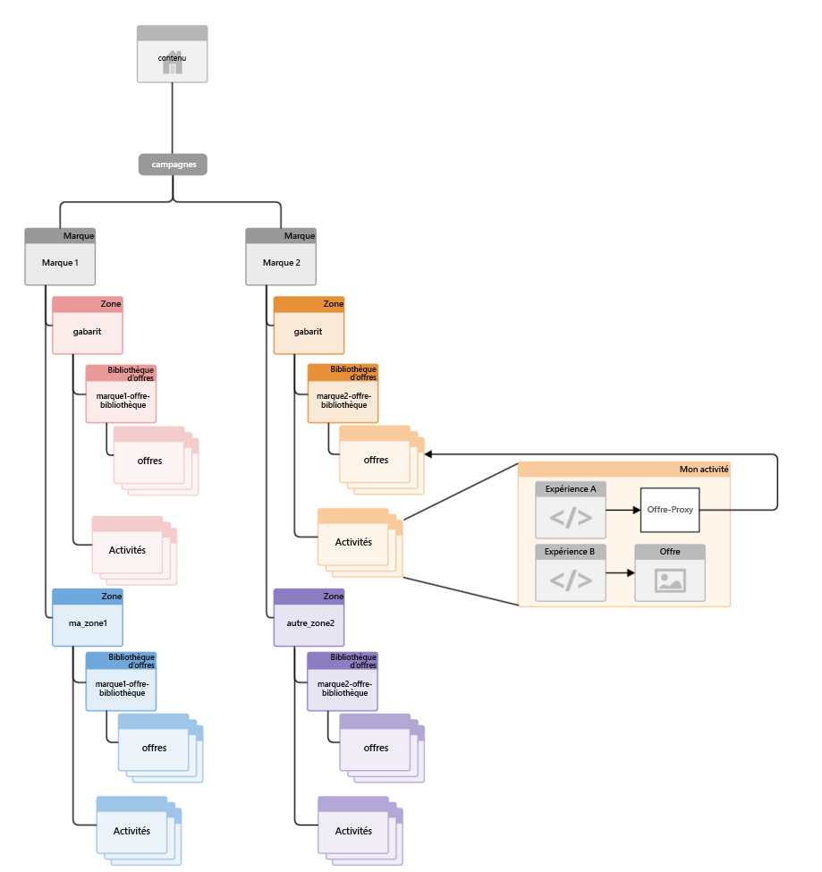
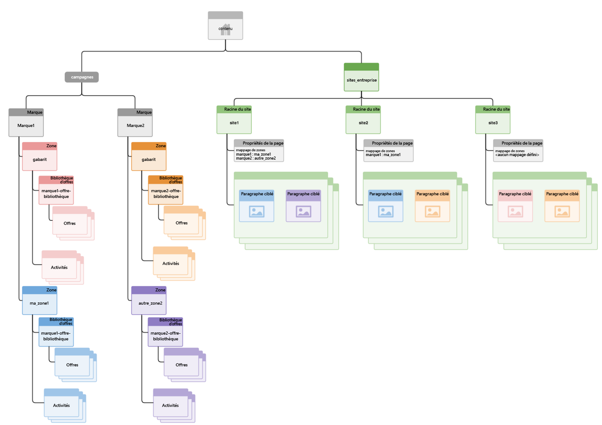

# Structuration de la gestion multisite du contenu ciblé{#how-multisite-management-for-targeted-content-is-structured}

>[!CAUTION]
>
>AEM 6.4 a atteint la fin de la prise en charge étendue et cette documentation n’est plus mise à jour. Pour plus d’informations, voir notre [période de support technique](https://helpx.adobe.com/fr/support/programs/eol-matrix.html). Rechercher les versions prises en charge [here](https://experienceleague.adobe.com/docs/?lang=fr).

Le diagramme suivant indique comment est structurée la prise en charge multisite du contenu ciblé.

Les zones apparaissent sous **/content/campaigns/&lt;marque>** et par défaut chaque marque comporte une zone maître, qui est créée automatiquement. Chaque zone contient son propre ensemble d’activités, d’expériences et d’offres.

Pour rechercher du contenu ciblé, les pages ou les sites peuvent correspondre à une zone. Si aucune zone n’est configurée, AEM revient à la zone maître de cette marque spécifique.

Le diagramme suivant illustre le fonctionnement de la logique pour trois sites, nommés site1, site2 et site3.

* site1 recherche myarea1 pour brand1 et otherarea2 pour brand2 en fonction du mappage des zones.
* site2 recherche myarea1 pour la marque1 et la zone maître pour la marque2, car seul le mappage de zone pour la marque1 est défini.
* site3 recherche la zone maître pour brand1 et brand2, car aucun autre mappage de zone n’est défini pour ce site.
