# Gestion de projets{#managing-projects}

>[!CAUTION]
>
>AEM 6.4 a atteint la fin de la prise en charge étendue et cette documentation n’est plus mise à jour. Pour plus d’informations, voir notre [période de support technique](https://helpx.adobe.com/fr/support/programs/eol-matrix.html). Rechercher les versions prises en charge [here](https://experienceleague.adobe.com/docs/?lang=fr).

La console Projets vous permet d’organiser votre projet en regroupant les ressources dans une seule entité.

Dans le **Projets** , vous accédez à vos projets et vous y exécutez les actions suivantes :

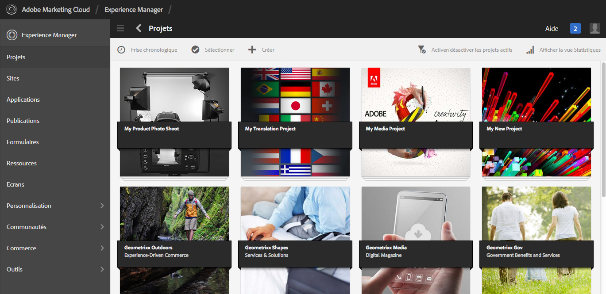

Dans les projets, vous pouvez créer un projet, associer des ressources à votre projet et supprimer un projet ou des liens Ressource. Vous pouvez ouvrir une mosaïque pour afficher son contenu et ajouter des éléments à une mosaïque. Cette rubrique décrit ces procédures.

>[!NOTE]
>
>La version 6.2 offre la possibilité d’organiser les projets dans des dossiers. Sur la page Projets , vous pouvez créer un projet ou un dossier.
>
>Si un dossier est créé, l’utilisateur est alors amené dans ce dossier où il peut créer un autre dossier ou un projet. Il permet d’organiser les projets dans des dossiers en fonction de catégories telles que les campagnes de produits, l’emplacement, les langues de traduction, etc.
>
>Les projets et les dossiers peuvent être affichés en mode Liste et faire l’objet de recherches.

>[!CAUTION]
>
>Pour que les utilisateurs participant à des projets voient d’autres utilisateurs/groupes lorsqu’ils utilisent des fonctionnalités de la console Projets comme créer des projets, créer des tâches/workflows, afficher et gérer l’équipe, ils doivent disposer d’un accès en lecture à **/home/users** et **/home/groups**. Le moyen le plus simple de mettre en oeuvre cette méthode consiste à attribuer la variable **projects-users** accès en lecture au groupe **/home/users** et **/home/groups**.

## Création d’un projet {#creating-a-project}

AEM fournit les modèles prêts à l’emploi suivants à utiliser lors de la création d’un projet :

* Projet simple
* Projet de média
* Projet de séance photo du produit
* Projet de traduction

Les étapes de création d’un projet sont identiques d’un projet à l’autre. La différence entre les types de projets porte sur les [rôles utilisateur](/help/sites-authoring/projects.md) et les [workflows](/help/sites-authoring/projects-with-workflows.md) disponibles. Pour créer un projet :

1. Dans **Projets**, appuyez/cliquez sur **Créer** pour ouvrir l’assistant **Créer un projet** :
1. Sélectionner un modèle. Prêt à l’emploi : projet simple, projet multimédia, [Projet de traduction](/help/sites-administering/tc-manage.md), et [Produit Séance photo du produit](/help/sites-authoring/managing-product-information.md) sont disponibles et cliquez sur **Suivant**.

   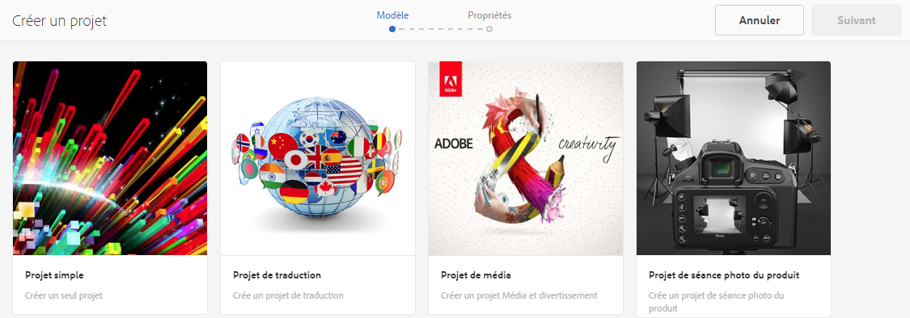

1. Définissez le **titre** et la **description**, puis ajoutez une **miniature** s’il y a lieu. Vous pouvez également ajouter ou supprimer des utilisateurs et définir le groupe auquel ils appartiennent. En outre, cliquez sur **Avancé** pour ajouter un nom utilisé dans l’URL.

   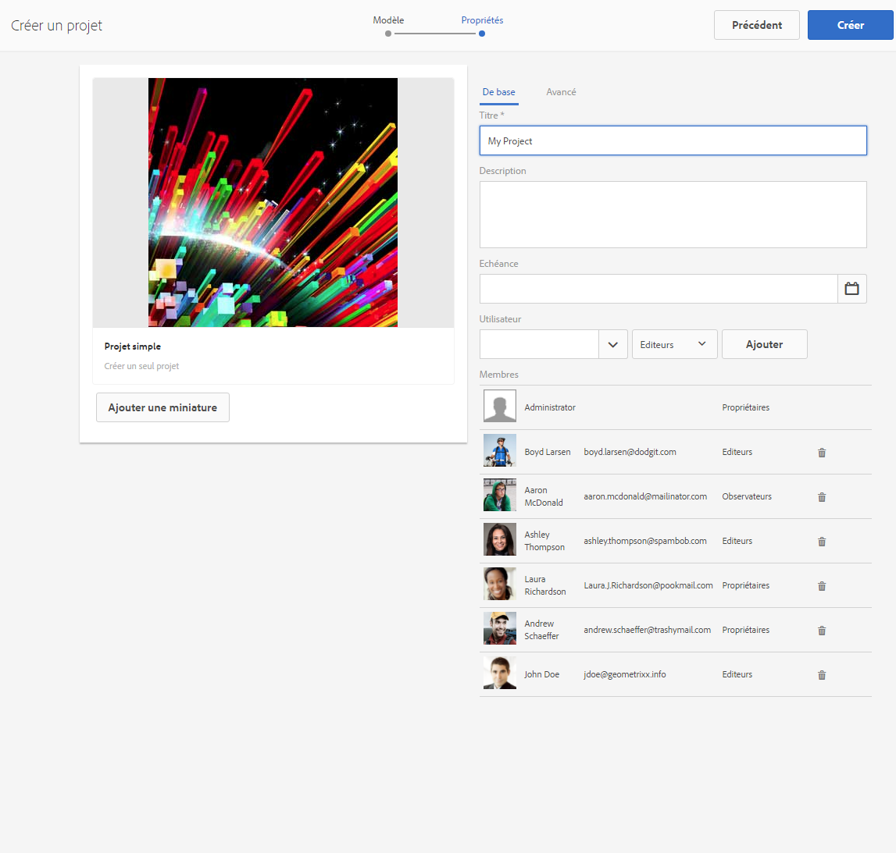

1. Cliquez/appuyez sur **Créer**. Le message de confirmation vous demande si vous voulez ouvrir votre projet ou revenir à la console.

### Association de ressources à un projet {#associating-resources-with-your-project}

Comme les projets vous permettent de regrouper des ressources dans une seule entité, vous souhaitez associer des ressources à votre projet. Ces ressources sont appelées **Mosaïques**. Les types de ressources que vous pouvez ajouter sont décrits à la section [Mosaïques de projet](/help/sites-authoring/projects.md#project-tiles).

Pour associer des ressources à votre projet :

1. Ouvrez votre projet à partir du **Projets** console.
1. Appuyez/cliquez sur **Ajouter une mosaïque** et sélectionnez la mosaïque à lier à votre projet. Vous pouvez sélectionner plusieurs types de mosaïque.

   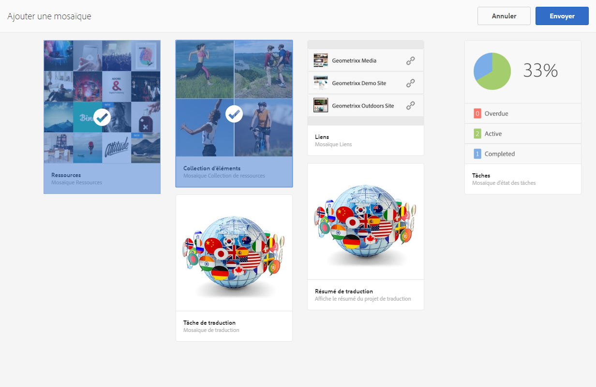

   >[!NOTE]
   >
   >Les mosaïques de projet qui peuvent être associées à un projet sont décrites en détail dans la rubrique [Mosaïques de projet](/help/sites-authoring/projects.md#project-tiles).

1. Cliquez/appuyez sur **Créer**. La ressource est désormais associée à votre projet et vous pouvez y accéder à partir du projet.

### Suppression d’un projet ou d’un lien vers une ressource {#deleting-a-project-or-resource-link}

La méthode permettant de supprimer un projet à partir de la console est la même que celle employée pour supprimer une ressource liée de votre projet :

1. Accédez à l’emplacement approprié :

   * Pour supprimer un projet, accédez au niveau supérieur de la **Projets** console.
   * Pour supprimer un lien vers une ressource dans un projet, ouvrez le projet dans la console **Projets**.

1. Activez le mode de sélection en cliquant sur **Sélectionner** et sélectionnez le projet ou le lien vers une ressource.
1. Cliquez/appuyez sur **Supprimer**.

1. Vous devez confirmer la suppression dans une boîte de dialogue. Si cette opération est confirmée, le projet ou le lien vers la ressource est supprimé. Cliquez/appuyez sur **Désélectionner** pour quitter le mode de sélection.

>[!NOTE]
>
>Lorsque vous créez le projet et ajoutez des utilisateurs aux différents rôles, les groupes associés au projet sont automatiquement créés pour gérer les autorisations associées. Par exemple, un projet appelé Myproject aurait trois groupes **Myproject Owners**, **Myproject Editors**, **Myproject Observators**. Toutefois, si le projet est supprimé, ces groupes ne sont pas automatiquement supprimés. Un administrateur doit supprimer manuellement les groupes dans **Outils** > **Sécurité** > **Groupes**.

### Ajout d’éléments à une mosaïque {#adding-items-to-a-tile}

Dans certaines mosaïques, vous pouvez ajouter plusieurs éléments. Par exemple, plusieurs workflows peuvent s’exécuter à la fois ou plusieurs expériences.

Pour ajouter des éléments à une mosaïque :

1. Dans la console **Projets**, accédez au projet, puis cliquez sur l’icône d’ajout (+) dans la mosaïque à laquelle vous souhaitez ajouter un élément.

   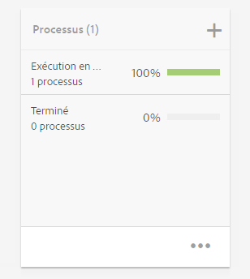

1. Ajoutez un élément à la mosaïque comme vous le feriez lors de la création d’une mosaïque. Les mosaïques de projets sont décrites [ici](/help/sites-authoring/projects.md#project-tiles). Dans cet exemple, un autre workflow a été ajouté.

   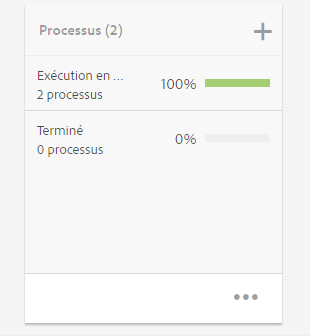

### Ouverture d’une mosaïque {#opening-a-tile}

Vous pouvez afficher les éléments inclus dans une mosaïque actuelle ou modifier ou supprimer des éléments dans la mosaïque.

Pour ouvrir une mosaïque afin d’afficher ou de modifier des éléments :

1. Dans la console Projets, cliquez/appuyez sur les points de suspension (...)

   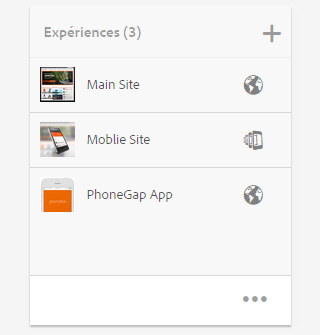

1. AEM répertorie les éléments de cette mosaïque. Vous pouvez passer en mode de sélection pour modifier ou supprimer les éléments.

   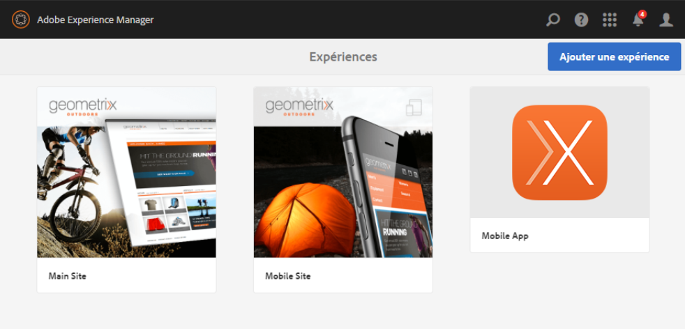

## Affichage des statistiques d’un projet {#viewing-project-statistics}

Pour afficher les statistiques d’un projet, dans la variable **Projets** console, cliquez sur **Afficher la vue Statistiques**. Le niveau d’achèvement de chaque projet s’affiche. Cliquez une nouvelle fois sur **Afficher la vue Statistiques** pour accéder à la console **Projets**.

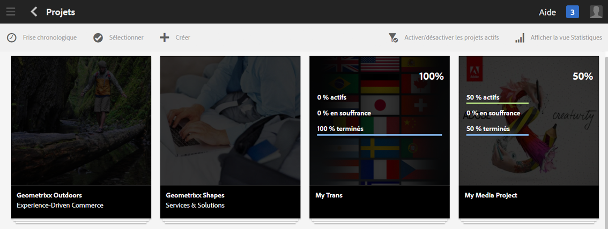

### Affichage d’une chronologie de projet {#viewing-a-project-timeline}

La chronologie du projet fournit des informations sur le moment auquel les ressources du projet ont été utilisées pour la dernière fois. Pour afficher la chronologie du projet, cliquez/appuyez sur **Chronologie**, puis activez le mode de sélection et sélectionnez le projet. Les ressources sont affichées dans le volet de gauche. Cliquez/appuyez sur **Chronologie** pour revenir à la console **Projets**.

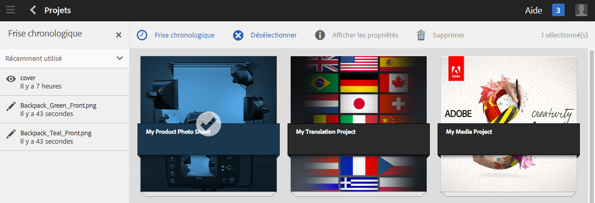

### Affichage de projets actifs/inactifs {#viewing-active-inactive-projects}

Pour basculer entre vos projets actifs et inactifs, dans la console **Projets**, cliquez sur **Activer/désactiver les projets actifs**. Si l’icône est accompagnée d’une coche, les principaux projets s’affichent.

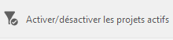

Si l’icône est accompagnée d’une croix (x), elle affiche les projets inactifs.

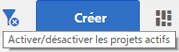

## Activation/désactivation de projets {#making-projects-inactive-or-active}

Vous pouvez désactiver un projet si vous l’avez terminé, mais que vous souhaitez conserver ses informations.

Pour rendre un projet inactif (ou principal) :

1. Dans le **Projets** , ouvrez votre projet, puis recherchez **Informations sur le projet** mosaïque.

   >[!NOTE]
   Vous devrez peut-être ajouter cette mosaïque si elle ne figure pas déjà dans votre projet. Voir [Ajout de mosaïques](#adding-items-to-a-tile).

1. Appuyez/cliquez sur **Modifier**.
1. Basculez la valeur du sélecteur entre **Actif** et **Inactif**.

   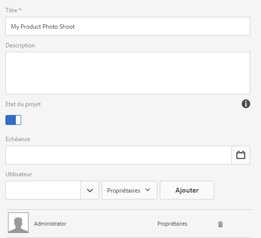

1. Cliquez/appuyez sur **Terminé** pour enregistrer vos modifications.
