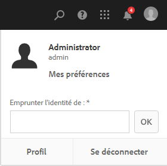
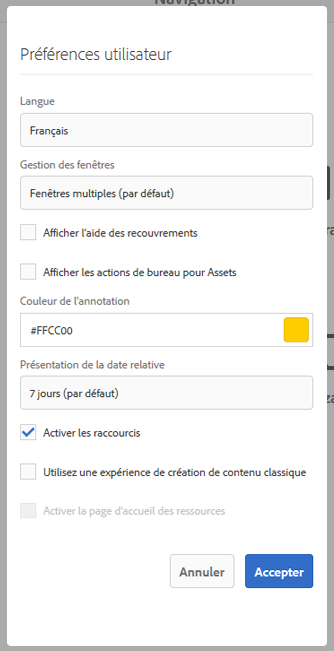

# Configuration de l’environnement du compte{#configuring-your-account-environment}

>[!CAUTION]
>
>AEM 6.4 a atteint la fin de la prise en charge étendue et cette documentation n’est plus mise à jour. Pour plus d’informations, voir notre [période de support technique](https://helpx.adobe.com/fr/support/programs/eol-matrix.html). Rechercher les versions prises en charge [here](https://experienceleague.adobe.com/docs/?lang=fr).

AEM vous dote des outils nécessaires pour configurer votre compte ainsi que certains aspects de l’environnement de création.

En utilisant la variable [Utilisateur](/help/sites-authoring/user-properties.md#user-settings) dans le [header](/help/sites-authoring/basic-handling.md#the-header) et le [Mes préférences](#my-preferences) vous pouvez modifier les options de l’utilisateur.

## Paramètres utilisateur {#user-settings}

Le **Utilisateur** La boîte de dialogue paramètres vous donne accès aux options suivantes :

* Se faire passer pour

   * Avec le [Se faire passer pour](/help/sites-administering/security.md#impersonating-another-user) fonctionnalité qu’un utilisateur peut utiliser au nom d’un autre utilisateur.

* Profil

   * Offre un lien pratique vers vos [paramètres utilisateur](/help/sites-administering/security.md).

* [Mes préférences](/help/sites-authoring/user-properties.md#my-preferences)

   * Spécifiez les différents paramètres uniques à votre utilisateur.

## Mes préférences {#my-preferences}

La boîte de dialogue **Mes préférences** est accessible par l’intermédiaire de l’option [Utilisateur](/help/sites-authoring/user-properties.md#user-settings) dans l’en-tête.

Chaque utilisateur peut définir certaines propriétés pour lui-même.

* **Langue**

   Cette option définit la langue à utiliser pour l’interface utilisateur de l’environnement de création. Sélectionnez la langue souhaitée dans la liste disponible.

   Cette configuration est également utilisée pour l’IU classique.

* **Gestion des fenêtres**

   Cela définit le comportement ou l’ouverture des fenêtres. Vous avez le choix entre :

   * **Fenêtres multiples** (Par défaut)

      * Les pages s’ouvrent dans une nouvelle fenêtre.
   * **Une seule fenêtre**

      * Les pages s’ouvrent dans la fenêtre active.

* **Afficher les actions de bureau pour Assets**

   Cette option nécessite l’utilisation de l’appli de bureau AEM.

* **Couleur de l’annotation**

   Cette option définit la couleur par défaut utilisée lors de la création d’annotations.

   * Cliquez sur le bloc de couleur pour ouvrir le sélecteur d’échantillons afin de sélectionner une couleur.
   * Vous pouvez également saisir le code hexadécimal de la couleur désirée dans le champ.

* **Présentation de la date relative**

   Pour améliorer la lisibilité, AEM effectuera le rendu des dates au cours des sept derniers jours sous forme de dates relatives (par exemple, il y a trois jours) et des dates plus anciennes sous forme de dates exactes (par exemple, le 20 mars 2017).

   Cette option définit la manière dont les dates sont affichées dans le système. Les options suivantes sont disponibles :

   * **Toujours afficher la date exacte** : la date exacte est toujours affichée (ce n’est jamais une date relative).
   * **1 jour** : la date relative s’affiche pour les dates correspondant au jour même ; dans le cas contraire, une date exacte est affichée.
   * **7 jours (par défaut)** : la date relative s’affiche pour les dates parmi les sept derniers jours ; dans le cas contraire, une date exacte est affichée.
   * **1 mois** : la date relative s’affiche pour les dates correspondant au dernier mois ; dans le cas contraire, une date exacte est affichée.
   * **1 an** : la date relative s’affiche pour les dates correspondant à la dernière année ; dans le cas contraire, une date exacte est affichée.
   * **Toujours afficher la date relative** : les dates exactes ne sont jamais affichées, seules les dates relatives le sont.

* **Activer les raccourcis**

   AEM prend en charge un certain nombre de raccourcis clavier qui rendent la création plus efficace.

   * [Raccourcis clavier lors de la modification de pages](/help/sites-authoring/page-authoring-keyboard-shortcuts.md)
   * [Raccourcis clavier pour les consoles](/help/sites-authoring/keyboard-shortcuts.md)

   Cette option active les raccourcis clavier. Par défaut, elles sont activées, mais peuvent être désactivées, par exemple si un utilisateur a certaines exigences d’accessibilité.

* **Utilisez une expérience de création de contenu classique**.

   Cette option permet la création de pages basée sur l’[IU classique](/help/sites-classic-ui-authoring/home.md). Par défaut, l’IU standard est utilisée.

* **Activer la page d’accueil des ressources**

   Cette option est disponible uniquement si l’administrateur système a activé l’environnement Page d’accueil des ressources pour l’ensemble de l’entreprise.
