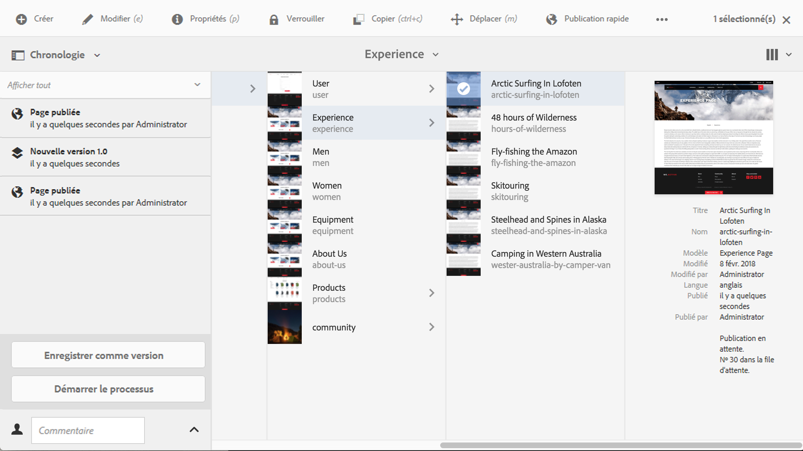
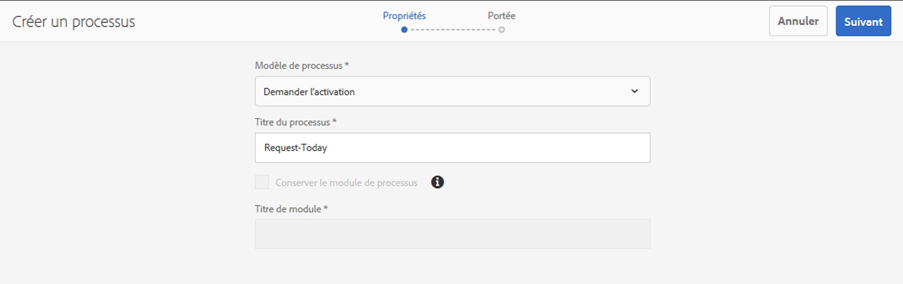
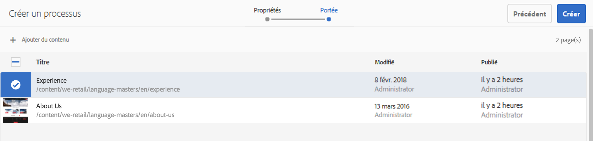
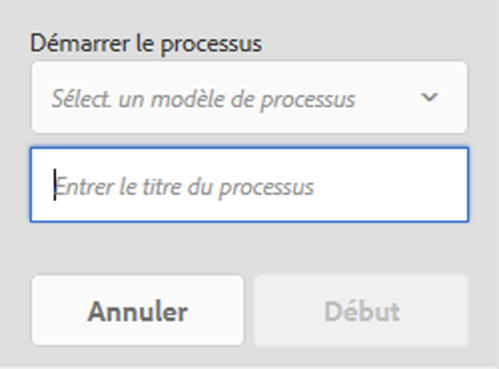

# Application de workflows aux pages{#applying-workflows-to-pages}

Lors de la création, vous pouvez appeler des processus pour agir sur vos pages ; il est également possible d’appliquer plusieurs processus.

Lorsque vous appliquez le workflow, vous spécifiez les informations suivantes :

* Processus à appliquer.

   Vous pouvez appliquer n’importe quel processus (auquel vous avez accès, tel qu’il est attribué par votre administrateur AEM).

* Éventuellement, un titre permettant d’identifier l’instance de workflow dans la boîte de réception d’un utilisateur.
* La charge utile du workflow. Cela peut concerner une ou plusieurs pages.

Vous pouvez démarrer les workflows :

* via la **[console](#starting-a-workflow-from-the-sites-console)**Sites.
* lors de la modification d’une page, via **[Informations sur la page](#starting-a-workflow-from-the-page-editor)**.

>[!NOTE]
>
>Voir également:
>
>* [Comment appliquer des workflow à des ressources DAM](/help/assets/assets-workflow.md).
>* [Utilisation des workflows de projet](/help/sites-authoring/projects-with-workflows.md).
>

>[!NOTE]
>
>Les administrateurs AEM peuvent [démarrer des workflow à l’aide de plusieurs autres méthodes](/help/sites-administering/workflows-starting.md).

## Démarrage d’un workflow à partir de la console Sites {#starting-a-workflow-from-the-sites-console}

Vous pouvez démarrer un workflow des deux manières suivantes :

* Option **[Créer](#starting-a-workflow-from-the-sites-toolbar)**de la barre d’outils Sites.
* Le rail **[Chronologie](#starting-a-workflow-from-the-timeline)**de la console Sites.

Dans les deux cas, vous aurez besoin d’effectuer les opérations suivantes :

* [Spécifier les détails du workflow dans l’assistant Créer un workflow](#specifying-workflow-details-in-the-create-workflow-wizard).

### Démarrage d’un workflow à partir de la barre d’outils Sites {#starting-a-workflow-from-the-sites-toolbar}

You can start a workflow from the toolbar of the **Sites** console:

1. Recherchez et sélectionnez la page voulue. 

1. From the **Create** option in the toolbar you can now select **Workflow**.

   

1. L’assistant **Créer un workflow** vous aidera à [spécifier les détails du workflow](#specifying-workflow-details-in-the-create-workflow-wizard).

### Démarrage d’un workflow à partir de la chronologie {#starting-a-workflow-from-the-timeline}

Dans la **Chronologie**, vous pouvez démarrer un workflow à appliquer à la ressource sélectionnée.

1. [Sélectionnez la ressource](/help/sites-authoring/basic-handling.md#viewing-and-selecting-resources) et ouvrez [Chronologie](/help/sites-authoring/basic-handling.md#timeline) (ou ouvrez Chronologie, puis sélectionnez la ressource).
1. La tête de flèche située en regard du champ de commentaire peut être utilisée pour afficher **Démarrer le workflow** :

   

1. L’assistant **Créer un workflow** vous aidera à [spécifier les détails du workflow](#specifying-workflow-details-in-the-create-workflow-wizard).

### Spécification des détails du workflow dans l’assistant Créer un workflow {#specifying-workflow-details-in-the-create-workflow-wizard}

L’assistant **Créer un workflow** vous permet de sélectionner le workflow et d’en spécifier les détails.

Après avoir ouvert l’assistant **Créer un workflow** de l’une des façons suivantes :

* Option **[Créer](#starting-a-workflow-from-the-sites-toolbar)**de la barre d’outils Sites.
* Le rail **[Chronologie](#starting-a-workflow-from-the-timeline)**de la console Sites.

Vous pouvez spécifier les détails du workflow :

1. Dans l’étape **Propriétés**, les options de base du workflow sont définies :

   * **Modèle de workflow**
   * **Titre du workflow**

      * Vous pouvez spécifier un titre pour cette instance pour vous permettre de l’identifier ultérieurement.
   En fonction du modèle de workflow, les options suivantes sont également disponibles. Elles permettent de conserver le module créé comme charge utile une fois le workflow terminé.

   * **Conserver le module de workflow**
   * **Titre de module**

      * Vous pouvez spécifier un titre pour le module, pour faciliter son identification.
   >[!NOTE]
   >
   >L’option **Prise en charge multi-ressource** est disponible lorsque le processus a été configuré pour la prise en charge de ressources multiples et que plusieurs ressources ont été sélectionnées.

   Une fois que vous avez terminé, cliquez sur **Suivant** pour continuer.

   

1. À l’étape **Domaine**, vous pouvez sélectionner :

   * **Ajouter du contenu** pour ouvrir le navigateur [de](/help/sites-authoring/author-environment-tools.md#path-browser) chemin et sélectionner des ressources supplémentaires ; dans le navigateur, cliquez/appuyez sur **Sélectionner** pour ajouter le contenu à l’instance de flux de travail.
   * Une ressource existante pour afficher d’autres actions :

      * **Inclure les enfants** pour indiquer que les enfants de la ressource seront inclus dans le workflow.

          Une fenêtre de dialogue s’ouvre pour vous permettre d’affiner la sélection selon les critères suivants :

         * Inclure seulement les enfants immédiats.
         * Inclure seulement les pages modifiées.
         * Inclure seulement les pages déjà publiées.
         Tous les enfants spécifiés seront ajoutés à la liste de ressources auquel le workflow s’appliquera.

      * **Supprimer la sélection** pour supprimer la ressource du workflow.
   

   >[!NOTE]
   >
   >Si vous ajoutez des ressources supplémentaires, vous pouvez utiliser l’option **Précédent** pour ajuster le paramètre **Conserver le module de processus** lors de l’étape **Propriétés**.

1. Use **Create** to close the wizard and create the workflow instance. Une notification s’affiche dans la console Sites.

## Démarrage d’un workflow à partir de l’Editeur de page {#starting-a-workflow-from-the-page-editor}

Lors de la modification d’une page, vous pouvez sélectionner **Informations sur la page** dans la barre d’outils. Le menu déroulant contient l’option **Démarrer dans le workflow**. Cette option ouvre une boîte de dialogue dans laquelle vous pouvez spécifier le workflow requis, ainsi qu’un titre si nécessaire :

