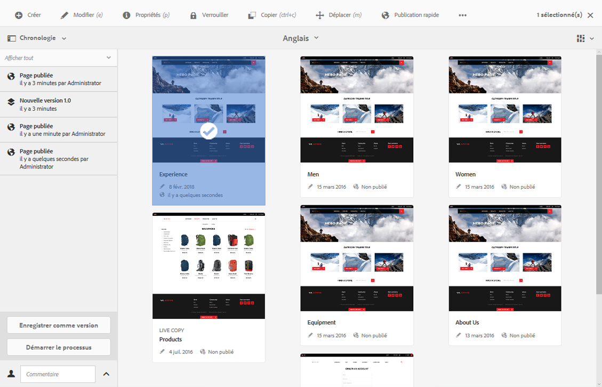
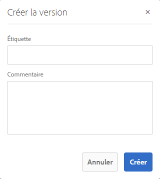
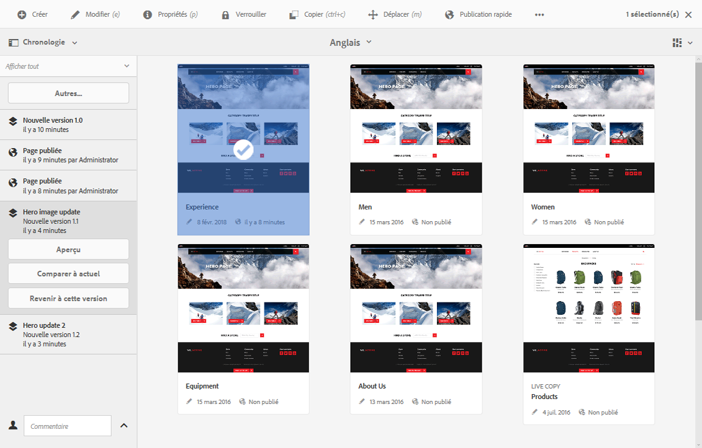
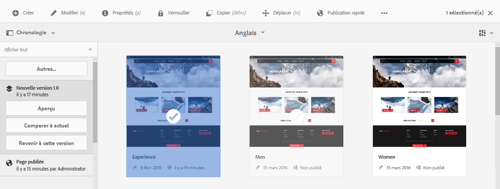
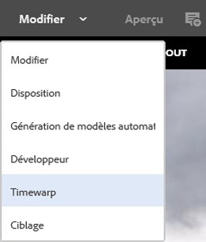
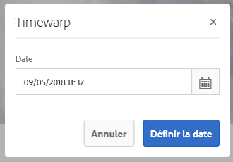
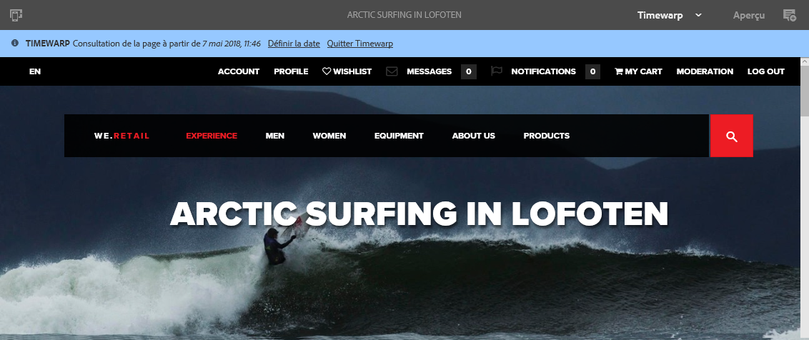

# Utilisation des versions de page{#working-with-page-versions}

La création de versions permet de créer un « instantané » d’une page à un moment donné. Avec la création de versions, vous pouvez effectuer les opérations suivantes :

* Créer une version d’une page donnée.
* Restaurer la version précédente d’une page (pour annuler une modification apportée à une page, par exemple).
* Comparer la version actuelle d’une page avec une version précédente (les différences dans le texte et les images sont mises en évidence).

## Création d’une version {#creating-a-new-version}

Vous pouvez créer une version de votre ressource depuis :

* le [rail de la frise chronologique](#creating-a-new-version-timeline)
* l’option [Créer](#creating-a-new-version-create-with-a-selected-resource) (lorsqu’une ressource est sélectionnée).

### Création d’une version - Frise chronologique {#creating-a-new-version-timeline}

1. Accédez à la page pour laquelle créer une version.
1. Sélectionnez la page en [mode de sélection](/help/sites-authoring/basic-handling.md#viewing-and-selecting-resources).
1. Ouvrez la colonne **Frise chronologique**.
1. Cliquez ou appuyez sur la tête de la flèche près du champ de commentaire pour afficher les options :

   

1. Sélectionnez **Enregistrer comme version**.
1. Saisissez un **libellé** et un **commentaire** si nécessaire.

   

1. Confirmez la nouvelle version avec l’option **Créer**.

   Les informations dans la frise chronologique sont mises à jour pour indiquer la nouvelle version.

### Creating a New Version - Create with a Selected Resource {#creating-a-new-version-create-with-a-selected-resource}

1. Accédez à la page pour laquelle créer une version.
1. Sélectionnez la page en [mode de sélection](/help/sites-authoring/basic-handling.md#viewing-and-selecting-resources).
1. Sélectionnez l’option **Créer** dans la barre d’outils.
1. Une boîte de dialogue s’ouvre. Vous pouvez saisir un **libellé** et un **commentaire** si nécessaire :

   

1. Confirmez la nouvelle version avec l’option **Créer**.

   La frise chronologique s’ouvrira avec les informations mises à jour afin d’indiquer la nouvelle version.

## Restauration de la version d’une page {#reverting-to-a-page-version}

Une fois une version créée, vous pouvez y revenir si nécessaire.

>[!NOTE]
>
>Lors de la restauration d’une page, la version créée fait partie d’une nouvelle branche.
>
>Illustration :
>
>* Créez des versions d’une page.
>* Les libellés et les noms de nœud de version initiaux sont 1.0, 1.1, 1.2, etc.
>* Restaurez la première version, soit 1.0.
>* Recréez des versions.
>* Les libellés et les noms de nœud générés sont à présent 1.0.0, 1.0.1, 1.0.2, etc.
>

Pour restaurer une ancienne version, procédez comme suit :

1. Naviguez pour afficher la page pour laquelle restaurer une ancienne version.
1. Sélectionnez la page en [mode de sélection](/help/sites-authoring/basic-handling.md#viewing-and-selecting-resources).
1. Ouvrez la colonne **Journal** et sélectionnez **Tout afficher** ou **Versions**. Les versions de la page sélectionnée sont répertoriées.
1. Sélectionnez la version à restaurer. Les options possibles s’affichent :

   

1. Sélectionnez **Revenir à cette version**. La version sélectionnée est restaurée et les informations dans la frise chronologique sont mises à jour.

## Aperçu d&#39;une version {#previewing-a-version}

Vous pouvez prévisualiser une version spécifique :

1. Accédez à la page à comparer.
1. Sélectionnez la page en [mode de sélection](/help/sites-authoring/basic-handling.md#viewing-and-selecting-resources).
1. Ouvrez la colonne **Journal** et sélectionnez **Tout afficher** ou **Versions**.
1. Les versions de la page sont répertoriées. Sélectionnez la version à prévisualiser :

   

1. Sélectionnez **Aperçu**. La page sera affichée sous un nouvel onglet.

   >[!CAUTION]
   >
   >Si une page a été déplacée, vous ne pouvez plus afficher l’aperçu des versions antérieures au déplacement.
   >
   >Si vous rencontrez des problèmes avec un aperçu, vérifiez dans la [chronologie](/help/sites-authoring/basic-handling.md#timeline) si la page a été déplacée.

## Comparaison d’une ancienne version avec la page actuelle {#comparing-a-version-with-current-page}

Pour comparer la version actuelle de la page avec une version précédente :

1. Accédez à la page à comparer.
1. Sélectionnez la page en [mode de sélection](/help/sites-authoring/basic-handling.md#viewing-and-selecting-resources).
1. Ouvrez la colonne **Journal** et sélectionnez **Tout afficher** ou **Versions**.
1. Les versions de la page sont répertoriées. Sélectionnez la version à comparer :

   

1. Sélectionnez **Comparer à actuel**. L’[outil de comparaison des pages](/help/sites-authoring/page-diff.md) s’ouvre et affiche les différences.

## Timewarp {#timewarp}

La fonction de distorsion du temps Timewarp permet de simuler l’état *publié* d’une page à des moments spécifiques dans le passé.

L’objectif est de vous permettre d’effectuer le suivi d’un site web publié au moment sélectionné. Cette fonction utilise les versions de page pour déterminer l’état de l’environnement de publication.

Pour ce faire :

* Le système recherche la version de page qui était active à l’heure sélectionnée.
* Cela signifie que la version affichée a été créée/activée *avant* le moment sélectionné dans Timewarp.
* Si vous accédez à une page qui a été supprimée, celle-ci est également affichée, à condition toutefois que les anciennes versions de la page soient toujours disponibles dans le référentiel.
* Si aucune version publiée n’a été trouvée, la fonction Timewarp revient à l’état actuel de la page dans l’environnement de création (et ce, afin d’éviter une erreur/page 404, ce qui rendrait impossible toute poursuite de la navigation).

### Utilisation de Timewarp {#using-timewarp}

Timewarp est un [mode](/help/sites-authoring/author-environment-tools.md#page-modes) de l’éditeur de page. Son lancement est semblable à celui de n’importe quel autre mode.

1. Démarrez l’éditeur de la page à l’endroit où vous souhaitez lancer la fonction Timewarp, puis sélectionnez **Timewarp** dans la sélection du mode.

   

1. Dans la boîte de dialogue, définissez une date et une heure cibles, puis cliquez ou appuyez sur **Définir la date**. Si vous ne sélectionnez pas d’heure, l’heure actuelle est utilisée par défaut.

   

1. La page s’affiche en fonction de la date définie. Le mode Timewarp est indiqué par la barre d’état bleue située dans la partie supérieure de la fenêtre. Utilisez les liens de la barre d’état pour sélectionner une nouvelle date cible ou quitter le mode Timewarp.

   

### Limites de la déformation temporelle

Timewarp s’efforce au mieux de reproduire une page à un moment donné. Toutefois, en raison de la complexité de la création continue de contenu dans AEM, cela n’est pas toujours possible. Ces limites doivent être prises en compte lorsque vous utilisez Timewarp.

* **Timewarp fonctionne en fonction des pages** publiées : Timewarp ne fonctionne entièrement que si vous avez déjà publié la page. Dans le cas contraire, Timewarp affiche la page en cours dans l’environnement de création.
* **Timewarp utilise des versions** de page : si vous accédez à une page qui a été supprimée/supprimée du référentiel, elle est générée correctement si d’anciennes versions de la page sont toujours disponibles dans le référentiel.
* **Les versions supprimées ont une incidence sur Timewarp** . Si les versions sont supprimées du référentiel, Timewarp ne peut pas afficher la vue correcte.
* **Minutage en lecture seule** : vous ne pouvez pas modifier l’ancienne version de la page. Elle est disponible uniquement à des fins d’affichage. Si vous souhaitez restaurer l’ancienne version, vous devrez procéder manuellement à l’aide de la fonction Restaurer. 
* **La déformation temporelle est uniquement basée sur le contenu** de la page : si des éléments (tels que le code, le fichier CSS, les ressources/images, etc.) pour le rendu du site Web ont changé, la vue diffère de ce qu’elle était initialement, car ces éléments ne sont pas versionnés dans le référentiel.

>[!CAUTION]
>
> Timewarp est un outil conçu pour aider les auteurs à comprendre et à créer leur contenu. Il ne s&#39;agit pas d&#39;un journal de vérification ou à des fins juridiques.