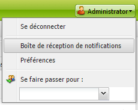
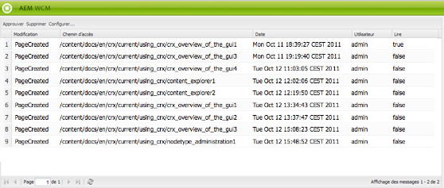
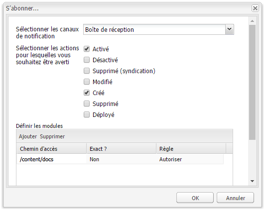
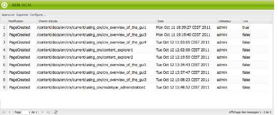

# Votre boîte de réception{#your-inbox}

>[!CAUTION]
>
>AEM 6.4 a atteint la fin de la prise en charge étendue et cette documentation n’est plus mise à jour. Pour plus d’informations, voir notre [période de support technique](https://helpx.adobe.com/fr/support/programs/eol-matrix.html). Rechercher les versions prises en charge [here](https://experienceleague.adobe.com/docs/?lang=fr).

Vous pouvez recevoir des notifications de différentes zones d’AEM, telles que des notifications sur des tâches ou des tâches qui représentent des actions que vous devez effectuer sur le contenu de la page.

Vous recevez ces notifications dans deux boîtes de réception, séparées par le type de notification :

* Une boîte de réception où vous pouvez voir les notifications que vous recevez suite aux abonnements est décrite dans la section suivante.
* Une boîte de réception spécialisée pour les éléments de workflow, décrite dans le document [Participer à des workflow](/help/sites-classic-ui-authoring/classic-workflows-participating.md).

## Affichage de vos notifications {#viewing-your-notifications}

Pour afficher vos notifications :

1. Ouvrez la boîte de réception de notification : dans le **Sites web** , cliquez sur le bouton de l’utilisateur dans le coin supérieur droit, puis sélectionnez **Boîte de réception de notifications**.

   

   >[!NOTE]
   >
   >Vous pouvez également accéder directement à la console dans votre navigateur ; par exemple.
   >
   >` https://<host>:<port>/libs/wcm/core/content/inbox.html`

1. Vos notifications sont répertoriées. Vous pouvez agir selon vos besoins :

   * [Abonnement aux notifications](#subscribing-to-notifications)
   * [Traitement des notifications](#processing-your-notifications)

   

## Souscrire à des notifications {#subscribing-to-notifications}

Pour vous abonner aux notifications :

1. Ouvrez la boîte de réception de notification : dans le **Sites web** , cliquez sur le bouton de l’utilisateur dans le coin supérieur droit, puis sélectionnez **Boîte de réception de notifications**.

   

   >[!NOTE]
   >
   >Vous pouvez également accéder directement à la console dans votre navigateur ; par exemple.
   >
   >`https://<host>:<port>/libs/wcm/core/content/inbox.html`

1. Cliquez sur **Configurer…** dans le coin supérieur gauche pour ouvrir la boîte de dialogue de configuration.

   

1. Sélectionnez le canal de notification :

   * **Boîte de réception**: les notifications s’affichent dans votre boîte de réception AEM.
   * **Email**: les notifications seront envoyées par courrier électronique à l’adresse électronique définie dans votre profil utilisateur.

   >[!NOTE]
   >
   >Certains paramètres doivent être configurés pour être avertis par email. Il est également possible de personnaliser le modèle d&#39;email ou d&#39;ajouter un modèle d&#39;email pour une nouvelle langue. Reportez-vous à la section [Configuration des notifications par e-mail](/help/sites-administering/notification.md#configuringemailnotification) pour configurer les notifications électroniques dans AEM.

1. Sélectionnez les actions de page pour lesquelles vous souhaitez être averti :

   * Activé : lorsqu’une page a été activée.
   * Désactivé : lorsqu’une page a été désactivée.
   * Supprimé (syndication) : lorsqu’une page a fait l’objet d’une réplication de suppression ; en d’autres termes, lorsqu’une action de suppression effectuée sur une page est répliquée.

      Lorsqu’une page est supprimée ou déplacée, une action de suppression est automatiquement répliquée : la page est supprimée sur l’instance source sur laquelle l’action de suppression a été effectuée, ainsi que sur l’instance de destination définie par les agents de réplication.

   * Modifié : lorsqu’une page a été modifiée.
   * Créé : lorsqu’une page a été créée.
   * Supprimé : lorsqu’une page a été supprimée via l’action de suppression de page.
   * Déployé : lorsqu’une page a été déployée.

1. Définissez les chemins d’accès des pages pour lesquelles vous serez averti :

   * Cliquez sur **Ajouter** pour ajouter une nouvelle ligne au tableau.
   * Cliquez sur la cellule de tableau **Chemin** et entrez le chemin d’accès, à savoir `/content/docs`.
   * Si vous souhaitez être averti pour toutes les pages appartenant à la sous-arborescence, définissez **Exact ?** sur **Non**.

      Pour n’être averti que pour les actions sur la page définie par le chemin d’accès, définissez **Exact ?** to **Oui**.

   * Pour autoriser la règle, définissez **Règle** to **Autoriser**. Si la variable est définie sur **Refuser**, la règle est refusée, mais pas supprimée et peut être autorisée ultérieurement.

   Pour supprimer une définition, sélectionnez la ligne en cliquant sur une cellule de tableau, puis cliquez sur **Supprimer**.

1. Cliquez sur **OK** pour enregistrer la configuration.

## Traitement des notifications {#processing-your-notifications}

Si vous avez choisi de recevoir des notifications dans votre boîte de réception AEM, les notifications seront alors ajoutées à votre boîte de réception. Vous pouvez [afficher vos notifications ;](#viewing-your-notifications) sélectionnez ensuite la ou les notifications requises pour :

* Approuvez-le en cliquant sur **Approuver**: la valeur de la variable **Lecture** est définie sur **true**.

* Pour le supprimer, cliquez sur **Supprimer**.

