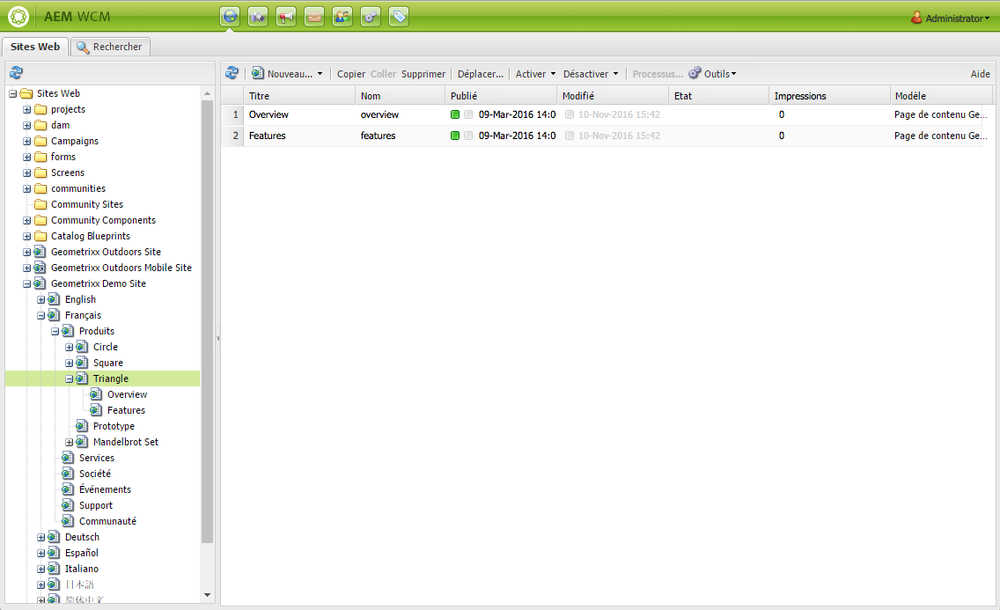
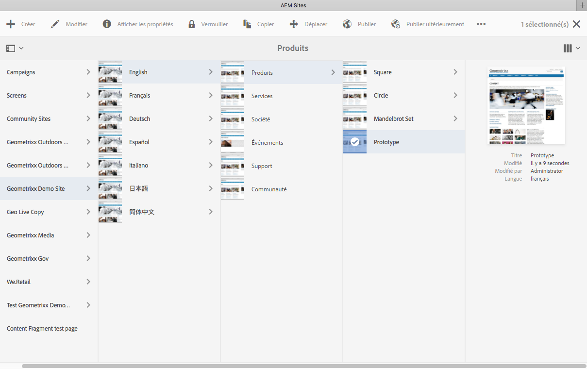
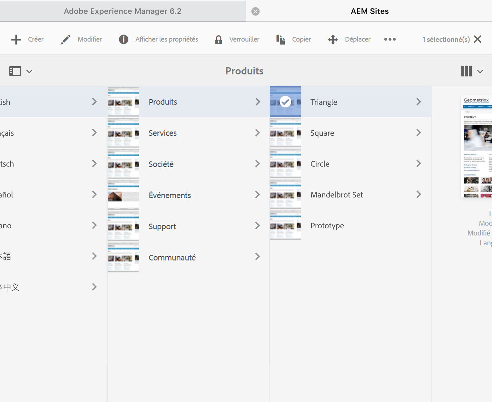

# Utiliser l’environnement de création{#working-with-the-author-environment}

>[!CAUTION]
>
>AEM 6.4 a atteint la fin de la prise en charge étendue et cette documentation n’est plus mise à jour. Pour plus d’informations, voir notre [période de support technique](https://helpx.adobe.com/fr/support/programs/eol-matrix.html). Rechercher les versions prises en charge [here](https://experienceleague.adobe.com/docs/?lang=fr).

>[!NOTE]
>
>La documentation suivante porte sur l’IU classique. Pour plus d’informations sur la création dans l’interface moderne destinée aux écrans tactiles, consultez la [documentation de création standard](/help/assets/assets.md).

L’environnement de création vous permet d’effectuer les opérations suivantes :

* [Création](/help/sites-authoring/author.md) (y compris la [création de pages](/help/sites-authoring/qg-page-authoring.md) et la [gestion de ressources](/help/assets/assets.md))

* [Administration](/help/sites-administering/administer-best-practices.md) des tâches nécessaires pour générer et gérer le contenu sur votre site Web

Deux interfaces utilisateur graphiques sont à votre disposition, accessibles dans n’importe quel navigateur moderne :

1. Interface utilisateur classique

   * Cette interface utilisateur est toujours disponible dans AEM depuis de nombreuses années.
   * Elle est principalement verte.
   * Il a été conçu pour être utilisé sur des ordinateurs de bureau.
   * Elle n’est plus conservée.
   * La documentation suivante porte sur cette IU classique. Pour plus d’informations sur la création dans l’IU tactile moderne, voir la rubrique [documentation de création standard](/help/sites-authoring/author.md).
   

1. Interface utilisateur optimisée pour les écrans tactiles

   * Il s’agit de l’interface utilisateur d’AEM moderne et standard.
   * Elle est principalement grise, avec une interface propre et plate.
   * Il est conçu pour être utilisé à la fois sur les appareils tactiles et de bureau (optimisé pour les écrans tactiles). L’apparence est identique sur tous les appareils, bien que[ l’affichage et la sélection des ressources](/help/sites-authoring/basic-handling.md) diffère légèrement (appuyer ou cliquer).
   * Pour plus d’informations sur la création à l’aide de l’IU pour écrans tactiles, consultez la [documentation de création standard](/help/sites-authoring/author.md). La documentation suivante porte sur l’IU classique.

   * Bureau :
   

   * Tablettes (ou bureau de moins de 1024 pixels de large) :
   
