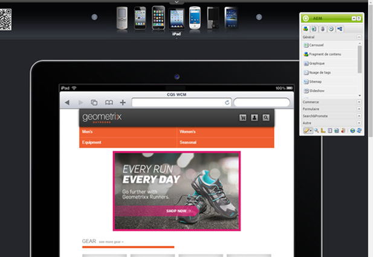

# Création d’une page pour les appareils mobiles{#authoring-a-page-for-mobile-devices}

>[!CAUTION]
>
>AEM 6.4 a atteint la fin de la prise en charge étendue et cette documentation n’est plus mise à jour. Pour plus d’informations, voir notre [période de support technique](https://helpx.adobe.com/fr/support/programs/eol-matrix.html). Rechercher les versions prises en charge [here](https://experienceleague.adobe.com/docs/?lang=fr).

Lorsque vous créez une page mobile, celle-ci est affichée d’une manière qui émule l’appareil mobile. Lors de la création de la page, vous pouvez basculer entre plusieurs émulateurs pour voir ce que l’utilisateur final voit lorsqu’il accède à la page.

Les périphériques sont regroupés dans les catégories fonctionnalité, intelligent et tactile selon les capacités des périphériques à effectuer le rendu d’une page. Lorsque l’utilisateur final accède à une page mobile, AEM détecte l’appareil et envoie la représentation qui correspond à son groupe d’appareils.

>[!NOTE]
>
>Pour créer un site mobile en fonction d’un site standard existant, créez une Live Copy du site standard. (Reportez-vous à [Création d’une live copy pour différents canaux](/help/sites-administering/msm-livecopy.md).)
>
>Les développeurs AEM peuvent créer de nouveaux groupes d’appareils. (Consultez [Création de filtres de groupe de périphériques.](/help/sites-developing/groupfilters.md))

Utilisez la procédure suivante pour créer une page mobile :

1. Dans votre navigateur, accédez au **Siteadmin** console.
1. Ouvrez la page **Produits** située sous **Sites Web** >> **Site de démonstration mobile Geometrixx** >> **English**.

1. Basculez vers un autre émulateur. Pour ce faire, vous pouvez effectuer l’une des opérations suivantes :

   * Cliquez sur l’icône de périphérique en haut de la page.
   * Cliquez sur le bouton **Modifier** dans le **Sidekick** et sélectionnez le périphérique dans le menu déroulant.

1. Faites glisser et déposez le **Texte et image** du panneau Mobile du sidekick vers la page.
1. Modifiez le composant et ajoutez du texte. Pour enregistrer les modifications, cliquez sur **OK**.

La page ressemble à ce qui suit :

>[!NOTE]
>
>Les émulateurs sont désactivés lorsqu’une page de l’instance de création est demandée à partir d’un appareil mobile. La création peut être effectuée à l’aide d’une interface utilisateur activée pour les écrans tactiles.
