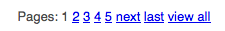
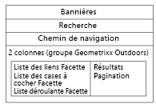

# Ajout de fonctionnalités de Search &amp; Promote à votre page {#adding-search-promote-features-to-your-page}

Pour intégrer des fonctionnalités de Search &amp; Promote à votre site web, utilisez la méthode [!UICONTROL Search &amp; Promote] composants pour ajouter les fonctionnalités suivantes à vos pages :

* Recherche par mot-clé
* Page des résultats de la recherche
* Amélioration de la recherche
* Bannières

Notez que vous pouvez utiliser les fonctionnalités Search&amp;Promote uniquement si votre administrateur AEM les a activées. Reportez-vous à la section [Intégration à Adobe Search&amp;Promote](/help/sites-administering/search-and-promote.md).

Les facettes sont configurées sur le serveur Search&amp;Promote, de même que les informations que chaque composant fournit. Le tableau suivant présente une brève description de chaque composant. Les sections qui suivent contiennent des informations détaillées sur leur utilisation.

<table> 
 <tbody> 
  <tr> 
   <th>Composant Search&amp;Promote</th> 
   <th>Description</th> 
  </tr> 
  <tr> 
   <td>Bannières</td> 
   <td>Affiche des bannières publicitaires. Les bannières sont sélectionnées en fonction des données collectées par Search&amp;Promote.   </td> 
  </tr> 
  <tr> 
   <td>Chemin de navigation</td> 
   <td>Affiche le mot-clé de recherche et la séquence des filtres que l’utilisateur a appliqués aux résultats de la recherche.</td> 
  </tr> 
  <tr> 
   <td>Liste des cases à cocher - Facettes</td> 
   <td>Liste de cases à cocher permettant de sélectionner des facettes pour le filtrage des résultats de la recherche.</td> 
  </tr> 
  <tr> 
   <td>Liste déroulante Facette</td> 
   <td>Liste déroulante de facettes pour le filtrage des résultats de la recherche.</td> 
  </tr> 
  <tr> 
   <td>Liste des liens Facette</td> 
   <td>Liste de liens de facettes pour le filtrage des résultats de la recherche.</td> 
  </tr> 
  <tr> 
   <td>Pagination</td> 
   <td>Contrôles permettant de parcourir les pages de résultats de la recherche.</td> 
  </tr> 
  <tr> 
   <td>Résultats</td> 
   <td>Affiche les résultats d’une recherche par mot-clé.</td> 
  </tr> 
  <tr> 
   <td>Rechercher</td> 
   <td>Insère un champ de recherche dans la page.</td> 
  </tr> 
 </tbody> 
</table>

## Création de la page de résultats de la recherche {#creating-the-search-results-page}

Utilisez la console Sites web WCM pour créer une page qui servira à afficher les résultats de recherche. Les résultats d’une recherche de n’importe quel composant de recherche peuvent apparaître dans cette page si elle utilise le même service Search&amp;Promote. 

Les composants qui permettent aux utilisateurs de consulter les résultats de la recherche sont Résultats et Pagination. Le composant **[!UICONTROL Résultats]** ne dispose d’aucune propriété configurable en mode d’édition ou en mode de conception. Le composant Résultats répertorie uniquement les résultats de la recherche, qui proposent des liens vers d’autres pages, ainsi que le nombre de résultats pour le mot-clé de la recherche. 

Le composant **[!UICONTROL Pagination]** permet aux utilisateurs de naviguer au sein de plusieurs pages de résultats de recherche. L’utilisateur peut voir le nombre de pages, accéder à la page précédente ou suivante, sélectionner une page à ouvrir ou regrouper tous les résultats dans une seule page. 

Vous pouvez configurer les propriétés de composant suivantes dans [!UICONTROL Modifier] pour contrôler le comportement d’exécution :

* **[!UICONTROL Masquer la page de résultat unique]** - Sélectionnez cette option pour masquer les commandes de navigation de la page lorsque la recherche renvoie une seule page de résultats.
* **[!UICONTROL Masquer le premier/dernier]** - Sélectionnez cette option pour empêcher les utilisateurs d’accéder à la première ou à la dernière page de résultats.
* **[!UICONTROL Masquer Précédent/Suivant]** - Détermine si les utilisateurs peuvent parcourir les pages de résultats par rapport à la page active.
* **[!UICONTROL Tout masquer]** - Détermine si l’utilisateur peut consolider tous les résultats de recherche sur une seule page. En général, le fait de fournir des données paginées optimise l’utilisation des ressources serveur. Sélectionnez cette option pour empêcher le transfert d’importants jeux de données dans un seul message de réponse.

## Activation du filtrage des résultats par le biais de facettes {#enabling-the-filtering-of-results-by-facets}

Vous pouvez autoriser les utilisateurs à filtrer les résultats d’une recherche au moyen de facettes. Le **[!UICONTROL Liste des cases à cocher - Facette]**, **[!UICONTROL Liste déroulante Facette]**, et **[!UICONTROL Facette Liste des liens]** Les composants permettent aux utilisateurs de sélectionner une ou plusieurs facettes pour le filtrage. Lorsque vous utilisez ces composants, vous devez également inclure le composant **[!UICONTROL Chemin de navigation]**. Les chemins de navigation indiquent les filtres actuels qui sont utilisés.

Le **[!UICONTROL Liste des cases à cocher - Facette]**, **[!UICONTROL Liste déroulante Facette]**, et **[!UICONTROL Facette Liste des liens]** Les composants possèdent chacun les propriétés suivantes que vous configurez dans **[!UICONTROL Modifier]** mode :

* **[!UICONTROL Nom de la facette]** - Nom de la facette utilisée pour les filtres.

Le composant **[!UICONTROL Liste des cases à cocher - Facettes]** présente une liste de facettes accompagnée d’une case à cocher. Utilisez **[!UICONTROL Liste des cases à cocher - Facettes]** pour permettre aux utilisateurs d’afficher un sous-ensemble de résultats intégrant les éléments de plusieurs facettes. Par exemple, la facette Marque est appropriée, car plusieurs marques fournissent le même type de produit.

Une case à cocher apparaît pour chaque facette associée à un résultat de recherche. Lorsqu’un utilisateur coche une case, la page est actualisée avec un jeu de résultats mis à jour. Toutes les cases à cocher restent sur la page pour que les internautes puissent ajouter (ou supprimer) des facettes au filtre, à tout moment :

Le composant **[!UICONTROL Liste déroulante Facette]** permet aux utilisateurs de choisir un élément de facette dans une liste déroulante. Ce composant est utile si vous souhaitez que les utilisateurs se concentrent sur un seul élément de facette à la fois. Par exemple, la facette Rayon est appropriée pour permettre aux utilisateurs de restreindre la recherche de produits par sexe. Patrick recherche un *pantalon denim* puis filtre par rayon Homme. 

La liste déroulante présente les facettes associées à tous les résultats de la recherche. Une fois qu’un élément est sélectionné dans la liste déroulante, la page est actualisée avec un jeu de résultats mis à jour. Les éléments de la liste déroulante ne changent pas, ainsi les utilisateurs peuvent basculer d’une facette à l’autre, à tout moment. 

Le composant **[!UICONTROL Liste des liens Facette]** permet aux utilisateurs d’affiner progressivement leur recherche sur les éléments qui sont catégorisés sous plusieurs membres de facette ou facettes.

Les membres de facette s’affichent sous la forme d’une liste de liens. Le texte de chaque lien correspond au nom d’un membre de facette associé aux résultats de la recherche en cours. Lorsqu’un utilisateur clique sur un lien de facette, la page est actualisée et un sous-ensemble de résultats de recherche s’affiche. La liste des liens est mise à jour en conséquence pour des résultats encore plus pertinents.

Les liens de la liste changent également lorsqu’un filtre est appliqué à partir d’un autre type de [!UICONTROL Search &amp; Promote] composant. L’utilisation de plusieurs types de composants de filtrage peut optimiser le filtrage.

Le composant **[!UICONTROL Chemin de navigation]** permet aux utilisateurs de voir les filtres actuellement actifs pour les résultats de la recherche et l’ordre dans lequel ils ont été appliqués. Ils peuvent cliquer sur les éléments du chemin de navigation pour revenir à cette combinaison de filtres.

En mode d’édition, vous pouvez configurer les propriétés suivantes pour les chemins de navigation afin de personnaliser l’aspect du composant :

* **[!UICONTROL Délimiteur]** - Définissez le caractère ou la chaîne de caractères à utiliser comme délimiteur entre chaque chemin de navigation. Le champ Délimiteur accepte toute chaîne de caractères en entrée. Le paramètre par défaut est : « > » (sans guillemets)
* **[!UICONTROL Délimiteur de fin]** - Définissez un caractère ou une chaîne de caractères à afficher à la fin du chemin de navigation. Le champ Délimiteur de fin accepte toute chaîne de caractères en entrée. Le paramètre par défaut est &quot;vide&quot; (c’est-à-dire que rien n’est affiché à la fin de la ligne de chemin de navigation).

## Ajout de zones de recherche {#adding-search-boxes}

Le **[!UICONTROL Rechercher]** permet aux clients d’effectuer des recherches par mot-clé. Insérez des composants de recherche dans chaque page où un accès à la recherche est nécessaire. 

Configurez les propriétés suivantes dans **[!UICONTROL Modifier]** pour contrôler le comportement d’exécution :

* **[!UICONTROL Chemin de la page de résultats]** - Chemin d’accès à la page qui affiche les résultats de la recherche.
* **[!UICONTROL Activation de la saisie automatique]** - Sélectionnez cette option pour que les mots-clés de recherche suggérés s’affichent lorsque le client commence à saisir du texte dans la zone de recherche.

## Ajout de bannières {#adding-banners}

Le **[!UICONTROL Bannières]** affiche des bannières publicitaires en fonction des recherches de Search &amp; Promote du client. La logique du serveur Search&amp;Replace détermine la bannière publicitaire qu’il faut diffuser. Par exemple, une recherche sur un pantalon denim peut déclencher l’affichage d’une bannière associée à des articles de mode. Le filtrage par rayon Homme peut affiner davantage le choix de la bannière.

Le **[!UICONTROL Bannières]** component fournit une propriété configurable nommée **[!UICONTROL Zone de bannière]**. Dans **[!UICONTROL Modifier]** sélectionnez l’une des valeurs de propriété pour spécifier comment la bannière apparaît. Le service Search&amp;Promote détermine la liste des valeurs parmi lesquelles choisir.

## Exemple de page de recherche Search&amp;Promote {#example-search-promote-search-page}

Ce schéma présente les composants ajoutés à une page pour créer des résultats Search&amp;Promote entièrement fonctionnels dans la page ci-dessous.

 
